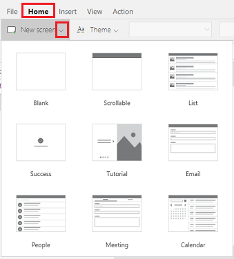
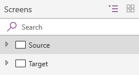
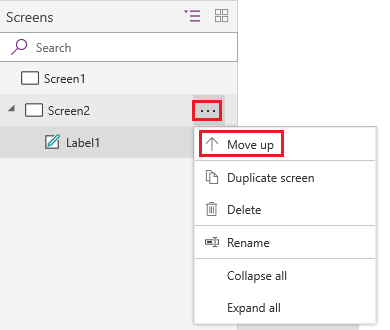

# Add a screen to a canvas app and navigate between screens

Create a canvas app with multiple screens, and add ways for users to navigate between them.

## Add and rename a screen

1. On the **Home** tab, select **New screen**, and then select the type of screen that you want to add.

    

2. In the right-hand pane, select the name of the screen (just above the **Properties** tab), and then type **Source**.

    

3. Add another screen, and name it **Target**.

    

## Reorder screens

In the left navigation bar, hover over a screen that you want to move up or down, select the ellipsis button that appears, and then select **Move up** or **Move down**.

> [!NOTE]
> When the app is opened, the screen at the top of the hierarchical list of controls usually appears first. But you can specify a different screen by setting the **[OnStart](controls/control-screen.md)** property to a formula that includes the **[Navigate](functions/function-navigate.md)** function.

## Add navigation

1. With the **Source** screen selected, open the **Insert** tab, select **Icons**, and then select **Next arrow**.  

    

2. (optional) Move the arrow so that it appears in the lower-right corner of the screen.

3. With the arrow still selected, select the **Action** tab, and then select **Navigate**.

    The **[OnSelect](controls/properties-core.md)** property for the arrow is automatically set to a **Navigate** function.

    

    When a user selects the arrow, the **Target** screen fades in.

4. On the **Target** screen, add a **Back arrow**, and set its **[OnSelect](controls/properties-core.md)** property to this formula:

    `Navigate(Source, ScreenTransition.Fade)`

5. While holding down the Alt key, toggle between screens by selecting the arrow on each screen.

## More information

[Screen-control reference](controls/control-screen.md)

[!INCLUDE[footer-include](../../includes/footer-banner.md)]