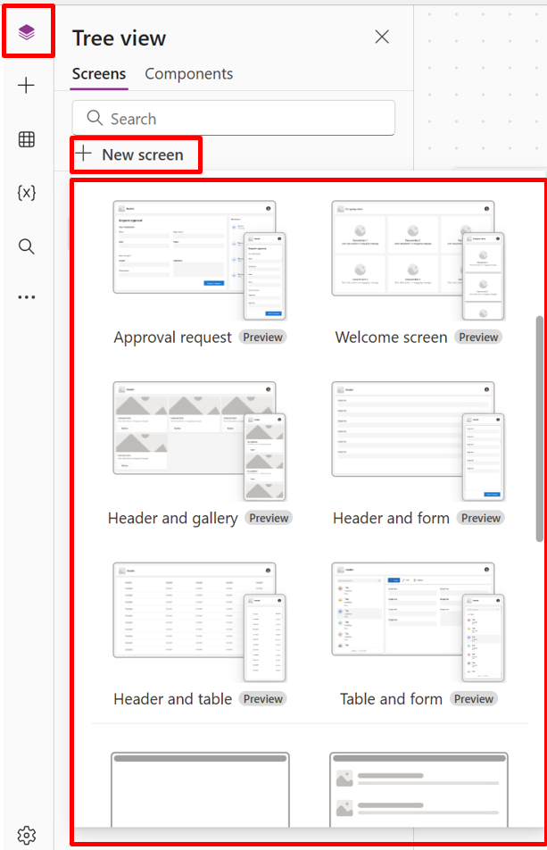

# Add a screen

Prebuilt screens allow makers to easily create modern, responsive app by simply selecting a screen. The screens are designed with common app scenarios and compositions in mind, and feature responsive containers and modern controls.

> [!div class="mx-imgBorder"]
> 

The following new screens are available:

- [Welcome screen](add-screen-context-variables.md#welcome-screen)
- [Header and gallery](add-screen-context-variables.md#header-and-gallery-screen)
- [Approval request](add-screen-context-variables.md#approval-request-screen)
- [Header and form](add-screen-context-variables.md#header-and-form)
- [Header and table](add-screen-context-variables.md#header-and-table)

## Add a new screen

When you add a new screen, you can also select a screen layout such as blank or split screen that adapt to different screen sizes.

1. Sign in to [Power Apps](https://make.powerapps.com?utm_source=padocs&utm_medium=linkinadoc&utm_campaign=referralsfromdoc).
2. Create a canvas app in tablet format.
3. In Power Apps Studio, on the command bar, select **New screen** and then select a screen.
1. When you're done, preview the app and see how the app displays on different devices. More information, see [Preview an app](preview-app.md).

When the **[Scale to fit](create-responsive-layout.md#disable-scale-to-fit)** option is turned off, the screen layout of the app adapts to the size of the device's screen it's being run on.

## Welcome screen 

The **Welcome screen** is ideal for the starting screen of an app. It contains individual tiles that you can customize with an image, a title, and a description text. The number of tiles on the screen can be easily changed by adding or removing the tiles within the body container. Each tile can be used to navigate users to other parts of the app.  

The **Welcome screen** contains the following controls:

- Header container
    - Header 
- Body container
    - Container 
        - Image container
            - Image (Classic)
        - Title container 
          - Feature item button 
          - Text 

#### Add and customize the Welcome screen

1. In Power Apps Studio, select **Add Screen** > **Welcome screen**.
1. To change the image, select the image and then select **Edit**. 
1. Select **Feature Item** button control and add your own text. 
1. Select **Short description or engaging message** and edit the description text.
1. To add more tiles, in the tree view copy and paste a **Container** item.
1. To remove a tile, in the tree view right click a **Container** and select **Delete**.  

## Header and gallery screen

Use the **Header and gallery** screen to showcase a wide range of product or service information, like a product catalog. When you connect a gallery control to a data source, a catalog is automatically generated with little customization required.

The [gallery control](controls/control-gallery.md) in **Header and gallery** screen is a classic control. However, when the modern gallery control is released, the **Header and gallery** screen use the modern gallery control. For more information, see [Overview of modern controls and themes in canvas apps](controls/modern-controls/overview-modern-controls.md).

The **Header and gallery** screen contains the following controls:

- Header Container 
    - Header 
- Main Container 
    - Gallery (Classic) 
        - Image container 
            - Image (Classic) 
     - Title container 
         - Title text 
         - Description text 
     - Button Container 
         - Button 

#### Add and customize Header and gallery screen

1. In Power Apps Studio, select **Add Screen** > **Header and gallery**.
1. In the tree view, select **Gallery**  and connect it to a data source such as Dataverse.
1. Select specific controls inside the gallery such as the image, title text, and text description.

    In the Image property, utilize the *ThisItem* syntax to set the desired image. Apply the same method to the title text and text description.

## Approval request screen

The **Approval request** screen includes a header, a form featuring a submit button, and a gallery with predefined stages. The **Approval request** screen is useful in scenarios where actions are triggered by form submissions, such as submitting an approval request or displaying a workflow process for a business.

The **Approval request** screen contains the following controls:

- Header container 
    - Header 
- Main container 
    - Form container
        - Form title text 
        - Approval form 
        - Submit button 
     - Sidebar container 
         - Text 
         - Gallery (Classic) 

#### Add and customize Approval request screen

1. In Power Apps Studio, select **Add Screen** > **Approval request**.
1. In the tree view, select **Approval form** and connect it to a data source such as Dataverse.
1. To view the details of the approval stages, in the tree view, select **ReviewersGallery** and in the properties pane select the **Advanced** tab and go to **Items**. 

    The following details are part of the approval stage:
   - **Name**: Name of the stage or approver.  
   - **Title**: Subtitle of the stage or approver. 
   - **Status**: Stage status 
   - **Current**: Indicates whether this is the current stage of the approval request.
    
        You can also add a Power Automate approval workflow in the button to notify the approver. For more information, see [Create and test an approval workflow with Power Automate](/power-automate/modern-approvals).

## Header and form   

The **Header and form** screen contains the header, form, and two buttons to submit and cancel form submission. This screen is great for using a screen-wide form.  

The **Header and form** screen contains the following controls:

- Header container 
    - Header 
- Main container 
    - Form container
        - Form  
    - Button container
        - Cancel button
        - Submit button
      
#### Add and customize Header and form screen

1. In Power Apps Studio, select **Add Screen** > **Header and form**.
1. In the tree view, select **Form** and connect it to a data source.
1. [Optional] To ensure the best screen responsiveness, choose each data card on the form and set the **Width Fit** property to **On** in the **Properties** pane.
 

## Header and table 

The **Header and table** screen contains two controls, a header control and a table control. This template is great to showcase a detailed data table on a screen. 

The **Header and table** screen contains the following controls:

- Header container 
    - Header 
- Main container 
    - Table

      
#### Add and customize Header and table screen

1. In Power Apps Studio, select **Add Screen** > **Header and table**.
1. In the tree view, select **Table** and connect it to a data source. 

## Reorder screens

When you have more than one screen, you can reorder them.

In the left pane, hover over a screen that you want to move up or down, and then select **Move up** or **Move down**.

> [!NOTE]
> Use the **[StartScreen](/power-platform/power-fx/reference/object-app#startscreen-property)** property to set which screen will be displayed first.

## Add navigation

When you create a canvas app with multiple screens, you can add navigation so your users can navigate between screens.

1. With the screen selected, select **Insert** and in the search box type **Next arrow** and then select it.

2. (optional) Move the arrow so that it appears in the lower-right corner of the screen.

3. With the arrow selected, set the **[OnSelect](controls/properties-core.md)** property to the **Navigate** function.

    

    When a user selects the arrow, the **Target** screen fades in.

4. On the **Target** screen, add a **Back arrow** icon, and set its **[OnSelect](controls/properties-core.md)** property to this formula:

    `Navigate(Target, ScreenTransition.Fade)`

   > [!NOTE]
   > In the formula above where it says **Target** enter the name of the screen that you're navigating to. 

## More information

[Screen-control reference](controls/control-screen.md)

[!INCLUDE[footer-include](../../includes/footer-banner.md)]

