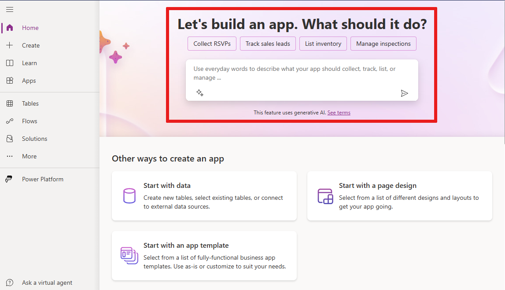
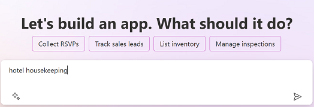
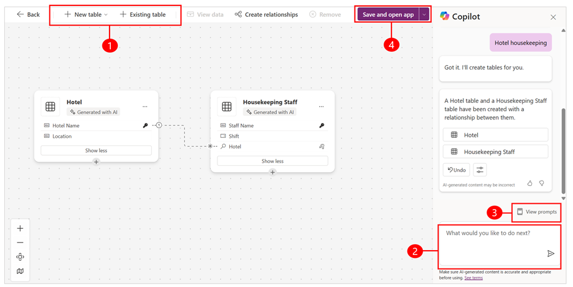

# Build apps through conversation (preview)

[This article is prerelease documentation and is subject to change.]

Create Power Apps with the help of AI. Describe the app that you want to build, and AI will design it for you.

With the **Copilot** feature in Power Apps, you get in-app guidance using natural language processing to help you build your app.

The AI assistant is available from the Power Apps home screen. You can tell the AI assistant what kind of information you want to collect, track, or show and the assistant will generate one or more Dataverse tables along with relationships and use it to build your canvas app.

> [!div class="mx-imgBorder"]
> 

### Prerequisites for preview

- Prerequisites for AI features: [AI Copilot overview (preview)](ai-overview.md)
- This feature is available in English. Depending on where your environment is hosted, you might need to enable data movement across regions. For more information see [Copilots and generative AI features that are available when you enable data movement across regions](/power-platform/admin/geographical-availability-copilot#copilots-and-generative-ai-features-that-are-available-when-you-enable-data-movement-across-regions).
- To use this feature you must set the **Preview** toggle to **On**.

### Create an app with the help of AI

To help you get started, let's build an app to track housekeeping tasks for a hotel.

1. Sign in to [Power Apps](https://make.powerapps.com).

2. In the text box, enter **hotel housekeeping**.

   > [!div class="mx-imgBorder"]
   > 

3. One or more Dataverse tables with relationship and data that includes typical hotel housekeeping tasks are created for you.

### Review the tables for your app

Based on what you described, AI generates tables and relationships for your app. You can take the following actions:

   > [!div class="mx-imgBorder"]
   > 

1. **Edit**: Edit or keep creating more tables in Power Apps Studio. For more information, see [Create and edit tables](../data-platform/create-edit-entities-portal.md).

2. **Copilot**: Enter text to instruct the AI assistant on how to modify the table, or create more tables.

3. **View prompt**: View examples of what actions are supported by Copilot.

4. **Save and app**: Select **Save and app** to create an app based on your tables or select **Back** to start over.

   > [!IMPORTANT]
   > If you encounter any issues during the app creation process related to permissions or if you don't have access to Dataverse, a dialog box will appear asking you to create the app in your own environment. You will need to confirm that the table and app can be created in your environment to proceed. In case you don't have a personal developer environment, a new one will be automatically created for you. For more information, see [Get your developer environment (preview)](../maker-create-environment.md).

## Build apps through conversation (General Availabilible (GA) version)

The app building experince will look different if your using the General Availabilible (GA) version to build apps through conversation with Copilot. 

> [!div class="mx-imgBorder"]
> 

### Prerequisites

- Prerequisites for Copilot features in  Power Apps: [Copilot in Power Apps overview (preview)](ai-overview.md)
- Have a [Microsoft Dataverse database](/power-platform/admin/create-database) in your environment.  
- To see if this feature is available in your region, see the [Product availability report](https://releaseplans.microsoft.com/en-US/availability-reports/?report=copilotfeaturereport).
- This feature is available in English, Dutch, French, German, Italian, Japanese, Portuguese (Brazil), and Spanish. Depending on where your environment is hosted, you might need to enable data movement across regions. For more information see [Copilots and generative AI features that are available when you enable data movement across regions](/power-platform/admin/geographical-availability-copilot#copilots-and-generative-ai-features-that-are-available-when-you-enable-data-movement-across-regions).

### Create an app 

To help you get started, let's build an app to track housekeeping tasks for a hotel.

1. Sign in to [Power Apps](https://make.powerapps.com).

2. In the text box, enter **hotel housekeeping**.

   > [!div class="mx-imgBorder"]
   > 

3. A Dataverse table with data that includes typical hotel housekeeping tasks is created for you.

### Review the table 

Based on what you described, AI generates a table for your app. You can take the following actions:

1. **Suggestions**: These are suggested actions that you can ask the AI assistant to take to help you finalize the table.

2. **View column**: Select to view the column name.

3. **Edit table name**: View the table name and its properties.

4. **Copilot**: Enter text to instruct the AI assistant on how to modify the table, such as remove room type column.

5. **Create app**: Select **Create app** to create an app based on the table or select **Cancel** to start over.

   > [!div class="mx-imgBorder"]
   > 

   
   > [!IMPORTANT]
   > If you encounter any issues during the app creation process related to permissions or if you don't have access to Dataverse, a dialog box will appear asking you to create the app in your own environment. You will need to confirm that the table and app can be created in your environment to proceed. In case you don't have a personal developer environment, a new one will be automatically created for you. For more information, see [Get your developer environment (preview)](../maker-create-environment.md).

## Make edits

If you want to make changes, use the **Copilot** panel to describe what you want to do, and it will make the change for you. Let's ask **Copilot** to add a column to track cleaning start and end time.

1. In the **Copilot** text box enter, **Add columns to track start and end time**.

2. **Copilot** has added two new columns called, **Start Time** and **End Time**.

3. You can continue editing the table by adding features such as room status, change rooms, or set priority levels for each room. When you're ready to create your app, select **Create app**.

### See also

[Copilot in Power Apps overview (preview)](ai-overview.md)

[Add Chatbot control to a canvas app (preview)](add-ai-chatbot.md)

[Add Copilot control to a canvas app (preview)](add-ai-copilot.md)

[Leverage Azure OpenAI Service in AI Builder (preview)](/ai-builder/prebuilt-azure-openai) 

[!INCLUDE[footer-include](../../includes/footer-banner.md)]
