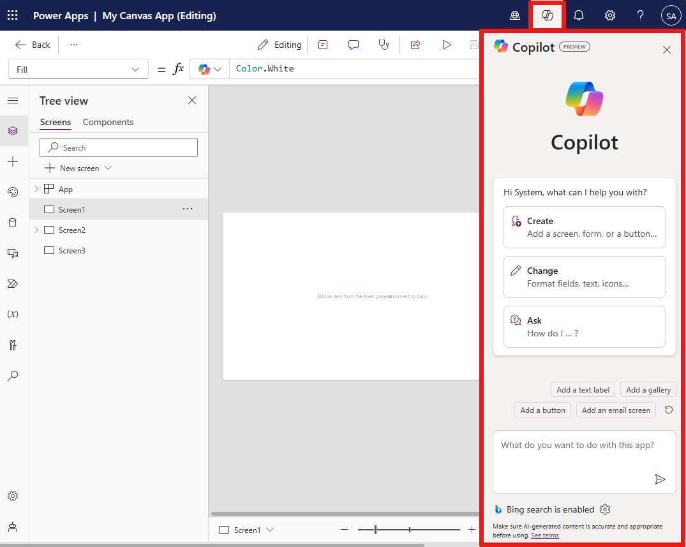

# Continue editing your app with Copilot (preview)

[This article is prerelease documentation and is subject to change.]

Build and continue editing your app with the help of Copilot powered by AI. Tell Copilot what changes you want to make to your app in simple language, and let AI do the work for you.

The Copilot panel is available when you edit a canvas app in Power Apps Studio. You can edit your app by telling Copilot what kind of changes you want to make such as add a screen, configure navigation, styling a single control, or bulk editing.

> [!div class="mx-imgBorder"]
> 

> [!IMPORTANT]
> - To use this capability you must have a [Microsoft Dataverse database](/power-platform/admin/create-database) in your environment.
> - Preview features aren’t meant for production use and may have restricted functionality. These features are available before an official release so that customers can get early access and provide feedback.
> - For more information, go to our [preview terms](https://go.microsoft.com/fwlink/?linkid=2189520).
> - This capability is powered by [ Azure OpenAI Service](/azure/cognitive-services/openai/overview).
> - This capability is in process of rolling out, and is only available in United States region.
> - This capability may be subject to usage limits or capacity throttling.

## Prerequisites

Prerequisites for AI features: [AI Copilot overview (preview)](ai-overview.md)

## What's supported

AI Copilot supports the following commands:

- [Use a screen template](add-screen-context-variables.md) to add a new screen.
- Modify the properties of various controls. Supported controls: 
    - Screen
    - Horizontal and Vertical containers
    - Gallery
    - Edit form
    - Button
    - Text label
    - Text input
    > [!NOTE]
    > [Modern controls](controls/modern-controls/overview-modern-controls.md) are not supported.

## Sample commands you can try
| Scenario      | Commands |
| ----------- | ----------- |
|Add a new screen using template	      |Adding a new email screen|
|             |Adding a new screen|
|             |Add a new screen with header body and footer|
|Add/edit/style a control	|Add a new button|
|             |change selected button to have width 100|
|             |add a new icon|
|             |add a new text label|
|Bulk editing	|Change all buttons to gray|
|             |Change all labels in the selected container to be red|
|Working with containers	|Add a button to the selected container|
|Templatized formulas|	when clicking on Button1, show screen 2|

## Use Copilot to edit your app

1. Sign in to [Power Apps](https://make.powerapps.com) and open a canvas app for editing.
1. In Power Apps Studio, on the top right, select **Copilot**.
1. In the **Copilot** panel, chat with Copilot and describe the changes you want to make such as  **Add a  new screen**.

   > [!div class="mx-imgBorder"]
   > 

[!INCLUDE[footer-include](../../includes/footer-banner.md)]
