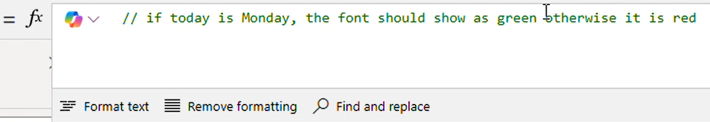
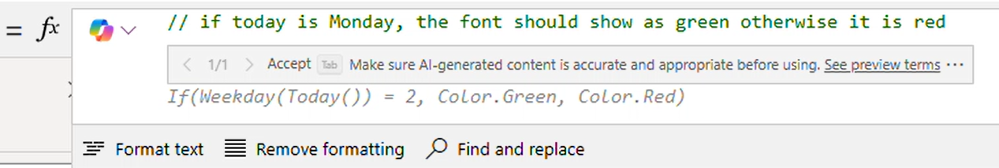

# Using Formulas with Copilot in the Formula Bar

Use AI to improve the experience of creating and editing formulas in the Formula Bar. By allowing Copilot to help explain Power Fx formulas in natural language or create Power Fx formulas from natural language, makers can build new or existing apps faster.

> [!IMPORTANT]
> AI generated content may be inaccurate and should always be checked for accuracy.

### Prerequisites
- Power Fx Formula Bar experience enabled in Studio Settings
- Browser and Power Apps portal configured for English language
- Copilot enabled on the environment and tenant

## Explain This Formula
Select a control and property that you want to understand more about what the formula is doing. Select the new Copilot button in the Formula Bar, and choose "Explain This Formula." An explanation window apears to let you know that the Copilot is working on the explanation, and then display the explanation once it's available. Explanations can be copied and inserted as code comments or shared with other people that are collaborating on an application.

### Known Limitations
- 1,000 character formula limit for explanations
- AI is only aware of default properties
- User Defined Functions are not supported
- Canada region is not available

## Formula from Comments (Preview)

Begin typing a code comment using // or /* in the Formula Bar, pause, and Copilot will generate a recommended formula to use for that situation. To select the recommendation, press "Tab," or begin typing through the recommendation. The recommendation will remain until you click elsewhere or type a character that doesn't align with the recommendation. Comments used to generate Power Fx formulas can remain in the Formula Bar to serve as ongoing documentation just like traditional code comments.

### Tips and Hints
- If after pausing to get a formula recommendation, no recommendation appears, the Copilot wasn't able to generate anything based on the comment provided. Rephrase or modify the comment and try again
- For specific references, sometimes it's helpful to put quotations around the element you're trying to include in your formula, for example "Button1.text"

### Known Limitations
- AI is only aware of default properties in the app
- Only works with general Power Fx functions, and not Power Apps specific functions (for exampe, Navigate())
- Other actions may be prevent from occurring in the Canvas Studio while retrieving Copilot formula recommendations 
- Existing formulas for that property aren't included in the recommendation
- User Defined Functions aren't supported
- Canada region isn't available

### Disabling Formula from Comments
This setting can be disabled from the Upcoming Features screen in Canvas Studio settings by toggling the flag for "Copilot comment-generated formulas." This ability to disable will be removed when the feature becomes Generally Available.

## Responsible AI

Review the Microsoft Documentation on [Responsible AI use for Power Apps](../common/responsible-ai-overview.md) to understand the choices a user has when working with AI. Additionally, review the [Power Fx Copilot FAQ](../common/pfx-copilot-faq.md) for questions regarding this functionality specifically.
