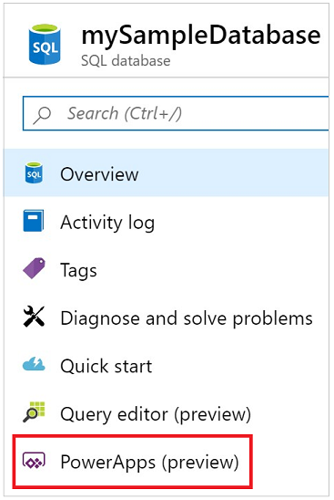
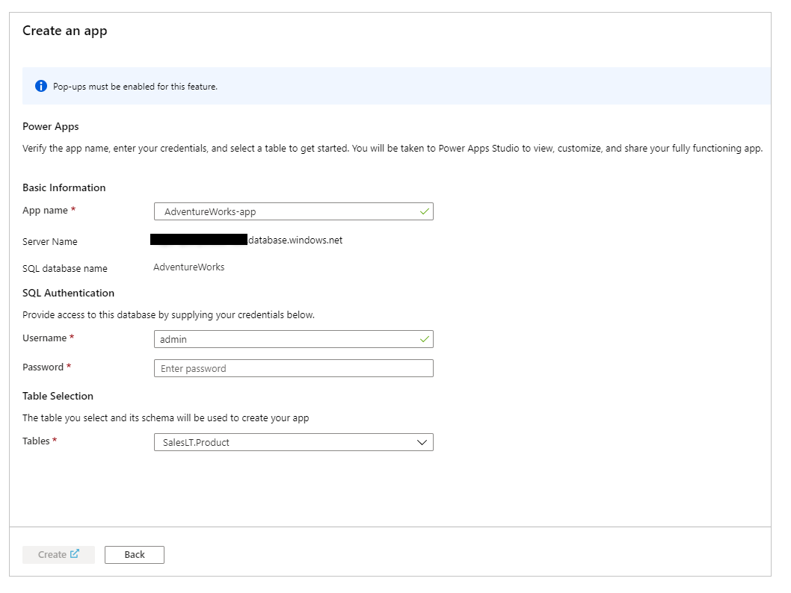

# Preview: Create a canvas app from Azure SQL Database

[This article is pre-release documentation and is subject to change.]

In this article, you'll use data in your Azure SQL Database to create an app with Power Apps in minutes. You'll have a fully functional app with your data that you can customize to fit your business needs and share  on any device.

> [!IMPORTANT]
> - This is a preview feature.
> - A preview feature may have limited availability and restricted functionality. A preview feature is available before an official release so that customers can get early access and provide feedback.

## Prerequisites

- Your browser must have pop-ups enabled.
- You need an Azure subscription.  If you don't have an Azure subscription, [create a free account](https://azure.microsoft.com/free/).
- You need access to an existing SQL database.   If you don't have an existing SQL database, [create a new database](/azure/sql-database/sql-database-single-database-get-started?tabs=azure-portal).
- You must allow [Azure services](#app-access-to-sql-database-server) access to SQL Database server in firewall settings.
- The SQL database table must have at least one column with text data type.

## Create an app from Azure portal

> [!TIP]
> You can also create an app that uses Azure SQL database from [Power Apps](https://make.powerapps.com). For more information, read [SQL Server connector for Power Apps](./connections/connection-azure-sqldatabase.md).

1. Sign in to [Azure portal](https://portal.azure.com).
1. Go to your SQL database.
1. Select **Power Apps**.
    
    

1. Select **Get started**.

1. App name is autofilled, but you can change it if necessary.
    

1. Enter a SQL authentication password and if necessary, change the autofilled username.
    
    > [!NOTE]
    > If you want to use Azure AD Integrated authentication instead of SQL authentication with Azure SQL database, create an app from [Power Apps](https://make.powerapps.com) instead, and use [SQL Server connector](./connections/connection-azure-sqldatabase.md).

1. Select a table from the dropdown list that you want to use to create the app.

1. Select **Create**.

    

    The [Power Apps Studio](https://create.powerapps.com/studio/) opens in a new tab. If the pop-up is blocked, update the browser to allow pop-ups and try again. Once created, you'll have a three-page app with data from your SQL database.

## Accessing your app

To access the created app again, go to [Power Apps](https://make.powerapps.com).

## App environment and region

The app you create with this method uses the [default environment](/power-platform/admin/environments-overview#the-default-environment) for the tenant and deploys to the region of this environment. You can find the region of a deployed app or your tenant's default environment from the [admin center](/power-platform/admin/regions-overview#how-do-i-find-out-where-my-app-is-deployed). To review all apps in a specific environment, go to [Power Apps](https://make.powerapps.com), select the **Environment** from the ribbon, and then select **Apps** on the left.

## App access to SQL Database server

You can configure Power Apps access to Azure SQL Database server using the Azure portal, or stored procedure *sp_set_firewall_rule*.

To configure access using the Azure portal, sign in to the [Azure portal](https://portal.azure.com/), and go to your **SQL Server**. Select **Firewalls and virtual networks** and set the control **Allow Azure services and resources to access this server** to **ON**. Select **Save** to submit changes.

You can also use stored procedure [sp_set_firewall_rule](/sql/relational-databases/system-stored-procedures/sp-set-firewall-rule-azure-sql-database) with IP address **0.0.0.0** to allow Azure services access to your SQL Database server.

## Limitations

- The app name can include only letters, numbers, hyphens, parentheses, or underscores.
- Creating an app from Azure portal requires SQL authentication.
- You can select only one table while you're creating a canvas app from the Azure portal. Customize the app after the app is created if you want to add more tables and other data sources by adding more data connections.
- Power Apps can't connect to SQL Database using VNet Service Endpoints. For more information, read [allowing access through VNet Service Endpoints](/azure/sql-database/sql-database-vnet-service-endpoint-rule-overview).

## Other considerations

- The access of the app to SQL Database is implicitly shared to all users that you [share this app](share-app.md) with. Ensure the SQL authentication credentials have appropriate access for reading and writing data.   For example, you can create a separate app that connects to the same SQL Database with different SQL authentication credentials to segregate read and read/write access.
- Review throttling limits, delegable functions and operations, known issues, and limitations of the [SQL Database](/connectors/sql/) connector this feature uses for performance considerations.
- Create an app from [Power Apps](https://make.powerapps.com) when you need to create an app for a non-default environment and a different region for the tenant using data from SQL Database.

## Next steps

As a next step, use [Power Apps](https://make.powerapps.com) studio to customize the app by adding additional controls, images, and logic to better suit your business needs.

> [!div class="nextstepaction"]
> [Design the canvas app interface in Power Apps](add-configure-controls.md)

## See also

- [Share a canvas app in Power Apps](share-app.md)  
- [Add a data connection to a canvas app in Power Apps](add-data-connection.md#add-data-source) 
- [Microsoft Learn: Customize a canvas app in Power Apps](/learn/modules/customize-apps-in-powerapps/)

[!INCLUDE[footer-include](../../includes/footer-banner.md)]