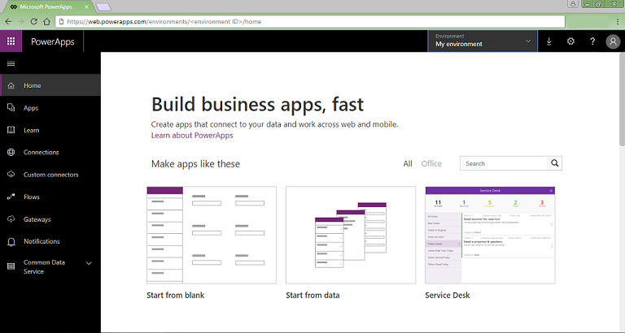

# Quickstart for generating an app in PowerApps from SharePoint

In this quickstart, you'll use PowerApps to automatically generate your first app based on a list that you create in SharePoint. In this app, you can browse all items in the list, show details of a single item, and create, update, or delete an item.

You can learn concepts and techniques from this quickstart if you have any list in SharePoint. To follow this quickstart exactly, create a list, named **SimpleApp**, that contains a column named **Title**, in a SharePoint Online site. In the list, create entries for **Vanilla**, **Chocolate**, and **Strawberry**.

You can create a list that's far more complex with many columns of various types, such as text, dates, numbers, and currency. The principles of generating an app won't change. You can also generate an app from a list in an on-premises SharePoint site if you [connect to the site](connect-to-sharepoint.md) through a data gateway.

If you don't have a license for PowerApps, you can [sign up for free](../signup-for-powerapps.md).

## Generate an app
1. Sign in to [PowerApps](https://web.powerapps.com).

	

1. Under **Make apps like these**, hover over **Start from data**, and then select **Make this app**.

	

1. On the SharePoint tile, select **Phone layout**.

	

1. With the **Connect directly** option selected, select **Create**.

    

1. Under **Connect to a SharePoint site**, type or paste the URL for your SharePoint Online site, and then select **Go**.

    Include only the site URL (not the name of the list), as in this example: `https://microsoft.sharepoint.com/teams/Contoso`

1. Under **Choose a list**, select **SimpleApp**, and then select **Connect**.

After a few minutes, your app opens to the browse screen, which shows the items that you created in your list. If your list has data in more columns than just **Title**, the app will show that data. Near the top of the screen, a title bar shows icons for refreshing the list, sorting the list, and creating an item in the list. Under the title bar, a search box provides the option to filter the list based on text that you type or paste. 

You'll probably want to make more changes before you use this app or share it with others. As a best practice, save your work so far by pressing Ctrl-S before you proceed. Give your app a name, and then select **Save**.

## Next steps
In this quickstart, you created an app to manage data in a SharePoint list. As a next step, generate an app from a more complex list, and then customize the app (starting with the browse screen) to better suit your needs.

> [!div class="nextstepaction"]
> [Customize a default browse screen](customize-layout-sharepoint.md)