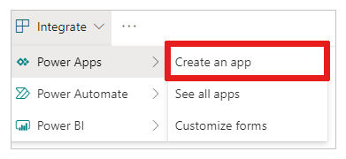

# Create a canvas app from a SharePoint list

In this topic, you'll use Power Apps to create a canvas app based on items in a SharePoint list. You can create the app from within Power Apps or SharePoint Online. From within Power Apps, you can create the app based on a list in an on-premises SharePoint site if you [connect to it](connections/connection-sharepoint-online.md#create-a-connection) through a data gateway.

The app that you create will contain three screens:

- In the browse screen, you can scroll through all items in the list.
- In the details screen, you can show all information about a single item in the list.
- In the edit screen, you can create an item or update information about an existing item.

You can apply the concepts and techniques in this topic to any list in SharePoint. To follow the steps exactly:

1. In a SharePoint Online site, create a list named **SimpleApp**.
2. In a column named **Title**, create entries for **Vanilla**, **Chocolate**, and **Strawberry**.

The principles of generating an app won't change even if you create a list that's far more complex, with many columns of various types such as text, dates, numbers, and currency.

> [!IMPORTANT]
> Power Apps doesn't support all types of SharePoint data. For more information, see [Known issues](connections/connection-sharepoint-online.md#known-issues).

Watch this video to learn how to create a canvas app from a list:
> [!VIDEO https://www.microsoft.com/videoplayer/embed/RWLj3n]

## Create an app from within Power Apps

1. Sign in to [Power Apps](https://make.powerapps.com?utm_source=padocs&utm_medium=linkinadoc&utm_campaign=referralsfromdoc).

1. Under **Start from data**, select **SharePoint**.

    

1. With the **Connect directly** option selected, select **Create**.

    

1. Under **Connect to a SharePoint site**, type or paste the URL for your SharePoint Online site, and then select **Go**.

    Include only the site URL (not the name of the list), as in this example: `https://microsoft.sharepoint.com/teams/Contoso`

1. Under **Choose a list**, select **SimpleApp**, and then select **Connect**.

    After a few minutes, your app opens to the browse screen, which shows the items that you created in your list. If your list has data in more columns than just **Title**, the app will show that data. Near the top of the screen, a title bar shows icons for refreshing the list, sorting the list, and creating an item in the list. Under the title bar, a search box provides the option to filter the list based on text that you type or paste. 

    

    You'll probably want to make more changes before you use this app or share it with others. As a best practice, save your work so far by pressing Ctrl-S before you proceed. Give your app a name, and then select **Save**.

## Create an app from within SharePoint Online

If you create an app of a custom list from the SharePoint Online command bar, the app appears as a view of that list. You can also run the app on an iOS or Android device, in addition to a web browser.

1. In SharePoint Online, open a custom list, and then select **Integrate** -> **Power Apps** -> **Create an app**.

    

2. In the panel that appears, type a name for your app, and then select **Create**.

    

    A new tab appears in your web browser that shows the app that you created based on your SharePoint list. The app appears in Power Apps Studio, where you can customize it.

    

3. (optional) Refresh the browser tab for your SharePoint list (by selecting it and then, for example, pressing F5), and then follow these steps to run or manage your app:

    - To run the app (in a separate browser tab), select **Open**.
    - To let others in your organization run the app, select **Make this view public**.

        To let others to edit your app, [share it](share-app.md) with **Can edit** permissions.

    - To remove the view from SharePoint, select **Remove this view**.

        To remove the app from Power Apps, [delete the app](delete-app.md).

> [!NOTE]
> Apps created from the SharePoint list currently do not show in the Power Apps Mobile.

## Next steps
In this topic, you created an app to manage data in a SharePoint list. As a next step, create an app from a more complex list, and then customize the app (starting with the browse screen) to better suit your needs.

> [!div class="nextstepaction"]
> [Customize a default browse screen](customize-layout-sharepoint.md)

### See also

- [SharePoint integration scenarios](sharepoint/scenarios-intro.md)

[!INCLUDE[footer-include](../../includes/footer-banner.md)]