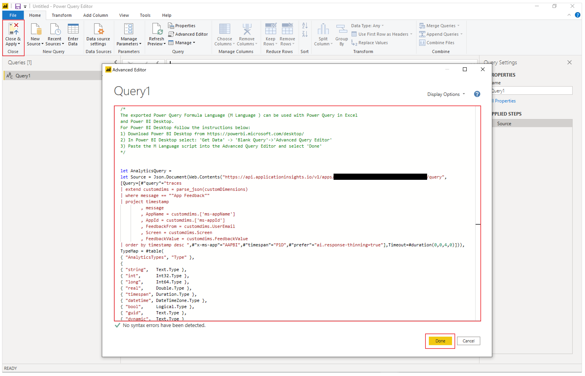

# Analyze system-generated logs using Application Insights

You can connect your canvas apps to [Application Insights](/azure/azure-monitor/app/app-insights-overview), a feature of [Azure Monitor](/azure/azure-monitor/overview). Application Insights includes powerful analytics tools to help you diagnose issues and understand what users actually do with your apps. You can collect information to help you drive better business decisions and improve the quality of your apps.

In this quickstart, we use a canvas app called Kudos to explore concepts of system-generated logs in canvas apps and apply them to your apps. The sample Kudos app is part of a suite of employee engagement apps available for download from the [Employee Experience Starter Kit](https://powerapps.microsoft.com/blog/powerapps-employee-experience-starter-kit).

## Prerequisites

- You must have access to the [Azure portal](https://portal.azure.com).
- You must have the permissions to [create Azure resources](/azure/role-based-access-control/quickstart-assign-role-user-portal).

### Optional

- Download and install the Kudos app from the [Employee Experience Starter Kit](https://powerapps.microsoft.com/blog/powerapps-employee-experience-starter-kit). You can also use an existing app instead.

## Create an Application Insights resource

Before you can send system-generated logs from an app, you need to create an Application Insights resource to store the events.

1. Sign in to the [Azure portal](https://portal.azure.com/).

1. Search for Application Insights:

    

1. Create an Application Insights resource:

    

1. Enter the appropriate values and select **Review + create**.

    For more details, read [Create an Application Insights resource](/azure/azure-monitor/app/create-new-resource). 

    

1. After the Application Insights instance is created, copy the **Instrumentation Key** in the instance overview for use in an upcoming step.

    

## Connect your app to Application Insights

> [!NOTE]
> - When specifying an instrumentation key, be aware that data can be sent across tenants. Trace events are sent to the App Insights resource that corresponds to the instrumentation key you set for your app, even if the target App Insights instance is in a different tenant than the app.
> - Use caution when importing existing .msapp files since instrumentation keys for App Insights may be present. Manually open the app after import to verify that the correct App Insights instrumentation key is being used.

1. Sign in to [Power Apps](https://make.powerapps.com).

1. Select **Apps** in the left navigation pane. From the list of apps, select the **Kudos** app, and then select **Edit**:

    

    > [!NOTE]
    > You can also [create](open-and-run-a-sample-app.md) a new app or [edit](edit-app.md) any existing app instead.

1. Select the **App** object in the left navigation tree view and paste the **Instrumentation Key**:

    

1. **Save** and **Publish** your app.

1. **Play** the published app and browse the different screens. 

As you browse the app screens, events are automatically logged to Application Insights, including usage details such as:

- Where the app is accessed from
- Which devices are used
- The browser types used

> [!IMPORTANT]
> You must play the published app to send events to Application Insights. Events are not sent to Application Insights when you preview the app in Power Apps Studio.

## View events in Application Insights

1. Sign in to the [Azure portal](https://portal.azure.com/) and open the Application Insights resource you created [earlier](#create-an-application-insights-resource).

1. Scroll down in the left navigation pane and select **Users** under the **Usage** section. 

    > [!NOTE]
    > The **Users** view shows the app's usage details, such as:
    > - Number of users who viewed the app
    > - Number of user sessions
    > - Number of events logged
    > - Users' operating systems and browser version details
    > - Users' region and location
    > 
    > [Learn more about users, sessions, and events analysis in Application Insights](/azure/azure-monitor/app/usage-segmentation).

1. Select one of the user sessions to drill into specific details. You can see information such as the session length and the screens visited:

    

1. Select the **Events** view in the left navigation pane under the **Usage** section. You can see a summary of all the screens viewed across all app sessions:

    

> [!TIP]
> More Application Insights features are available, such as:  
> - [Funnels](/azure/azure-monitor/app/usage-funnels)
> - [Cohorts](/azure/azure-monitor/app/usage-cohorts)
> - [Impact analysis](/azure/azure-monitor/app/usage-impact)
> - [Retention analysis](/azure/azure-monitor/app/usage-retention)
> - [Usage flows](/azure/azure-monitor/app/usage-flows)

## Create custom trace events

You can write custom traces directly to Application Insights and start to analyze information specific to your scenario. The [Trace](./functions/function-trace.md) function allows you to collect:

- Granular usage information for controls on the screens
- Which specific users are accessing your app
- What errors occur

Tracing can also help diagnose issues because you can send a trail of information as your users browse through your app and perform different actions. Trace messages sent to Application Insights have one of three severities:

- Information
- Warning
- Error

Depending on your scenario, you can choose to send a trace message with the appropriate severity. You can query the data and take specific actions based on the severity.

> [!NOTE]
> If you are logging any personal data, be aware of your obligations with respect to various privacy laws and regulations. Refer to the [Microsoft Trust Center](https://www.microsoft.com/trust-center) and the [Service Trust Portal](https://servicetrust.microsoft.com/ViewPage/HomePageVNext) for more information.

Now create a new component in your app to collect feedback on each screen, and write the events to Application Insights.

1. Sign in to [Power Apps](https://make.powerapps.com).

1. Select **Apps** in the left navigation pane. From the list of apps, select the **Kudos** app, and then select **Edit**.

    > [!NOTE]
    > You can also [create](open-and-run-a-sample-app.md) a new app or [edit](edit-app.md) an existing app instead.

1. Select the **Components** option on the **Tree view**:

    

1. Select **New component**, and then resize the width to 200 and height to 75:

    

1. Select **Insert** from the menu and then select **Icons** to add *Emoji - Frown* and *Emoji - Smile*:

    

1. Select **New custom property** to create a custom property:

    

1. Enter property *Name* and *Display name* such as *FeedbackSceen*.

1. Enter property *Description*.

1. Select **Property type** as **Input** and **Data type** as **Screen**:

    

    > [!NOTE]
    > Input property allows you to capture the screen name and its component so that you can log this information to Application Insights.

1. Select the component on the **Tree View**, select **More actions** (**&hellip;**), and then select **Rename** to rename the component with a meaningful name such as *FeedbackComponent*.

    

1. Select the icons, select **More actions** (**&hellip;**), and then select **Rename** to rename the icons with meaningful names, such as *FrownIcon* and *SmileIcon*.

1. Select **FrownIcon**, select the **OnSelect** property, and then enter the following expression in the formula bar:

    ```powerapps-dot
    Trace(
       "App Feedback",
       TraceSeverity.Information,
           {
             UserName: User().FullName,
             UserEmail: User().Email,
             Screen: FeedbackComponent.FeedbackScreen.Name,
             FeedbackValue: "-1"
           }
         );
    Notify("Thanks for your feedback!");
    ```

    

    > [!NOTE]
    > The formula expression sends *UserName*, *UserEmail*, *Screen*, and the *Feedback* (with the value *-1*) to Application Insights.

1. Select **SmileIcon**, select the **OnSelect** property, and then enter the following expression in the formula bar:
    
    ```powerapps-dot
    Trace(
       "App Feedback",
       TraceSeverity.Information,
           {
             UserName: User().FullName,
             UserEmail: User().Email,
             Screen: FeedbackComponent.FeedbackScreen.Name,
             FeebackValue: "1"
           }
         );
    Notify("Thanks for your feedback!");
    ```

1. Add the component to one of the screens in your app:

    

1. Select **Save** and then select **Publish** to save and publish your app.

1. Play the published app, and send a smile and a frown feedback from your screens.

    > [!IMPORTANT]
    > You must play the published app to send events to Application Insights. Events are not sent to Application Insights when you preview the app in Power Apps Studio.

    

## Analyze data in Application Insights

You can now begin to analyze the data you sent using the [Trace](#create-custom-trace-events) function from your app in Application Insights.

1. Sign in to the [Azure portal](https://portal.azure.com/) and open the Application Insights resource you created [earlier](#create-an-application-insights-resource):

    

1. Select **Logs** under **Monitoring** in the left navigation pane:

    

1. Enter the following query and select **Run** to view the feedback received from your app:

    ```kusto
    traces
    | where message == "App Feedback"
    | order by timestamp
    ```

    

1. Select a row in the results and expand the *customDimensions* field. 

    The values for **Screen**, **UserName**, **UserEmail**, and **FeedbackValue** for the **OnSelect** event of the smile or frown icon in your component have been recorded. Values are also recorded for each event sent to Application Insights, such as the **appId**, **appName**, and **appSessionId**.

    

1. With the following example query, you can extend the properties of the JSON custom dimensions and project the columns in the results view.

    ```kusto
    traces
        | extend customdims = parse_json(customDimensions)
        | where message == "App Feedback"
        | project timestamp
            , message
            , AppName = customdims.['ms-appName']
            , AppId = customdims.['ms-appId']
            , FeedbackFrom = customdims.UserEmail
            , Screen = customdims.Screen
            , FeedbackValue = customdims.FeedbackValue
        | order by timestamp desc
    ```

    

    > [!TIP]
    > *Log queries* are extremely powerful. You can use them to join multiple tables, aggregate large amounts of data, and perform complex operations. [Learn more about log queries](/azure/azure-monitor/log-query/log-query-overview).

## Monitor unhandled errors (experimental)

[This section contains pre-release documentation and is subject to change.]

> [!IMPORTANT]
> - This is an experimental feature.
> - Experimental features aren’t meant for production use and may have restricted functionality. These features are available before an official release so that customers can get early access and provide feedback.

You can't always anticipate and plan for all errors that might occur while your app is running. Unhandled Power Fx formula errors are reported to users as banner messages. They can also be reported to Application Insights to help you understand their frequency and severity without relying on your app's users to report issues. You can also [set up real-time alerts](/azure/azure-monitor/app/availability-alerts) when runtime errors occur to take a more proactive approach.

### Enable error passing to Application Insights

You need to enable the setting that allows Power Apps to pass unhandled runtime errors to Azure Application Insights.

> [!WARNING]
> Enabling this setting may incur additional costs related to the storage of Application Insights logs.

To enable error passing, go to **Settings > Upcoming features > Experimental > Pass errors to Azure Application Insights** while keeping your canvas app open for editing. Save and publish your app.

:::image type="content" source="media/application-insights/pass-error-feature.png" alt-text="Enable Pass errors to Azure Application Insights setting.":::

### Error events in Application Insights

Unhandled Power Fx errors experienced by users at app runtime are reported to the **traces** table. Unhandled errors can be identified and distinguished from other error events by the event message "Unhandled error." The "severityLevel" dimension of these events is 3 (TraceSeverity.Error).

Detailed error messages are provided in the "errors" dimension of the *customDimension* property. In situations where multiple errors occurred during the same operation, the errors are consolidated in the "errors" dimension of a single trace event. The error messages are the same as reported in [Monitor](/power-apps/maker/monitor-canvasapps) during a live debug session.

The following example query identifies unhandled errors and expands all error messages included in the trace event:

```kusto
traces
    | where message == "Unhandled error"
    | extend customdims = parse_json(customDimensions)
    | extend errors = parse_json(tostring(customdims.['errors']))
    | mv-expand errors
    | project timestamp
        , itemId //unique identifier for the trace event
        , AppName = customdims.['ms-appName']
        , AppId = customdims.['ms-appId']
        , errors = errors.['Message']
    | order by timestamp desc
```

:::image type="content" source="media/application-insights/kusto.png" alt-text="Sample output for example query.":::

## Correlation tracing (experimental)

[This section contains pre-release documentation and is subject to change.]

> [!IMPORTANT]
> - This is an experimental feature.
> - Experimental features aren’t meant for production use and may have restricted functionality. These features are available before an official release so that customers can get early access and provide feedback.

Connections to external data and services are fundamental to most apps. Correlation tracing generates and propagates context information to join system-generated logs across a canvas app and its connections, subject to certain [limitations](#limitations). As an example, your app may call into a custom connector that in turn calls an Azure Function or other REST API. Correlation tracing allows you to correlate actions taken in the app with the underlying API calls across tiers. This can be useful in troubleshooting.

Canvas app correlation tracing is an implementation of context tracing and follows the [W3C specification](https://www.w3.org/TR/trace-context/).

### Enable correlation tracing

> [!WARNING]
> Enabling this setting may incur additional costs related to the storage of Application Insights logs.

To enable the correlation tracing feature, go to **Settings > Upcoming features > Experimental > Enable Azure Application Insights correlation tracing** while keeping your canvas app open for editing. Save and publish your app.

:::image type="content" source="media/application-insights/correlation-tracing.png" alt-text="Enable Azure Application Insights correlation tracing.":::

### Limitations

- Correlation tracing is available only for custom connectors. Other connector types aren't supported.
- HTTP requests are captured in Application Insights only if the connected service [is also connected to Application Insights](/azure/azure-monitor/app/app-insights-overview).

### Using correlation tracing

When enabled, correlation tracing adds a new system-generated log event in the **dependencies** table of the canvas app's Application Insights instance. This event is recorded at the time a response from a network call is received. Dependency events capture details of the network call, including the request and response headers, response status code, and duration of the call.

:::image type="content" source="media/application-insights/correlation-dependencies.png" alt-text="Sample event logged in the dependencies table.":::

If the connected service is also connected to Application Insights, an additional system-generated log event capturing the request is generated in the **requests** table of the service's Application Insights instance. Some Azure services, such as Azure Functions, can be connected without any coding from the Azure portal. Both the canvas app or multiple apps and connected services can be connected to the same Application Insights instance.

:::image type="content" source="media/application-insights/correlation-requests.png" alt-text="Sample event logged in the requests table.":::

Network calls for supported connectors can be joined with other system-generated logs on the "operation_Id" dimension. The following example query shows a network call being made alongside trace events emitted during an app session.

```kusto
traces | union dependencies | union requests | union pageViews | union customEvents
| project timestamp
    , itemType
    , name
    , operation_Name
    , message
    , severityLevel
    , customDimensions
    , operation_Id
    , operation_ParentId
| where operation_Id == "0a7729e3e83c4e4d93cb4f51149f73b9" //placeholder operation_Id, replace
| order by timestamp asc
```

:::image type="content" source="media/application-insights/correlation-output.png" alt-text="Sample output for the earlier example query.":::
  
## Export data to Power BI

You can export your Application Insights data and query results to Power BI for analysis and data presentation.

1. Sign in to the [Azure portal](https://portal.azure.com/) and open the Application Insights resource you created [earlier](#create-an-application-insights-resource):

1. Select **Logs** under **Monitoring** in the left navigation pane:

1. From the log analytics query window, select the **Export** menu.

1. Select the **Export to Power BI (M query)** option to download a Power BI query file:

    

1. Open the downloaded file in a text editor and copy the query to the clipboard.

1. Open Power BI.

1. Select the **Get Data** menu in the **Home** ribbon, and then select  **Blank query**:

    

1. In the query window, select **Advanced Editor**. Paste the query into the window, select **Done**, and then select **Close & Apply**:

    

You can also create charts and visualizations in Power BI to represent feedback received in your app, as well as make data-based decisions and actions.


## Default Trace event context and dimensions

A set of default dimensions is also added to the *customDimensions* property on each Trace event. These dimensions can be used to identify the application and application sessions the events occurred in. If you log additional custom data using the Trace function, they'll also appear in the custom dimensions.

| Dimension Name  | Represents                                            |
|-----------------|-------------------------------------------------------|
| ms-appId | The Application ID of the app that sent the event. |
| ms-appname | The Application name of the app that sent the event. |
| ms-appSessionId | The application session ID. This value may not be populated is some scenarios. When available, this value overrides the standard Application Insights sessionID dimension. |
| ms-tenantID | The unique identifier of the tenant where the application is published. |
| ms-environmentId | The name of the environment where the application is published. |
| userId | A unique identifier for the user associated with the session. |
| ms-duration | An imputed value measuring the time it takes for a user to navigate from one screen to another. This value overrides the standard Application Insights PageView duration dimension. |
| sessionId | A session ID that can be used to correlate all events associated with a single application session. This value is always present and is recommended for understanding unique session count. This value is taken from the player's session ID and is shown when viewing the session details while playing the app. Session ID might sometimes get a default, random, and unique Application Insights generated value. This default value isn't reliable and doesn't correlate with any app-specific parameters. |
| Duration | An imputed value measuring the time it takes for a user to navigate from one screen to another. This value is the same as the duration reported by the ms-duration dimension. |
| ms-isTest | Indicates whether the session is associated with the Test Studio test runner. |
| ms-currentScreenName | The name of the page a user is navigating from (present for page navigation events). |
| ms-targetScreenName | The name of the page a user is navigating to (present for page navigation events). |

## Unsupported scenarios

Application Insights doesn't support the following scenarios.

- Offline player events aren't captured.
- Mobile app (both iOS and Android) events aren't captured when app is suspended.
- GCC and non-public clouds aren't supported.

[!INCLUDE[footer-include](../../includes/footer-banner.md)]
