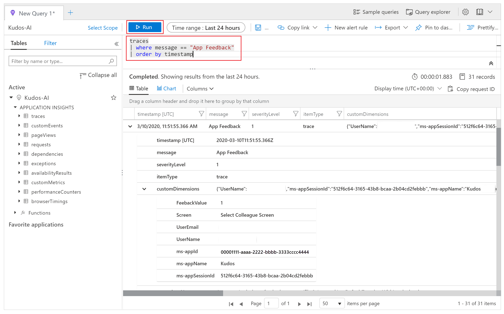

# Analyze app telemetry using Application Insights

You can connect your app with [Application Insights](https://docs.microsoft.com/azure/azure-monitor/app/app-insights-overview), a feature of [Azure Monitor](https://docs.microsoft.com/azure/azure-monitor/overview). Application Insights includes powerful analytics tools to help you diagnose issues and to understand what users actually do with your app. 

With your app connected to Applications Insights, you can collect
information to help you drive better business decisions and improve the quality of your apps.

In this quickstart, you'll instrument a canvas app called Kudos. This helps you explore, discover telemetry concepts, and apply them to your own canvas
apps. The sample Kudos app is part of a suite of employee engagement apps
available for download from [Employee Experience Starter
Kit](https://powerapps.microsoft.com/blog/powerapps-employee-experience-starter-kit).

## Prerequisites

- You must have access to [Azure portal](https://portal.azure.com).
- You must have the permissions to [create Azure resources](https://docs.microsoft.com/azure/role-based-access-control/quickstart-assign-role-user-portal).

### Optional

- Download and install Kudos app from [Employee Experience Starter
Kit](https://powerapps.microsoft.com/blog/powerapps-employee-experience-starter-kit). You can also use an existing app instead.

## Create an Application Insights resource

Before you can send telemetry for an app, you'll need to create an Azure
Application Insights resource to store the events.

1. Sign in to the [Azure portal](https://portal.azure.com/).

1. Search for Application Insights:

    

1. Create an Application Insights resource:

    

1. Enter the appropriate values and select **Review + create**. For more details, read [Create an Application Insights resource](https://docs.microsoft.com/azure/azure-monitor/app/create-new-resource). 

    

1. After the Application Insights instance is created, you'll see the instance overview. Copy the **Instrumentation Key**. You'll need this key to configure your app.

    

## Connect your app to Application Insights

1. Sign in to [Power Apps](https://make.powerapps.com).

1. Select **Apps** from the left navigation. From the list of apps, select the **Kudos** app and then select **Edit**:

    

    > [!NOTE]
    > You can also [create](open-and-run-a-sample-app.md) a new app or [edit](edit-app.md) any existing app instead.

1. Select **App** object from the left navigation tree view and paste the **Instrumentation Key**:

    

1. **Save** & **Publish** your app.

1. **Play** the published app and browse through different screens. 

As you browse through different screens, events are automatically logged to Application Insights including the usage details such as:

- Where the app is accessed from.
- Which are the devices used.
- The browser types used.

> [!IMPORTANT]
> You must play the published app to send events to Application
Insights. Events are not sent to Application Insights when you preview the
app in Power Apps Studio.

## View events in Application Insights

1. Sign in to the [Azure portal](https://portal.azure.com/) and open the Application Insights resource you created [earlier](#create-an-application-insights-resource).

1. Scroll down in the left navigation pane and select **Users** under the **Usage** section. 

    > [!NOTE]
    > **Users** view shows usage details of the app, such as:
    > - Number of users that viewed the app.
    > - Number of sessions by the users for the app.
    > - Number of events logged for the app.
    > - Operating systems and browser version details of the users.
    > - Region and location of the users.
    > 
    > For more details, read [Users, sessions, and events analysis in Application Insights](https://docs.microsoft.com/azure/azure-monitor/app/usage-segmentation).

1. Select one of the user sessions to drill into specific details. You can see information such as the session length and the screens visited:

    

1. Select the **Events** view in left navigation pane under **Usage** section. You can see a summary of all the screens viewed across all app sessions:

    

> [!TIP]
> Some of the additional Application Insights features you can use are:  
> - [**Funnels**](https://docs.microsoft.com/azure/azure-monitor/app/usage-funnels)
> - [**Cohorts**](https://docs.microsoft.com/azure/azure-monitor/app/usage-cohorts)
> - [**Impact analysis**](https://docs.microsoft.com/azure/azure-monitor/app/usage-impact)
> - [**Retention analysis**](https://docs.microsoft.com/azure/azure-monitor/app/usage-retention)
> - [**Usage flows**](https://docs.microsoft.com/azure/azure-monitor/app/usage-flows)

## Create custom trace events

You can write custom traces directly to Application Insights and start to analyze information specific to your scenario. [Trace](https://docs.microsoft.com/powerapps/maker/canvas-apps/functions/function-trace) function allows you to collect:

- Granular usage information for controls on the screens.
- Which specific users are accessing your app.
- What errors occur.

Tracing can also help diagnose issues as you can send a trail of information as your users browse through your app and perform different actions.

There are 3 severities for trace messages when sending custom trace information to Application Insights from your app:

- **Information**
- **Warning**
- **Error**

Depending on your scenario, you can choose to send trace message with the appropriate severity. You can query the data and take specific actions based on the message severity.

> [!NOTE]
> If you are logging any personnel data, you will need to consider any
data compliance obligations, such as GDPR, that you may also need to implement.

You'll now update your app and create a new component to collect feedback on each screen of the app. You'll write the events to Application Insights.

1. Sign in to [Power Apps](https://make.powerapps.com).

1. Select **Apps** from the left navigation. From the list of apps, select the **Kudos** app and then select **Edit**.

    > [!NOTE]
    > You can also [create](open-and-run-a-sample-app.md) a new app or [edit](edit-app.md) any existing app instead.

1. Select the **Components** option in the **Tree view**:

    

1. Select **New component**, and then resize the width to 200, height to 75:

    

1. Select **Insert** from the menu and then select **Icons** to add *Emoji - Frown* and *Emoji - Smile* icons:

    

1. Select **New custom property** to create a custom property:

    

1. Enter property *Name* and *Display name* such as *FeedbackSceen*.

1. Enter property *Description*.

1. Select **Property type** as **Input** and **Data type** as **Screen**:

    

    > [!NOTE]
    > Input property allows you to capture the screen name and it's component so that you can log this information to Application Insights.

1. Select the component on the **Tree View**, then select the **More actions** (**...**) and then select **Rename** to rename the component with a meaningful name such as *FeedbackComponent*.

    

1. Select icons, select **More actions** (**...**) and then select **Rename** to rename the icons with a meaningful names, such as *FrownIcon* and *SmileIcon*.

1. Select the *FrownIcon*, select the **OnSelect** property, and then enter the following expression in the formula bar:

    ```
    Trace(
       "App Feedback",
       TraceSeverity.Information,
           {
             UserName: User().FullName,
             UserEmail: User().Email,
             Screen: FeedbackComponent.FeedbackScreen.Name,
             FeedbackValue: "-1"
           }
         );
    Notify("Thanks for you feedback!");
    ```

    

    > [!NOTE]
    > The formula expression sends *UserName*, *UserEmail*, *Screen* and the *Feedback* (with the value *-1*) to Application Insights.

1. Select the *SmileIcon*, select the **OnSelect** property, and then enter the following expression in the formula bar:
    
    ```
    Trace(
       "App Feedback",
       TraceSeverity.Information,
           {
             UserName: User().FullName,
             UserEmail: User().Email,
             Screen: FeedbackComponent.FeedbackScreen.Name,
             FeebackValue: "1"
           }
         );
    Notify("Thanks for you feedback!");
    ```

1. Add the component to one of the screens in your app:

    

1. Select **Save** and then select **Publish** to save & publish your app.

1. Play the published app, and send a smile and a frown feedback from your
    screens.

    > [!IMPORTANT]
    > You must play the published app to send events to Application
    Insights. Events are not sent to Application Insights when you preview the
    app in Power Apps Studio.

    

## Analyze data in Application Insights

You can now begin to analyze the data you sent using the [Trace](#create-custom-trace-events) function from your application in App Insights.

1. Sign in to the [Azure portal](https://portal.azure.com/) and open the Application Insights resource you created [earlier](#create-an-application-insights-resource):

    

1. Select **Logs** under **Monitoring** from left navigation pane:

    

1. Enter the following query and select **Run**. The feedback received from your app is returned:

    ```powerappsfl
    traces
    | where message == "App Feedback"
    | order by timestamp
    ```

    

1. Select a row in the results and expand the *custom dimensions* field. 

    The values for **Screen**, **UserName**, **UserEmail**, and **FeedbackValue** for the **OnSelect** event of the smile or frown icon in your component have been recorded. <br>
    There are also some additional values recorded for each event sent to
    Application Insights; such as the **appId**, **appName** and **appSessionId**.

    

1. With the following example query, you can extend the properties of the JSON custom dimensions and project the columns in the results view.

    ```powerappsfl
    traces
        | extend customdims = parse_json(customDimensions)
        | where message == "App Feedback"
        | project timestamp
            , message
            , AppName = customdims.['ms-appName']
            , AppId = customdims.['ms-appId']
            , FeedbackFrom = customdims.UserEmail
            , Screen = customdims.Screen
            , FeedbackValue = customdims.FeedbackValue
        | order by timestamp desc
    ```

    

    > [!TIP]
    > *Log queries* are extremely powerful. You can use them to join multiple
    tables, aggregate large amounts of data and perform complex operations. For more information, read [Log
    queries](https://docs.microsoft.com/azure/azure-monitor/log-query/log-query-overview).

## Export data to Power BI

You can export your Application Insights data and query results to Power BI for analysis and data presentation.

1. Sign in to the [Azure portal](https://portal.azure.com/) and open the Application Insights resource you created [earlier](#create-an-application-insights-resource):

1. Select **Logs** under **Monitoring** from left navigation pane:

1. From the log analytics query window, select **Export** drop down menu.

1. Select **Export to Power BI (M query)** option. This will download a Power BI query file to your machine:

    

1. Open the downloaded file in a text editor and copy the query to clipboard.

1. Open Power BI.

1. Select **Get Data** drop-down menu in **Home** ribbon and then select  **Blank Query**:

    

1. In the query window, select **Advanced Editor**. Paste the query from step 5 into the window, select **Done**, and then select **Close & Apply**:

    

1. You can also create charts and visualizations in Power BI to represent feedback received in your app. And make data-based decisions and actions.

    

## Default Trace event context and dimensions

A set of default dimensions is also added to the *customDimensions* property on each Trace event. These dimensions can be used to identify the application and application sessions the events occurred in. If you log additional custom data using the trace function, they'll also appear in the custom dimensions.

| Dimension Name  | Represents                                            |
|-----------------|-------------------------------------------------------|
| ms-appId        | The Application ID of the app that sent the event     |
| ms-appName      | The Application name of the app that sent the event   |
| ms-appSessionId | The application session ID.                           |

