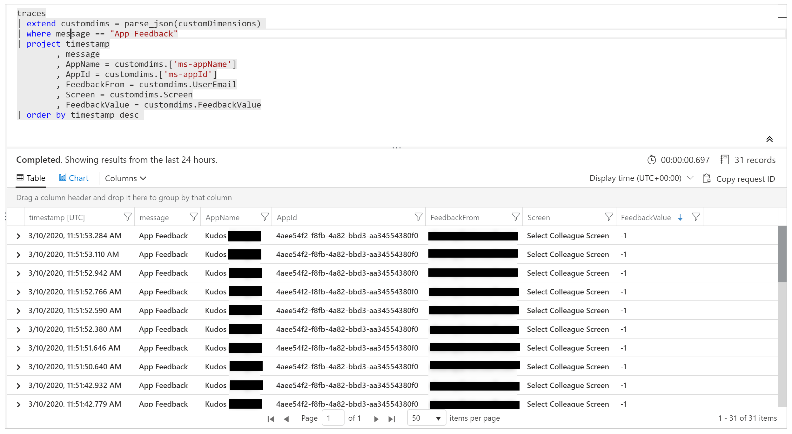

# Analyze system-generated logs using Application Insights

Connect your canvas apps to [Application Insights](/azure/azure-monitor/app/app-insights-overview), which is a feature of [Azure Monitor](/azure/azure-monitor/overview). Application Insights includes analytics tools that help diagnose issues and understand user behavior in apps. Use the collected information to make better business decisions and improve app quality.

## Prerequisites

- You need access to the [Azure portal](https://portal.azure.com).
- You need permission to [create Azure resources](/azure/role-based-access-control/quickstart-assign-role-user-portal).

> [!NOTE]
> To view telemetry information, your tenant admin needs to enable **Canvas app insights**. Sign in as an admin at the [Power Platform admin center](https://admin.powerplatform.microsoft.com/). Select **Settings** > **Tenant settings** > **Canvas app insights**. In the **Canvas app insights** pane, turn the toggle **On** and save your changes.
> Learn more in [Tenant settings](/power-platform/admin/tenant-settings).

## Create an Application Insights resource

Send system-generated logs from an app by creating an Application Insights resource to store events.

Learn how to [create a workspace-based resource](/azure/azure-monitor/app/create-workspace-resource?tabs=bicep#create-a-workspace-based-resource) for Application Insights in the Azure portal.

## Connect your app to Application Insights

> [!NOTE]
>
> - When you specify a connection string, remember that data can be sent across tenants. Trace events are sent to the App Insights resource that corresponds to the connection string you set for your app, even if the target App Insights instance is in a different tenant than the app.
> - Be cautious when importing existing .msapp files because connection strings for App Insights might be present. Manually open the app after import to check that the correct App Insights connection string is used.

1. Sign in to [Power Apps](https://make.powerapps.com).

1. Open an app to [edit it](edit-app.md).

1. Select the **App** object in the left navigation tree view, and paste the **Connection string** from your Application Insights resource.

    

1. **Save** and **Publish** your app.

1. **Play** the published app and browse the different screens.

When you browse the app screens, events are automatically logged to Application Insights. These include usage details like:

- Where users access the app from
- Which devices users use
- The types of browsers users use

> [!IMPORTANT]
> Play the published app to send events to Application Insights. Events don't send to Application Insights when you preview the app in Power Apps Studio.

## View events in Application Insights

1. Sign in to the [Azure portal](https://portal.azure.com/) and open the Application Insights resource you [created previously](#create-an-application-insights-resource).

1. In the left navigation pane, select **Users** under the **Usage** section.

    > [!NOTE]
    >
    > The **Users** view shows app usage details, such as:
    > - Number of users who viewed the app
    > - Number of user sessions
    > - Number of events logged
    > - Users' operating systems and browser version details
    > - Users' region and location
    >
    > [Learn more about users, sessions, and events analysis in Application Insights](/azure/azure-monitor/app/usage-segmentation).

1. Select a user session to view specific details, such as session length and screens visited.

    

1. In the left navigation pane, select **Events** under the **Usage** section. You can view a summary of all the screens viewed across all app sessions.

    

> [!TIP]
> Explore more Application Insights features, such as:
>
> - [Funnels](/azure/azure-monitor/app/usage-funnels)
> - [Cohorts](/azure/azure-monitor/app/usage-cohorts)
> - [Impact analysis](/azure/azure-monitor/app/usage-impact)
> - [Retention analysis](/azure/azure-monitor/app/usage-retention)
> - [Usage flows](/azure/azure-monitor/app/usage-flows)

## Create custom trace events

Write custom traces to Application Insights to analyze information specific to your app. The [Trace](./functions/function-trace.md) function allows you to collect:

- Detailed usage information for controls on the screens
- Which specific users are accessing your app
- What errors occur

Tracing helps you diagnose issues by sending a trail of information as users browse your app and take actions. Trace messages sent to Application Insights have one of three severities:

- Information
- Warning
- Error

Send a trace message with the appropriate severity based on the situation. You can query the data and take specific actions based on the severity.

> [!NOTE]
> If you are logging any personal data, be aware of your obligations with respect to various privacy laws and regulations. Refer to the [Microsoft Trust Center](https://www.microsoft.com/trust-center) and the [Service Trust Portal](https://servicetrust.microsoft.com/ViewPage/HomePageVNext) for more information.

Create a component in your app to collect feedback on each screen and log events to Application Insights.

1. Sign in to [Power Apps](https://make.powerapps.com).

1. Select **Apps** in the left navigation pane. From the list of apps, select the **Kudos** app, and then select **Edit**.

    > [!NOTE]
    > You can also [create](open-and-run-a-sample-app.md) a new app or [edit](edit-app.md) an existing app instead.

1. Select **Components** in the **Tree view**:

    

1. Select **New component**, then resize the width to 200 and the height to 75:

    

1. Select **Insert** from the menu and then select **Icons** to add *Emoji - Frown* and *Emoji - Smile*:

    

1. Select **New custom property** to create a custom property:

    

1. Enter the property *Name* and *Display name* (for example, *FeedbackScreen*).

1. Enter a property *Description*.

1. Select **Property type** as **Input** and **Data type** as **Screen**:

    

    > [!NOTE]
    > An input property lets you capture the screen name and its component to log this information to Application Insights.

1. Select the component in the **Tree view**, select **More actions** (**&hellip;**), and select **Rename** to give the component a meaningful name, such as *FeedbackComponent*.

    

1. Select the icons, select **More actions** (**&hellip;**), and then select **Rename** to rename the icons with meaningful names, such as *FrownIcon* and *SmileIcon*.

1. Select **FrownIcon**, select the **OnSelect** property, and enter the following expression in the formula bar:

    ```power-fx
    Trace(
       "App Feedback",
       TraceSeverity.Information,
           {
             UserName: User().FullName,
             UserEmail: User().Email,
             Screen: FeedbackComponent.FeedbackScreen.Name,
             FeedbackValue: "-1"
           }
         );
    Notify("Thanks for your feedback!");
    ```

    

    > [!NOTE]
    > The formula sends *UserName*, *UserEmail*, *Screen*, and *Feedback* (with the value *-1*) to Application Insights.

1. Select **SmileIcon**, select the **OnSelect** property, and then enter the following expression in the formula bar:
    
    ```power-fx
    Trace(
       "App Feedback",
       TraceSeverity.Information,
           {
             UserName: User().FullName,
             UserEmail: User().Email,
             Screen: FeedbackComponent.FeedbackScreen.Name,
             FeebackValue: "1"
           }
         );
    Notify("Thanks for your feedback!");
    ```

1. Add the component to one of the screens in your app:

    

1. Select **Save** and then select **Publish** to save and publish your app.

1. Play the published app and send smile or frown feedback from its screens.

    > [!IMPORTANT]
    > You must play the published app to send events to Application Insights. Events are not sent to Application Insights when you preview the app in Power Apps Studio.

    

## Analyze custom data in Application Insights

You can now begin to analyze the data you sent using the [Trace](#create-custom-trace-events) function from your app in Application Insights.

1. Sign in to the [Azure portal](https://portal.azure.com/) and open the application insights resource you created [earlier](#create-an-application-insights-resource).

    

1. Select **Logs** under **Monitoring** in the left navigation pane.

    

1. Enter the following query and select **Run** to view the feedback from your app:

    ```kusto
    traces
    | where message == "App Feedback"
    | order by timestamp
    ```

    

1. Select a row in the results and expand the *customDimensions* field. 

    The values for **Screen**, **UserName**, **UserEmail**, and **FeedbackValue** for the **OnSelect** event of the smile or frown icon in your component are recorded. Values are also recorded for each event sent to Application Insights, such as the **appId**, **appName**, and **appSessionId**.

    

1. Use the following example query to extend the properties of the JSON custom dimensions and project the columns in the results view.

    ```kusto
    traces
        | extend customdims = parse_json(customDimensions)
        | where message == "App Feedback"
        | project timestamp
            , message
            , AppName = customdims.['ms-appName']
            , AppId = customdims.['ms-appId']
            , FeedbackFrom = customdims.UserEmail
            , Screen = customdims.Screen
            , FeedbackValue = customdims.FeedbackValue
        | order by timestamp desc
    ```

    

    > [!TIP]
    > *Log queries* are powerful. Use them to join multiple tables, aggregate large amounts of data, and run complex operations. [Learn more about log queries](/azure/azure-monitor/log-query/log-query-overview).

## Analyze app lifecycle data in Application Insights
The session summary event is logged once per session and contains 
information on app open success, app open optimal vs non-optimal sessions, and app 
open performance metrics.

### Limits
These events are accurate for canvas apps running in a web browser. They aren't available for apps running in Power Apps mobile, and their values might not always be available or accurate for custom pages.  

Here is an example query showing how to access the session summary event and all 
available fields: 

```kusto
customEvents 
| where name == "PowerAppsClient.PublishedApp.SessionLoadSummary" 
// 
| extend cd = parse_json(customDimensions) 
// 
| extend sessionSummary = parse_json(tostring(cd["ms-sessionSummary"])) 
| extend successfulAppLaunch = tobool(sessionSummary["successfulAppLaunch"]) 
| extend unsuccessfulReason = tostring(sessionSummary["unsuccessfulReason"]) 
| extend appLoadResult = tostring(sessionSummary["appLoadResult"]) 
| extend appLoadNonOptimalReason = 
tostring(sessionSummary["appLoadNonOptimalReason"]) 
// 
| extend timeToAppInteractive = todouble(sessionSummary["timeToAppInteractive"]) 
| extend timeToAppFullLoad = todouble(sessionSummary["timeToAppFullLoad"]) 
// 
| project 
    timestamp, 
    session_Id, 
    successfulAppLaunch, 
    unsuccessfulReason, 
    appLoadResult, 
    appLoadNonOptimalReason, 
    timeToAppInteractive, 
    timeToAppFullLoad 
| limit 5 
```
The following fields help measure app open success and latency of performance markers tied to end-user experiences. 

| Field                   | Description                                                                                                                                                                         |
|-------------------------|-------------------------------------------------------------------------------------------------------------------------------------------------------------------------------------|
| successfulAppLaunch     | Boolean value indicating whether   the session successfully launched the app                                                                                                        |
| unsuccessfulReason      | If the session failed to launch   the app, this indicates the reason / error. This field will be an empty   string if the session was successful.                                   |
| appLoadResult           | Indicates if the session was   optimal or not.       Possible values: optimal, other                                                                                                |
| appLoadNonOptimalReason | If the session was not optimal,   this indicates the reason.       Possible values: interaction-required, throttled, screen-navigated-away,   other                                 |
| timeToAppInteractive    | Duration in milliseconds for the   app session to reach an interactive state. In this state, users can start to   interact with the first screen, but data may not be fully loaded. |
| timeToAppFullLoad       | Duration in milliseconds for the   app session to reach a fully loaded state, where all data requests for the   first screen have finished loading.                                 |

### Sample queries

#### App Open Success rates

This query will show the app open success rate by day. This can be used to evaluate spikes 
or trends in issues that users may be experiencing 
 ```kusto
customEvents 
| where name == "PowerAppsClient.PublishedApp.SessionLoadSummary" 
| extend cd = parse_json(customDimensions) 
| extend sessionSummary = parse_json(tostring(cd["ms-sessionSummary"])) 
| extend successfulAppLaunch = tobool(sessionSummary["successfulAppLaunch"]) 
| summarize 
sessions_total = dcount(session_Id), 
sessions_success = dcountif(session_Id, successfulAppLaunch == true) 
by bin(timestamp, 1d) 
| extend successRate =  
100.0 * (todouble(sessions_success) / todouble(sessions_total)) 
| project timestamp, successRate 
| render timechart
```
#### Count of Unsuccessful Sessions by Reason 
This query will show counts of unsuccessful sessions by reason / error. This can be used to 
debug app open failures or evaluate trends in issues that users may be experiencing. 

 ```kusto
customEvents 
| where name == "PowerAppsClient.PublishedApp.SessionLoadSummary" 
| extend cd = parse_json(customDimensions) 
| extend sessionSummary = parse_json(tostring(cd["ms-sessionSummary"])) 
| extend successfulAppLaunch = tobool(sessionSummary["successfulAppLaunch"]) 
| extend unsuccessfulReason = tostring(sessionSummary["unsuccessfulReason"]) 
| where successfulAppLaunch == false 
| summarize 
count() 
by unsuccessfulReason, bin(timestamp, 1d) 
| render timechart
```

#### App Open Performance 
This query will show app open performance metrics by day. This can be used to evaluate 
performance trends over time or after making changes. 
We recommend: 
1. Using the 75th percentile of the timeToAppInteractive and timeToAppFullLoad fields 
to avoid noise caused by outliers.
1. Filtering to only optimal sessions to avoid noise in the data caused by expected 
cases like sessions with user interaction, sessions where the app was loaded in a 
background tab, etc.

```kusto
customEvents 
| where name == "PowerAppsClient.PublishedApp.SessionLoadSummary" 
| extend cd = parse_json(customDimensions) 
| extend sessionSummary = parse_json(tostring(cd["ms-sessionSummary"])) 
| extend appLoadResult = tostring(sessionSummary["appLoadResult"]) 
| extend timeToAppInteractive = todouble(sessionSummary["timeToAppInteractive"]) 
| extend timeToAppFullLoad = todouble(sessionSummary["timeToAppFullLoad"]) 
| where appLoadResult == "optimal" 
| summarize 
percentile(timeToAppInteractive, 75), 
percentile(timeToAppFullLoad, 75) 
by bin(timestamp, 1d) 
| render timechart
```

#### App Load State on HTTP Calls 
There is a new request header x-ms-app-load-state that indicates if an HTTP call 
contributed to app startup. Specifically, this can be used to determine which HTTP calls 
impacted the timeToAppFullLoad above.

The header can be one of two values: 

| Value    | Description                                                        |
|----------|--------------------------------------------------------------------|
| TTFL     | indicates that the request contributed to timeToAppFullLoad        |
| PostTTFL | indicates that the request did not contribute to timeToAppFullLoad |

Here is an example query showing how to access the header value and projecting it in the 
appLoadState column: 

```kusto
dependencies 
| extend cd = parse_json(customDimensions) 
| extend requestHeaders = parse_json(tostring(cd["requestHeaders"])) 
| extend appLoadState = tostring(requestHeaders["x-ms-app-load-state"]) 
| project timestamp, session_Id, appLoadState, name, duration 
| limit 5
```

#### Count of HTTP calls contributing to Full Load 
This query will show the average count of HTTP calls that are contributing to 
timeToAppFullLoad by day. This can be used to evaluate the number of calls the app is 
making at startup that may be contributing to poor performance. 

```kusto
dependencies 
| extend cd = parse_json(customDimensions) 
| extend requestHeaders = parse_json(tostring(cd["requestHeaders"])) 
| extend appLoadState = tostring(requestHeaders["x-ms-app-load-state"]) 
| where appLoadState == "TTFL" 
| summarize httpCalls = count() by session_Id, bin(timestamp, 1d) 
| summarize avg(httpCalls) by timestamp 
| render timechart
```

#### Duration of HTTP calls contributing to Full Load 
This query will show the total duration of HTTP calls that are contributing to 
timeToAppFullLoad by day. This can be used to evaluate the overall impact of HTTP calls to 
app startup performance. 

```kusto
dependencies 
| extend cd = parse_json(customDimensions) 
| extend requestHeaders = parse_json(tostring(cd["requestHeaders"])) 
| extend appLoadState = tostring(requestHeaders["x-ms-app-load-state"]) 
| where appLoadState == "TTFL" 
| summarize httpCallDuration = sum(duration) by session_Id, bin(timestamp, 1d) 
| summarize percentile(httpCallDuration, 80) by timestamp 
| render timechart
```
#### Duration of HTTP calls contributing to Full Load by URL
Similar to above, this query will show the count and duration of HTTP calls contributing to 
timeToAppFulLoad by URL. This can be used to identify specific slow HTTP calls that are 
impacting app startup performance. 

```kusto
dependencies 
| extend cd = parse_json(customDimensions) 
| extend requestHeaders = parse_json(tostring(cd["requestHeaders"])) 
| extend appLoadState = tostring(requestHeaders["x-ms-app-load-state"]) 
| where appLoadState == "TTFL" 
| summarize 
count(), percentile(duration, 80) by name
```

## Monitor unhandled errors (experimental)

[This section contains pre-release documentation and is subject to change.]

> [!IMPORTANT]
> - This is an experimental feature.
> - Experimental features aren’t meant for production use and may have restricted functionality. These features are available before an official release so that customers can get early access and provide feedback.

You can't always anticipate or plan for every error that might occur while your app runs. Unhandled Power Fx formula errors are reported to users as banner messages. They can also be reported to Application Insights to show their frequency and severity without relying on your app's users to report issues. You can also [set up real-time alerts](/azure/azure-monitor/app/availability-alerts) when runtime errors occur to take a more proactive approach.

### Enable error passing to Application Insights

Enable the setting that lets Power Apps pass unhandled runtime errors to Azure Application Insights.

> [!WARNING]
> Enabling the **Pass errors to Azure Application Insights** setting might incur additional costs for storing Application Insights logs.

1. Open the canvas app for editing. 
1. Select **Settings** > **Updates** > **Experimental**, and turn on **Pass errors to Azure Application Insights**.
1. Save and then publish your app.

### Error events in Application Insights

Unhandled Power Fx errors that users encounter at app runtime are reported to the **traces** table. Unhandled errors can be identified and distinguished from other error events by the event message "Unhandled error." The "severityLevel" dimension of these events is 3 (TraceSeverity.Error).

Detailed error messages are provided in the "errors" dimension of the *customDimension* property. In situations where multiple errors occurred during the same operation, the errors are consolidated in the "errors" dimension of a single trace event. The error messages match those reported in [Monitor](/power-apps/maker/monitor-canvasapps) during a live debug session.

This example query identifies unhandled errors and expands all error messages in the trace event:

```kusto
traces
    | where message == "Unhandled error"
    | extend customdims = parse_json(customDimensions)
    | extend errors = parse_json(tostring(customdims.['errors']))
    | mv-expand errors
    | project timestamp
        , itemId //unique identifier for the trace event
        , AppName = customdims.['ms-appName']
        , AppId = customdims.['ms-appId']
        , errors = errors.['Message']
    | order by timestamp desc
```

:::image type="content" source="media/application-insights/kusto.png" alt-text="Screenshot of the sample output for the example query.":::

## Correlation tracing (experimental)

[This section contains pre-release documentation and is subject to change.]

> [!IMPORTANT]
> - This is an experimental feature.
> - Experimental features aren’t meant for production use and may have restricted functionality. These features are available before an official release so that customers can get early access and provide feedback.

Connecting to external data and services is essential for most apps. Correlation tracing generates and propagates context information to link system-generated logs across a canvas app and its connections, subject to certain [limitations](#limitations). For example, your app might call a custom connector that then calls an Azure Function or another REST API. Correlation tracing allows you to correlate actions taken in the app with the underlying API calls across tiers. This is useful for troubleshooting.

Canvas app correlation tracing implements context tracing and follows the [W3C specification](https://www.w3.org/TR/trace-context/).

### Enable correlation tracing

> [!WARNING]
> Enabling this setting might incur additional costs related to storing Application Insights logs.

1. To enable correlation tracing, open your cavas app for editing.
1. Select **Settings** > **Udates** > **Experimental** >  and turn on **Enable Azure Application Insights correlation tracing**.
1. Save and publish the app.

:::image type="content" source="media/application-insights/correlation-tracing.png" alt-text="Screenshot of the setting to enable Azure Application Insights correlation tracing.":::

### Limitations

- Correlation tracing works only with custom connectors. Other connector types aren't supported.
- HTTP requests are captured in Application Insights only if the connected service [is also connected to Application Insights](/azure/azure-monitor/app/app-insights-overview).

### Using correlation tracing

When enabled, correlation tracing adds a new system-generated log event in the **dependencies** table of the canvas app's Application Insights instance. This event is recorded at the time a response from a network call is received. Dependency events capture details of the network call, including the request and response headers, response status code, and duration of the call.

:::image type="content" source="media/application-insights/correlation-dependencies.png" alt-text="Sample event logged in the dependencies table.":::

If the connected service is also connected to Application Insights, an additional system-generated log event capturing the request is generated in the **requests** table of the service's Application Insights instance. Some Azure services, such as Azure Functions, can be connected without any coding from the Azure portal. Both the canvas app or multiple apps and connected services can be connected to the same Application Insights instance.

:::image type="content" source="media/application-insights/correlation-requests.png" alt-text="Sample event logged in the requests table.":::

Join network calls for supported connectors with other system-generated logs on the "operation_Id" dimension. The following query shows a network call alongside trace events emitted during an app session.

```kusto
traces | union dependencies | union requests | union pageViews | union customEvents
| project timestamp
    , itemType
    , name
    , operation_Name
    , message
    , severityLevel
    , customDimensions
    , operation_Id
    , operation_ParentId
| where operation_Id == "0a7729e3e83c4e4d93cb4f51149f73b9" //placeholder operation_Id, replace
| order by timestamp asc
```

:::image type="content" source="media/application-insights/correlation-output.png" alt-text="Screenshot of sample output for the earlier example query.":::
  
## Export data to Power BI

You can export your Application Insights data and query results to Power BI for analysis and data presentation.

1. Sign in to the [Azure portal](https://portal.azure.com/) and open the Application Insights resource you set up [earlier](#create-an-application-insights-resource).

1. Select **Logs** under **Monitoring** in the left navigation pane.

1. In the log analytics query window, select the **Export** menu.

1. Select **Export to Power BI (M query)** to download a Power BI query file.

    

1. Open the downloaded file in a text editor, and copy the query to the clipboard.

1. Open Power BI.

1. Select **Get Data** in the **Home** ribbon, and then select **Blank query**.

    

1. In the query window, select **Advanced Editor**, paste the query into the window, select **Done**, and then select **Close & Apply**.

    

Create charts and visualizations in Power BI to represent feedback from your app and make data-driven decisions.


## Default Trace event context and dimensions

Default dimensions are added to the *customDimensions* property on each Trace event. These dimensions identify the application and application sessions where the events occur. If you log additional custom data using the Trace function, it also appears in the custom dimensions.

| Dimension Name  | Represents                                            |
|-----------------|-------------------------------------------------------|
| ms-appId | The Application ID of the app that sent the event. |
| ms-appname | The Application name of the app that sent the event. |
| ms-appSessionId | The application session ID. This value might not be populated in some scenarios. When available, this value overrides the standard Application Insights sessionID dimension. |
| ms-tenantID | The unique identifier of the tenant where the application is published. |
| ms-environmentId | The name of the environment where the application is published. |
| userId | A unique identifier for the user associated with the session. |
| ms-duration | An imputed value measuring the time it takes for a user to navigate from one screen to another. This value overrides the standard Application Insights PageView duration dimension. |
| sessionId | A session ID that can be used to correlate all events associated with a single application session. This value is always present and is recommended for understanding unique session count. This value is taken from the player's session ID and is shown when viewing the session details while playing the app. Session ID might sometimes get a default, random, unique Application Insights-generated value. This default value isn't reliable and doesn't correlate with any app-specific parameters. |
| Duration | An imputed value measuring the time it takes for a user to navigate from one screen to another. This value matches the duration reported by the ms-duration dimension. |
| ms-isTest | Indicates whether the session is associated with the Test Studio test runner. |
| ms-currentScreenName | The name of the page the user navigates from (available for page navigation events). |
| ms-targetScreenName | The name of the page a user is navigating to (present for page navigation events). |

## Unsupported scenarios

Application Insights doesn't support these scenarios.

- Offline player events aren't recorded.
- Events from mobile apps (iOS and Android) aren't recorded when the app is suspended.

[!INCLUDE[footer-include](../../includes/footer-banner.md)]
