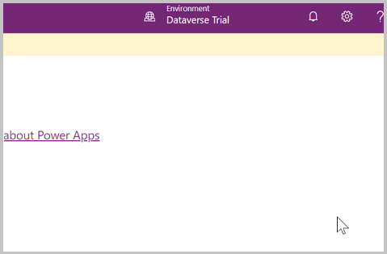
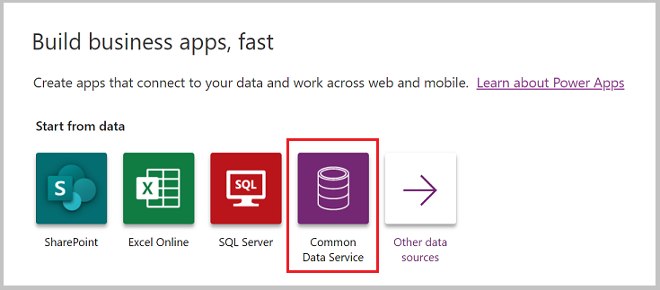
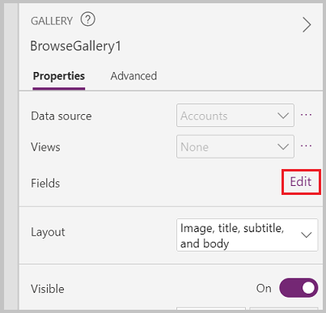
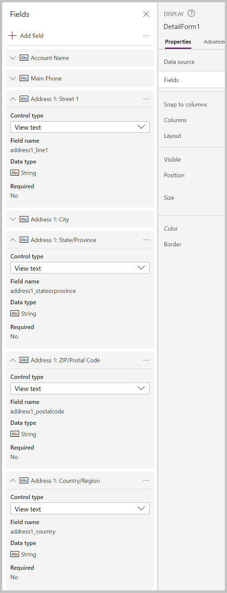
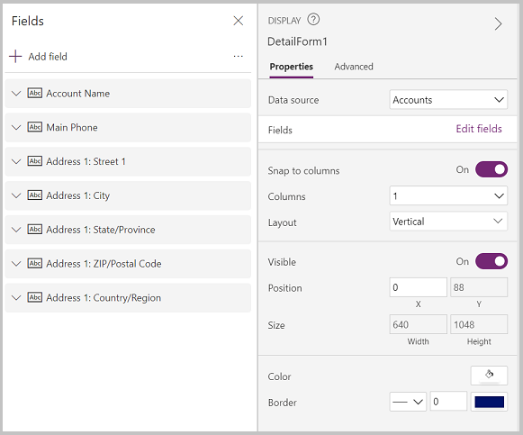

# Build a canvas app from blank

Dataverse is Microsoft’s premier data platform for Power Platform. Dataverse lets you securely store and manage data used by your apps within a set of
tables.

In this topic we will create an app connected to existing data in a Dataverse environment.

## Prerequisites

To complete this lesson you will need a Power Apps environment with a Dataverse database with at least one table containing data. If you don’t have a license, you can sign up for the [Power Apps Community Plan](https://powerapps.microsoft.com/en-us/communityplan/) or use a Power Apps trial.

## Create a trial environment

An environment in Power Apps is a space to store, manage, and share your organization’s business data, apps, chatbots, and flows. It also serves as a
container to separate apps that might have different roles, security requirements , or target audiences.

Each environment can have one Dataverse database.

To make sure that you have what you need to complete this lesson, we are going to create a new environment that includes a Dataverse database. This is a 30-day trial that will go away at the end of the 30 days, but it can be upgraded to a sandbox or production environment if you want to keep it. 

We are going to create a trial environment that will include a Dataverse database and the sample data used in this topic.

1.  Go to <https://aka.ms/ppac> in a web browser

2.  Select **Environments**.

3.  Select **New**.

4.  Name the environment **Dataverse Trial**.

5.  Select **Trial** for environment type.

6.  Toggle **Create Database** to **Yes**.

7.  Select **Next**.

    

8.  Toggle **Deploy Sample Apps and Data** to **Yes**.

9.  Select **Save**.

Your trial environment will now be created, including a Dataverse database and sample data in common business data tables.

## Build a canvas app

In this lesson we will build an app to search, view, and create customer Account data

1.  Log in to <https://make.powerapps.com>.

2.  Select the Dataverse Trial environment in the upper right corner.

    

3.  Under **Build business apps, fast** select the button for **Common Data Service**.
    
    
    
4.  Under **Choose a table** select the **Accounts** table.

5.  Select **Connect** in the lower right corner.

6. Power Apps will generate an app for you. This app includes the following screens:

   - Browse Screen: a screen to search, sort, and select an account record, and launch the edit screen to create a new record.
   - Detail Screen: a read-only screen that displays the details of the record selected on the Browse Screen
   - Edit Screen: an edit form that is used to edit the details of a selected record or create new records

## Try the app

From the Power Apps Studio, you can preview your app to try it out.

1.  Select the **Play** button in the upper right corner of the screen.

2.  From the Account list, select **Alpine Ski House**.

3.  View the details of Alpine Ski House.

4.  Select the pencil icon in upper right corner to launch edit screen.

5.  On edit form, remove **(sample)** from the account name field.

6.  Select the checkmark in the upper right corner to save the record changes.

7.  Back on the account list screen, select **+** to launch a new record form.

8.  Populate the desired fields, such as **Account name**.

9.  Select the checkmark in the upper right corner to same the new record.

10. Verify that the newly created record appears in the account list gallery.

11. To exit preview mode, select the **x** in upper right corner.

## Using the Tree view

The **Tree View** is on the left side of the screen (if you don’t see it, select the  button). The tree view gives you easy access to the components in your canvas app, such as screens, galleries, text input controls, and text labels.

The tree view can be collapsed or expanded by screen to make it easy to focus on the part of the app on which you are working.

Currently BrowseScreen1 is expanded, to see the components for other screens, simply select the \> next to the name of the screen.

## Modify the gallery of accounts

A gallery in Power Apps is used to show several related items—for example, in our app, BrowseGallery1 displays all of our account records. When one of the items is selected, a border is placed around the item to indicate that it has been selected.

By default this gallery includes the following three fields: Account name, phone number, and city.

However, we can change the fields included in the gallery.

1.  From the tree view, select BrowseGallery1.

2.  In the property pane on the right side of the screen, select **Edit** by Fields.
    
    
    
3.  The field data panel will appear. Change Subtitle 1 to Website.

4.  Click outside of the field data panel.

5.  App will now display the website fields value instead of the phone number.

    

### Update search to include the Account name

When you previewed the app, you may have noticed that searching by account name didn’t work. That is because the auto generated app search formula does not include the **Account name** field. In this lesson we will update to search formula to include the Account name field.

Note: the account name is stored in a column called **Name**.

1.  In the tree view, select **BrowseGallery1**.

2.  Verify the **Items** property is selected in the property selector.

3. In the formula bar, update the formula as follows:

   ```
   SortByColumns(Search([@Accounts], TextSearchBox1.Text, "name","address1_city","address1_composite"), "name", If(SortDescending1, Descending, Ascending))
   ```

4.  The account list can now be searched and sorted by the Account name field.

## Add fields to the account detail screen

Datascreen 1 includes a Display form that displays the data of the record selected on the browse screen. Display form controls are read only, intended to
allow users to read data but not create or edit data.

1.  In the tree view, expand Detail Screen 1.

2.  Select **DetailForm1**.

3.  In the right-side properties panel, Select **Edit Fields**.

4.  Field panel will appear.

5.  Select **Add field**.

6.  Select the following fields:

    -   Address 1: Country

    -   Address 1: State/Province

    -   Address 1: Street 1

    -   Address 1: ZIP/Postal Code

7.  Select **Add**.

    

8.  You will now see the selected fields in the Field panel. Rearrange the fields by dragging and dropping them or by clicking on the three dots to the
    right of the field name and selecting **Move up** or **Move down.**
    
9.  Arrange the field in the following order:

    -   Account Name

    -   Main Phone

    -   Address 1: Street 1

    -   Address 1: City

    -   Address 1: State/Province

    -   Address 1: Zip/Postal Cde

    -   Address 1: Country/Region



10. Click outside of the field panel to close the panel and return to DetailScreen1.

11. You will now see the selected fields displayed in the correct order.

## Modify account edit screen

EditScreen1 allows users to edit or create account records. This screen includes an Edit Form control called **EditForm1**.

> Note: Since the edit form is one of the primary methods for creating or updating records, it should include every field that you want your users to be able to submit, but should not include any fields that are read only or you do not want your users to modify.

In this lesson we will add the same fields that we added earlier to the display form, plus the ability to attach files.

1.  In the tree view, expand EditScreen 1.

2.  Select **EditForm1**.

3.  In the right-side properties panel, select **Edit Fields**.

4.  Field panel will appear.

5.  Select **Add field**.

6.  Select the following fields:

    -   Address 1: Country

    -   Address 1: State/Province

    -   Address 1: Street 1

    -   Address 1: ZIP/Postal Code

7.  You will now see the selected fields in the Field panel. Rearrange the fields by dragging and dropping them or by clicking on the three dots to the
    right of the field name and selecting **Move up** or **Move down.**
    
8.  Arrange the field in the following order:

    -   Account Name

    -   Main Phone

    -   Address 1: Street 1

    -   Address 1: City

    -   Address 1: State/Province

    -   Address 1: Zip/Postal Cde

    -   Address 1: Country/Region

9.  Click outside of the field panel to close the field panel.

10. To minimize unnecessary scrolling in the app, we want the Edit Form to arrange the fields into two columns. In the Properties pane on the right,
    select 2 in the **Columns** drop down.
    
11. To make the form easier to read, we want to remove the “Address 1:” part of the address field labels.
    
    -   In tree view, expand **EditForm1** by selecting the \> to the left
    
    -   Select the Address 1: City_DataCard2 control
    
    -   In the properties pane on right, select **Advanced**
    
    -   Select **Unlock to change properties**
    
    -   Change **DisplayName** property to “**City”**
    
    -   Follow this process to remove **Address 1:**  from the Street 1, Country/Region, State/Province, and Zip/Postal Code field EditScreen1 should now look like the following:
        
        

## Save the app

By saving the app, your app will become available to use and share with others.

1.  In Power Apps Studio, select **File**.

2.  In the **Name** field enter **Account Manager**.

3.  Select an icon and background color from the **Icon** area. This will be used to identify your app in the app list.
    
4.  Select **Save**.

5.  Select **Save** in the lower right corner.

6.  Once app is saved, select the back arrow to return to the Power Apps Studio.

    

## Run the app

1.  Log in to make.powerapps.com.

2.  Verify you are in the environment you used to create the app by looking in the upper right side of the Power Apps Studio—it should say the same
    environment name as you were working in earlier. If it does not, select **Environment** and select the appropriate environment.
    
3.  Select **Apps**.

4.  From the app list, select **Account Manager**.

5. When the app loads, verify the changes made.

   - Search app list for Blue Yonder Airlines.

   - Select the Blue Yonder record and verify you see the fields added to the Display form.

   - Select the pencil icon in upper right to navigate to Edit form.

   - Verify form displays two columns of fields.

   - Verify that the field names do not display **Address 1:** in the labels.

   - Select **Attach file** in the Attachment area, select a file, and select **Open**.

   - Verify uploaded file appears in the attachment list.

   - Select the **check mark** icon in upper right to save the record.

## Run your app on mobile

To test your Power App on your mobile device, follow these steps:

1.  Download the app from your mobile app store.

    -   IOS: [‎Power Apps on the App Store (apple.com)](https://apps.apple.com/us/app/power-apps/id1047318566)
        
    -   Android: [Power Apps - Apps on Google Play](https://play.google.com/store/apps/details?id=com.microsoft.msapps&hl=en_US&gl=US)
    
2.  Log in using your Microsoft work or school account.

3.  Select your app from the list.
