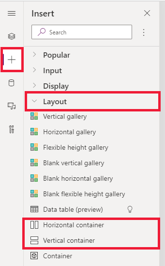

# Building responsive canvas apps  

Responsiveness refers to the ability of an app to automatically align to different screen sizes and form factors to use the available screen space sensibly, providing great UI and UX in every device, form factor, and screen size. 

Responsiveness allows different elements of the app to specify how they: 

- Stretch or resize with the screen size changes.

- Maintain or change positions with the screen size changes. 

## Why should you build responsive apps

End users can access your app from different devices such as phones, tablets, laptops, and desktops with large monitors, different screen sizes, and with varied number of pixels.

To ensure great user experience and usability of the app on each form factor and device, designing the app with responsive design principles is necessary. Even if the app is intended to be used only on the web browser or on mobile phones, user device screen sizes can be different, so designing the app with responsive principles is a good idea.

## Designing the app with responsiveness principles

Before you start designing the UI for your app, you need to consider the following aspects: 

- What form factors or devices do you want to support.

- How the app should look on each form factor?

- What elements of the app need to stretch or resize?

- Are the elements hidden on some form factors?

- Does the app behave different in some form factors?

Once all these requirements are gathered, you should start thinking about how these different UI layouts can be created in a single application with the responsive tools available in Power Apps. 

Before you start using the responsive layouts, you need to do the following:

1. Go to [Power Apps](https://make.powerapps.com).
1. Open the app where you want to use the responsive layout.
1. Go to **Settings** > **Display** to disable **Scale to fit**, **Lock aspect ratio**, and **Lock orientation** and select **Apply**.

   

## Responsive layouts

The following responsive layouts can be created by adding a new screen and selecting the appropriate option from the **Layout** tab: 

> [!div class="mx-imgBorder"]
> 

> [!NOTE]
> The new responsive layouts are available to the apps formats but the new screen templates are available only for **Tablet** format.

### Split-screen

The Split-screen layout has two sections, each occupying 50% width of the screen on desktops. On mobile devices, the sections are placed one below the other, each occupying up the entire screen width. 

### Sidebar

The Sidebar layout has a fixed width sidebar on the left. The main body consists of a fixed height header, and the main section takes up the rest of the screen width.  By default, the template has the same behavior on mobile, however some customizations are recommended based on the UI pattern desired for the mobile experience. 

## Working with containers 

Containers are building blocks of all the responsive design. A container can be an [auto-layout container](#auto-layout-containers) in vertical or horizontal direction, or a fixed-layout container, which in the future will support constraints. 

Below are some tips for building your app’s UI with containers:

- Always create UI elements that form a UI table inside a container.

- Allows the container to have its own responsive properties and settings to specify how it is positioned or resized on different screen sizes.

- Allows you to change how its child components are laid out with respect to responsiveness. 

Choose one of two layout modes for a container: Manual layout or auto-layout (Horizontal or Vertical)

## Auto-layout containers

Two controls, [Horizontal container](controls/control-horizontal-container.md) and [Vertical container](controls/control-vertical-container.md) can be used to automatically lay out the child components. These containers determine the position of the child components so that you never have to set X, Y for a component inside the container. Also, it can distribute the available space to its child components based on the settings, as well as determines both the vertical and horizontal alignment of the child components.  

### When to use auto-layout containers

You can use auto-layout containers in the following scenarios:

- UI needs to be responsive to screen size or form factor changes.
- There is more than one child component that needs to resize or move around based on the screen size or form factor changes.
- When you need to stack items vertically or horizontally (regardless of their size).
- When you need to space items evenly on the screen.

### Example for auto-layout container

To build a responsive screen:

1. Sign in to [Power Apps](https://make.powerapps.com).
1. Select **Apps** from left navigation. Select the **New app** drop-down menu and then select **Canvas**.
1. On the **Blank app** tile, select **Tablet layout**.
1. Select **Settings** > **Display** and disable **Scale to fit**, **Lock aspect ratio**, and **Lock orientation** and select **Apply**. 
1. Now from the **Insert** panes in the left sidebar, under **Layout** tab, select **Horizontal container**. 

   > [!div class="mx-imgBorder"]
   > 

1. The top-most container needs to be sized to take the entire space with these properties. It will be the same size as the screen as it resizes.  
   1. X = 0 
   1. Y= 0 
   1. Width = Parent.Width 
   1. Height = Parent. Height 

1. Now, from the **Insert** pane add two **Vertical containers** into the Horizontal container. 

   > [!div class="mx-imgBorder"]
   > 

1. To make the containers, fill the full vertical space, Select **Container1** and set the `Align (vertical)` property to `Stretch`.  

   > [!div class="mx-imgBorder"]
   > 

1. To divide the screen between the content, use the `Fill portions` property on the two child containers. The left container will take up 1/4 of the screen space. 
   1. Select **Container2**. You'll see that the `Flexible width` property is turned on. Set the `Fill portions` to 1. 
   1. Select **Container3**. You'll see that the `Flexible width` property is turned on. Set the `Fill portions` to 3.  
1. Select **Container2**. Set the `Fill = RGBA(56, 96, 178, 1)` property in the formula bar. Set `Align (horizontal)` to `Stretch`.   
1. Add few buttons to create a menu. Rename the buttons as needed.  

   > [!div class="mx-imgBorder"]
   > 

1. Select **Container3** and add a Horizontal container and turn off the `Flexible height` property. Set `Height` to 100. Set `Align (vertical)` to `Stretch`.  
1. Add some **Icons** into **Container4**. Change the icons to be different with the icon property.  

   > [!div class="mx-imgBorder"]
   > 

1. Select **Container4**. Set the `Justify (horizontal)` property to `End`. Set the `Align (vertical)` to `Center`. Set `Gap` to 40 to create space between the icons.  
1. Select **Container3**. Set `Align (horizontal)` to `Stretch`. Set `Vertical Overflow` to `Scroll`.  
1. Add different **Label**, **Inputs**, **Media**  until they extend beyond the container. Change the color of the rectangles to be different. You'll see a scroll bar to access the unseen content. 

   > [!div class="mx-imgBorder"]
   >   

1. Select Preview or F5. Change the size of the browser window to see how your app adjusts to different screen sizes.

## Known issues

- Certain combinations of layout container properties are incompatible or can produce undesirable outputs, for example:
   - If the container’s `Wrap` property is enabled, the `Align` property setting is ignored on child controls. 
   - If the container’s `Wrap` property is disabled and the container’s primary-axis overflow is set to **Scroll** (Horizontal Overflow for Horizontal containers or Vertical Overflow for Vertical containers), it is recommended to set the `Justify` property to either **Start** or **Space Between**. 
   - The **Center** or **End** options can cause child controls inaccessible when the container is too small to display all the controls, even though the `Overflow` property is set to **Scroll**. 

- You can’t resize or reposition the controls on the canvas app because the drag & drop controls are disabled in the layout containers. Instead, use the layout container properties to achieve the desired size and positioning. Control ordering can be changed via the **Tree view**, or by using the arrow keys as shortcuts. 

- The **Data table**, **Charts**, and **Add Picture** controls are currently not supported in the layout containers. 

- Some of the layout containers properties are hidden for child controls. The hidden properties can still be accessible via the formula bar or from the advanced panel. However, these properties will be ignored even if they are set in these places. 

- When controls are moved into a layout container (for example, when copy or pasting the controls), they are inserted into the container by their order in the **Tree view**.

## See also

[Create responsive layouts](create-responsive-layout.md)

[!INCLUDE[footer-include](../../includes/footer-banner.md)]