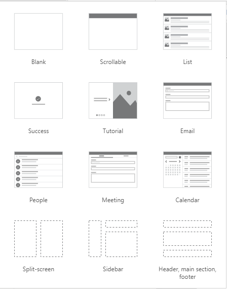

# Building responsive apps  

[This article is pre-release documentation and is subject to change.]

Responsiveness refers to the ability of an app to automatically adapt to different screen sizes and form factors to use the available screen space sensibly, providing great UI and UX in every device, form factor, and screen size. 

> [!IMPORTANT]
> - This feature is in public preview. For more information, see [Experimental and preview features](working-with-experimental-preview.md).
> - Preview features aren’t meant for production use and may have restricted functionality. These features are available before an official release so that customers can get early access and provide feedback.

Responsiveness allows different elements of the app to specify how they: 

- Stretch or resize with the screen size changes.

- Maintain or change position with the screen size changes. 

> [!NOTE]
> The new responsive layouts are applicable to the apps that are built for **Tablet** format.

## Why should you build responsive apps

End users can access your app from different devices such as phones, tablets, laptops, and desktops with large monitors, different screen sizes, and with various numbers of pixels.

To ensure great user experience and usability of the app on each form factor and device, you need to design the app with responsive design principles. Even if your app is intended to be used only on the web browser or only on mobile phones, user device screen sizes can be different, so designing the app with responsive principles is a good idea.

## Designing the app with responsiveness principles

Before you start designing the UI for your app, you need to consider the following aspects: 

- What form factors or devices do you want to support.

- How the app should look on each form factor?

- What elements of the app need to stretch or resize?

- Are the elements hidden on some form factors?

- Does the app behave different in some form factors?

Once all these requirements are gathered, you should start thinking about how these different UI layouts can be created in a single application with the responsive tools available in Power Apps. 

Before you start using the responsive layouts, you need to do the following:

1. Go to [Power Apps](https://make.powerapps.com).
1. Open the app where you want to use the responsive layout.
1. Go to **File** > **Settings** > **Screen size & orientation** to disable **Scale to fit**, **Lock aspect ratio**, and **Lock orientation** and select **Apply**.

   

1. Go to **File** > **Settings** > **Advanced Settings** and enable the **Container control** feature under **Experimental features** tab.

   

## Responsive layouts

The following responsive layouts can be created by adding a new screen and selecting the appropriate option from the **Layout** tab: 

### Split-screen

The Split-screen layout has two sections, each occupying 50% width of the screen on desktops. On mobile devices, the sections are placed one below the other, each occupying up the entire screen width. 

### Sidebar

The Sidebar layout has a fixed width sidebar on the left. The main body consists of a fixed height header, and the main section takes up the rest of the screen width.  By default, the template has the same behavior on mobile, however some customizations are recommended based on the UI pattern desired for the mobile experience. 

<!-- #### Sidebar layout considerations for mobile devices

The Sidebar layout can be modified to implement a popular design pattern for mobile apps such as a hamburger menu that appears and allows the user to navigate to a screen or a record and then disappears from the UI. By adding formulas to conditionally show the sidebar or the main components, this pattern can be implemented with auto-layout containers.

### Header, main section, footer

The Header, main section, footer layout is a popular design for webpages and apps that consists of a fixed height for header and footer, and the main section takes up the rest of the screen height. The same layout is displayed both on large screens as well as mobile devices. -->

### Working with containers 

Containers are building blocks of all the responsive design. A container can be an [auto-layout container](#auto-layout-containers) in vertical or horizontal direction, or a fixed-layout container, which in the future will support constraints. 

Below are some tips for building your app’s UI with containers: 

- Always create UI elements that form a UI entity inside a container 

- Allows the container to have its own responsive properties and settings to specify how it is positioned or resized on different screen sizes.

- Allows you to change how its child components are laid out with respect to responsiveness. 

Choose one of two layout modes for a container: Manual layout or Auto layout (horizontal or vertical) 

### Auto-layout containers 

Two new controls, `Vertical layout container` and `Horizontal layout container`, can be used to automatically lay out child components. 

These containers determine the position of the child components, so you never have to set X, Y for a component inside the container. Also, it can distribute the available space to its child components based on the settings, as well as determines both the vertical and horizontal alignment of the child components.  

#### When to use auto-layout containers

You can use auto-layout containers in the following scenarios:

- UI needs to be responsive to screen size or form factor changes.

- There is more than one child component that needs to resize or move around based on the screen size or form factor changes.

- When you need to stack items vertically or horizontally (regardless of their size).

- When you need to space items evenly on the screen.

Auto-layout containers have the following properties:

<!--#### Vertical vs. Horizontal mode 

**LayoutDirection**: Horizontal, Vertical 
In what direction does the container layout its children 

##### Alignment options of Vertical Container and Horizontal Container -->

|Property|Description|Parameters|
|--------|-----------|----------|
|LayoutDirection|Defines in what direction the container layouts its child components. | Horizontal, Vertical |
|LayoutJustifyContent| Defines how child elements are aligned with the primary axis.|Start, End, Center, Space Between|
|LayoutAlignItems| Defines how child components are positioned in the container, in the off axis (opposite from LayoutDirection).| Start, Center, End, Stretch| 
|LayoutGap| Defines the space between containers child components in pixels. |Number|
|LayoutOverflowX |Defines whether the container shows scrollbars or remove content when it is too large to fit. |Scroll, Hide |
|LayoutOverflowY|Defines whether the container shows scrollbars or remove content when it is too large to fit. |Scroll, Hide |
|LayoutWrap| Defines whether the content wraps to a new row or column when it cannot fit.| Boolean |
|||

The following properties can be set on any child for an auto-layout container (vertical or horizontal): 

|Property|Description|Parameters/Value|
|--------|-----------|----------|
|AlignInContainer|Defines how the individual component is aligned to the parent. The default value, `SetByContainer`, inherits the value from the parent’s `LayoutAlignItems` property, while other properties can be used to customize the alignment for the individual child component. | SetByContainer, Start, End, Center, Stretch | 
|GrowthPortions|Defines how the individual component grows when there is more screen real-estate assigned to its parent.  The number represents the portion of the extra space given to the component out of all the available extra space claimed by children of its parent.  For example, if child A has `GrowthPortions` set to 1 and child B has `GrowthPortions` set to 2, child A gets 1/3 of the extra space available while child B gets 2/3 of the extra available space.| Integer |
|MinWidth, MinHeight|When GrowthPortions is used, represent the minimum size of the component in the direction of the GrowthPortions (that is, the parent’s LayoutDirection) | Number |
|||

## See also

[Create responsive layouts](create-responsive-layout.md)