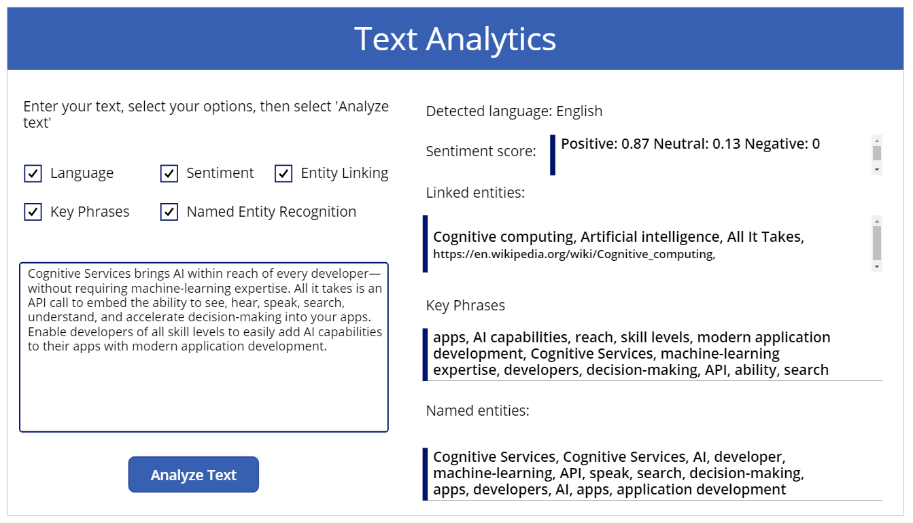

# Use Cognitive Services in Power Apps

This article shows you how to build a basic canvas app that uses the [Azure Cognitive Services Text Analytics API](https://docs.microsoft.com/azure/cognitive-services/text-analytics/overview) to analyze text. We'll show you how to set up the Text Analytics API, and connect to it with the [Text Analytics connector](https://docs.microsoft.com/connectors/cognitiveservicestextanalytics/). Then we'll show you how to create a canvas app that calls the API.

> [!NOTE]
> If you are new to building apps in Power Apps, we recommend reading [Create an app from scratch](get-started-create-from-blank.md) before diving into this article.

## Introduction to Azure Cognitive Services

[Azure Cognitive Services](https://docs.microsoft.com/azure/cognitive-services/) are a set of APIs, SDKs, and services available to make your applications more intelligent, engaging, and discoverable. These services enable you to easily add intelligent features – such as emotion and video detection; facial, speech and vision recognition; and speech and language understanding – into your applications.

We'll focus on "language understanding" for this article, working with the Text Analytics API. This API enables you to detect sentiment, key phrases, topics, and language from your text. Let's get started by trying out a demo of the API, then signing up for a preview version.

## Prerequisites

Before you begin building a canvas app using the Text Analytics API, you must prepare the Text Analytics resource. For more details, go to [Text Analytics API prerequisites](https://docs.microsoft.com/azure/cognitive-services/text-analytics/quickstarts/client-libraries-rest-api#prerequisites).

## Step 1. Create the app and add a connection

> [!TIP]
> In this tutorial, you'll learn about creating a demo app with a few properties and values from the output using the Text Analytics API operations. You can use similar method to create your own app to show more or all such properties and values for the Text Analytics API operations.

Create a blank phone app and add a connection with the **Text Analytics** connector.

1. Go to [Power Apps](https://make.powerapps.com).

1. Select **Canvas app from blank**.

    

1. Enter app name.

1. Choose a layout for the app, and select **Create**. For this demo, we'll use **Tablet** layout.

    

1. Select **Data** from the left pane.

1. Search for **Text Analytics** connection.

    

1. Enter **Account Key**, and **Site URL** values.

    

    You can find the **Account Key** and **Site URL** from the **KEY** and **Endpoint** values respectively using the Azure portal.

    

1. Select **Connect**.

Your app is now connected to the Cognitive Services resource of Text Analytics API type in Azure.

## Step 2. Design the app

In this section, you'll design the app controls, and the formulas required to work with the Text Analytics API. After you've completed the app design, this is how it'll look:


> [!NOTE]
> - Values for component properties such as alignment, size, color, position (X, Y) in this tutorial as suggested. Actual values may vary depending on the app layout you select. You can also change these suggested values to design the app as per your requirements.
> - To learn more about how to add controls and formulas to the controls in detail, see [Add and configure controls](add-configure-controls.md).

1. Select  from the left pane.

1. Select **Text label**.

1. Change the label properties with the following configuration.

    | Property Name | Value |
    | - | - |
    | Text | "Text Analytics" |
    | Size | 36 |
    | Color | RGBA(255, 255, 255, 1) |
    | Fill | RGBA(56, 96, 178, 1)|
    | Align | Align.Center |
    | X | 0 |
    | Y | 0 |
    | Width | 1366 |
    | Height | 98 |

1. Insert **Text label**.

1. Change the label properties with the following configuration.

    | Property Name | Value |
    | - | - |
    | Text | "Enter your text, select your options, then select 'Analyze text'" |
    | Size | 16 |
    | Align | Align.Left |
    | X | 24 |
    | Y | 135 |
    | Width | 601 |
    | Height | 60 |

1. Insert **Checkbox**.

1. Change the checkbox properties with the following configuration.

    | Property Name | Value |
    | - | - |
    | Name | chkLanguage |
    | Text | "Language" |
    | Size | 16 |
    | X | 24 |
    | Y | 228 |

1. Insert **Checkbox**.

1. Change the checkbox properties with the following configuration.

    | Property Name | Value |
    | - | - |
    | Name | chkSentiment |
    | Text | "Sentiment" |
    | Size | 16 |
    | X | 230 |
    | Y | 228 |

1. Insert **Checkbox**.

1. Change the checkbox properties with the following configuration.

    | Property Name | Value |
    | - | - |
    | Name | chkEL |
    | Text | "Entity Linking" |
    | Size | 16 |
    | X | 403 |
    | Y | 228 |
    | Width | 200 |
    | Height | 50 |

1. Insert **Checkbox**.

1. Change the checkbox properties with the following configuration.

    | Property Name | Value |
    | - | - |
    | Name | chkPhrases |
    | Text | "Key Phrases" |
    | Size | 16 |
    | X | 24 |
    | Y | 286 |
    | Width | 193 |
    | Height | 50 |

1. Insert **Checkbox**.

1. Change the checkbox properties with the following configuration.

    | Property Name | Value |
    | - | - |
    | Name | chkNER |
    | Text | "Named Entity Recognition" |
    | Size | 16 |
    | X | 230 |
    | Y | 286 |
    | Width | 318 |
    | Height | 50 |

1. Insert **Text input**.

1. Change the text input properties with the following configuration.

    | Property Name | Value |
    | - | - |
    | Name | tiTextToAnalyze |
    | Text | "Enter text" |
    | Mode | MultiLine |
    | Size | 14 |
    | Height | 256 |
    | Width | 557 |
    | X | 24 |
    | Y | 390 |

1. Insert **Button**.

1. Change the button properties with the following configuration.

    | Property Name | Value |
    | - | - |
    | Name | analyzeText |
    | Text | "Analyze Text" |
    | X | 189 |
    | Y | 684 |
    | Width | 196 |
    | Height | 53 |
    | Size | 16 |

1. Insert **Text label**.

1. Change the label properties with the following configuration.

    | Property Name | Value |
    | - | - |
    | Name | dLanguage |
    | Text | "Detected language:" |
    | Size | 16 |
    | X | 633 |
    | Y | 135 |
    | Width | 665 |
    | Height | 48 |

1. Insert **Text label**.

1. Change the label properties with the following configuration.

    | Property Name | Value |
    | - | - |
    | Name | sScore |
    | Text | "Sentiment score:" |
    | Size | 16 |
    | X | 633 |
    | Y | 196 |
    | Width | 656 |
    | Height | 48 |

1. Select **Insert** -> **Gallery** -> **Blank vertical**.

1. Change the gallery properties with the following configuration.

    | Property Name | Value |
    | - | - |
    | Name | gallerySS |
    | Layout | Title |
    | X | 826 |
    | Y | 196 |
    | Width | 503 |
    | Height | 62 |

1. Select the arrow icon inside the gallery and delete it.

1. Change the following properties for the first row inside the gallery.

    | Property Name | Value |
    | - | - |
    | X | 16 |
    | Height | 63 |

1. Insert **Text label**.

1. Change the label properties with the following configuration.

    | Property Name | Value |
    | - | - |
    | Text | "Linked entities:" |
    | Size | 16 |
    | X | 633 |
    | Y | 258 |
    | Width | 206 |
    | Height | 48 |

1. Select **Insert** -> **Gallery** -> **Blank vertical**.

1. Change the gallery properties with the following configuration.

    | Property Name | Value |
    | - | - |
    | Name | galleryLE |
    | Layout | Title and subtitle |
    | X | 633 |
    | Y | 318 |
    | Width | 696 |
    | Height | 87 |

1. Select the arrow icon inside the gallery and delete it.

1. Insert **Text label**.

1. Change the label properties with the following configuration.

    | Property Name | Value |
    | - | - |
    | Text | "Key Phrases:" |
    | Size | 16 |
    | X | 633 |
    | Y | 429 |
    | Width | 150 |
    | Height | 48 |

1. Select **Insert** -> **Gallery** -> **Blank vertical**.

1. Change the gallery properties with the following configuration.

    | Property Name | Value |
    | - | - |
    | Name | galleryKP |
    | Layout | Title |
    | X | 633 |
    | Y | 489 |
    | Width | 696 |
    | Height | 87 |

1. Select the arrow icon inside the gallery and delete it.

1. Change the following properties for the first row inside the gallery.

    | Property Name | Value |
    | - | - |
    | X | 16 |
    | Height | 87 |

1. Insert **Text label**.

1. Change the label properties with the following configuration.

    | Property Name | Value |
    | - | - |
    | Text | "Named entities:" |
    | Size | 16 |
    | X | 633 |
    | Y | 589 |
    | Width | 193 |
    | Height | 48 |

1. Select **Insert** -> **Gallery** -> **Blank vertical**.

1. Change the gallery properties with the following configuration.

    | Property Name | Value |
    | - | - |
    | Name | galleryNER |
    | Layout | Title |
    | X | 633 |
    | Y | 670 |
    | Width | 696 |
    | Height | 87 |

1. Select the arrow icon inside the gallery and delete it.

1. Change the following properties for the first row inside the gallery.

    | Property Name | Value |
    | - | - |
    | X | 16 |
    | Height | 87 |

Here's how the app should look like after following the above steps.


## Step 3. Add logic

1. Copy and paste the following formula as the **OnSelect** property value for the button **analyzeText**.

    ```powerapps-dot
    ClearCollect( languageInfo, { id: "E393CEB2-56A8-4668-A5EB-A1254E9758F0", countryHint: "US", text: tiTextToAnalyze.Text } );
    TextAnalytics.LanguagesV3(languageInfo);
    If( chkLanguage.Value=true,
        ClearCollect( languageCollect,
            TextAnalytics.LanguagesV3(languageInfo).documents.detectedLanguage
        )
    );
    ClearCollect( phrasesInfo, { id: "E393CEB2-56A8-4668-A5EB-A1254E9758F0", language: "en", text: tiTextToAnalyze.Text } );
    If( chkPhrases.Value = true,
        ClearCollect( phrasesCollect,
            TextAnalytics.KeyPhraseV3(phrasesInfo).documents.keyPhrases
        )
    );
    ClearCollect( sentimentInfo, { id: "E393CEB2-56A8-4668-A5EB-A1254E9758F0", language: "en", text: tiTextToAnalyze.Text } );
    If( chkSentiment.Value = true,
        ClearCollect( sentimentCollect,
            TextAnalytics.SentimentV3(sentimentInfo).documents.confidenceScores
        )
    );      
    ClearCollect( nerinfo, { id: "E393CEB2-56A8-4668-A5EB-A1254E9758F0", language: "en", text: tiTextToAnalyze.Text } );
    If( chkNER.Value = true,
        ClearCollect( nerCollect,
            TextAnalytics.EntitiesRecognitionGeneralV3(nerinfo).documents.entities
        )
    );
    ClearCollect( elinfo, { id: "E393CEB2-56A8-4668-A5EB-A1254E9758F0", language: "en", text: tiTextToAnalyze.Text } );
    If( chkEL.Value = true,
        ClearCollect( elCollect,
            TextAnalytics.EntitiesLinkingV3(elinfo).documents.entities
        )
    ); 
    ```

1. Copy and paste the following formula as the value of the **Text** property for the **dLanguage** label.

    ```powerapps-dot
    "Detected language: " & First(languageCollect.detectedLanguage).detectedLanguage.name
    ```

1. Select data source for **gallerySS** as **sentimentCollect**.

1. Select the first row inside the **gallerySS** gallery. And then, copy and paste following formula for the **Text** property.

    ```powerapps-dot
    "Positive: " & ThisItem.confidenceScores.positive &" Neutral: " & ThisItem.confidenceScores.neutral & " Negative: " & ThisItem.confidenceScores.negative
    ```

1. Select data source for **galleryLE** as **elCollect**.

1. Select the second row inside the **galleryLE** gallery. And then, copy and paste following formula for the **Text** property.

    ```powerapps-dot
    Concat(ThisItem.entities.url,url,", ")
    ```

1. Select the first row inside the **galleryLE** gallery. And then, copy and paste following formula for the **Text** property.

    ```powerapps-dot
    Concat(ThisItem.entities.name,name,", ")
    ```

1. Select data source for **galleryKP** as **phrasesCollect**.

1. Select the first row inside the **galleryKP** gallery. And then, copy and paste following formula for the **Text** property.

    ```powerapps-dot
    Concat(ThisItem.keyPhrases.Value, Value, ", ")
    ```

1. Select data source for **galleryNER** as **nerCollect**.

1. Select the first row inside the **galleryNER** gallery. And then, copy and paste following formula for the **Text** property.

    ```powerapps-dot
    Concat(ThisItem.entities.text,text,", ")
    ```

1. [Save and publish](save-publish-app.md) the app.

## Step 4. Run and test the app

1. Preview the app, or press F5 on the keyboard.

1. Enter sample text, such as the following.

    `Cognitive Services brings AI within reach of every developer—without requiring machine-learning expertise. All it takes is an API call to embed the ability to see, hear, speak, search, understand, and accelerate decision-making into your apps. Enable developers of all skill levels to easily add AI capabilities to their apps with modern application development.`

1. Select all five checkboxes.

1. Select **Analyze Text**.

1. Review the output.

    

Now that you've used Azure Cognitive Services in Power Apps by creating a demo app, you can customize the app interface and add more features.

## Next steps

[Add and configure controls](add-configure-controls.md)

### See also

[Controls and properties in Power Apps](reference-properties.md)
