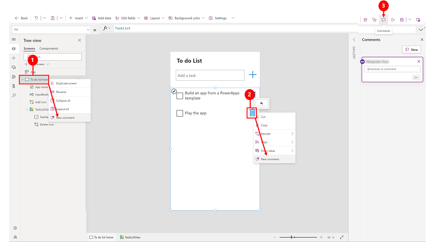
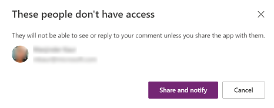
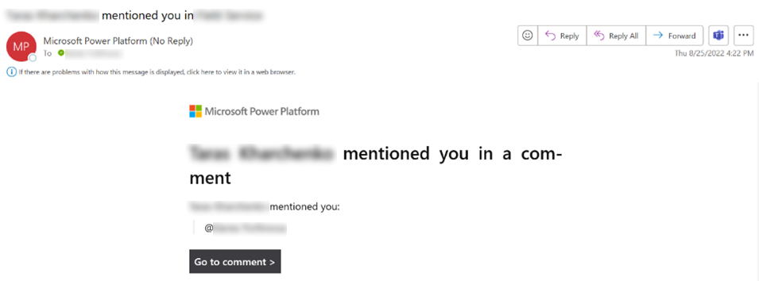

# Add comments

Easily add comments when you’re building a canvas app in [Power Apps Studio](power-apps-studio.md). Use comments to help your team review the app and provide feedback, or provide additional information on implementation details in your app. To allow other makers to add comments, make sure to share the app with them.

You can add comments to different components or pages.

> [!div class="mx-imgBorder"] 
> 

Legend

1. **Tree view**: Select a screen from the tree view and right-click to add a **New comment**.
2. **Component**: In the canvas area, right-click on a component to add a **New comment**.
3. **App actions**: Select **Comments** > **New** and then add your comments. 

## Use @mention in comments to tag someone for feedback

Connect with other makers in your organization as you collaborate on creating your app. You can tag people in the comments by using **@**+ their name.

If you tag a maker that doesn’t have access to your app, then you’ll be prompted to share the app with them.

> [!div class="mx-imgBorder"] 
> 

When someone tags you in a comment, you'll receive an email that lets you know which app you're tagged in and the person who tagged you. It also includes the comment text and a direct link to that comment.

> [!div class="mx-imgBorder"] 
> 

## Edit or delete a comment

You can edit your comments or remove existing comments from appearing in the app.

In the **Comments** pane, next to a comment, select **...**, and then select **Edit comment** or **Delete comment**.

## Resolve a comment

Comments are commonly questions, feedback, or ideas that are important context to live alongside your app. But they may not be active discussions anymore. You can resolve, or reopen a resolved, comment thread to better track the active comments.  

1. In the **Comments** pane, next to a comment, select **...**, and then select **Resolve comment**.
1. The comment thread appears as **Resolved**.
1. To reopen select  **Reopen thread** or  **Delete thread** to remove the comment.

## Limitations 

1. There's a limitation on how many users can access an app in edit mode in Power Apps Studio. If you have an app open and tag someone, the user will receive an email  notification, but the user has to wait for you to exit the app in order to see the comment and resolve it. 
2. Comments aren't supported when you're working on an app using Git. 
3. @mention aren't supported for SharePoint custom Power Apps. For information: [Customize a form for a SharePoint list](/sharepoint/dev/business-apps/power-apps/get-started/create-your-first-custom-form).

