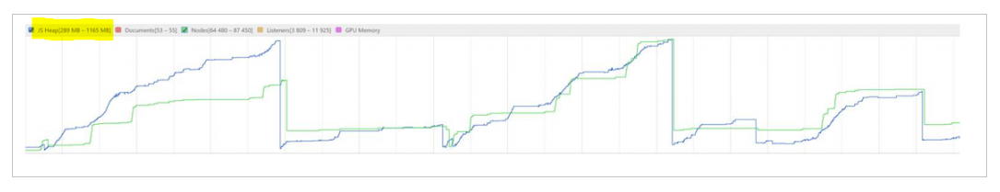

# Common canvas app performance issues and resolutions

You can build canvas apps by using a diverse array of data sources. Choose the data source and connector based on the business needs and scenarios you're designing the app for. For enterprise apps, Microsoft Dataverse is the recommended data source because it provides several performance benefits. For apps with a small number of transactions, you can go with any other available data sources in your environment.

For performance considerations of an app, think about the number of users who will use the app when it has been published; the volume of create, retrieve, update, and delete (CRUD) transactions; the type of data interactions; geographical access; and the kind of devices users have.

In this article, you'll learn about some of the most common performance issues that can make canvas apps run slowly, and how to resolve them. This information will help you to improve app performance with your business plan and growth in mind.

We'll begin with some of the common performance issues that occur regardless of the connector being used. In later sections, you'll learn about performance issues and resolutions specific to various connectors.

Before you begin, ensure that you understand [canvas app execution phases and data call flow](execution-phases-data-flow.md). Also, read [Common sources of slow performance for a canvas app](slow-performance-sources.md) to learn about common pitfalls you can avoid while designing or updating canvas apps.

## Large datasets loading slowly on different platforms

The performance of an app might vary when loading large sets of data on different platforms like iOS or Android. This variation happens because of different network request limitations on each platform. For example, the number of concurrent network requests allowed might differ by platform. This difference can have a major impact on the data load time for large datasets.

We recommend that you only load the data you need to immediately display on the screen. For other data, paginate and [cache](performance-tips.md#cache-lookup-data) your data. More information: [Tips and best practices to improve canvas app performance](performance-tips.md)

## Too many columns retrieved

We recommend that you select only the columns that are necessary for the app. Adding more (or all) columns from the data source downloads all the data in the columns. This action results in a high number of network overhead calls and, therefore, high memory usage in the client device. This problem can affect users with mobile devices even more if the network bandwidth is limited, or if a device has limited memory or a legacy processor.

For example, if you use Dataverse as the data source for your app, make sure you've enabled the [explicit column selection](use-native-cds-connector.md) feature. This feature allows Power Apps to restrict data retrieval to only the columns used in the app.

To turn on the explicit column selection feature on the canvas app, go to **File** > **Settings** > **Upcoming features** > **Preview**, and then turn on the **Explicit column selection** toggle.

## Unsupported or legacy browsers

Users who use unsupported or legacy browsers, such as Internet Explorer 11, might experience performance issues. Ensure that users only use [supported browsers](limits-and-config.md#supported-browsers-for-running-canvas-apps) for running canvas apps.

## Slow performance because of geographical distance

The geographical location of the Dataverse environment and the distance of the data source from users can affect performance.

We recommend that your environment be located close to users. Though Power Apps uses Azure Content Delivery Network for content, data calls still get the data from the data source. A data source located in another geographical location might adversely affect the performance of the app.

Excessive geographical distance affects performance in different ways, such as latency, reduced throughput, lower bandwidth, or packet loss.

## Allow list not configured

Ensure that required service URLs haven't been blocked or that they've been added to your firewall's allow list. For a complete list of all service URLs that must be allowed for Power Apps, go to [Required services](limits-and-config.md#required-services).

## Use of non-delegable functions and inappropriate data row limits for non-delegable queries

*Delegable functions* delegate the processing of data to the data source, minimizing the overhead at the client side. When delegation isn't possible, you can restrict the data row limit for non-delegable queries so that the number of rows returned from a server-based connection remain optimal.

The use of non-delegable functions and inappropriate [data row limits for non-delegable queries](delegation-overview.md#non-delegable-limits) add extra overhead to data transfer. This overhead results in manipulation of the received data to the [JS heap](#memory-pressure-at-the-client-side) at the client side. Be sure to use delegable functions for the app whenever available, and use the optimum data row limit for non-delegable queries.

More information: [Use delegation](performance-tips.md#use-delegation), [Delegation overview](delegation-overview.md)

## OnStart event needs tuning

The **OnStart** event runs when the application is loading. Calling large amounts of data by using the functions in the app's [**OnStart** property](functions/object-app.md#onstart-property) will cause the app to load slowly. A screen that's heavily dependent on controls and values defined on another screen will be affected by slow screen navigation.

The following sections describe some of the most common problems experienced in these situations.

### High number of calls in OnStart event causing the app to start slowly

In an enterprise, the volume of data calls to a central data source can drive server bottlenecks or resource contention.

Use a [cache mechanism](performance-tips.md#cache-lookup-data) to optimize data calls. A single app might be used by many users, resulting in multiple data calls per user that reach the server's endpoints. These data calls can be a spot where the bottleneck or throttling can occur.

### Latency on OnStart event because of heavy scripts

Heavy scripts at the **OnStart** event are one of the most common mistakes while designing canvas apps. You should only get the data required for the app to start.

Optimize the formula in an **OnStart** event. For example, you can move some functions to the [**OnVisible**](controls/control-screen.md#additional-properties) property instead. This way you can let the app start quickly, and other steps can continue while the app opens.

More information: [Optimize the OnStart property](performance-tips.md#optimize-the-onstart-property)

## Memory pressure at the client side

It's important to check the memory consumption of a canvas app because most of the time, the app runs on mobile devices. Memory exceptions in the heap are the most likely cause behind a canvas app that crashes or freezes ("hangs") on certain devices.

A JavaScript (JS) heap might reach the limit because of heavy scripts running at the client side for adding, joining, filtering, sorting, or grouping columns. In most cases, an out-of-memory exception at the heap in a client can trigger the app to crash or hang.

When using data from sources such as Dataverse or SQL Server, you can use a **View** object to ensure that joining, filtering, grouping, or sorting occurs at the server side instead of the client side. This approach reduces the client overhead of scripting for such actions.

If client-heavy operations like **JOIN** or **Group By** happened at the client side with a dataset that has 2,000 records or more, the objects in the heap will increase, resulting in exceeding memory limits.

Developer tools for most browsers allow you to profile memory. It helps you visualize heap size, documents, nodes, and listeners. Profile the app's performance by using a browser, as described in [Microsoft Edge (Chromium) Developer Tools overview](/microsoft-edge/devtools-guide-chromium/). Check the scenarios that exceed the memory threshold of the JS heap. More information: [Fix memory problems](/microsoft-edge/devtools-guide-chromium/memory-problems/)

## Performance considerations for the SQL Server connector

You can use the [SQL Server connector](connections/connection-azure-sqldatabase.md) for Power Apps to connect to SQL Server on-premises or Azure SQL Database. This section describes common performance-related problems and resolutions for using this connector for a canvas app. More information: [Connect to SQL Server from Power Apps](connections/connection-azure-sqldatabase.md), [Create a canvas app from Azure SQL Database](app-from-azure-sql-database.md)

> [!NOTE]
> Though this section references the SQL Server connector for performance issues and resolutions, most of the recommendations also apply to using any database type&mdash;such as MySQL or PostgreSQL&mdash;as the data source.

Let's take a look at the common performance problems and resolutions for using the SQL Server connector for canvas apps.

### N+1 query

Galleries that generate too many requests to servers cause N+1 query problems. The *N+1 query* problem is one of the most commonly experienced problems with using the [**Gallery**](add-gallery.md) control.

To avoid the problem, use **view objects** in the SQL back end or change the user interface scenarios.

### Table scan instead of index seek

An app might slow down if the functions used by the app run queries in the database that result in table scans instead of index seek. More information: [Hints, Table SCAN, and Index SEEK](/sql/t-sql/queries/hints-transact-sql-table)

To resolve such problems, use [**StartsWith**](functions/function-startswith.md) instead of [**IN**](functions/operators.md#in-and-exactin-operators) in the formula. With a SQL data source, the **StartsWith** operator results in an index seek, but the **IN** operator results in an index or table scan.

### Slow queries

You can profile and tune slow queries and indexes on the SQL database. For instance, if a formula gets data with descending (DESC) order on a certain column, that sorting column should have an index with descending order. The index key creates ascending (ASC) order by default.

You can also check the URL address of data requests. For example, the following data request snippet (partial OData call) asks SQL to return 500 records matching the column to *Value* and order by *ID* in descending order.

``Items? \$filter=Column eq 'Value' & Orderby = ID desc & top 500``

This helps in understanding index requirements for covering similar request conditions. In this example, if the ID column has an index with descending order, the query will be performed more quickly.

Check the execution plan of slow queries to see whether any table or index scan exists. Monitor any excessive costs of key lookup in the execution plan.

More information:

- [Monitor and tune for performance](/sql/relational-databases/performance/monitor-and-tune-for-performance)
- [Monitoring performance by using the Query Store](/sql/relational-databases/performance/monitoring-performance-by-using-the-query-store)
- [Extended Events overview](/sql/relational-databases/extended-events/extended-events)

### Database resource contention

Ensure that the data source&mdash;SQL database&mdash;has no resource contentions such as processor bottlenecks, I/O contention, memory pressure, or *tempDB* contention. Also check for locks, waits, deadlocks, and query timeouts.

> [!TIP]
> Use [automatic tuning](/sql/relational-databases/automatic-tuning/automatic-tuning) for insights into potential query performance problems, recommended solutions, and to automatically fix the identified problems.

### Thick client or excessive requests

An app running **Group By**, **Filter By**, or **JOIN** operations at the client side uses processor and memory resources from client devices. Depending on the data size, these operations might take more scripting time at the client side, increasing the [JS heap](#memory-pressure-at-the-client-side) size on the client. This problem increases for an on-premises data source, because each lookup data call travels to the data source through the data gateway.

In such situations, use the **View** object in SQL database for the **Group By**, **Filter By**, or **JOIN** operations. Views can use selective columns and remove unnecessary columns with big data types such as **NVARCHAR(MAX)**, **VARCHAR(MAX)**, and **VARBINARY(MAX)**.

> [!TIP]
> This approach also helps address the N+1 query problem.

### Data size transferred to the client

By default, a canvas app shows data by using the tables, or views, from the available database objects. Retrieving all columns from a table can result in a slow response, especially when using big data types such as **NVARCHAR(MAX)**.

Transferring large amounts of data to clients takes time. This transfer also results in more scripting time when there are large amounts of data in the JS heap at the client side, as [described earlier in this article](#memory-pressure-at-the-client-side).

To reduce the size of data being transferred to the client, use views with the specific columns required for the app and ensure that explicit column selection is enabled, as [described earlier in this article](#too-many-columns-retrieved).

### Considerations specific to SQL Server on-premises

The performance of a canvas app using the SQL Server connector with an on-premises data gateway might be affected in various ways. This section lists the common performance issues and resolutions specific to using an on-premises database source.

#### Unhealthy on-premises data gateway

Organizations can define multiple nodes for on-premises data gateways. If even one of the nodes is unreachable, data requests to the unhealthy node won't return the result within an acceptable timeframe, or they might cause "unreachable" error messages after waiting for a while.

Ensure that all on-premises data gateway nodes are healthy and configured with a minimum network latency between the nodes and the SQL instance.

#### Location of the on-premises data gateway

A data gateway requires network calls to on-premises data sources to interpret the OData requests. For instance, the data gateway needs to understand the data table schema to translate OData requests into SQL data manipulation language (DML) statements. Extra overhead is added when the data gateway is configured in a separate location with high network latency between the data gateway and the SQL instance.

In an enterprise environment, having a scalable data gateway cluster is recommended when heavy data requests are expected. Check how many connections are established between the data gateway nodes and the SQL instance.

By checking the concurrent connections in an on-premises data gateway or a SQL instance, your organization can identify the point where the data gateway needs to be scaled out, and with how many nodes.

#### Data gateway scalability

If you expect to access a large volume of data from the on-premises data gateway, just a single node of the on-premises data gateway can become a bottleneck in handling such a large volume of requests.

A single node of the on-premises data gateway might be sufficient to deal with 200 or fewer concurrent connections. However, if all these concurrent connections are executing queries actively, other requests end up waiting for an available connection.

For information about ensuring that your on-premises data gateway scales in accordance with the volume of data and requests, go to [Monitor and optimize on-premises data gateway performance](/data-integration/gateway/service-gateway-performance).

### Considerations specific to Azure SQL Database

Canvas apps can connect to Azure SQL Database by using the SQL Server connector. A common cause of performance problems when using Azure SQL Database is selecting the wrong tier for your business requirements.

Azure SQL Database is available in different service tiers, with varied capabilities for matching different business requirements. For more information about tiers, go to [Azure SQL Database documentation](/azure/azure-sql/database/sql-database-paas-overview).

With heavy data requests, the resources on the tier you select might get throttled as soon as the threshold value is reached. Such throttling compromises the performance of the next set of queries.

Check the service tier of Azure SQL Database. A lower tier will have some limitations and constraints. From a performance perspective, CPU, I/O throughput, and latency are important. Therefore, we recommend that you check the performance of the SQL database periodically, and check whether resource usage exceeds the threshold. For example, on-premises SQL Server normally sets the threshold of CPU usage to around 75&nbsp;percent.

## Performance considerations for the SharePoint connector

You can use the [SharePoint connector](connections/connection-sharepoint-online.md) to create apps by using data from SharePoint lists. You can also create canvas apps directly from the SharePoint list view. Let's take a look at the common performance problems and resolutions for using a SharePoint data source with canvas apps.

### Too many dynamic lookup columns

SharePoint supports various data types, including dynamic lookups such as **Person**, **Group**, and **Calculated**. If a SharePoint list defines too many dynamic columns, it takes more time to manipulate these dynamic columns within SharePoint before returning data to the client running the canvas app.

Don't overuse the dynamic lookup columns in SharePoint. This overuse can result in avoidable and extra overhead on the SharePoint side for manipulation of data. Instead, you can use static columns to keep email aliases or people's names, for example.

### Picture column and attachment

The size of an image and an attached file can contribute to a slow response while retrieving to the client.

Review your SharePoint list, and ensure that only necessary columns have been defined. The number of columns in the list affects the performance of the data requests. This is because the matched records, or the records up to the defined data row limits, are retrieved and transmitted back to the client with all the columns defined in the list&mdash;even if the app doesn't use all of them.

To query only the columns used by the app, enable the explicit column selection feature, as [described earlier in this article](#too-many-columns-retrieved).

### Large lists

If you have a large list with hundreds of thousands of records, consider partitioning the list or splitting it into several lists based on parameters such as categories, or date and time.

For instance, your data might be stored in different lists on a yearly or monthly basis. In such a case, you can design the app to let a user select a time window and retrieve the data within that range.

Within a controlled environment, the performance benchmark has proven that the performance of OData requests against SharePoint lists is highly related to the number of columns in the list and the number of rows being retrieved (limited by the [data row limit for non-delegable queries](delegation-overview.md#changing-the-limit)). Having fewer columns and a lower data row limit setting can make a canvas app perform better.

In the real world, though, apps are designed to meet certain business requirements. It might not be quick or simple to reduce the data row limit or the number of columns in a SharePoint list. However, we recommend that you monitor the OData requests at the client side and tune the data row limit for non-delegable queries and the number of columns in the list.

## Performance considerations for using Dataverse as the data source

When you use Microsoft Dataverse as the data source, data requests go to the environment instance directly, without passing through Azure API Management. More information: [Data call flow when connecting to Microsoft Dataverse](execution-phases-data-flow.md#data-call-flow-with-microsoft-dataverse)

> [!TIP]
> When custom tables are used in Dataverse, additional security configuration might be required for users to be able to view the records with canvas apps. More information: [Security concepts in Dataverse](/power-platform/admin/wp-security-cds), [Configure user security to resources in an environment](/power-platform/admin/database-security), and [Security roles and privileges](/power-platform/admin/security-roles-privileges)

A canvas app connected to Dataverse might perform slowly if it runs client-heavy scripting such as **Filter By** or **JOIN** client-side instead of server-side.

Use [Dataverse views](../model-driven-apps/create-edit-views.md) when possible. A view with the required join or filter criteria helps reduce the overhead of using an entire table. For instance, if you need to join tables and filter their data, you can [define a view](../model-driven-apps/create-edit-views.md#places-where-you-can-access-the-view-editor-to-create-or-edit-views) by joining them and define only the columns you require. Then you can use this view in your app, which creates this overhead at the server side for the join/filter operation instead of the client side. This method reduces not only the extra operations, but also data transmission. For information about editing filter and sort criteria, go to [Edit filter criteria](../model-driven-apps/edit-filter-criteria.md).

## Performance considerations for the Excel connector

The [Excel connector](connections/connection-excel.md) provides connectivity from a canvas app to the data in a table in an Excel file. This connector has limitations compared to other data sources&mdash;for example, limited [delegable](delegation-overview.md) functions&mdash;which restrict the canvas app to loading data from the table only up to 2,000 records. To load more than 2,000 records, partition your data in different data tables as additional data sources.

Let's take a look at the common performance problems with using Excel as the data source for canvas apps, and how to resolve them.

### Too many data tables and large data size

An app can perform slowly when it uses an Excel file that has too many data tables, or data tables that contain an immense amount of data over several columns. An Excel file isn't a relational database or a data source that provides delegable functions. Power Apps has to load data from the defined data tables first, and then use functions such as **Filter**, **Sort**, **JOIN**, **Group By**, and **Search**.

Having too many data tables with many rows and columns affects app performance and the client-side overhead because each data table needs to be manipulated within the [JS heap](#memory-pressure-at-the-client-side). This effect also leads to the app's consuming more client-side memory.

To ensure that your app isn't affected by this problem, define only the columns you need on the data table in an Excel file.

### Heavy transactions

Excel isn't a relational database system. Any changes from an app are managed by Excel in the same way as if a user were changing data in an Excel file. If the app has a high number of reads, but fewer CRUD operations, it might perform well. However, if the app makes heavy transactions, it can adversely affect the performance of the app.

There's no specific threshold value for the number of transactions, because it also depends on the data being manipulated. Several other aspects also affect the app's performance, such as network overhead or the user's device.

If you have read-only data, you can import such data into the app locally instead of loading it from the data source. For enterprise apps, use data sources such as Dataverse, SQL Server, or SharePoint instead.

### File size

You can choose from a wide range of [cloud storage](connections/cloud-storage-blob-connections.md) options with varying&mdash;or configurable&mdash;storage capacity for the Excel file. However, having a single large Excel file with all tables defined in that file adds extra overhead for the app while it downloads the file and reads data to load at the client side.

Instead of using one large file, split the data into multiple Excel files with minimal data tables. Then connect to each file only when you need it. This way, loading the data from the data table happens in fragments, reducing the overhead of having many tables or a large dataset.

### File location

The geographic location of the data source and its distance from [client locations](slow-performance-sources.md#client-browsers-devices-and-locations) can result in a performance bottleneck for the app and induce network latency. This effect can become amplified when a mobile client has limited bandwidth for connectivity.

It's better to keep the file near your users (or most users, if you have a global audience) so that the file can be downloaded quickly.

## Next steps

[Tips and best practices to improve canvas app performance](performance-tips.md)

### See also

[Understand canvas app execution phases and data call flow](execution-phases-data-flow.md)  
[Common sources of slow performance for a canvas app](slow-performance-sources.md)  
[Common issues and resolutions for Power Apps](common-issues-and-resolutions.md)  
[Troubleshooting startup issues for Power Apps](../../troubleshooting-startup-issues.md)

[!INCLUDE[footer-include](../../includes/footer-banner.md)]