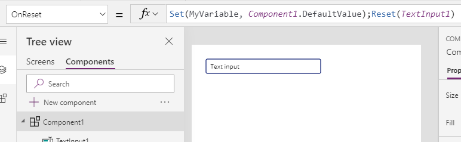
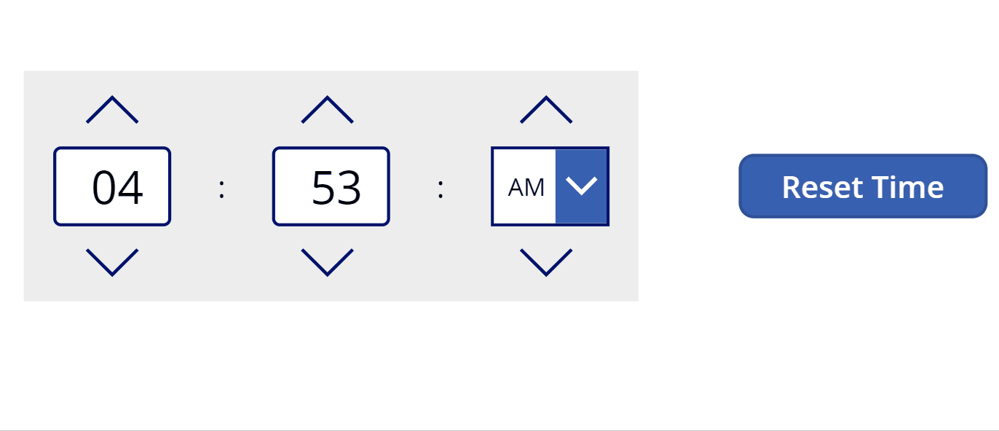
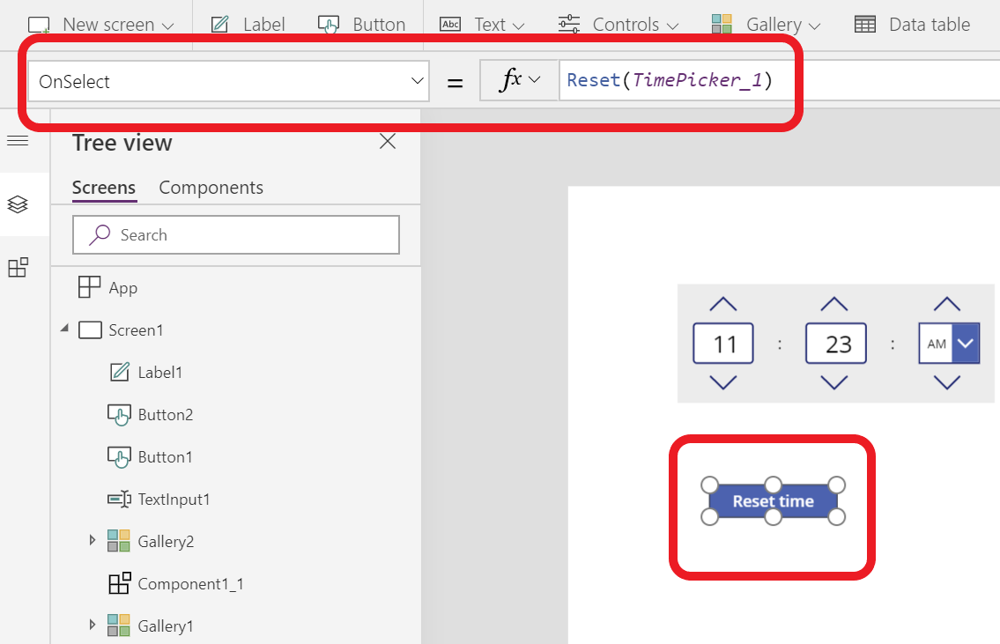
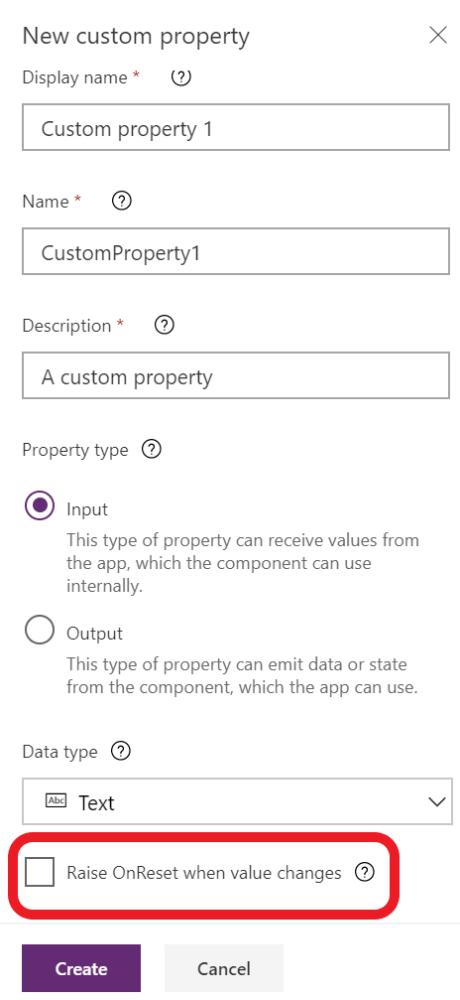
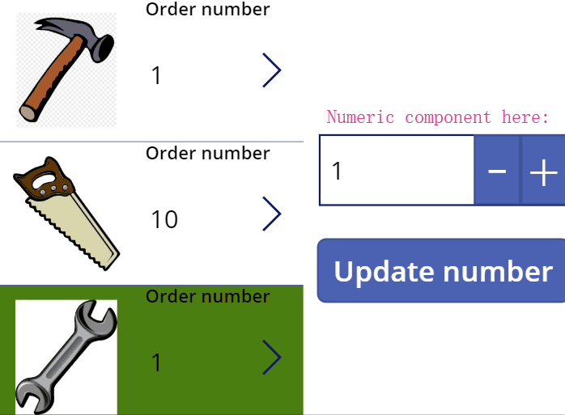

# Behavior formulas for components (experimental)

[This article is pre-release documentation and is subject to change.]

> [!IMPORTANT]
> This is an experimental feature. For more information, see [Experimental and preview features](working-with-experimental-preview.md).

Specify one or more [behavior formulas](working-with-formulas-in-depth.md) that run when an event triggers a change in component instances.

For example, set a component's **OnReset** property to one or more formulas that do initialization and clear input. Reset values when the **Reset** function runs on the component instances.

> [!NOTE]
> The feature to create custom behavioral properties is currently experimental. However, you can use the default **OnReset** property that is available on all components in your production environment.

## OnReset

With a component master selected, select **OnReset** in the drop-down list of properties (on the left side of the formula bar), and then enter one or more formulas.

> [!div class="mx-imgBorder"]
> 

To test **OnReset**, configure a control to reset the component. For example, set the **OnSelect** property of a button to this formula: **Reset**(*ComponentName*).

### Example - Reset timer

> [!div class="mx-imgBorder"]
> 

In this time picker component, two variables are used to display the time _selectedHour and _selectedMinute. When the picker gets reset, these variables should be reset to a default value, say 12: 12.  The OnReset property for the component has the following formula: **Set(_selectedHour,12); Set(_selectedMinute,12)**

To trigger reset, go to a screen and insert an instance of the component. Add a button and configure OnSelect of the button to call **Reset(TimerComponent_instance)**  to trigger OnReset.

> [!div class="mx-imgBorder"]
> 

## Update OnReset using custom property

Besides resetting a component instance from outside of the component, there's another method to trigger the OnReset from the inside. "**Raise OnReset when value changes**" is an option when creating a custom input property. It allows the value changes of this property to trigger OnReset of the component. This method is designed to set and reset the default value easily. 

> 

### Example

> [!div class="mx-imgBorder"]
> 

The example above shows reviewing order numbers and updating the numbers. The numeric up and down component is used to increase or decrease number of orders. When selecting the gallery on the left, the default number of the numeric up and down component is reset to display the order number of the selected tool. **Raise OnReset when value changes** made it possible to reset the default value when the input changes. 

To do so, check **Raise OnReset when value changes** of the default input property. **OnReset** of the component is set to **Set(_numericValue,'Numeric up down'.DefaultValue)**. _numericValue is the variable to store the value of the current order value. Set the **Default** of the text input control to **If(IsBlank(_numericValue), 'Numeric up down'.DefaultValue, _numericValue)**.

### See also

- [Canvas components](create-component.md)
- [Component library](component-library.md)
- [Component library application lifecycle management (ALM)](component-library.md)
- [Behavior formulas for components](component-behavior.md)
- [Power Apps component framework](../../developer/component-framework/component-framework-for-canvas-apps.md) 
- [Add canvas components to a custom page in a model-driven app](../model-driven-apps/page-canvas-components.md)

[!INCLUDE[footer-include](../../includes/footer-banner.md)]
