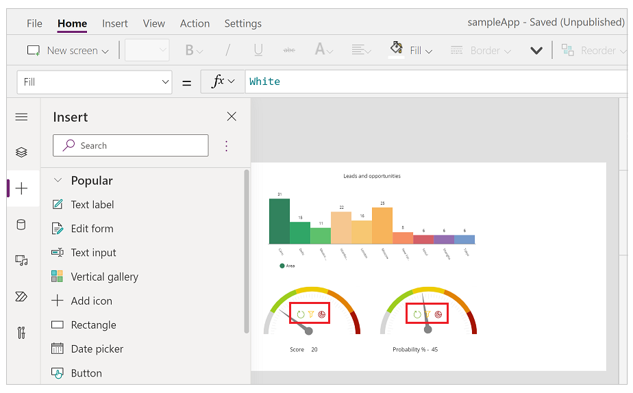
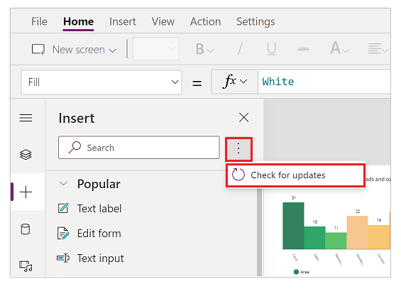
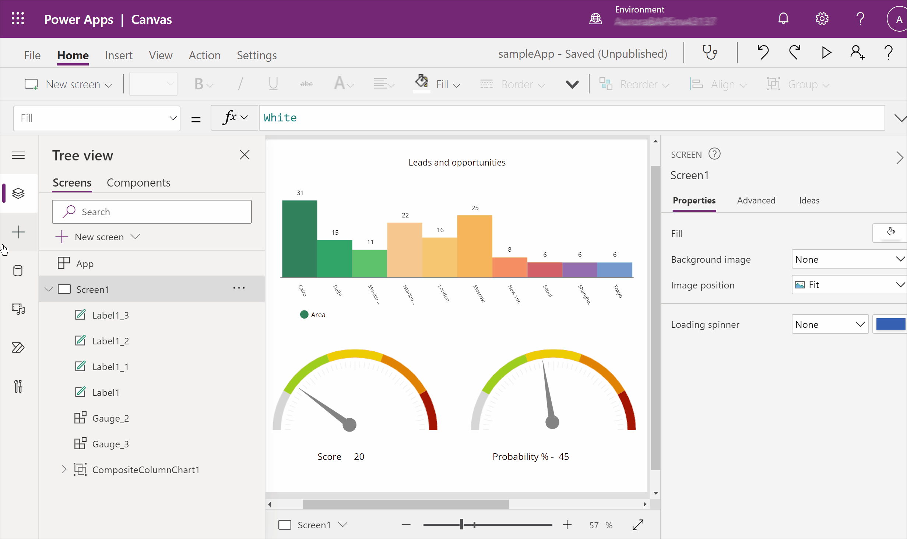
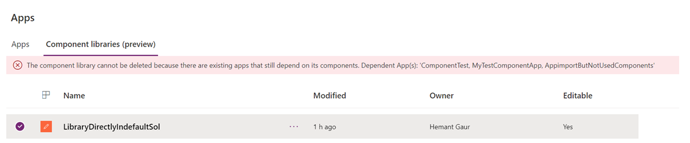

# Component library

In the [overview](create-component.md) article for creating components, you're introduced to components inside canvas app. As you create components inside an app, you can also create a library of components that can be reused. By creating a component library, app makers easily share and update one or more components with other makers.

Component libraries are containers of component definitions that make it easy to:

- Discover and search components.
- Publish updates.
- Notify app makers of available component updates. 

> [!NOTE]
> Component libraries are the recommended way to reuse components across apps. When using a component library, an app maintains dependencies on the components it uses. The app maker will be alerted when the updates to dependent components become available. Hence, all new reusable components should be created within the component libraries instead. An earlier Power Apps feature that allowed [importing components from one canvas app to another](create-component.md#import-and-export-components-retired) is retired.

## Difference between an app and a component library

A component library provides a centralized and managed repository of components for reusability. 

The **Insert** pane on the left navigation defaults to a components tab if you create a component library. When you create an app, this view shows screens instead of components. 

The screens inside a component library are available for testing only. It provides library creators a way to quickly test the created components on an actual screen and also validate the update behavior as components are enhanced over time. To use the components from the component library, you must create an app that uses the component library.

You can preview component library components using the screens inside the library with the play option. When you select the component tab, the play option is disabled. The component library doesn't display when using Power Apps Mobile.

> [!NOTE]
> The component library discussed in this article is different from the Power Apps component framework that enables developers and makers to create code components for model-driven and canvas apps. For more information, go to [Power Apps component framework overview](../../developer/component-framework/overview.md).

## Working with component library

You can create a new component library or edit an existing component library from the same interface. Go to [Power Apps](https://make.powerapps.com) > select **More** from left navigation > select **Discover all** > select **Component libraries** from the **App enhancements** section. You can also pin **Component libraries** option to your Power Apps interface. More information: [Left navigation in Power Apps](intro-maker-portal.md#1--left-navigation-pane)

## Create an example component library

The steps to create components inside a component library are the same as creating components inside an app. You'll create a component library and then reuse the steps for creating components from [components overview example](create-component.md#create-an-example-component). Then you'll use the component library to provide the reusable components in a new app.

1. Sign in to [Power Apps](https://make.powerapps.com).

1. Select **Component libraries** in the left navigation, and then select **New component library**.
   Alternatively, select **More** from left navigation > select **Discover all** > select **Component libraries** from the **App enhancements** section.

1. Name the component library as *Menu components*; you can also provide a different name of your choice.

1. Follow the steps to create components from [components overview example](create-component.md#create-an-example-component). You don't have to open Power Apps Studio or create a new blank app, since you already have created a new component library. Start with step 2. 

    After following the steps to create components, follow the next set of steps to also [add components to a screen](create-component.md#add-component-to-a-screen) and the steps to [create output property](create-component.md#create-and-use-output-property). 

1. After you complete the components creation and testing, save the component library by selecting the **File** menu and then selecting **Save**. 

    You also have an option to save a **version note**. A version note is useful to retrieve versions of a component library and for upgrading the components used in apps from this component library.

    

    > [!TIP]
    > A version note is useful when reviewing versions of a component library and for the app makers using your component library to review changes and update apps consuming these components as needed. Go to [update a component library](component-library.md?#update-a-component-library) for more details.   

1. A saved component library can be published. Only published component library updates are available for apps that consume a component library. Select **Publish** to publish the component library version:

    

## Library component customization

When creating component inside a component library, you have the option to allow the component to be customized when used by apps consuming the library components. By default, this setting is turned **On**. Turn this setting to **Off** to remove the ability to customize component while using in other apps.

:::image type="content" source="media/component-library/allow-customization-on.png" alt-text="Option to allow customization to this component when being used by an app.":::

When you add a component that allows customization, you'll see an option to edit this component for more customization. App makes a local copy and you can make changes to local component copy. The association with the component library is removed once the component is edited.

:::image type="content" source="media/component-library/edit-customizable-component.png" alt-text="Edit a component allowed for customization.":::

Selecting **Edit component** prompts you to copy the component locally for customization.

However, when you don't allow the components to be customized, the consuming apps won't show the option to edit the component.

:::image type="content" source="media/component-library/allow-customization-off.png" alt-text="No option to edit component inside consuming app.":::

In this case, the only way to edit the component is to edit the component library where the component is stored.

## Import from a component library

After you create a component library and publish, apps can consume the components from this component library by importing the library. You can also [share a component library](component-library.md#component-library-permissions).

To import from a component library, edit an existing app or create a new app. After the app opens in canvas app studio, select **Insert** or the **+** on the left navigation. Then select **Get more components** to list the component libraries available in the current environment:

You'll see the list of component libraries available in the current environment on the right side of the screen. Select an individual component from a component library. Or use **Select all** to import all of the components from the library at once:

> [!NOTE]
> If a maker doesn't see the component library listed in the import section, ensure the component library is shared with the maker. For more details, go to [component library permissions](component-library.md#component-library-permissions). 

Notice you can select and import more than one component and across different component libraries. 

Components available inside the app are listed under the **Custom** category in the list of components in the **Insert** pane. Components available from imported component libraries are listed under the **Library components** category:

## Update a component library

You can modify an existing component library and save any changes with other version notes. However, the updated component library version must be published for use in existing apps that use the component library. The [example component library](component-library.md#create-an-example-component-library) steps above explain how to publish a component library after saving it.

There are two ways apps using the components from library can get the latest changes.

### Method 1: Component update notification on app edit

Makers of other apps are notified of updated components being available. The notification appears when makers edit the apps in canvas app studio. They can choose to update the components:

Select **Review**, and you'll see the option to update the component:

Notice that the version note you added when publishing the component library version shows up here. 

Select **Update** to update the components.

### Method 2: Proactive check for updates

This method is to check for the app update proactively while working on the app in Studio.

To do this check, select Insert component panel on the left-side, and then select **...** (ellipsis) next to the search button. And then, select **Check for updates**.

If there are updates in the components used from library, maker will get the message to review and get the latest changes. Upon review and update, the app gets updated with the latest components.

The following animation shows the process to get the latest components.

### Updating component from a component library in a consuming app

If you import a component from a component library, you can't edit it inside the consuming app. If you select **Edit component**, you'll see an option to create a copy of the component inside the current app for you to make changes: 

If you select **Create a copy**, the component is copied to the local app. The local copy of the component appears under the **Custom** category in the **Insert** pane. This local copy of the component won't receive updates if a new version of the originating component library is published later.

> [!NOTE]
> The in-use instances of components from the component library won't be affected after you create a local copy of a component, and will remain linked to the component library definition. Only instances of the locally copied components (from **Custom** category) are considered to be the local app components.

## Deleting a component library

If a component library is referenced by a canvas app, it can't be deleted. This is true for both Power Platform and non-Power Platform environments.  Remove the component from the app before deleting the library.  You can find information about the apps using the component library in either solution dependencies view or in the message, which is shown when you try to delete library.

## Component library permissions

Sharing a component library works the same way you share a canvas app. When you share a component library, you allow others to reuse the component library. Once shared, others can edit the component library and import components from this shared component library for creating and editing apps. If shared as a co-owner, a user can use, edit, and share a component library but not delete or change the owner.

Additional considerations when sharing component libraries to security groups:

- You can't use the [sharing UI](share-app.md) when sharing component libraries created as part of a solution. Instead, use [Set-PowerAppRoleAssignment cmdlet](/powershell/module/microsoft.powerapps.administration.powershell/set-adminpowerapproleassignment#parameters) with **CanEdit** permission level to share the component libraries with the selected security group.
- Component libraries created in a Power Platform environment [without a Dataverse database](/power-platform/admin/create-environment#create-an-environment-in-the-power-platform-admin-center) shared as **Co-owner** automatically grant **CanEdit** permission to the selected security group.

## Known limitations

- [Known limitations](create-component.md#known-limitations) applicable to components also applies to component libraries.
- You can't import components from a locally saved component library. It's possible to save a component library using **File** > **Save As** > **This Computer**. But if you try to import such saved component library, you'll see the following error message: 

    

- If you're importing an app and a component library in an environment for the first time, ensure the app uses the latest version of the component included with the component library. Otherwise, the app won't receive updates after the import. The app will recognize and prompt for the updated version upon subsequent component library imports to the same environment.
- Code components aren't supported inside component libraries.

### See also

- [Canvas components](create-component.md)
- [Component library application lifecycle management (ALM)](component-library-alm.md)
- [Map input fields of a component](map-component-input-fields.md)
- [Add multimedia to a component](component-multimedia.md)
- [Behavior formulas for components](component-behavior.md)
- [Power Apps component framework](../../developer/component-framework/component-framework-for-canvas-apps.md) 
- [Add canvas components to a custom page in a model-driven app](../model-driven-apps/page-canvas-components.md)

[!INCLUDE[footer-include](../../includes/footer-banner.md)]
