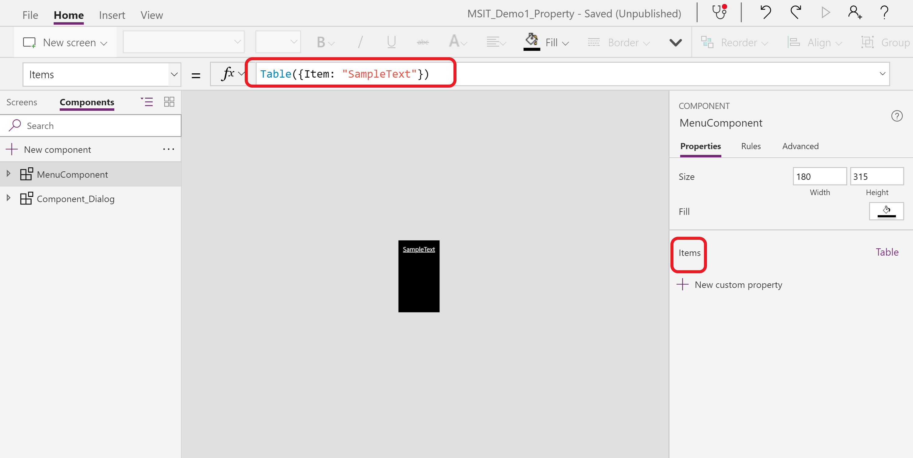
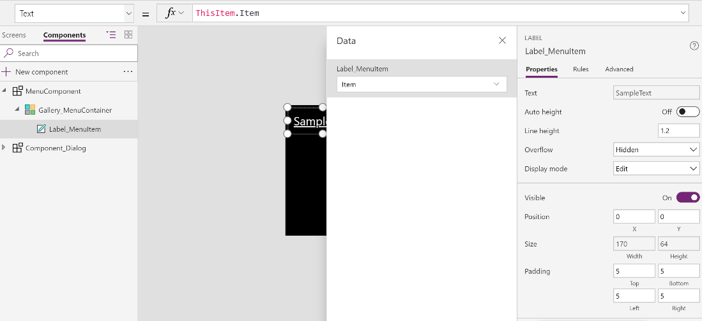

# Components (Experimental feature)

Components are reusable canvas app building blocks where app makers can create custom controls to use within the app or across apps. Advanced features like custom properties enable complex capabilities in components. In this article, we will introduce component concepts and some examples.

Components are useful in building larger apps that have similar control patterns. With components, updating a component definition reflects the changes in all instances within the app. It also helps improve performance as it reduces duplicate controls through copy/paste. Components also enable collaborative development and standardized look-and-feel within an organization.

Since this feature is in the experimental stage, it needs to be enabled from the App Settings screen.

## Prerequisite

Make sure you are in a preview region, turn on the feature in the app setting. Read here about the [Preview program](../../administrator/preview-environments.md). The feature is not supported in classic canvas.

## Component canvas

There are two gestures to making a new component: from the ‘Components’ list view or from the ‘Components’ ribbon button. The Components view lives next to the ‘Screens’ tree view and lists components that you have defined in the app, sorted by creation time.


The ribbon button brings you to the same spare canvas where you can add controls as part of the component definition. The ribbon dropdown also shows the same list and selecting one from the ribbon inserts an instance of the component, just like inserting a control.

Editing on the component canvas will update related component instances that you inserted in the app screens.

## Scope

Think of a component as an encapsulated black box with properties as the interface. Controls within the component are not accessible from outside of the component. Within the component, any reference to outside of the component is not valid and will result in an expression error. Scope restrictions keep the data contract of a component simple and cohesive, and it helps enable seamless component definition updates, especially across apps. You can update the data contract of the component by creating custom properties.

## Variables

You can use variables in component with the Set() function. UpdateContext() function is not supported. Please note that the scope of these variables is within the component. To access them from outside the component, you can leverage custom output properties.

## Import and export

The export gesture will create a local file which you can import to a different app. If the app contains the same component but modified, you will be prompted to decide whether to replace or skip the modified version. Saving components to the cloud and sharing them within an environment is a limitation that will be addressed in future updates.


## Custom properties

A component can receive input values and emit data using custom properties. They are advanced scenarios which require understanding of formulas and binding contract.

An input property is how a component receives data to be used inside the component. Input properties show up in the properties pane of component instances and can be configured with expressions, just like standard properties in other controls. The ‘Default’ property on input controls like **TextInput** is an example of an input property.

Output properties can emit data or component state. For example, the “Selected” property on the Gallery control is an output property. When you create an output property, you can determine what other controls can refer to from the component state.

The following walkthrough explains the concepts further.

## Menu component example

1. Create a component by selecting **New component** from the Components list view.
 
1. Rename the component **MenuComponent**.
 
1. In the right-hand pane, select **New custom property** to create a custom property. Fill out information in the pane. **Property name** is the reference name in the formula, so not space allowed. For example, when going back to app authoring, other controls can refer to this property by **ComponentName.PropertyName**. 

    **Display name** shows in the property pane when you insert this component. Being descriptive can help understand the purpose of this property. **Description** is the tooltip content where a user can hover the name of this property in the property pane in app authoring. 
  
    The data type will be **Table** because the input will be a list of text.
 
    

1. A default value is assigned to this property based on the data type. You can edit the default value if needed. For **Table** and **Record** type, you may want to change it to match the data schema that you want to input to the component. In this case, we want to change it to a list of text. You can click on the name in the right-hand pane and edit from the formula bar or you can find it from the advanced pane. 

    Let's define the default value of Items to:

    ```
    Table({Item:"SampleText"})
    ```

    

1. Insert an blank gallery and insert a label inside the gallery. Set the **Items** property of the gallery control to:

    ```
    MenuComponent.Items
    ```

    This way, the gallery Items property reads and depends on the component input property ‘Items’. Make sure Gallery field selection is correct.

    

1. Now, you create a component which takes a table input. Let's try to reuse the component in app authoring. From **Insert** tab, click the component dropdown and insert **MenuComponent**. 

    

1. You will find the input property **Items** shows up on the right-hand pane.(This string is set by **Display name**.) Make sure the input you give here matches the fields with the default formula set in **Step4**. Here is a sample input. You can have any number of entries.

    ```
    Table({Item:"Home"}, {Item:"Admin"}, {Item:"About"}, {Item:"Help"})
    ```

    

1. So far, we create a component and reuse it in app authoring. Let’s create a text output property which emits what’s selected from the menu. Add a custom property following the screenshot.

    

1. Go to advanced pane and change the formula to the following, so that the output property is bond to the **seleted** of the gallery. Note that output properties only show up in the advance pane.

    

1. Go back to screens and test it out by adding a label to the app and bond it to **MenuComponent_2.Selected**. Note that here **MenuComponent_2** is the name of an instance, not the name of the defined component. You can rename any instance. Now the label shows the text of selected menu item.

    

## Known limitations

1. Data source is not saved with components. This capability is planned as the next step.
1. Collection is not supported in component.  
1. Variables used in components don't display with app variables. This is coming soon.
1. Nesting a component inside a gallery, form, or datacard is not supported.
