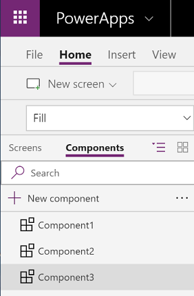
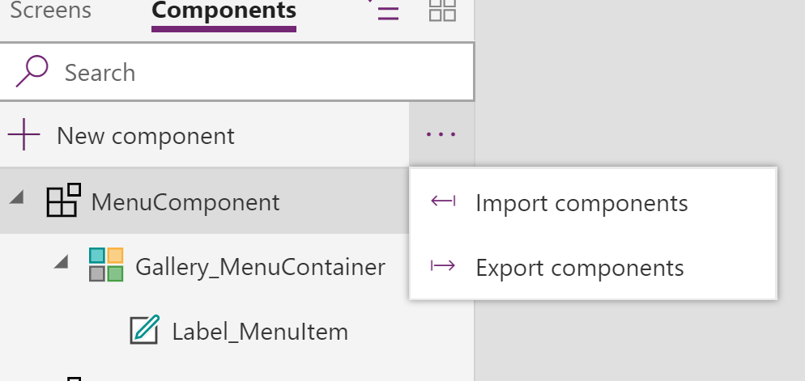
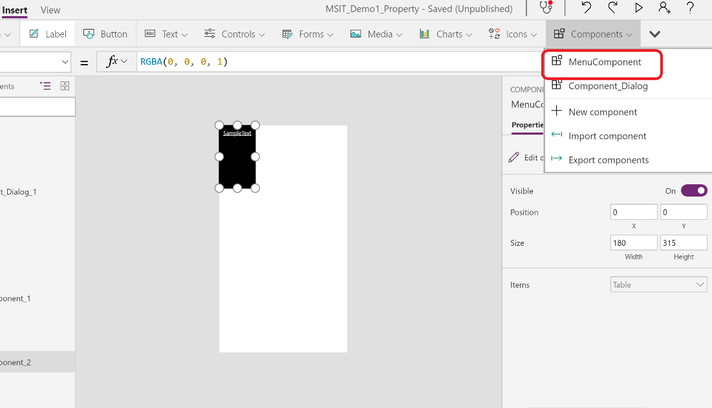
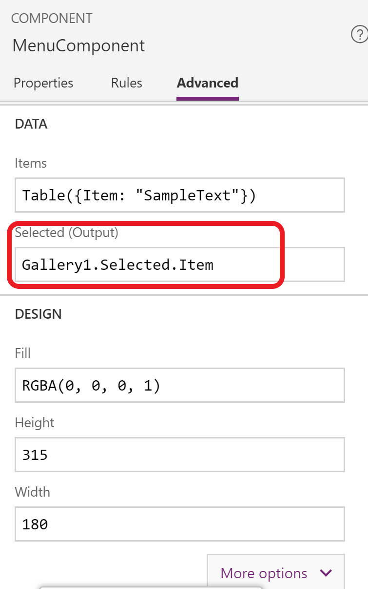

# Create a component for canvas apps (experimental feature)

Components are reusable building blocks for canvas apps where app makers can create custom controls to use in an app or across apps. Advanced features such as custom properties enable complex capabilities in components. This article introduces component concepts and some examples.

Components are useful in building larger apps that have similar control patterns. If you update a component definition, all instances in the app reflect your changes. You can also improve performance by using one or more components because you don't duplicate controls by using copy and paste. Components also enable collaborative development and standardized look-and-feel in an organization.

This feature is in the experimental stage, so you must enable it from the **App Settings** screen.

## Prerequisite

In a preview region, open the **App Settings** screen, and then enable the feature. Read here about the [Preview program](../../administrator/preview-environments.md). The feature isn't supported in classic canvas.

## Component canvas

You can create a component from the **Components** menu on the **Insert** tab or, as the next graphic shows, the list in the left navigation bar. This list shows components that are defined in the app, sorted by creation time.



If you open the **Components** menu and then select **New component**, PowerApps opens the same empty canvas where you can add controls as part of the component definition. The **Components** menu also shows the same list of existing components, and you can select one to insert an instance of that component, just as you insert a control.

If you edit a component in the canvas, you'll update instances of the same component in other app screens and other apps.

## Scope

Think of a component as an encapsulated black box with properties as the interface. You can't access controls in the component from outside of the component, and you can't refer to anything outside of the component from inside the component. If you try, an error appears. Scope restrictions keep the data contract of a component simple and cohesive, and it helps enable seamless component-definition updates, especially across apps. You can update the data contract of the component by creating custom properties.

## Variables

You can create and update variables in a component by using the **Set** function. The **UpdateContext** function isn't supported. The scope of these variables is limited to the component, but you can access them from outside the component by leveraging custom output properties.

## Import and export

If you export a component, you create a local file that you can import to a different app. If the app contains a modified version of the same component, you're prompted to decide whether to replace the modified version or cancel the import. As of this writing, you can't save components to the cloud or share them within an environment.



## Custom properties

A component can receive input values and emit data using custom properties. They are advanced scenarios that require you to understand formulas and binding contracts.

An input property is how a component receives data to be used in the component. Input properties appear in the properties pane of component instances, and you can configure them with expressions, just as you configure standard properties in other controls. Other input properties include the **Default** property on an input control such as the **TextInput** control.

Output properties can emit data or component state. For example, the **Selected** property on a **Gallery** control is an output property. When you create an output property, you can determine what other controls can refer to from the component state.

This walkthrough further explains these concepts.

## Create an example component

In this example, you'll create a menu component that resembles this graphic:

1. Create a blank app for tablets.

1. In the left navigation bar, open the list of components, and then select **New component**.

    

1. Hover over the new component, and then select the ellipsis (...).

1. In the menu that appears, select **Rename**, and then type or paste **MenuComponent**.

1. In the right-hand pane, select **New custom property**.

    

1. In the **Display name**, **Property name**, and **Description** boxes, type or paste **Items**.

    

    When you specify a **Property name**, don't include spaces because you'll refer to the component by this name when you write a formula (for example, **ComponentName.PropertyName**).

    The **Display name** appears on the **Properties** tab of the right-hand pane if you select the component. A descriptive display name helps you and other makers understand the purpose of this property. The **Description** appears in a tooltip if you hover over the name of this property in the **Properties** tab.

1. In the **Data type** list, select **Table**, and then select **Create**.

    

    The **Items** property is set to a default value based on the data type that you specified, but you can set it to a value that suits your needs. If you specified a data type of **Table** or **Record** for the **Items** property, you may want to change the property's value to match the data schema that you want to input to the component. In this case, you'll change it to a list of strings.

    You can set the property's value in the formula bar if you select the name of the property in the right-hand pane. As the next graphic shows, you can also edit the property's value on the **Advanced** tab of the right-hand pane.

1. Set the component's **Items** property to this formula:

    ```
    Table({Item:"SampleText"})
    ```

    

1. In the component, insert a blank vertical **Gallery** control, and set its **Items** property to this expression:

    ```
    MenuComponent.Items
    ```

    This way, the **Items** property of the **Gallery** control reads and depends on the **Items** input property of the component. Make sure that the **Gallery** field selection is correct.

1. Insert a **Label** control inside the gallery.

    

Next, you'll add the component to a screen and specify a table of strings for the component to show.

1. Select the default screen of the app.

1. On the **Insert** tab, open the **Components** menu, and then select **MenuComponent**.

    

    The new component is named **MenuComponent_1** by default.

1. Set the **Items** property of **MenuComponent_1** to this formula:

    ```
    Table({Item:"Home"}, {Item:"Admin"}, {Item:"About"}, {Item:"Help"})
    ```

    

1. (optional) In the list of components, set the **Label** control's **Y** property to **0** and the **Gallery** control's **TemplateSize** property to **50**. On the screen, set the **Gallery** control's **Width** property to **150** and its **Height** property to **250**.

    

So far, you've created a component and added it to an app. Next, you'll create an output property that reflects the item that the user selects in the menu.

1. In the list of components, select **MenuComponent**.

1. In the right-hand pane, select the **Properties** tab, and then select **New custom property**.

1. In the **Display name**, **Property name**, and **Description** boxes, type or paste **Selected**.

1. Under **Property type**, select **Output**, and then select **Create**.

1. On the **Advanced** tab, set the value of the **Selected** property to this expression, adjusting the numeral in the gallery name if necessary:

    ```
    Gallery1.Selected.Item
    ```

    

1. On the app screen, add a label, and set its **Text** property to this expression, adjusting the numeral in the component name if necessary:

    ```
    MenuComponent_1.Selected
    ```

    Note that **MenuComponent_1** is the default name of an instance, not the name of the component definition. You can rename any instance. Now the label shows the text of selected menu item.

1. While holding down the Alt key, select each item in the menu.

    The **Label** reflects the item that you selected most recently.

## Known limitations

- As of this writing, data sources aren't saved with components, and variables used in components don't appear with app variables.
- Components don't support collections.
- Nesting a component inside a gallery, a form, or a datacard isn't supported.