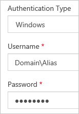
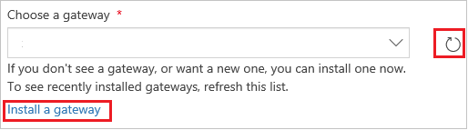

# Create a connection to SharePoint from PowerApps
Create a connection to either SharePoint Online or on-premises SharePoint so that you can generate a canvas app automatically or build one from scratch.

If you're unfamiliar with PowerApps, see [Introduction to PowerApps](getting-started.md).

As of this writing, PowerApps supports custom lists but not libraries. In addition, you can show data in some types of columns, such as **Choice** and **Picture**, but you can't update that data. For more information, see [Known issues](connections/connection-sharepoint-online.md#known-issues).

## Specify a SharePoint connection
1. If you haven't already signed up, [sign up for PowerApps](../signup-for-powerapps.md).

2. Sign in to [powerapps.com](https://web.powerapps.com?utm_source=padocs&utm_medium=linkinadoc&utm_campaign=referralsfromdoc) using the same credentials that you used to sign up.

3. In the left navigation bar, click or tap **Manage**, and then click or tap **Connections**.

    

4. Near the upper-right corner, click or tap **New connection**.

    

5. In the list of connections, click or tap **SharePoint**.

    

6. Follow the steps in either of these procedures, which appear later in this topic:

   * [Connect to a SharePoint Online site](connect-to-sharepoint.md#connect-to-a-sharepoint-online-site).
   * [Connect to an on-premises SharePoint site](connect-to-sharepoint.md#connect-to-an-on-premises-sharepoint-site).

## Connect to a SharePoint Online site
1. Click or tap **Connect directly (cloud services)**, and then click or tap **Add connection**.

    

2. Go to [Next steps](connect-to-sharepoint.md#next-steps) at the end of  this topic.

## Connect to an on-premises SharePoint site
1. Click or tap **Connect using on-premises data gateway**.

    

    > [!NOTE]
   > Gateways and on-premises connections can only be created and used in the user's [default environment](working-with-environments.md).

2. Specify your user name and your password.

    If your credentials include a domain name, specify it as *Domain\Alias*.

    

3. If you don't have an on-premises data gateway installed, [install one](gateway-reference.md), and then click or tap the icon to refresh the list of gateways.

    

4. Under **Choose a gateway**, click or tap the gateway that you want to use, and then click or tap **Add connection**.

    

## Next steps
* [Generate an app automatically](app-from-sharepoint.md) based on a list that you specify. The app will have three screens by default: one each for browsing records, displaying details about a single record, and creating or updating a record.
* [Build an app from scratch](get-started-create-from-blank.md). This topic was written for Excel, but the same principles apply to SharePoint.
