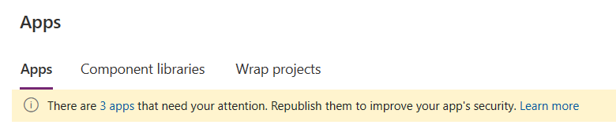
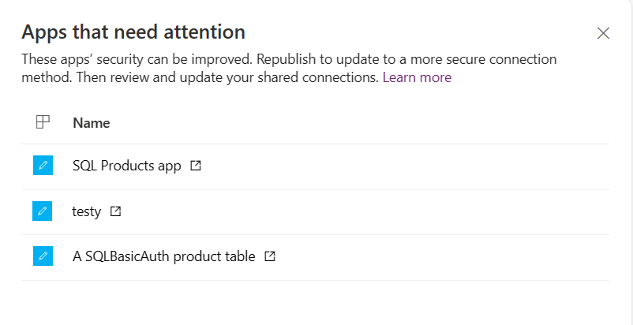
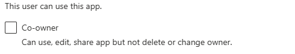
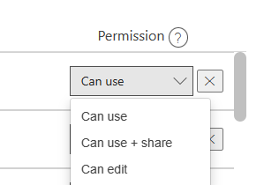

# Overview of connectors for canvas apps

Data is at the core of most apps, including the data you build in Power Apps. Data is stored in a *data source*, and you bring that data into your app by creating a *connection*. The connection uses a specific *connector* to talk to the data source. Power Apps has connectors for many popular services and on-premises data sources, including SharePoint, SQL Server, Office 365, Salesforce, and Twitter. To get started adding data to a canvas app, see [Add a data connection in Power Apps](add-data-connection.md).

A connector may provide **tables** of data or **actions**. Some connectors provide only tables, some provide only actions, and some provide both. Also your connector may be either a standard or custom connector.

## Tables

If your connector provides tables, you add your data source, and then select the table in the data source that you want to manage. Power Apps both retrieve table data into your app and updates data in your data source automatically for you. For example, you can add a data source that contains a table named **Lessons** and then set the **Items** property of a control, such as a gallery or a form, to this value in the formula bar:

 

You can specify the data that your app retrieves by customizing the **Items** property of the control that shows your data. Continuing the previous example, you can sort or filter the data in the **Lessons** table by using that name as an argument for the **Search** and **SortByColumn** functions. In this graphic, the formula to which the **Items** property is set specifies that the data is sorted and filtered based on the text in **TextSearchBox1**. 

 

For more information about how to customize your formula with tables, see these articles:

  [Understand data sources in Power Apps](working-with-data-sources.md)  
  [Generate an app from Excel data](get-started-create-from-data.md)  
  [Create an app from scratch](get-started-create-from-blank.md) 
  [Understand tables and records in Power Apps](working-with-tables.md)

  > [!NOTE]
  > To connect to data in an Excel workbook, it must be hosted in a cloud-storage service such as OneDrive. For more information, see [Connect to cloud-storage from Power Apps](connections/cloud-storage-blob-connections.md).

## Actions

If your connector provides actions, you must still select your data source as you did before. Instead of selecting a table as the next step, however, you manually connect a control to an action by editing the **Items** property of the control that will show your data. The formula to which you set the **Items** property specifies the action that retrieves data. For example, the app won't retrieve any data if you connect to Yammer and then set the **Items** property to the name of the data source. To populate a control with data, specify an action such as **GetMessagesInGroup(5033622).messages**.

If you need to handle custom data updates for action connectors, build a formula that includes the **Patch** function. In the formula, identify the action and the fields that you'll bind to the action.  

> [!NOTE]
> For action-based connectors, galleries and other controls don't page in more data automatically the same way they do for tables. For instance, if you bind an action to a gallery then it’ll retrieve the first set or page of records. But if the data requested exceeds the size for a page of data, then the control won't automatically fetch the next page. You must manage this directly with collections.

For more information about how to customize your formula for custom updates, see these articles:

[Patch](functions/function-patch.md) [Collect](functions/function-clear-collect-clearcollect.md) [Update](functions/function-update-updateif.md)

> [!NOTE]
> To work with dynamic schema, you can use an **experimental** feature called **Dynamic schema**. Dynamic schema refers to the possibility that the same action may return a different table with different columns. Conditions that may cause the columns in the tables to differ include the action input parameters, the user or role that's executing the action, and the group in which the user is working, among others. For example, SQL Server stored procedures may return different columns if run with different inputs, or an Azure DevOps instance may use custom fields that aren't available by default. For working with dynamic schema, the [connector documentation](/connectors) shows **The outputs of this operation are dynamic.** as the return value.
> For more information about how to work with dynamic schema in Power Apps, see [working with dynamic schema in Power Apps (experimental)](working-with-dynamic-schema.md)

## Popular connectors

This table has links to more information about our most popular connectors. For a complete list of connectors, see [All connectors](/connectors/connector-reference/).

| &nbsp; | &nbsp; | &nbsp; | &nbsp; | &nbsp; |
| --- | --- | --- | --- | --- |
|  |[**Microsoft Dataverse**](connections/connection-common-data-service.md) |&nbsp; | |[**Cloud storage**](connections/cloud-storage-blob-connections.md) ** |
|  |[**Dynamics AX**](connections/connection-dynamicsax.md)|&nbsp; | |[**Excel**](connections/connection-excel.md)|
|  |[**Microsoft Translator**](connections/connection-microsoft-translator.md)|&nbsp; |  |[**Office 365 Outlook**](connections/connection-office365-outlook.md)|
|  |[**Office 365 Users**](connections/connection-office365-users.md)  |&nbsp; |  |[**Oracle**](connections/connection-oracledb.md)|
|  |[**Power BI**](connections/connection-powerbi.md) |&nbsp; |  |[**SharePoint**](connections/connection-sharepoint-online.md) |
|  |[**SQL Server**](connections/connection-azure-sqldatabase.md) |&nbsp; |  |[**Twitter**](connections/connection-twitter.md) |

** Applies to Azure Blob, Box, Dropbox, Google Drive, OneDrive, and OneDrive for Business

## Standard and custom connectors

Power Apps provides *standard* connectors for many commonly used data sources. If Power Apps has a standard connector for the type of data source that you want to use, you should use that connector. If you want to connect to other types of data sources, such as a service that you've built, see [Register and use custom connectors](../canvas-apps/register-custom-api.md).

## All standard connectors

Standard connectors don't require special licensing. For more information, see [Power Apps Plans](https://powerapps.microsoft.com/pricing/).

You can ask questions about a specific connector in the [Power Apps forums](https://powerusers.microsoft.com/t5/PowerApps-Community/ct-p/PowerApps1), and you can suggest connectors that you want to add or other improvements to make in [Power Apps Ideas](https://ideas.powerapps.com/).

## Security and types of authentication

As you author your app and create a connection to a data source, you may see that your choice of connector allows you to use different ways to authenticate. For instance, the SQL Server connector allows you to use Azure AD Integrated, SQL Server Authentication, and Windows Authentication. Each type of authentication has different levels of security associated with it.  It's important to understand what information and rights you share with users who use your application. The primary example in this article is SQL Server, however the principles apply to all types of connections.

> [!NOTE]
> - For detailed information about security considerations when using a relational database server (such as Microsoft SQL Server, or Oracle) as the data source for an app, see [Use Microsoft SQL Server securely with Power Apps](connections\sql-server-security.md).
> - Power Apps doesn't  support **External member** identities. For more information, see [Properties of an Azure Active Directory B2B collaboration user](/azure/active-directory/external-identities/user-properties). 

### Azure Active Directory (AAD)

This is a secure type of connection.  For example, SharePoint uses this type of authentication.  SQL Server also allows for this type of authentication.  When you connect, the Azure AD service identifies you separately to SharePoint on your behalf.  You don't have to supply a username or password.  As an author you can create and work with the data source with your credentials.  When you publish your application and your application user logs in, they do so with their credentials. If the data is appropriately secured on a back-end your users can only see what they're authorized to see based on their credentials.   This type of security allows you to change rights for specific application users on the back-end data source after the application has been published.  For instance you can grant access, deny access, or refine what a user or set of users can see all on the back-end data source.
> [!NOTE]
> Power Apps does not yet formally support Service Principal types of authentication. For more information, see [Authentication methods using Azure Active Directory](/azure-sphere/deployment/authenticate-options).

### Open-standard authorization (OAuth)

This type of connection is also secure.  For example Twitter uses this type of authentication.  When you connect, you must supply your user name and password.  As an author you can create and work with the data source with your credentials.  When you publish your application and your application user logs in, they must also supply their credentials.  Therefore this type of connection is secure as your users must use their own credentials to access the data source service. 

### SQL User name and password authentication

This type of connection isn't secure because it doesn't rely on end-user authentication. **It should only be used in cases where you can safely assume that everyone who has access to this connection can see and use all of the data to which the connection provides access.**  You can't reliably lock down portions of the data accessible within the connection. For instance, if the connection allows access to a single table, you can't rely on a userID to filter and only show data for that specific user within that table. For reliable security, use a more secure connection such as [Azure AD Integrated](connections-list.md#azure-active-directory-aad).  

In SQL Server, this type of connection is called **SQL Server Authentication**.  Many other database data sources provide a similar capability.  When you publish your application, your users don't need to supply a unique user name and password.  They're using the user name and password you supply when you author the application.  The connection authentication to the data source is **Implicitly Shared** with your users.  Once the application is published, the connection is also published and available to your users.  Your end users can also create applications using any connection using SQL Server authentication that is shared with them.  Your users can't see the user name or password, but the connection will be available to them.  **There are valid scenarios for this type of connection. For instance if you have a read-only database that is available to everyone in the company. Reference data scenarios (for example, a corporate calendar) can be useful for this kind of connection.** More information: [Use Microsoft SQL Server securely with Power Apps](connections/sql-server-security.md)

### Secure Implicit Connections (preview)

[This section is prerelease documentation and is subject to change.]

Power Apps now has full preview support for **[Secure implicit connections](working-with-experimental-preview.md)**. The default setting for this feature is **On**. The secure implicit shared connections are more secure than the existing implicit connections. Power Apps implicitly shared connections are ones that use a fixed credential such as a SQL Server connection string rather than the end user's specific credentials such as AAD. With this feature, connections are no longer directly shared with the users of Power Apps. Instead, a proxy connection object that only grants access to the underlying resource such as a specific SQL server table is shared. End user authors can't create new applications with either the connection or the proxy connection. This feature also limits the end user to such actions as **get**, **put/patch**, and **delete** that are defined in the corresponding app. The result is that end users who are also authors can't create new applications with either the connection or the proxy connection object.

> [!NOTE]
> **Secure implicit connections** is now **On** by default for new apps.

#### Notification to update your apps
If you have applications that may be upgraded to use this feature then you'll see a message on the Apps page. It indicates the number of apps that need your attention.  

   > [!div class="mx-imgBorder"]
   > 

Select the link and it opens a side panel that will list all of the apps that need attention.  

   > [!div class="mx-imgBorder"]
   > 

Select the *open* icon to the right of the app name to open and republish it.  See the directions below.

#### Enable secure implicit connections for an existing app

Open an existing [app open for editing](../../edit-app.md) with implicitly shared connections that has previously been published:
1. On the command bar, select **Settings** > **Upcoming features**.
2. From the **Preview** tab, set the toggle for **Secure implicit connections** to **On**.
3. Save and publish the app.

#### Sharing

Once the app is published follow these steps to verify that sharing works correctly:

- Check if connections are shared with co-owners. If you don't want an end-user to get a connection, then uncheck the **Co-owner** checkbox.

   > [!div class="mx-imgBorder"]
   > 

- To verify the feature works correctly, share the app with a different user who isn't an owner. Once you have shared the app, check the **Connections** list in the **Dataverse** tab in [Power Apps](https://make.powerapps.com) for that user. Verify that the user doesn't have a connection available.

- Open the **Sharing** panel to change the end-user's right to the connection. Choosing the **X** will remove the user's access to the connection. 

   > [!div class="mx-imgBorder"]
   > 

#### Use apps with a new secure implicit connection

When your app is republished and shared, then end-users won't have access to the connection but will work with the hidden proxy connection. They won't be able to create a new app based on your original connection. 

#### Limitations

1. All types of implicitly shared connections work such as action and tabular.
2. Server and database names are hidden in network traces but visible in the consent dialog. Column names aren't hidden.
3. For tabular connectors, we only limit CRUD actions such as Get, Post, Put, or Delete. If you have permissions to **Put**, then you have access to **Post**.
4. Action based connectors limit based on the specific API being used in the application. 
5. Warnings are still enabled in sharing. The warning around implicitly shared connections still warns while in private preview. However, your connection with this feature is secure – despite the warning.
6. Publishing to an entire tenant, as opposed to specific groups or individuals isn't supported.  
7. There is a known issue when importing an implicitly shared secure connection via a connection reference. The security is not set properly in the target enviroment. 
8. There is a known issue importing a solution using a service principal, causing import failure. A workaround is to share the connection with the service principal.

### Windows Authentication

This type of connection isn't secure because it doesn't rely on end-user authentication. Use Windows authentication when you need to connect to a data source that is **on-premises**. An example of this type of connection is to an on-premises server that has a SQL Server. The connection must go through a gateway. Since it goes through a gateway, the connector has access to all of the data on that data source. As a result, any information that you can access with the Windows credentials you supply are available to the connector. And once the application is published, the connection is also published and available to your users.  This behavior means that your end users can also create applications using this same connection and access the data on that machine. Connections to the data source are also **Implicitly Shared** with users that the app is shared with. This type of connection may be valid when your data source only lives on an on-premises server and the data on that source is freely shareable.

## Data sources in solutions

Solutions are used for [application lifecycle management](/power-platform/alm/overview-alm) and provide other capabilities for managing the lifecycle of **data sources**. If a canvas app is in a solution, [connection references](../data-platform/create-connection-reference.md) and [environment variables](../data-platform/environmentvariables.md) may be created to store information about the data sources. This ensures data sources can be changed or re-established when solutions are migrated to different environments. 

## Rename data sources in apps

To learn about renaming data sources in an app, and the difference between tabular and action-based data sources, go to [Rename Power Apps action-based data sources](rename-data-source.md).

## Connection consent dialog

When users open an app that uses connectors for the first time, they see a "connection consent" dialog for the following purposes.

1. To inform users about the data sources accessed by the app.

1. To outline the actions a connector may, or may not perform in an app. For example, for apps using the **Office 365 Users** connector, this could be the following.

    - This app is able to:
        - Read your full user profile
        - Read the full profile of all users
    - It won't be able to:
        - Modify or delete any user-profile information

1. To capture end-user consent to connect to the data sources that the app uses.

1. To facilitate manual end-user authentication, when needed.

For some connections, Power Platform can automatically authenticate a user to access a data source. However, if the automatic sign-in fails, this dialog prompts users to fix a connection by manually signing in. Power Platform can only attempt automatic sign-in for a connection when a data source preauthorizes Microsoft’s Azure API connections service principal, granting it permission to perform single sign-on for a user when a connection is created. For more information on single sign-on, see [What is single sign-on (SSO)?](/azure/active-directory/manage-apps/what-is-single-sign-on)

The following image is an example of the connection consent dialog for an app connecting to a SharePoint site.  

For select connectors, admins can suppress this dialog, and consent on behalf of end users to connect to a data source. The following table explains which types of connectors the consent dialog may be suppressed for an app.

> [!NOTE]
> If an admin suppresses the consent dialog but the platform can’t perform single-sign-on for an end-user, the dialog will be presented to the user when they launch the app.

| Connector type                                                                                                                                           | Consent dialog suppressible? | Reference               |
|----------------------------------------------------------------------------------------------------------------------------------------------------------|------------------------------|-------------------------|
| Microsoft first-party connectors that support single sign-on (such as SharePoint, Office 365 users)                                                         | Yes                          | [Power Apps admin cmdlet](/powershell/module/microsoft.powerapps.administration.powershell/set-adminpowerappapistobypassconsent) |
| Connector accessing a non-Microsoft, third-party service, such as Salesforce                                                                                  | No                           | Not applicable                    |
| Custom connectors using OAuth with Azure Active Directory as the identity provider. These are custom connectors built by organizations, and are only accessible by the users within the organization (for example, built by Contoso for only Contoso users) | Yes                           | [Manage Connections](add-manage-connections.md#manage-the-consent-dialog-appearance-for-custom-connectors-using-azure-active-directory-oauth)                    |

Microsoft Power Platform is only able to suppress the consent dialog for connections to data sources where:

1. There isn’t an obligation by the data source to show an explicit consent UI.
1. The data source preauthorizes Microsoft’s Azure API connections service principal to enable single-sign-on.
1. An admin configures an app to suppress the consent for the preceding connections.

The preauthorization of Microsoft’s Azure API connections service principal exists for Microsoft's first-party data sources, and may be configured by custom applications registered in an Azure AD tenant that are used by custom connectors. An admin manages consent suppression on a per-app basis (as opposed to connector basis), so suppression is managed at the most granular app experience level&mdash;this level of granularity prevents consent suppression for an organization’s "approved apps" from inadvertently suppressing consent for apps that aren't approved or reviewed.

[!INCLUDE[footer-include](../../includes/footer-banner.md)]

