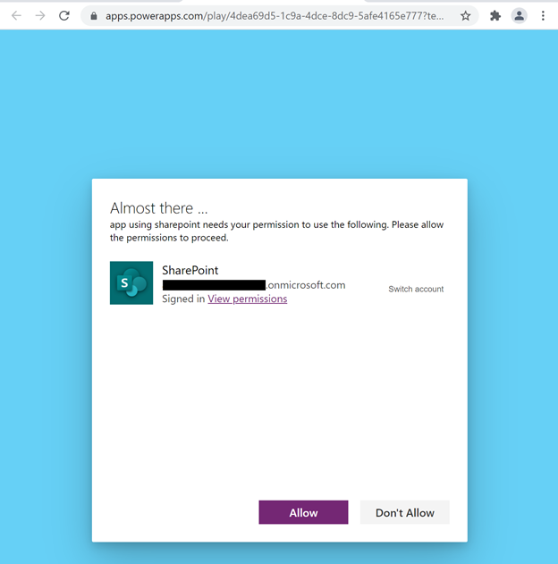

# Overview of connectors for canvas apps

Data is at the core of most apps, including those you build in Power Apps. Data is stored in a *data source*, and you bring that data into your app by creating a *connection*. The connection uses a specific *connector* to talk to the data source. Power Apps has connectors for many popular services and on-premises data sources, including SharePoint, SQL Server, Office 365, Salesforce, and Twitter. To get started adding data to a canvas app, see [Add a data connection in Power Apps](add-data-connection.md).

A connector may provide **tables** of data or **actions**. Some connectors provide only tables, some provide only actions, and some provide both. Also your connector may be either a standard or custom connector.

## Tables

If your connector provides tables, you add your data source and then select the table in the data source that you want to manage. Power Apps both retrieves table data into your app and updates data in your data source for you. For example, you can add a data source that contains a table named **Lessons** and then set the **Items** property of a control, such as a gallery or a form, to this value in the formula bar:

 

You can specify the data that your app retrieves by customizing the **Items** property of the control that shows your data. Continuing the previous example, you can sort or filter the data in the **Lessons** table by using that name as an argument for the **Search** and **SortByColumn** functions. In this graphic, the formula to which the **Items** property is set specifies that the data is sorted and filtered based on the text in **TextSearchBox1**. 

 

For more information about how to customize your formula with tables, see these topics:

  [Understand data sources in Power Apps](working-with-data-sources.md)  
  [Generate an app from Excel data](get-started-create-from-data.md)  
  [Create an app from scratch](get-started-create-from-blank.md) 
  [Understand tables and records in Power Apps](working-with-tables.md)

  > [!NOTE]
  > To connect to data in an Excel workbook, it must be hosted in a cloud-storage service such as OneDrive. For more information, see [Connect to cloud-storage from Power Apps](connections/cloud-storage-blob-connections.md).

## Actions

If your connector provides actions, you must still select your data source as you did before. Instead of selecting a table as the next step, however, you manually connect a control to an action by editing the **Items** property of the control that will show your data. The formula to which you set the **Items** property specifies the action that retrieves data. For example, the app won't retrieve any data if you connect to Yammer and then set the **Items** property to the name of the data source. To populate a control with data, specify an action such as **GetMessagesInGroup(5033622).messages**.

If you need to handle custom data updates for action connectors, build a formula that includes the **Patch** function. In the formula, identify the action and the fields that you'll bind to the action.  

For more information about how to customize your formula for custom updates, see these topics:

[Patch](functions/function-patch.md) [Collect](functions/function-clear-collect-clearcollect.md) [Update](functions/function-update-updateif.md)

> [!NOTE]
>  **Power Apps doesn't work with dynamic schema**. The phrase dynamic schema refers to the possibility that the same action may return a different table with different columns. Conditions that may cause the columns in the tables to differ include the action input parameters, the user or role that's executing the action, and the group in which the user is working, among others. For example, SQL Server stored procedures may return different columns if run with different inputs. For actions with dynamic schema, the connector documentation shows **The outputs of this operation are dynamic.** as the return value. In contrast, Power Automate works with dynamic schema and might provide a work-around for your scenario.

## Popular connectors

This table has links to more information about our most popular connectors. For a complete list of connectors, see [All connectors](/connectors/connector-reference/).

| &nbsp; | &nbsp; | &nbsp; | &nbsp; | &nbsp; |
| --- | --- | --- | --- | --- |
|  |[**Microsoft Dataverse**](connections/connection-common-data-service.md) |&nbsp; | |[**Cloud storage**](connections/cloud-storage-blob-connections.md) ** |
|  |[**Dynamics AX**](connections/connection-dynamicsax.md)|&nbsp; | |[**Excel**](connections/connection-excel.md)|
|  |[**Microsoft Translator**](connections/connection-microsoft-translator.md)|&nbsp; |  |[**Office 365 Outlook**](connections/connection-office365-outlook.md)|
|  |[**Office 365 Users**](connections/connection-office365-users.md)  |&nbsp; |  |[**Oracle**](connections/connection-oracledb.md)|
|  |[**Power BI**](connections/connection-powerbi.md) |&nbsp; |  |[**SharePoint**](connections/connection-sharepoint-online.md) |
|  |[**SQL Server**](connections/connection-azure-sqldatabase.md) |&nbsp; |  |[**Twitter**](connections/connection-twitter.md) |

** Applies to Azure Blob, Box, Dropbox, Google Drive, OneDrive and OneDrive for Business

## Standard and custom connectors
Power Apps provides *standard* connectors for many commonly used data sources. If Power Apps has a standard connector for the type of data source that you want to use, you should use that connector. If you want to connect to other types of data sources, such as a service that you've built, see [Register and use custom connectors](../canvas-apps/register-custom-api.md).

## All standard connectors
Standard connectors do not require special licensing. For more information, see [Power Apps Plans](https://powerapps.microsoft.com/pricing/).

You can ask questions about a specific connector in the [Power Apps forums](https://powerusers.microsoft.com/t5/PowerApps-Community/ct-p/PowerApps1), and you can suggest connectors to add or other improvements to make in [Power Apps Ideas](https://powerusers.microsoft.com/t5/PowerApps-Ideas/idb-p/PowerAppsIdeas).

## Security and types of authentication

As you author your app and create a connection to a data source, you may see that your choice of connector allows you to use different ways to authenticate. For instance, the SQL Server connector allows you to use Azure AD Integrated, SQL Server Authentication, and Windows Authentication. Each type of authentication has different levels of security associated with it.  It's important to understand what information and rights you share with users who use your application. The primary example in this article is SQL Server, however the principles apply to all types of connections.

> [!NOTE]
> For detailed information about security considerations when using a relational database servers (such as Microsoft SQL Server, or Oracle) as the data source for an app, see [Use Microsoft SQL Server securely with Power Apps](connections\sql-server-security.md).

### Azure AD Integrated

This is a secure type of connection.  For example, SharePoint uses this type of authentication.  SQL Server also allows for this type of authentication.  When you connect, the Azure AD service identifies you separately to SharePoint on your behalf.  You do not have to supply a username or password.  As an author you can create and work with the data source with your credentials.  When you publish your application and your application user logs in, they do so with their credentials. If the data is appropriately secured on a back-end your users can only see what they are authorized to see based on their credentials.   This type of security allows you to change rights for specific application users on the back-end data source after the application has been published.  For instance you can grant access, deny access, or refine what a user or set of users can see all on the back-end data source.

### Open-standard authorization (OAuth)

This type of connection is also secure.  For example Twitter uses this type of authentication.  When you connect you must supply your user name and password.  As an author you can create and work with the data source with your credentials.  When you publish your application and your application user logs in, they must also supply their credentials.  Therefore this type of connection is secure as your users must use their own credentials to access the data source service. 

### SQL User name and password authentication

This type of connection is not very secure because it does not rely on end-user authentication. **It should only be used in cases where you can safely assume that everyone who has access to this connection can see and use all of the data to which the connection provides access.**  You cannot reliably lock down portions of the data accessible within the connection. For instance, if the connection allows access to a single table, you cannot rely on a userID to filter only to only see data for that specific user within that table. For a reliable security, use more secure connection such as [Azure AD Integrated](#azure-ad-integrated).  

In SQL Server, this type of connection is called **SQL Server Authentication**.  Many other database data sources provide a similar capability.  When you publish your application, your users do not need to supply a unique user name and password.  They are using the user name and password you supply when you author the application.  The connection authentication to the data source is **Implicitly Shared** with your users.  Once the application is published, the connection is also published and available to your users.  Your end users can also create applications using any connection using SQL Server authentication that is shared with them.  Your users cannot see the user name or password, but the connection will be available to them.  **There are valid scenarios for this type of connection. For instance if you have a read-only database that is available to everyone in the company. Reference data scenarios (for example, a corporate calendar) can be useful for this kind of connection.**

### Windows Authentication

This type of connection is not very secure because it doesn't rely on end-user authentication. Use Windows authentication when you need to connect to a data source that is **on-premises**. An example of this type of connection is to an on-premises server that has a SQL Server. The connection must go through a gateway. Since it goes through a gateway, the connector has access to all of the data on that data source. As a result, any information that you can access with the Windows credentials you supply are available to the connector. And once the application is published, the connection is also published and available to your users.  This means that your end users can also create applications using this same connection and access the data on that machine. Connections to the data source are also **Implicitly Shared** with users that the app is shared with. This type of connection may be valid when your data source only lives on an on-premises server and the data on that source is freely shareable.

## Data sources in solutions

Solutions are used for [application lifecycle management](/power-platform/alm/overview-alm) and provide additional capabilities for managing the lifecycle of **data sources**. If a canvas app is a solution, [connection references](/maker/data-platform/create-connection-reference) and [environment variables](/maker/data-platform/environmentvariables) may be created to store information about the data sources. This ensures data sources can be changed or re-established when solutions are migrated to different environments. 

## Rename data sources in apps

To learn about renaming data sources in an app, and the difference between tabular and action-based data sources, go to [Rename Power Apps action-based data sources](rename-data-source.md).

## Connection consent dialog

When users first launch an app using connectors, users are presented with a ‘connection consent’ dialog which serves four purposes: 
1.	it informs users of the data sources accessed by the app, 
2.	it outlines actions a connector may perform in an app, e.g. when an app uses the Office 365 Users connector it presents: 

“This app will be able to: 
- Read your full user profile
- Read the full profile of all users

It won't be able to:
- Modify or delete any user-profile information”

3.	it captures end-user consent to connect to those data sources
4.	it facilitates manual end-user authentication, when needed.
For some connections, Power Platform can automatically authenticate a user to access a data source, however, if the automatic sign in fails this dialog prompts users to fix a connection by manually signing in. Power Platform can only attempt automatic sign in for a connection when a data source pre-authorizes Microsoft’s Azure API connections service principal, granting it permission to perform single sign-on for a user when a connection is created. For more details on single sign-on see ‘[What is single sign-on (SSO)?](https://docs.microsoft.com/azure/active-directory/manage-apps/what-is-single-sign-on)”. The following image is an example of the connection consent dialog for an app connecting to SharePoint.  

For select connectors, admins can suppress this dialog and consent on behalf of end-users to connect to a data source. The following table illustrates which types of connectors the consent dialog may be suppressed for an app. 

> [!NOTE]
> If an admin suppresses the consent dialog but the platform can’t perform single-sign-on for an end-user, the dialog will be presented to the user when they launch the app. 

| # | Connector type                                                                                                                                           | Consent dialog suppressible? | Reference               |
|---|----------------------------------------------------------------------------------------------------------------------------------------------------------|------------------------------|-------------------------|
| 1 | Microsoft First Party connectors that support single sign on (e.g. SharePoint, Office 365 users)                                                         | Yes                          | [Power Apps admin cmdlet](https://docs.microsoft.com/powershell/module/microsoft.powerapps.administration.powershell/set-adminpowerappapistobypassconsent) |
| 2 | Connector accessing a non-Microsoft, 3rd party service, e.g. Salesforce                                                                                  | No                           | N/A                     |
| 3 | Custom connectors using OAuth with Azure AD as the identity provider. These are custom connectors built by Contoso and only accessible by Contoso users. | No                           | N/A                     |

Microsoft Power Platform is only able to suppress the consent dialog for connections to data sources where: 

1.	there isn’t an obligation by the data source to show an explicit consent UI
2.	the data source pre-authorizes Microsoft’s Azure API connections service principal to enable single-sign-on 
3.	an admin configures an app to suppress the consent for the preceding connections. 

The pre-authorization of Microsoft’s Azure API connections service principal exists for Microsoft First Party data sources and may be configured by custom applications registered in an Azure AD tenant that are used by custom connectors. An admin manages consent suppression on a per app basis (as opposed to connector basis) so suppression is managed at the most granular app experience level – this prevents consent suppression for an organization’s ‘approved apps’ from inadvertently suppressing consent for ‘un-reviewed/unapproved’ apps. 

[!INCLUDE[footer-include](../../includes/footer-banner.md)]
