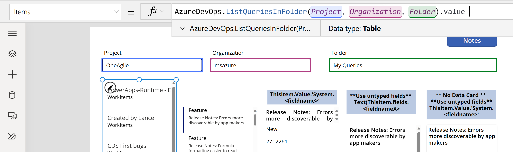
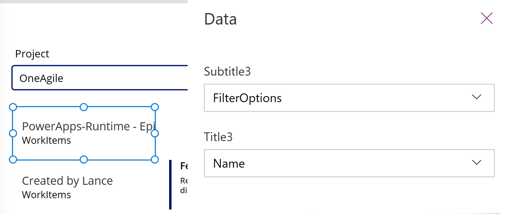
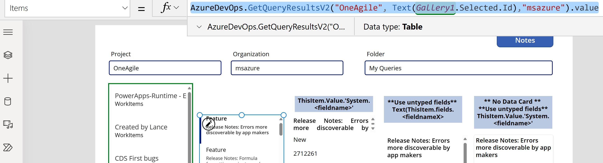
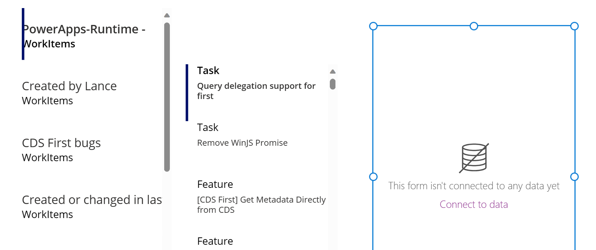
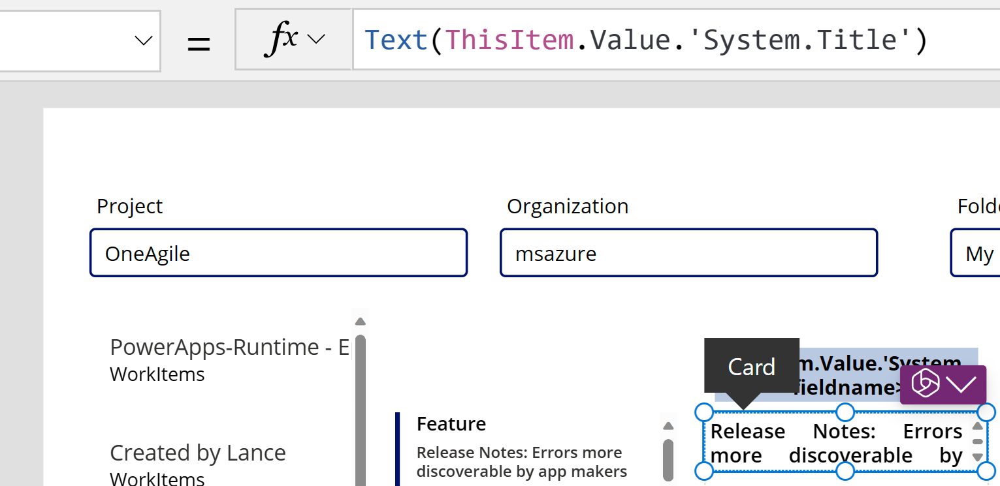

# Connect to Azure DevOps from Power Apps

Power Apps connector for [Azure DevOps](/connectors/visualstudioteamservices/) allows you to work with Azure DevOps instance. You can view Azure DevOps queries, select work items based on different work item types, and view, or edit details all from inside a canvas app that connects to Azure DevOps.

> [!TIP]
> For a complete list of all actions, see [Azure DevOps connector actions](/connectors/visualstudioteamservices/#actions).

The objective of this article is to guide you in building a canvas app that can connect with Azure DevOps to gather a list of queries and interact with the work items in the project.

## Prerequisites

The following requirements are necessary:

- A Power Apps license. If you don't have a license, use a [30-day trial](../../signup-for-powerapps.md), or sign up for a [developer plan](../../developer-plan.md) for non-production use.
- If you're new to Power Apps, familiarize yourself with Power Apps basics by [generating an app](../get-started-test-drive.md) and then customizing that app's [controls](../add-configure-controls.md), [gallery](../add-gallery.md), [forms](../working-with-forms.md), and [cards](../working-with-cards.md).
- A [blank canvas app](../create-blank-app.md) to use to connect to Azure DevOps.
- To create the app featured in this article, you'll require an  [Azure DevOps](/azure/devops/user-guide/what-is-azure-devops) instance that includes an organization, a project, and a shared query with a few sample work items available for editing.
- The Azure DevOps instance must be enabled for **Third-party application access via OAuth**. For more information, see [Manage access policies for Azure DevOps](/azure/devops/organizations/accounts/change-application-access-policies#manage-a-policy).

## Step 1 - Add Azure DevOps data source

To connect to Azure DevOps, [edit](../edit-app.md) the [blank canvas app](../create-blank-app.md), and add **Azure DevOps** data source.

> [!div class="mx-imgBorder"]
>

If you don't have an Azure DevOps connection already, select **Connect** and follow the prompts to provide your details, and then allow the app to connect.

## Step 2 - List shared queries

In this section, we'll use the [ListQueriesInFolder](/connectors/visualstudioteamservices/#list-queries-within-folder) action for the Azure DevOps connector to list the available queries.

1. From the left pane, select **Insert** > **Layout** > **Blank vertical gallery**.

1. Enter the following formula for the **Items** property of the gallery, replacing the example parameter values as appropriate.

    ```power-fx
    AzureDevOps.ListQueriesInFolder("Project","Organization","Folder").value
    ```


> [!div class="mx-imgBorder"]
>

If the example uses the variables "Project", "Organization", and "Folder" and the actual values are in the text boxes below the formula bar (highlighted). You can find your Project and Organization values from the URL used to connect to Azure Dev Ops.  The Folder will usually be "Shared Queries" or "My Queries".

> [!div class="mx-imgBorder"]
>

If you get the following error in the above formula, [enable third-party app access using OAuth](/azure/devops/organizations/accounts/change-application-access-policies#manage-a-policy) in your Azure DevOps organization, and try again.<br>
"AzureDevOps.ListQueriesInFolder failed:{"status":401,"message":"TF400813:The user 'GUID' isn't authorized to access this resource."}

1. Select the **Layout** for the gallery to **Title and subtitle**.

1. Choose the fields appropriate for Azure Dev Ops as **Name** and **FolderOptions** for the title and subtitles.

> [!div class="mx-imgBorder"]
>

## Step 3 - List work items

Now we use [GetQueryResultsV2](/connectors/visualstudioteamservices/#get-query-results) action for the Azure DevOps connector to list all work items for the selected query. This binds the gallery to the data source.

1. Insert another blank vertical gallery, and place it on the right-side of the existing gallery.

1. Enter the following formula for the **Items** property of the gallery, replacing the example parameter values as appropriate.  Substitute your Project and Organization names as appropriate.

    ```power-fx
    AzureDevOps.GetQueryResultsV2("Project", Text(Gallery1.Selected.Id),"Organization").value
    ```

> [!div class="mx-imgBorder"]
>

This formula uses the [GetQueryResultsV2](/connectors/visualstudioteamservices/#get-query-results) action with the project name, query ID, and the organization name. The query ID in this example (`Gallery2.Selected.Id`) refers to the query selected from the list of queries available through the gallery added earlier. Replace the gallery name as appropriate.


### Adding dynamic return values to your gallery
The returned result of **GetQueryResultsV2** is dynamic. And the values are therefore dynamic as well.

> [!div class="mx-imgBorder"]
> 

However you can access some of the values.  Azure Dev Ops returns a basic set of values for all items that are typed.  Select the data card in the gallery and insert two text label.  Set the text property of the labels as follows:

```power-fx
    ThisItem.Value.'System.WorkItemType'
    ThisItem.Value.'System.Title'
```

## Step 4 - Display work items

The app shows a list of all queries, and the list of work items for the selected query. Now we can add an edit form that we'll use to simply display data.

1. Arrange the two galleries on screen to make room for the edit form that we add by moving both galleries to the left of the screen.

1. Add **Edit form** to the screen, and move it to the right side of the galleries.

  > [!div class="mx-imgBorder"]
  > 


1. Set the **DataSource** property of the edit form to `AzureDevOps.GetQueryResultsV2("Project", Text(Gallery1.Selected.Id),"Organization").value`.  Substitute your Project and Organization names as appropriate.


1. Set the **Item** property of the edit form to `Gallery2.Selected`.

    This formula sets the **Item** property for the edit form to the work item that's selected in the list of work items.

1. Select **Edit fields** from the properties pane on the right-side of the screen.

1. Select **...** (ellipsis) > **Add a custom card**.

    

 
2. Rearrange the data card within the edit form at the top.

    :::image type="content" source="media/azure-devops/custom-card-top.png" alt-text="Custom card moved to the top section inside the edit form.":::

3. Keeping the custom card selected, insert a **Text input** control. Once selected, the control is added inside the custom card.

4. Increase the size of the text input control.

> [!div class="mx-imgBorder"]
>


5. Set the **Default** property of the text input control to `Text(ThisItem.Value.'System.Title')`. The Text function 'types' the return as Text.  

> [!div class="mx-imgBorder"]
> 

  This formula sets the default text inside the text input control to the **Title** field from the selected Azure DevOps work item.

> [!TIP]
> If your Azure DevOps project uses **Description** field with HTML or rich text, you can also use the [Rich text editor](../controls/control-richtexteditor.md) input control instead of the [Text input](../controls/control-text-input.md) or label controls. Using the **Rich text editor** control in this case also helps resolve any issues such as the description being displayed with HTML code instead of plain or rich text.

6. Repeat the previous steps to add another custom card, with a text input control inside with the **Default** property set to `Text(ThisItem.Value.'System.State')`.

    This formula sets the default text inside the text input control to the **State** field from the selected Azure DevOps work item.

7. Rearrange the data cards inside the edit form to create space where we'll add the save icon.

### Adding dynamic return values to your forms
So far we have been using the Edit form which simplifies the data access story by providing a common DataSource and Item property which all of the data cards in the form can work with.  If you use the Edit form, to access the dynamic values make sure you set **both** the data source and the item properties as follows: (Substituting in your values for Organization and Project.)

 ```power-fx
    AzureDevOps.GetWorkItemDetails(Gallery2.Selected.Value.'System.Id',Organization, Project, Gallery2.Selected.Value.'System.WorkItemType')
  ```
When you pass the text property "WorkItemType", for instance, "Feature", it allows you to switch from items such as Features and Work Items. Since the set of fields for these items differ from one another, the return type from this call is dynamic.

You can access specific values using the common method Text(ThisItem.Value.'System.Id'). Alternatively, you may access them through the more general dynamic response using Text(ThisItem.fields.System_Id). These dynamic value names are not typically documented. To find the correct names for these fields, including non-standard fields, open the monitor tool and examine the data response for the GetWorkItemDetails call. Refer to the image below for further guidance.

If you're not utilizing an Edit form, but instead using a container, then you can retrieve these values by using a formula such as the one below, which retrieves information from a custom team field.


```power-fx
Text(AzureDevOps.GetWorkItemDetails(Gallery2.Selected.Value.'System.Id',Organization, Project, Gallery2.Selected.Value.'System.WorkItemType').fields.One_custom_CustomField1)
```

> [!div class="mx-imgBorder"]
> 
>
> 
## Updating values in Azure DevOps

To update a value in Azure Dev ops use the UpdateWorkItem in the OnSelect of a button. 

```power-fx
AzureDevOps.UpdateWorkItem(
    Gallery2.Selected.Value.'System.Id', 
    Organization, 
    {   description: "This is a new description", 
        dynamicFields: ParseJSON(JSON({'Custom Field 1': "This is new custom text" })) 
    }
);
```
The formula adds new sample text but you can also use a PowerFx expression. 

Ensure that the formula uses lower case for the *non-custom* or built-in field names. For example, when referring to "Description" field, use `description: "This is a new description"` instead of `Description:"This is a new description"`. Incorrect casing might result in the error "400 Required parameter missing for requested operation: 'UpdateWorkItem'".  For custom / dynamic values, you can use the normal casing of display field. For instance the field name for the custom field is just the display name 'Custom Field 1'. This naming convention of the return values is specific to Azure DevOps and may differ from other services.


## Next steps

Play the app. Select a query from the list of queries. And then, choose a work item that you want to update the title or description of. Make a change, and then select the save button. The changes are saved to the Azure DevOps work item. Switch to another query and switch back to see the changes show inside the app.

Similarly, customize the app further or create an app with additional data cards on forms. You can also use display form instead of edit form to just show data inside different data cards. When using display form, ensure you use the [Text label](../controls/control-text-box.md) control to display text. When using rich text or HTML format (such as the **Description** field in Azure DevOps), use the [HTML text](../controls/control-html-text.md) control. For more information about customizing that app, see [controls](../add-configure-controls.md), [gallery](../add-gallery.md), [forms](../working-with-forms.md), and [cards](../working-with-cards.md).

### See also

[Working with dynamic schema data sources in Power Apps (experimental)](../working-with-dynamic-schema.md)

[!INCLUDE[footer-include](../../../includes/footer-banner.md)]
