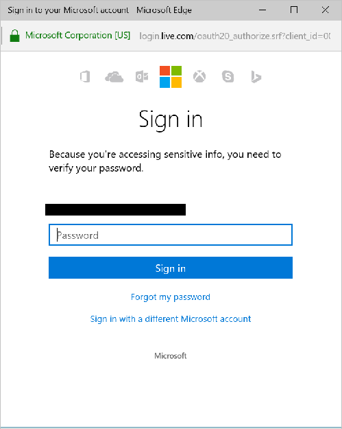
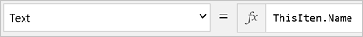

# Connect to cloud-storage from Power Apps

Power Apps offers several cloud-storage connections. Using any of these connections, you can store an Excel file and use the information in it throughout your app. These connections include:  

[Box](/connectors/box/) | [Dropbox](/connectors/dropbox/) | [Google Drive](/connectors/googledrive/) | [OneDrive](/connectors/onedrive/) | [OneDrive for Business](/connectors/onedriveforbusiness/) |
| --- | --- | --- | --- | --- |
|  | | |  | |

> [!NOTE]
> To learn about using Azure Blob Storage with Power Apps, go to [Connect to Azure Blob Storage from Power Apps](connection-azure-blob-storage.md).

[!INCLUDE [connection-requirements](../../../includes/connection-requirements.md)]

* An Excel file with the data [formatted as a table](https://support.office.com/article/Create-an-Excel-table-in-a-worksheet-E81AA349-B006-4F8A-9806-5AF9DF0AC664):
  
  1. Open the Excel file, and then select any cell in the data that you want to use.
  2. On the **Insert** tab, select **Table**.
  3. In the **Save as Table** dialog box, select the **My table has headers** checkbox, and then select **OK**.
  4. Save your changes.

## Connect to the cloud storage connection
1. At [powerapps.com](https://make.powerapps.com?utm_source=padocs&utm_medium=linkinadoc&utm_campaign=referralsfromdoc), expand **Manage**, and select **Connections**:  
   
    
2. Select **New connection**, and select your cloud storage connection. For example, select **OneDrive**.
3. You are prompted for the user name and password of your cloud storage account. Enter them, and then select **Sign in**:  
    
   
    Once you are signed in, this connection is ready to be used within your apps.
4. In your app, click or tap **Data sources** on the **View** tab of the ribbon. In the right-hand pane, click or tap **Add a data source**, click or tap your cloud-storage connection, and then choose the Excel table.
5. Select **Connect**.
   
    The table is listed as a data source:
   
    
   
    > [!NOTE]
   > Remember, the Excel data must be formatted as a table.

## Using the Excel data in your app
1. On the **Insert** tab, select **Gallery**, and then select a **With text** gallery control.
2. Set the **[Items](../controls/properties-core.md)** property of the gallery to your Excel table. For example, if your Excel table is named **Table1**, then set it to Table1:  
   
      
   
    The gallery is automatically updated with information from your Excel table.
3. In the gallery, select the second or third **Label** control. By default, you see the **Text** property of the second and third labels is automatically set to `ThisItem.something`. You can set these labels to any column in your table.
   
    In the following example, the second label is set to `ThisItem.Name` and the third label is set to `ThisItem.Notes`:  
   
      
   
      
   
    Sample output:  
    
   
> [!NOTE]
> The first box is actually an image control. If you don't have an image in your Excel table, then you can delete the image control, and add a label in its place. [Add and configure controls](../add-configure-controls.md) is a good resource.

[Understand tables and records](../working-with-tables.md) provides more details and some examples.  

## Sharing your app
You can share [your app](../share-app.md), [your resources](../share-app-resources.md) such as connectors, and [your data](../share-app-data.md) with others in your organization.

If you're sharing a folder in Dropbox, the shared folder must be attached to the user's Dropbox account.

There are [certain limitations](#sharing-excel-tables) with connectors involving Excel files.

## Known limitations

- If **Data type unsupported** or **Not formatted as a table** appears when you try to use an Excel connection in your app, [format the data as a table](https://support.office.com/article/Create-an-Excel-table-in-a-worksheet-E81AA349-B006-4F8A-9806-5AF9DF0AC664).

- If your Excel data includes a calculated column, you can't use it to build an app, and you can’t add that data to an existing app.

- Power Apps mobile app for Windows platform doesn't support **Dropbox** connector. A pop-up dialog will show the following message in this situation:  
  `Upgrade browser to use Dropbox`
  When this happens, consider using web player on Windows platform.

### Sharing Excel tables
To share data in an Excel file:

* In OneDrive for Business, share the file itself.
* In OneDrive, share the folder that contains the file, and specify file paths, not URLs, for any media.
* In Dropbox or Google Drive, share either the file or the folder.

## Helpful links
See all the [available connections](../connections-list.md).  
Learn how to [add connections](../add-manage-connections.md) and [add a data source](../add-data-connection.md) to your apps.  
[Understand tables and records](../working-with-tables.md) with tabular data sources.  
Some additional gallery resources include [Show a list of items](../add-gallery.md) and [Show images and text in a gallery](../show-images-text-gallery-sort-filter.md).

<!--Icon references-->
[boxicon]: ./media/cloud-storage-blob-connections/boxicon.png
[dropboxicon]: ./media/cloud-storage-blob-connections/dropboxicon.png
[googledriveicon]: ./media/cloud-storage-blob-connections/googledriveicon.png
[onedriveicon]: ./media/cloud-storage-blob-connections/onedriveicon.png
[onedriveforbusinessicon]: ./media/cloud-storage-blob-connections/onedriveforbusinessicon.png

[!INCLUDE[footer-include](../../../includes/footer-banner.md)]