# Connect to Azure Blob Storage from Power Apps

Power Apps can connect to [Azure Blob Storage](/azure/storage/blobs/storage-blobs-introduction). You can upload files such as Word, Excel, or multimedia images, audio or video using the [Azure Blob Storage connector for Power Apps](/connectors/azureblob/).

When you design a canvas app that connects to Azure Blob Storage, the app uses the blob storage account name and key to connect. After you share the app with others, users can use the connection configured inside the app to upload files to Azure Blob Storage without the need to share blob storage name and keys with the app users.

In this article, you'll learn how to create a sample canvas app that connects to Azure Blob Storage, and add controls to the app that allow you to upload different types of files to the connected blob storage.

> [!NOTE]
> To learn more about other types of cloud storage options with Power Apps (such as OneDrive, OneDrive for Business, Google Drive, Dropbox, or Box), go to [Connect to cloud storage from Power Apps](cloud-storage-blob-connections.md).

## Prerequisites

Before you begin, create and configure a [BlockBlobStorage account](/azure/storage/blobs/storage-blob-create-account-block-blob?tabs=azure-portal). You can also use legacy BlobStorage account, though not recommended. More information: [Types of storage accounts in Azure Blob Storage](/azure/storage/common/storage-account-overview)

## Create Azure Blob Storage connection

Power Apps requires a connection to Azure Blob Storage to be created for the app to connect to the storage.

To create the Azure Blob Storage connection:

1. Sign in to [Power Apps](https://make.powerapps.com).

1. On the left-pane, expand **Data**.

1. Select **Connections**.

1. Select **New connection**.

1. Select **Azure Blob Storage**.

    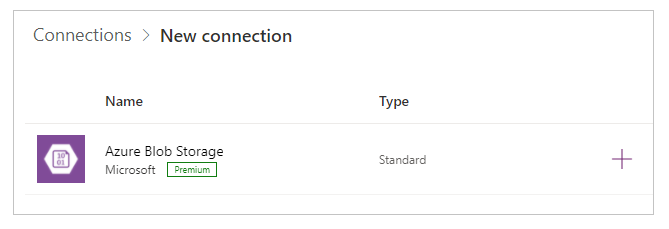

1. Copy and paste the account name, and access key.

    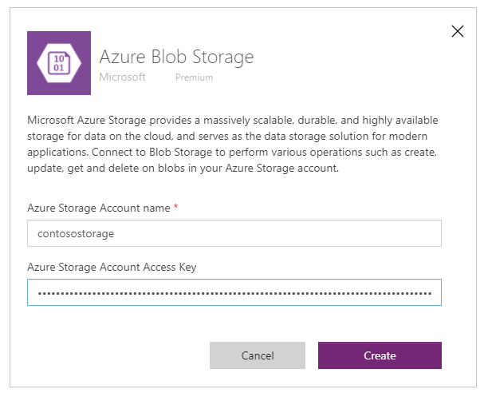

    For more information about how to copy account name and access key, go to [View account access keys in Azure](/azure/storage/common/storage-account-keys-manage?tabs=azure-portal#view-account-access-keys).

1. Select **Create**.

Your connection to the Azure Blob Storage is now configured and ready to use with canvas apps.

## Create canvas app with Azure Blob Storage connection

Now that you have the connection with Azure Blob Storage created, let's create a canvas app that connects to this storage.

> [!NOTE]
> In this section, you'll create a sample app with sample controls, functionality and layout design. Depending on your business requirement, you can create the app with a different structure, or customize differently.

1. Sign in to [Power Apps](https://make.powerapps.com).
1. On the left-pane, select **Create**.

1. Select **Canvas app from blank**.

1. Enter app name, such as "Sample app for Azure Blob Storage".

1. Select **Phone** layout.

1. Select **Create**.

1. Inside the Power Apps Studio, on the left-pane, select 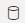.

1. Select **Add data**.

1. From the list of connectors, select **Azure Blob Storage**.

    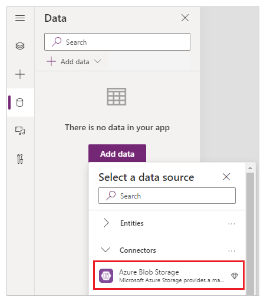

## View containers and files

Now that you have the app connected to Azure Blob Storage, let's add galleries to see containers and files within the containers from the connected storage.

1. Select **Insert** -> **Gallery** -> **Blank vertical**.

1. From the right-side of the screen, on the property pane, select the layout drop-down and choose **Title**.

    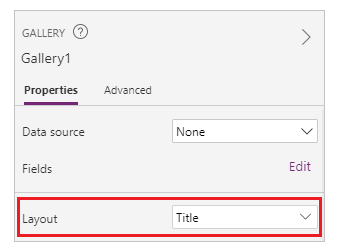

1. Select first  inside the gallery, and delete it.

    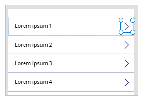

1. From the right-side of the screen, on the property pane, select the drop-down for data source, and choose **Azure Blob Storage**.

    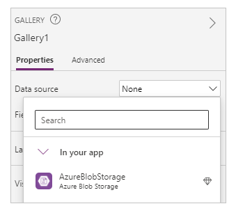

1. Set the **Items** property of the gallery to:

    ```powerapps-dot
    AzureBlobStorage.ListRootFolderV2().value
    ```

    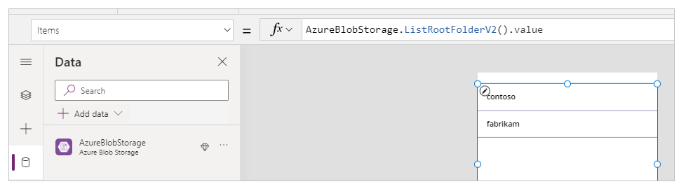

    This operation lists blobs in the Azure Blob Storage root folder. More information: [List blobs in root folder](/connectors/azureblob#list-blobs-in-root-folder)

1. Select **Insert** -> **Gallery** -> **Blank vertical** to add another blank vertical gallery.

1. Move the gallery below the gallery you added earlier that shows the list of containers.

1. From the right-side of the screen, on the property pane, select the layout drop-down and choose **Title, subtitle, and body**.

1. Select first  inside the gallery, and delete it.

1. From the right-side of the screen, on the property pane, select the drop-down for data source, and choose **Azure Blob Storage**.

1. Set the **Items** property of the gallery to:

    ```powerapps-dot
    AzureBlobStorage.ListFolderV2(Gallery1.Selected.Id).value
    ```
    This operation lists blobs in a container. More information: [List blobs](/connectors/azureblob#list-blobs) <br>
    
    > [!NOTE]
    > *Gallery1* in this formula is the reference to the gallery added earlier that lists all containers in the storage account. Update the formula with the gallery name if different.

1. From the right-side of the screen, on the property pane, select **Edit** for **Fields**.

1. Change the selected fields for the gallery title as **DisplayName**, subtitle as **LastModified**, and body as **Path**.

    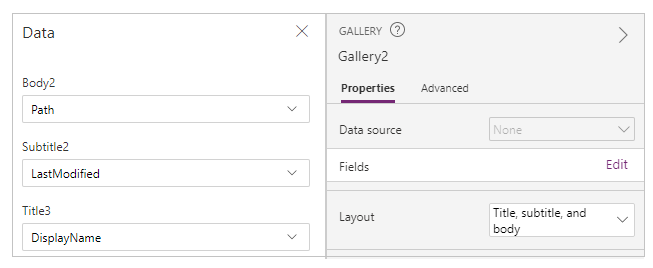

    The gallery now shows the list of files from the container selected using the gallery on the top.

    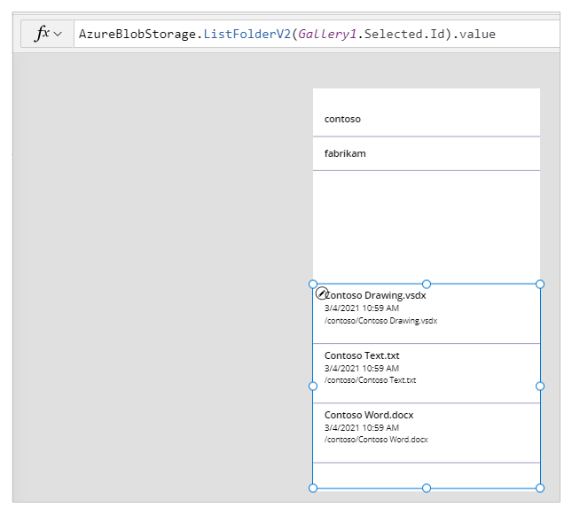

1. Select **Insert** -> **Text label**.

1. Place the label on top of the app screen.

1. Set the label's  **Text** property as "Select a container".

1. Use the properties pane on the right-side of the screen and choose the label text color, size, and label text background color of your choice.

1. Select **Insert** -> **Text label**.

1. Place the label above the gallery with the list of files.

1. Set the label's  **Text** property as "Files list".

    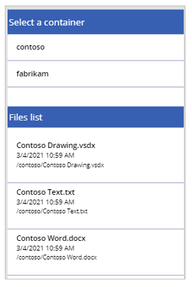

## Upload files to Azure Blob Storage

With the app design so far, you're able to select a container and then list the files from the container.

Let's configure the app with controls and logic to allow upload of files to the connected Azure Blob Storage.

1. Select **Insert** -> **Media** -> **Add picture** to add the ability to select files to upload.

1. Resize the **Add picture** control and place it on the bottom-left of the app screen.

1. Set the **Text** property of the control to "Select a file to upload".

1. Select **Insert** -> **Button**.

1. Place the button on bottom-right side of the app screen.

1. Set the **Text** property of the button to "Upload".

1. Select **Insert** -> **Text input**.

1. Place the text input control above the **Upload** button.

1. Set the **Default** property of the button to "Enter File Name".

1. Set the **OnSelect** property of the button to:

    ```powerapps-dot
    AzureBlobStorage.CreateFile(Gallery1.Selected.Name,TextInput1.Text, UploadedImage1.Image)
    ```

    This operation uploads a blob to Azure Blob Storage. More information: [Create blob](/connectors/azureblob#create-blob)

    > [!NOTE]
    > *Gallery1* in this formula is the reference to the gallery added earlier that lists all containers in the storage account. The file will be uploaded to the selected container in gallery 1. *TextInput1* and *uploadImage1* reference the text input and upload image controls. Update the formula with the control names if different.

    The app controls look like this in the sample app now.

    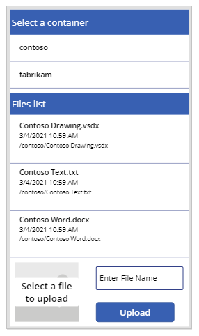

    > [!TIP]
    > Ensure you select **All files** when using the upload option to ensure all file types are visible in the file explorer dialog box.

## Download files from Azure Blob Storage

So far you've added the ability to view containers, files from the selected container, and the option to upload file to the storage. Now, let's understand how to work with the download capability with the connected storage.

1. Select the first row in the gallery with the list of files from a container.

    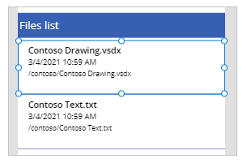

1. Select **Insert** -> **Icons** -> **Download**.
    This adds the download icon for all rows in the gallery.

1. Move the first download icon towards the right side inside the gallery on the app screen. This also moves rest of the icons for next rows in gallery.

    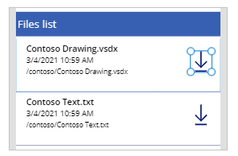

1. Set the **OnSelect** property of the download icon to:

    ```powerapps-dot
    Launch(AzureBlobStorage.CreateShareLinkByPath(ThisItem.Path).WebUrl)
    ```

    This operation creates a SAS link for a blob using the path. More information: [Create SAS URI by path](/connectors/azureblob#create-blob)

    > [!IMPORTANT]
    > SAS URI created using **CreateShareLinkByPath** has a [default expiry](/connectors/azureblob#create-sas-uri-by-path) of 24 hours. If you have a business requirement to expire the URI in a shorter or different time, consider updates to this formula. For example, the below sample expires the URI in 1 hour using [Now()](../functions/function-datevalue-timevalue.md) and [DateAdd()](../functions/function-dateadd-datediff.md) functions.
    
    ```powerapps-dot
    Launch(AzureBlobStorage.CreateShareLinkByPath(ThisItem.Path,{ExpiryTime:DateAdd( Now(),1)}).WebUrl)
    ```

    > [!TIP]
    > For more information about configuring Azure Blob Storage for public anonymous access, and different public access levels, go to [Configure anonymous public read access for containers and blobs](/azure/storage/blobs/anonymous-read-access-configure?tabs=portal).

The app now has the ability to allow you to download the files.

## Test, save, publish and share the app

Play the app to test, and verify the app works as expected. After the testing, ensure you [save and publish](../save-publish-app.md) the app before you close Power Apps Studio. And then, you can share the app with others [within your organization](../share-app.md), or [guests outside your organization](../share-app-guests.md).

## Optional customizations

In this section, you'll learn about optional and additional customizations that you can consider for your app.

### Media type

You can use **Media type**, or **Path** fields for the gallery to optionally display the image content in the respective controls. For example, [PDF viewer](../controls/control-pdf-viewer.md) for PDF files, [Image](../controls/control-image.md) for images, or [Audio/video](../controls/control-audio-video.md) for audio/video files.

For example, to filter the files with the file extension type of **.pdf**, use the following sample formula.

```powerapps-dot
If(".pdf" in Gallery2.Selected.Path, AzureBlobStorage.GetFileContent(Gallery2.Selected.Id))
```

Similarly, you can use different file extension types, or media types to additionally customize added controls.

### Refresh galleries connected to Azure Blob Storage

The Azure Blob Storage connection doesn't refresh data inside the galleries automatically when the data is updated. If you have more than one container, you can select the other container and then, select the previously selected container back to refresh the connected gallery to display the changes.

Another method that can be considered is to use collection for the first gallery, and then, use the function [ClearCollect](../functions/function-clear-collect-clearcollect.md) to refresh the collection.

For example, the following formulas allow you to update the collection for the top containers list in the first gallery, and update the second gallery when upload button is selected, or when the screen appears (OnVisible screen property).

1. Set the **Items** property of the first gallery for the list of containers to "TopLevelList".

1. Append to the upload button **OnSelect** property:

    ```powerapps-dot
    ClearCollect(TopLevelList, AzureBlobStorage.ListRootFolderV2().value)
    ```

3. Add to the screen **OnVisible** property:

    ```powerapps-dot
    ClearCollect(TopLevelList, AzureBlobStorage.ListRootFolderV2().value)
    ```

## Limitations

You can't use Microsoft Excel as the data source when the file is stored in Azure Blob Storage. To use Excel as the data source, use the other cloud storage connectors (such as OneDrive, OneDrive for Business, Google Drive, Dropbox, or Box). More information: [Connect to cloud storage from Power Apps](cloud-storage-blob-connections.md)

## Next steps

[Design the app interface](../add-configure-controls.md)

### See also

[Connect to cloud storage from Power Apps](cloud-storage-blob-connections.md)
