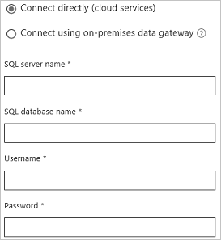

# Connect to SQL Server from Power Apps

Connect to SQL Server, in either Azure or an on-premises database, so that you can manage your data with create, read, update, and delete operations.

> [!NOTE] 
> Newly created SQL data sources are no longer prefixed with "[dbo]" as they have been in previous versions of Power Apps. See the [common issues and resolutions](../common-issues-and-resolutions.md) page for more information.

## Prerequisites

* [Sign up](../../signup-for-powerapps.md) for Power Apps, and then [sign in](https://make.powerapps.com?utm_source=padocs&utm_medium=linkinadoc&utm_campaign=referralsfromdoc) by providing the same credentials that you used to sign up.
* Gather the following information for a database that contains at least one table with a primary key:
  
  * the name of the database
  * the name of the server on which the database is hosted
  * a valid user name and password to connect to the database
  * the type of authentication needed to connect to the database
    
    If you don't have this information, ask the administrator of the database that you want to use.
* For an on-premises database, identify a [data gateway](../gateway-management.md) that was shared with you (or create one).

## Generate an app automatically
1. In Power Apps Studio, click or tap **New** on the **File** menu (along the left edge).
   
    
2. Under **Start with your data**, click or tap the right arrow at the end of the row of connectors.
3. If you already have a connection to the database that you want to use, click or tap it, and then skip to step 7 in this procedure.
4. Click or tap **New connection**, and then click or tap **SQL Server**.
   
    
5. Perform either of these steps:
   
   * Specify **Connect directly (cloud services)**, and then type or paste the server name, the database name, the user name, and the password for the database that you want to use.
     
       
   * Specify **Connect using on-premises data gateway**, type or paste the server name, the database name, the user name, and the password for the database that you want to use, and specify the authentication type and the gateway.
     
       
     
       > [!NOTE]
     > If you don't have a gateway, [install one](../gateway-reference.md), and then click or tap **Refresh gateway list**.
6. Click or tap **Connect**.
7. Click or tap an option under **Choose a dataset**, click or tap an option under **Choose a table**, and then click or tap **Connect**.
   
    Power Apps creates an app that shows data on three screens. Heuristics suggest what kind of data to show, but you might need to customize the UI to suit your needs.
8. Customize the app by using techniques that are similar to those that [Create an app from Excel](../get-started-create-from-data.md) describes, starting with changing the app layout.

## Build an app from scratch
1. Sign in to [powerapps.com](https://make.powerapps.com?utm_source=padocs&utm_medium=linkinadoc&utm_campaign=referralsfromdoc) with the same account that you used to sign up for Power Apps.
2. In the left navigation bar, click or tap **Connections**:  
   
    
3. In the upper-right corner, click or tap **New connection**, and then click or tap **SQL Server**.
4. Perform either of these steps:
   
   * Specify **Connect directly (cloud services)**, and then type or paste the server name, the database name, the user name, and the password for the database that you want to use.
     
       ")
   * Specify **Connect using on-premises data gateway**, type or paste the server name, the database name, the user name, and the password for the database that you want to use, and specify the authentication type and the gateway.
     
       
     
       > [!NOTE]
     > If you don't have a gateway, [install one](../gateway-reference.md), and then click or tap the clockwise icon to refresh the list.
5. Click or tap **Create** to create the connection.
6. Create an app by using techniques that are similar to those that [Create an app from scratch](../get-started-create-from-blank.md) describes.

## Update an existing app
1. In Power Apps Studio, open the app that you want to update.
2. Click or tap **Data sources** on the **View** tab of the ribbon.
3. In the right-hand pane, click or tap **Add a data source**.
   
    
4. Click or tap **New connection**, click or tap **SQL Server**, and then click or tap **Connect**.
5. Perform either of these steps:
   
   * Specify **Connect directly (cloud services)**, and then type or paste the server name, the database name, the user name, and the password for the database that you want to use.
     
       
   * Specify **Connect using on-premises data gateway**, type or paste the server name, the database name, the user name, and the password for the database that you want to use, and specify the authentication type and the gateway.
     
       
     
       > [!NOTE]
     > If you don't have a gateway, [install one](../gateway-reference.md), and then click or tap the circular icon to refresh the list.
6. Click or tap **Connect**.
7. Under **Choose a dataset**, click or tap an option.
8. Under **Choose a table**, select one or more checkboxes, and then click or tap **Connect**.

## Next steps
* Learn how to [show data from a data source](../add-gallery.md).
* Learn how to [view details and create or update records](../add-form.md).
* See other types of [data sources](../connections-list.md) to which you can connect.  
* [Understand tables and records](../working-with-tables.md) with tabular data sources.

<!--NotAvailableYet
## View the available functions ##
This connection includes the following functions:

| Function Name |  Description |
| --- | --- |
|[GetItems](connection-azure-sqldatabase.md#getitems) | Retrieves rows from a SQL table |
|[PostItem](connection-azure-sqldatabase.md#postitem) | Inserts a new row into a SQL table |
|[GetItem](connection-azure-sqldatabase.md#getitem) | Retrieves a single row from a SQL table |
|[DeleteItem](connection-azure-sqldatabase.md#deleteitem) | Deletes a row from a SQL table |
|[PatchItem](connection-azure-sqldatabase.md#patchitem) | Updates an existing row in a SQL table |
|[GetTables](connection-azure-sqldatabase.md#gettables) | Retrieves tables from a SQL database |

### GetItems
Get rows: Retrieves rows from a SQL table

#### Input properties

| Name| Data Type|Required|Description|
| ---|---|---|---|
|table|string|yes|Name of SQL table|
|$skip|integer|no|Number of entries to skip (default = 0)|
|$top|integer|no|Maximum number of entries to retrieve (default = 256)|
|$filter|string|no|An ODATA filter query to restrict the number of entries|
|$orderby|string|no|An ODATA orderBy query for specifying the order of entries|

### PostItem
Insert row: Inserts a new row into a SQL table

#### Input properties

| Name| Data Type|Required|Description|
| ---|---|---|---|
|table|string|yes|Name of SQL table|
|item| |yes|Row to insert into the specified table in SQL|

#### Output properties

| Property Name | Data Type | Required | Description |
|---|---|---|---|
|value|array|No | |

### GetItem
Get row: Retrieves a single row from a SQL table

#### Input properties

| Name| Data Type|Required|Description|
| ---|---|---|---|
|table|string|yes|Name of SQL table|
|id|string|yes|Unique identifier of the row to retrieve|

#### Output properties

| Property Name | Data Type | Required | Description |
|---|---|---|---|
|ItemInternalId|string|No | |

### DeleteItem
Delete row: Deletes a row from a SQL table

#### Input properties

| Name| Data Type|Required|Description|
| ---|---|---|---|
|table|string|yes|Name of SQL table|
|id|string|yes|Unique identifier of the row to delete|

#### Output properties
None.

### PatchItem
Update row: Updates an existing row in a SQL table

#### Input properties

| Name| Data Type|Required|Description|
| ---|---|---|---|
|table|string|yes|Name of SQL table|
|id|string|yes|Unique identifier of the row to update|
|item| |yes|Row with updated values|

#### Output properties

| Property Name | Data Type | Required | Description |
|---|---|---|---|
|ItemInternalId|string|No | &nbsp; |

### GetTables
Get tables: Retrieves tables from a SQL database

#### Input properties
None.

#### Output properties

| Property Name | Data Type | Required | Description |
|---|---|---|---|
|value|array|No | Can output the Name and DisplayName properties |

### ExecuteProcedure
Execute stored procedure: Executes a stored procedure in SQL

#### Input properties

| Name| Data Type|Required|Description|
| ---|---|---|---|
|procedure|string|yes|Procedure name|
|parameters| |yes|Input parameters|

#### Output properties
Result of the stored procedure execution.

| Property Name | Data Type | Required | Description |
|---|---|---|---|
|OutputParameters|object|No | Output parameter values |
|ReturnCode|integer|No | Return code of a procedure |
|ResultSets|object|No | Result sets|

-->

[!INCLUDE[footer-include](../../../includes/footer-banner.md)]
