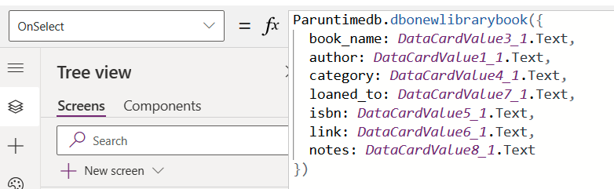

# Connect to SQL Server from Power Apps

You can connect to SQL Server in either Azure or an on-premises database.

> [!NOTE]
> Newly created SQL data sources are no longer prefixed with `[dbo]` like in previous versions of Power Apps.
>
> For more information, see [Common issues and resolutions for Power Apps](/troubleshoot/power-platform/power-apps/common-issues-and-resolutions).

## Generate an app automatically

Depending on which Power Apps interface you're using, reference the [new look](../intro-maker-portal.md?tabs=home-new-look) or the [classic look](../intro-maker-portal.md?tabs=home-classic) to build an app.

1. Sign in to [Power Apps](https://make.powerapps.com?utm_source=padocs&utm_medium=linkinadoc&utm_campaign=referralsfromdoc).
1. From the **Home** page, select either the _single-page gallery_ or _three screen mobile_ option:
   - To create a single-page gallery app with a responsive layout, choose either:
     - **Start with data** > **Select external data** > **From SQL**.
     - **Start with a page design** > **Gallery connected to external data** > **From SQL**.
   - To create a three screen mobile app, select **Start with an app template** > **From SQL**.
1. Select your SQL connection and then select a table. To choose a different connection, select the **...** overflow menu to switch your connection or create a new SQL connection.

   > [!NOTE]
   > Only one connection is shown at a time.
1. When you're done, select **Create app**.

## Call stored procedures directly in Power Fx (preview)

You can now directly call SQL Server stored procedures from Power Fx. By default, this **new** switch should be on. If not, you can turn it on.

1. Go to **Settings** > **Updates** > **New**.
1. Search for **stored procedures**.
1. Set the toggle to **On** for **SQL Server stored procedures**.
1. Save and reopen the app.

:::image type="content" source="media/connection-azure-sqldatabase/previewflag-call-sp-direct.png" alt-text="Screenshot that shows the SQL Server stored procedures toggle set to On.":::

When you add a SQL Server connection to your app, you can now add tables and views or stored procedures. This feature also works with secure implicit connections.

:::image type="content" source="media/connection-azure-sqldatabase/tables-views-stored-proc-selector.png" alt-text="Screenshot that shows lists of tables, views, and stored procedures available to be added to your app.":::

If you don't immediately see your stored procedure, it's faster to search for it.

Once you select a stored procedure, a child node appears and you can designate the stored procedure as **Safe to use for galleries and tables**. If you check this option, you can assign your stored procedure as an **Items** property for galleries for tables to use in your app.

Enable this option **only if**:

1. There are **no side effects** to calling this procedure on demand, multiple times, whenever Power Apps refreshes the control. When used with an **Items** property of a gallery or table, Power Apps calls the stored procedure whenever the system determines a refresh is needed. You can't control when the stored procedure is called.
2. The amount of data you return in the stored procedure is **modest**. Action calls, such as stored procedures, **do not have a limit on the number of rows retrieved**. They aren't automatically paged in 100 record increments like tabular data sources such as tables or views. So, if the stored procedure returns too much data (many thousands of records) then your app might slow down or crash. For performance reasons, you should bring in less than 2,000 records.

> [!IMPORTANT]
> The schema of the return values of the stored procedure should be **static**. Meaning that it doesn't change from call to call. For example, if you call a stored procedure and it returns two tables, then it should **always** return two tables. You can work with either typed or untyped results. The structure of the results need to be the same from call to call. If the schema of the results are **dynamic**, then results will be untyped and you will need to provide a type in order to use them in Power Apps. For more information, go to [Untyped results](#untyped-results).

### SQL namespace pre-pended to stored procedure name

The SQL Server namespace name that the stored procedure is stored in is pre-pended to the name of the stored procedure that is created for it in Power Apps. For example, all stored procedures in the **'DBO'** SQL Server namespace have the **'dbo'** at the start of the name.

## Example

When you add a stored procedure, you might see more than one data source in your project.

:::image type="content" source="media/connection-azure-sqldatabase/sqlserver-datasources.png" alt-text="Screenshot that shows SQL data sources.":::

### Calling a stored procedure

To use a stored procedure in Power Apps, first prefix the stored procedure name with the name of connector associated with it and the name the stored procedure. 'Paruntimedb.dbonewlibrarybook' in the example illustrates this pattern. When Power Apps brings the stored procedure in, it concatenates the namespace and the procedure name, and 'dbo.newlibrarybook' becomes 'dbonewlibrarybook'.  

Arguments are passed as a Power Apps record with named value pairs:

```powerapps-dot
<datasourceName>.<StoredprocedureName>({<paramName1: value, paramName2: value, ... >})
```

Remember to convert values as necessary as you pass them into your stored procedure as necessary since you're reading from a text value in Power Apps. For example, if you're updating an integer in SQL you must convert the text in the field using 'Value()'.



### Accessing results

A stored procedure can return a code, values from Out parameters or the results of queries. To access these results, use the following patterns:

#### Return code

```powerapps-dot
<datasourceName>.<StoredprocedureName>({<paramName1: value, paramName2: value, ... >}).ReturnCode
```

Use this for accessing the results of a return statement.

#### Output parameters

```powerapps-dot
<datasourceName>.<StoredprocedureName>({<paramName1: value, paramName2: value, ... >}).OutputParameters.<parameterName>
```

Take note to use the parameter name as it appears in the JSON payload.

#### Result Sets

```powerapps-dot
<datasourceName>.<StoredprocedureName>({<paramName1: value, paramName2: value, ... >}).ResultSets.Table1
```

Additional tables can be accessed via their name (for example, Table1, Table2, Table3, ... )

### Untyped results

Some complicated stored procedures return an untyped result. These results aren't accessible directly. You must first provide a type. You can access the data using the following pattern.

In this example, we first pull the results into a variable named "MyUntypedObject". Then we pull 'Table1' from that variable and put it into a variable named 'table1'. This step isn't strictly necessary. It's useful however to put all the results in a variable at a point in time and then pull out the parts you need. Then, we iterate through table1 and extract the JSON elements in named value pairs. Be sure to match the names with the names that are returned in the JSON payload. To validate, open a Power Apps monitor and look at the body section the data node for a record.

```powerapps-dot
Set(
    <MyUntypedObject>,
    <datasourceName>.<StoredprocedureName>( 
      { <paramName1>: "someString" }
    ).ResultSets
);
Set(
    table1,
    <MyUntypedObject>.Table1
);
Set(
    TypedTable,
    ForAll(
        table1,
        {
            BookID: Value(ThisRecord.BookID),
            BookName: Text(ThisRecord.BookName)
        }
    )
);

```

### Working with a gallery

You can access a stored procedure for the **Items** property of a gallery after you declare it safe for the UI. Reference the data source name and the name of the stored procedure followed by 'ResultSets'. You can access multiple results by referencing the set of tables returned such as Table 1, Table 2, etc.

For example, your access of a stored procedure off of a data source named 'Paruntimedb' with a stored procedure named 'dbo.spo_show_all_library_books()' will look like the following.

```powerapps-dot
Paruntimedb.dbospshowalllibrarybooks().ResultSets.Table1
```

This populates the gallery with records. However, stored procedures are an addition of **action** behaviors to the tabular model. Refresh() only works with tabular data sources and can't be used with stored procedures. Then you need to refresh the gallery when a record is created, updated, or deleted. When you use a Submit() on a form for a tabular data source, it effectively calls Refresh() under the covers and updates the gallery.

To get around this limitation, use a variable in the OnVisible property for the screen and set the stored procedure to the variable.

```powerapps-dot
Set(SP_Books, Paruntimedb.dbospshowalllibrarybooks().ResultSets.Table1);
```

And then set the 'Items' property of the gallery to the variable name.

```powerapps-dot
SP_Books
```

Then after you create, update, or delete a record with a call to the stored procedure, set the variable again. This updates the gallery.

```powerapps-dot
Paruntimedb.dbonewlibrarybook({   
  book_name: DataCardValue3_2.Text, 
  author: DataCardValue1_2.Text,
    ...
});
Set(SP_Books, Paruntimedb.dbospshowalllibrarybooks().ResultSets.Table1);
```

## Known issues

### SQL data sources no longer add a `[dbo]` prefix to the data source name

The `[dbo]` prefix doesn't serve any practical purpose in Power Apps as data source names are automatically disambiguated. Existing data sources aren't affected by this change, but any newly added SQL data sources don't include the prefix.

If you need to update a large number of formulas in one of your apps, the [Power Apps Source File Pack and Unpack Utility](https://powerapps.microsoft.com/blog/source-code-files-for-canvas-apps/) can be used to do a global search-and-replace.

> [!NOTE]
> Starting in version 3.21054, we'll automatically update broken legacy name references to the new data source name after reading the data source.

## Next steps

- Learn how to [show data from a data source](../add-gallery.md).
- Learn how to [view details and create or update records](../add-form.md).
- See other types of [data sources](../connections-list.md) to which you can connect.  
- [Understand tables and records](../working-with-tables.md) with tabular data sources.

[!INCLUDE[footer-include](../../../includes/footer-banner.md)]
