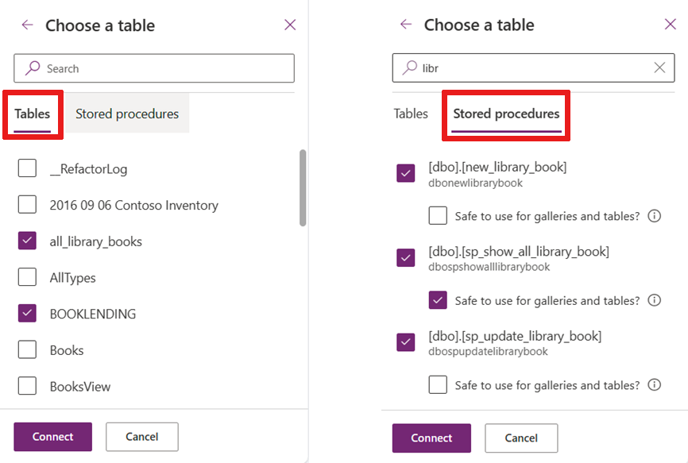

# Connect to SQL Server from Power Apps

Connect to SQL Server, in either Azure or an on-premises database. 

> [!NOTE]
> Newly created SQL data sources are no longer prefixed with "[dbo]" as they have been in previous versions of Power Apps. For more information, see the [common issues and resolutions](/troubleshoot/power-platform/power-apps/common-issues-and-resolutions) page.

## Generate an app automatically

Depending upon whether you have the [new look](../intro-maker-portal.md?tabs=home-new-look) or [classic look](../intro-maker-portal.md?tabs=home-classic) turned on, select the appropriate tab to know more.

1. Sign in to [Power Apps](https://make.powerapps.com?utm_source=padocs&utm_medium=linkinadoc&utm_campaign=referralsfromdoc).
2. Depending on how you want to create your app, from the home screen, select one of the following options:
   - To create a single-page gallery app with a responsive layout, choose either:
     - **Start with data** > **Connect to external data** > **From SQL**.
     - **Start with a page design** > **Gallery connected to external table** > **From SQL**.
   - To create a three screen mobile app, select **Start with an app template** > **From SQL**.
3. Select your SQL connection and then select a table. Note, that only one connection is shown at a time. To select a different connection, select on the **...** button to switch connection or create a new SQL connection.
4. When you're done, select **Create app**.

## Call stored procedures directly in Power Fx (Preview)
You can directly call SQL Server stored procedures from Power Fx. First you must turn on the SQL Server stored procedure preview switch. Navigate to Settings > Upcoming features > Preview. Search for "stored procedures" and turn on the preview switch as show in the image. 

With this feature turned you have the ability to add table, views, and stored procedures to your application. When you add a SQL Server connection to your app, you're presented a list of tables and views and also a list of stored procedures.

If you don't immediately see your stored procedure, it's faster to search for it. Notice that once you select a stored procedure a child node appears and you have the ability to designate the stored procedure as **Safe to use for galleries and tables**. If you check this option, you can assign your stored procedure as an Items property for galleries for tables. Only enable this option if:

1. There are no side effects to calling this procedure on demand, multiple times, whenever Power Apps decides it needs to refresh the control. When used with an Items property of a gallery or table, Power Apps calls the stored procedure whenever the system determines a refresh is needed.  You can't control when it's called.
2. The stored procedure returns less than the delegable limit (500/2000) of records. When a table or view is assigned to an Items property, Power Apps can control the paging and bring in 100 records at a time when it needs it. Stored procedures aren't pageable in the same way. They may be pageable via an argument to the stored procedure but you, as the author, are responsible for ensuring such behavior. Power Apps can't do this automatically like it can for tables and views.

### Example
When you add a stored procedure, you  may see more than one data source in your project.

* Access the stored procedure by prefixing the stored procedure name with the name of connector associated with it. Be sure to cast the values (e.g., to a number) as necessary as you a reading from a text value in Power Apps.

* To use a stored procedure in an Item property for a gallery or table simply use the stored procedure name in the same place where you would a table name.

## Known issues

### SQL data sources no longer adds a "[dbo]" prefix to the data source name

The "[dbo]" prefix doesn't serve any practical purpose in Power Apps as data source names are automatically disambiguated. Existing data sources aren't affected, but any newly added SQL data sources won't include the prefix. If you need to update a large number of formulas in one of your apps, the [Power Apps Source File Pack and Unpack Utility](https://powerapps.microsoft.com/blog/source-code-files-for-canvas-apps/) can be used to do a global search-and-replace.

Starting in version 3.21054, we'll automatically update broken legacy name references to the new data source name after reading the data source.

## Next steps

* Learn how to [show data from a data source](../add-gallery.md).
* Learn how to [view details and create or update records](../add-form.md).
* See other types of [data sources](../connections-list.md) to which you can connect.  
* [Understand tables and records](../working-with-tables.md) with tabular data sources.

[!INCLUDE[footer-include](../../../includes/footer-banner.md)]
