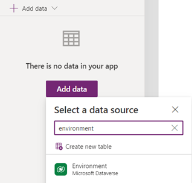
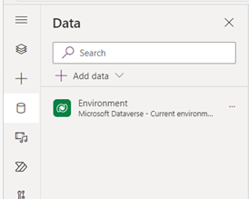
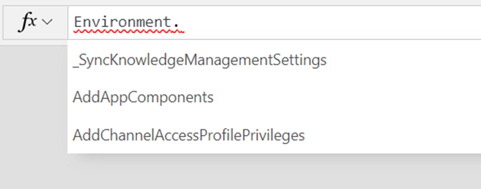
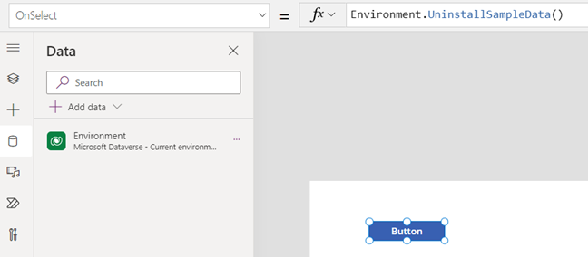

# Connect to Microsoft Dataverse

You can securely store your business data in Dataverse and build rich apps in Power Apps so that users can manage that data. You can also integrate that data into solutions that include Power Automate, Power BI, and data from Dynamics 365.

By default, the app connects to the current environment for Dataverse tables. If your app moves to another environment, the connector connects to data in the new environment. This behavior works well for an app using a single environment or an app that follows an application lifecycle management (ALM) process for moving from development, to test, and then to production.

When you add data from Dataverse, you can change the environment, and then select one or more tables. By default, the app connects to data in the current environment.


If you select **Change environment**, you can specify a different environment to pull data from it instead of or in addition to the current environment.


The name of the selected environment appears under the tables list.


## Visibility and access

When you select **Change environment**, you're presented with a list of environments. Though you might see an environment in the list, the security roles in the environment govern what you can do in that environment. For example, if you don't have read privileges, you aren't able to see the tables and records in the environment.

> [!NOTE]
> Connections listed in the app details pane outside of the app designer show connections that require user consent. Since native Dataverse connections used in the app don't require that additional consent, a native connection won't be in that list.


## Power Apps data type mappings

The Microsoft Dataverse connector is more robust than the Dynamics 365 connector and approaching feature parity. The following table lists the data types in Power Apps, and how they map to data types in Dataverse.

| Power Apps | Microsoft Dataverse                                                                                            |
|-----------------------------------|---------------------------------------------------------------------------------------------|
| Choice                            | Choice, Yes/No                                                                              |
| DateTime                          | Date Time, Date and Time, Date Only                                                         |
| Image                             | Image                                                                                       |
| Number                            | Floating Point Number, Currency, Decimal Number, Duration, Language, TimeZone, Whole Number |
| Text                              | Email, Multiline Text, Phone, Text, Text Area, Ticker Symbol, URL                           |
| Guid                              | Unique Identifier                                                                           |

## Power Apps delegable functions and operations for Dataverse

These Power Apps operations, for a given data type, might be delegated to
Dataverse for processing (rather than processing locally within Power Apps).

| **Item**                                                        | **Number [1]** | **Text [2]** | **Choice** | **DateTime [3]** | **Guid** |
|-----------------------------------------------------------------|----------------|--------------|------------|------------------|----------|
| \<, \<=, \>, \>=                                                | Yes            | Yes          | No         | Yes              | \-       |
| =, \<\>                                                         | Yes            | Yes          | Yes        | Yes              | Yes      |
| And/Or/Not                                                      | Yes            | Yes          | Yes        | Yes              | Yes      |
| CountRows [4] [5], CountIf [6]                                  | Yes            | Yes          | Yes        | Yes              | Yes      |
| Filter                                                          | Yes            | Yes          | Yes        | Yes              | Yes      |
| First [7]                                                       | Yes            | Yes          | Yes        | Yes              | Yes      |
| In (membership) [8]                                             | Yes            | Yes          | Yes        | Yes              | Yes      |
| In (substring)                                                  | \-             | Yes          | \-         | \-               | \-       |
| IsBlank [9]                                                     | Yes            | Yes          | No         | Yes              | Yes      |
| Lookup                                                          | Yes            | Yes          | Yes        | Yes              | Yes      |
| Search                                                          | No             | Yes          | No         | No               | \-       |
| Sort                                                            | Yes            | Yes          | Yes        | Yes              | \-       |
| SortByColumns                                                   | Yes            | Yes          | Yes        | Yes              | \-       |
| StartsWith                                                      | \-             | Yes          | \-         | \-               | \-       |
| Sum, Min, Max, Avg [6]                                          | Yes            | \-           | \-         | No               | \-       |
| UpdateIf/RemoveIf [10]                                          | Yes            | \-           | \-         | No               | \-       |

### Notes
1.  Numeric with arithmetic expressions (for example, `Filter(table, field + 10 > 100)` ) aren't delegable. Language and TimeZone aren't delegable. Casting to a column to a number isn't supported. When a value appears as a number in Power Apps but the back-end data source isn't a simple number such as currency then it isn't delegated.
2.  Doesn't support Trim[Ends] or Len. Does support other functions such as Left, Mid, Right, Upper, Lower, Replace, Substitute, etc. Also, casting such as Text(column) isn't supported for delegation.
3.  DateTime is delegable except for DateTime functions Now() and
    Today().
4.  CountRows on Dataverse uses a cached value. For non-cached values where the record count is expected to be under 50,000 records, use `CountIf(table, True)`.  
5.  For CountRows, ensure that users have appropriate permissions to get totals for the table. 
6.  All aggregate functions are limited to a collection of 50,000 rows. If needed, use the Filter function to select 50,000.  Aggregate functions aren't supported on Views.  
7.  FirstN isn't supported.
8.  `In` is subject to the 15 table query limit of Dataverse.
9.  Supports comparisons. For example, `Filter(TableName, MyCol = Blank())`.
10. UpdateIf and RemoveIf work locally but simulate delegation to a limit of 500/2000 records. They successively bring down records beyond the non-delegation 500/2000 record limit. Records that meet the If condition are collected. Generally, a maximum of 500/2000 records are collected separately and then changed per execution. However, more records may be updated if the existing local data cache is large as the function may have access to more records for evaluation.

## Call Dataverse actions directly in Power Fx

As a part of the Power Fx language, authors can now directly invoke a Dataverse action within a formula. Both unbound and bound actions are supported. Authors can add a Power Fx `Environment` language object to their app and access Dataverse actions.

Authors can work with untyped object fields for both inputs and outputs. On the input side, for instance, many Dataverse actions require an untyped object as an argument. Authors can now pass these arguments in by using ParseJSON to convert a Power Fx record into an untyped object. On the output side, for actions that return untyped objects, you can simply `dot` into returned objects properties. You need to cast specific values for use in specific contexts for use in Power Apps such as a label.

Without this feature, it was common for authors to use Power Automate to call Dataverse directly. However, calling Dataverse directly from Power Fx provides significant performance benefits (and ease of use) and should be preferred for direct transactional reads and updates. If you have an app that uses Power Automate to call Dataverse actions, you see a banner suggesting you use this direct action approach instead.  

Working with untyped fields isn't restricted to Dataverse. It works for all types of connectors and provides basic ad-hoc dynamic schema support.

> [!NOTE]
> 1. We do not fully support DV actions in  Power Fx commanding (specific to any actions call with parameters.) 
> 2. We do not support direct references to an Entity or an Entity collections. 
> 3. For parameters of object type that are nested (2 or more levels deep), the second level attributes are treated required in PowerApps.

### Enable access to Microsoft Dataverse actions

For new apps, this feature is automatically enabled. For apps created previously, you need to enable access to Dataverse actions. 

For older apps, open your canvas app for editing and navigate to **Settings** > **Upcoming features** > **Retired** and enable Dataverse actions.

### Add the Power Fx Environment language object to your app

To use Dataverse actions in your Power Fx formulas, select **Add data** and search for **Environment** and add it to your application. 



This adds the Power Fx `Environment` language object to your application. 




### Accessing Dataverse actions 

When the Power Fx `Environment` object is added to your application, you can access Dataverse actions by adding `Environment` to your formula and then dotting into the actions.



Unbound Dataverse actions are peer level to tables and need the parenting scope of the **Environment** language object. All actions in your environment are available – both system level and custom. Both bound and unbound actions are available. The 2-level call limit was removed.



For more details on how to use Dataverse actions in your formulas, see [Working with untyped and dynamic objects](../untyped-and-dynamic-objects.md).

[!INCLUDE[footer-include](../../../includes/footer-banner.md)]

### Passing Entity type arguments for bound/unbound actions

To pass entity type arguments for Dataverse actions, start by setting the entity type argument value to a variable. Additionally, ensure that any missing values such as ***activityId** are filled in. This is particularly important for entities that do not have defined types in the swagger.

```power-fx
Set(MyArgVar, {
  name: first(systemUser).name, 
  Id: First(systemUser).Id 
  ... })
```

### Rename, refresh, and actions in other environments

You can rename an Environment by choosing the ellipses and selecting "Rename".  If you add a new Dataverse action in Dataverse and need Power Apps to see it, you can choose "Refresh".  And, if you need to use an action in a different environment you first need to change the environment and then once there, search for 'Environment', select and add it to your application.  
