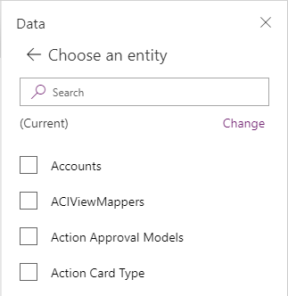
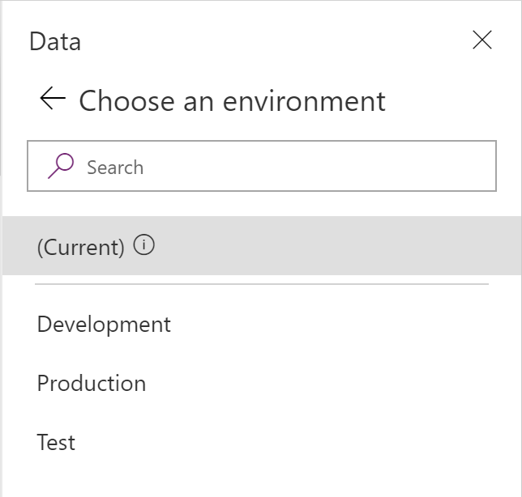
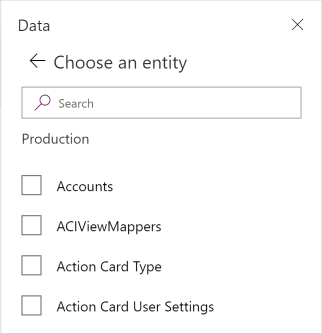

# Connect to Microsoft Dataverse

## Overview

You can securely store your business data in Dataverse and build rich apps in Power Apps so that users can manage that data. You can also integrate that data into solutions that include Power Automate, Power BI, and data from Dynamics 365.

By default, the app connects to the current environment for Dataverse tables. If your app moves to another environment, the connector connects to data in the new environment. This behavior works well for an app using a single environment or an app that follows an ALM process for moving from Development to Test to Production.

When you add a data from Dataverse, you can change the environment and then select one or more tables. By default, the app connects to data in the current environment.

If you select **Change**, you can specify a different environment to pull data from it instead of or in addition to the current environment.

The name of the selected environment appears under the tables list.

## Power Apps data type mappings

The Microsoft Dataverse connector is more robust than the Dynamics 365 connector and approaching feature parity. The following table lists the data types in Power Apps, and how they map to data types in Dataverse.

| Power Apps | Microsoft Dataverse                                                                                            |
|-----------------------------------|---------------------------------------------------------------------------------------------|
| Choice                            | Choice, Yes/No                                                                              |
| DateTime                          | Date Time, Date and Time, Date Only                                                         |
| Image                             | Image                                                                                       |
| Number                            | Floating Point Number, Currency, Decimal Number, Duration, Language, TimeZone, Whole Number |
| Text                              | Email, Multiline Text, Phone, Text, Text Area, Ticker Symbol, URL                           |
| Guid                              | Unique Identifier                                                                           |

## Power Apps delegable functions and operations for Dataverse

These Power Apps operations, for a given data type, may be delegated to
Dataverse for processing (rather than processing locally within Power Apps).

| **Item**                                                        | **Number [1]** | **Text [2]** | **Choice** | **DateTime [3]** | **Guid** |
|-----------------------------------------------------------------|----------------|--------------|------------|------------------|----------|
| Filter                                                          | Yes            | Yes          | Yes        | Yes              | Yes      |
| Sort                                                            | Yes            | Yes          | No         | Yes              | \-       |
| SortByColumns                                                   | Yes            | Yes          | No         | Yes              | \-       |
| Lookup                                                          | Yes            | Yes          | Yes        | Yes              | Yes      |
| =, \<\>                                                         | Yes            | Yes          | Yes        | Yes              | Yes      |
| \<, \<=, \>, \>=                                                | Yes            | Yes          | No         | Yes              | \-       |
| And/Or/Not                                                      | Yes            | Yes          | Yes        | Yes              | Yes      |
| StartsWith                                                      | \-             | Yes          | \-         | \-               | \-       |
| IsBlank                                                         | Yes [4]        | Yes [4]      | No [4]     | Yes [4]          | Yes      |
| Sum, Min, Max, Avg                                              | Yes [5]        | \-           | \-         | No               | \-       |

1.  Numeric with arithmetic expressions (for example, Filter(table, field + 10
    \> 100) ) aren't delegable. Language and TimeZone aren't delegable.

2.  Doesn't support Trim[Ends] or Len. Does support other functions such as
    Left, Mid, Right, Upper, Lower, Replace, Substitute, etc.

3.  DateTime is generally delegatable except for DateTime functions Now() and
    Today().

4.  Supports comparisons. For example, Filter(TableName, MyCol = Blank()).

5.  The aggregate functions are limited to a collection of 50,000 rows. If
    needed, use the Filter function to select 50,000 rows from a larger set
    before using the aggregate function.

> [!NOTE]
> Choices, Guids, and Aggregate functions for Dataverse are supported only with
the new version of the connector. Depending on the version of Power Apps that
you're using, enable this connector with either the Preview switch titled:
> - **Relational data, choices, and other new features for Dataverse**  
> or this Experimental switch:
> - **Use the Dataverse connector**  
> To find these switches, open the **File menu**, and then select **App settings** \> **Advanced settings**.

## Dataverse and the improved data source experience

If you created a canvas app with a Microsoft Dataverse connector prior to November 2019, then you might not have the benefit of the most current version of the Dataverse. Read [Dataverse connection improvements](../use-native-cds-connector.md) for more details and to upgrade your connection.

[!INCLUDE[footer-include](../../../includes/footer-banner.md)]