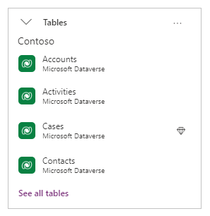

# Connect to Microsoft Dataverse

## Overview

You can securely store your business data in Dataverse and build rich apps in Power Apps so that users can manage that data. You can also integrate that data into solutions that include Power Automate, Power BI, and data from Dynamics 365.

By default, the app connects to the current environment for Dataverse tables. If your app moves to another environment, the connector connects to data in the new environment. This behavior works well for an app using a single environment or an app that follows an ALM process for moving from Development to Test to Production.

When you add data from Dataverse, you can change the environment, and then select one or more tables. By default, the app connects to data in the current environment.

If you select **Change environment**, you can specify a different environment to pull data from it instead of or in addition to the current environment.

The name of the selected environment appears under the tables list.

## Visibility and access

When you select **Change environment**, you're presented with a list of environments. Though you might see an environment in the list, the security role(s) in the environment govern what you can do in that environment. For example, if you don't have read privileges, you won't be able to see the tables and records in the environment.

## Power Apps data type mappings

The Microsoft Dataverse connector is more robust than the Dynamics 365 connector and approaching feature parity. The following table lists the data types in Power Apps, and how they map to data types in Dataverse.

| Power Apps | Microsoft Dataverse                                                                                            |
|-----------------------------------|---------------------------------------------------------------------------------------------|
| Choice                            | Choice, Yes/No                                                                              |
| DateTime                          | Date Time, Date and Time, Date Only                                                         |
| Image                             | Image                                                                                       |
| Number                            | Floating Point Number, Currency, Decimal Number, Duration, Language, TimeZone, Whole Number |
| Text                              | Email, Multiline Text, Phone, Text, Text Area, Ticker Symbol, URL                           |
| Guid                              | Unique Identifier                                                                           |

## Power Apps delegable functions and operations for Dataverse

These Power Apps operations, for a given data type, may be delegated to
Dataverse for processing (rather than processing locally within Power Apps).

| **Item**                                                        | **Number [1]** | **Text [2]** | **Choice** | **DateTime [3]** | **Guid** |
|-----------------------------------------------------------------|----------------|--------------|------------|------------------|----------|
| Filter                                                          | Yes            | Yes          | Yes        | Yes              | Yes      |
| Sort                                                            | Yes            | Yes          | Yes        | Yes              | \-       |
| SortByColumns                                                   | Yes            | Yes          | Yes        | Yes              | \-       |
| Lookup                                                          | Yes            | Yes          | Yes        | Yes              | Yes      |
| =, \<\>                                                         | Yes            | Yes          | Yes        | Yes              | Yes      |
| \<, \<=, \>, \>=                                                | Yes            | Yes          | No         | Yes              | \-       |
| In (substring)                                                  | \-             | Yes          | \-         | \-               | \-       |
| In (membership) (preview)                                       | Yes            | Yes          | Yes        | Yes              | Yes      |
| And/Or/Not                                                      | Yes            | Yes          | Yes        | Yes              | Yes      |
| StartsWith                                                      | \-             | Yes          | \-         | \-               | \-       |
| IsBlank                                                         | Yes [4]        | Yes [4]      | No [4]     | Yes [4]          | Yes      |
| Sum, Min, Max, Avg [5]                                          | Yes            | \-           | \-         | No               | \-       |
| CountRows [6] [7], CountIf [5]                                  | Yes            | Yes          | Yes        | Yes              | Yes      |

1.  Numeric with arithmetic expressions (for example, `Filter(table, field + 10 > 100)` ) aren't delegable. Language and TimeZone aren't delegable.

2.  Doesn't support Trim[Ends] or Len. Does support other functions such as
    Left, Mid, Right, Upper, Lower, Replace, Substitute, etc.

3.  DateTime is delegable except for DateTime functions Now() and
    Today().

4.  Supports comparisons. For example, `Filter(TableName, MyCol = Blank())`.

5.  The aggregate functions are limited to a collection of 50,000 rows. If
    needed, use the Filter function to select 50,000 

6.  CountRows on Dataverse uses a cached value. For non-cached values where the record count is expected to be under 50,000 records, use `CountIf(table, True)`.  

7.  For CountRows, ensure that users have appropriate permissions to get totals for the table. 

## Call Dataverse actions directly in Power Fx (Experimental)

[This section is pre-release documentation and is subject to change.]

> [!IMPORTANT]
> - This is an experimental feature.
> - Experimental features aren’t meant for production use and may have restricted functionality. These features are available before an official release so that customers can get early access and provide feedback.

As a part of the Power Fx language, authors can now directly invoke a Dataverse action within a formula. A new Power Fx `Environment` language object that authors can add to their app enables access to Dataverse actions. It is available with Power Apps release version 3.23022.

To enable access to Dataverse actions, open your canvas app for editing and go to **Settings** > **Upcoming features** > **Experimental** > **Enable access to Microsoft Dataverse actions** and set the toggle to **On**.

This feature update also allows authors to work with untyped object fields for both inputs and outputs, on the input side, for instance, many Dataverse actions require an untyped object as an argument. You can now pass these arguments in by using ParseJSON to convert a Power Fx record into an untyped object. On the output side, for actions that return untyped objects, you can simply `dot` into returned objects properties. You will need to cast specific values for use in specific contexts for use in Power Apps (such as a label.)

Without this feature, it has been common for authors to use Power Automate to call Dataverse directly. However, calling Dataverse directly from Power Fx provides significant performance benefits (and ease of use) and should be preferred for direct transactional reads and updates. 

Working with untyped fields is not restricted to Dataverse. It works for all types of connectors and provides basic ad-hoc dynamic schema support.

### Add the Power Fx Environment language object to your app

To use Dataverse actions in your Power Fx formulas, select **Add data** and search for **Environment** and add it to your application. 

This adds the Power Fx `Environment` language object to your application. 

### Accessing Dataverse actions 

When the Power Fx `Environment` object is added to your application, you can access Dataverse actions by adding `Environment` to your formula and then dotting into the actions.

Unbound Dataverse actions are peer level to tables and need the parenting scope of the **Environment** language object. All actions in your environment will be available – both system level and custom. Bound Dataverse actions, when supported, will be available by dotting into the table name.

### Passing in untyped objects

Some Dataverse actions require an untyped object as a parameter value.  If you have a Power Fx record, you can convert it to an untyped object so that it can be passed into a Dataverse action.

In the example below `TargetObject` is assigned a Power Fx record with the properties of name, accountid, and @odata.type. 

`Set (TargetObject, {name: "Test 2", accountid: "145dc2ba-85a2-ed11-aado-0022482d76a5", '@odata.type': "Microsoft.Dynamics.CRM.account"});` 

`TargetObject` can be converted to an untyped object by using ParseJSON on it. 

Note, that this example requires that you first enable the ParseJSON function.   

`Set (TargetUntypedObject, ParseJSON(JSON(TargetObject)));`

Then you can use the variable `TargetUntypedObject` directly in a Dataverse action as a parameter. 

### Using untyped object returned via an action

When a Dataverse actions returns an object you can directly access the object's properties although the values are untyped. To use a property, you will need to cast it for specific use in Power Apps such as label. For instance, in the example below, the httpRequest returns an object.

`Set (response, Office365Groups.HttpRequest("/v1.0/me", "GET", "");` 

DisplayName is one of the properties in the response. It can be accessed, and cast, with a Power Fx expression like the following:

`Text(response.displayName)`

In the example above, the displayName is being cast to type Text for use (for example) in a label.

[!INCLUDE[footer-include](../../../includes/footer-banner.md)]
