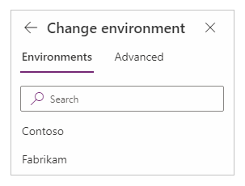

# Connect to Common Data Service

You can securely store your business data in Common Data Service and build rich apps in PowerApps so that users can manage that data. You can also integrate that data into solutions that include Microsoft Flow, Power BI, and data from Dynamics 365.

By default, the Common Data Service connector connects to data in your app's current environment. If your app moves to another environment, the connector connects to data in the new environment. This behavior works well for an app using a single environment or an app that follows an ALM process for moving from Development to Test to Production.

When you add a data source with the Common Data Service connector, you can change the environment and then select one or more entities. By default, the app connects to data in the current environment, and the UI shows **(Current)** over the list of entities.

> [!div class="mx-imgBorder"]
> 

If you select **Change**, you can specify a different environment to pull data from it instead of or in addition to the current environment.

> [!div class="mx-imgBorder"]
> 

The name of the selected environment appears under the search box.

> [!div class="mx-imgBorder"]
> 

The Common Data Service connector is more robust than the Dynamics 365 connector and approaching feature parity.

More information: [What is Common Data Service?](../../common-data-service/data-platform-intro.md)
