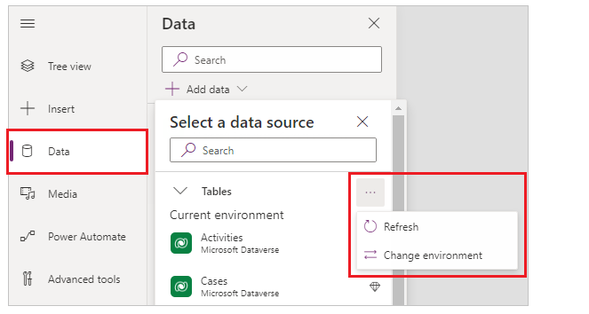

# Connect to Microsoft Dataverse

[!INCLUDE[cc-data-platform-banner](../../../includes/cc-data-platform-banner.md)]

## Overview

You can securely store your business data in Dataverse and build rich apps in Power Apps so that users can manage that data. You can also integrate that data into solutions that include Power Automate, Power BI, and data from Dynamics 365.

By default, the Common Data Service connector connects to data in your app's current environment. If your app moves to another environment, the connector connects to data in the new environment. This behavior works well for an app using a single environment or an app that follows an ALM process for moving from Development to Test to Production.

When you add a data source with the Common Data Service connector, you can change the environment and then select one or more entities. By default, the app connects to data in the current environment.

If you select **Change**, you can specify a different environment to pull data from it instead of or in addition to the current environment.

The name of the selected environment appears under the entities list.

The Common Data Service connector is more robust than the Dynamics 365 connector and approaching feature parity.

### Dataverse and the improved data source experience

If you created a canvas app with a Common Data Service connector prior to November 2019, then you might not have the benefit of the most current version of the Dataverse. Read [Dataverse connection improvements](../use-native-cds-connector.md) for more details and to upgrade your connection.

[!INCLUDE[footer-include](../../../includes/footer-banner.md)]