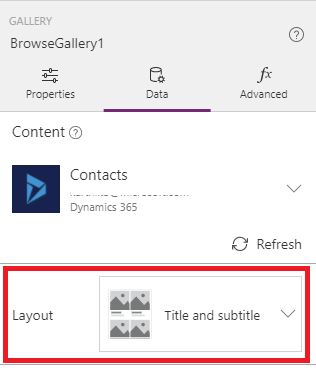

# Connect to Dynamics 365 from PowerApps
PowerApps lets you quickly generate, customize, share, and run mobile apps with little or no code. By using the Dynamics 365 connector, you can create useful mobile apps to share with your organization in just a few minutes.

By following the steps in this topic, you'll create an app in which users can browse, add, delete, and make updates to contacts in Dynamics 365. Users can run the app [in a browser](../../../user/run-app-browser.md) or [on a mobile device](../../../user/run-app-client.md) such as a phone.

## Prerequisite
To follow this tutorial, you need a Microsoft Office 365 account that includes a Dynamics 365 subscription.

## Create a connection
1. [Sign in to PowerApps](https://web.powerapps.com?utm_source=padocs&utm_medium=linkinadoc&utm_campaign=referralsfromdoc).
2. In the left navigation pane, click **Connections**.
   
    
3. Near the upper-right corner, click **New connection**.
   
    
4. In the list of connections, click **Dynamics 365**.
   
    
5. In the dialog box, click **Create**.
   
    
6. In the **Sign in to your account** dialog box, provide your credentials for the Dynamics 365 (online) tenant.
   
    A connection is created.

## Generate an app automatically
1. [Sign in to PowerApps](https://web.powerapps.com?utm_source=padocs&utm_medium=linkinadoc&utm_campaign=referralsfromdoc), and then click **New app** near the lower-left corner.
   
    
2. Under **Start with your data**, click **Phone layout** on the **Dynamics 365** tile.
   
    
3. Under **Connections**, select the connection that you want, and then choose a dataset, which corresponds to the instance of Dynamics 365 that you'll manage in the app.
4. Under **Choose a table**, click **Contacts**, and then click **Connect**.
5. In the left navigation bar, click or tap an icon in the upper-right corner to switch to the thumbnail view.
   
    

PowerApps generates a three-screen app based on contact records.

* **BrowseScreen1**. This screen appears by default when users open the app. In the left navigation bar, a thumbnail for this screen appears above the other two screens.
* **DetailScreen1**. This screen appears when users click an item in **BrowseScreen1**.  In the left navigation bar, a thumbnail for **DetailScreen1** appears between the other two screens.
* **EditScreen1**. This screen appears when users click the edit icon for an item in **DetailScreen1**. In the left navigation bar, a thumbnail for **EditScreen1** appears under the other two screens.

The app can run in its initial state, but we can make it more useful by refining the information on each screen.

## Customize BrowseScreen1
In this procedure, you'll configure **BrowseScreen1** to show the first and last names of each contact. The data will be sorted alphabetically by last name and include images in a two-column grid.

1. In **BrowseScreen1**, select the gallery by clicking any record in it except the first one.
   
    
2. In the right-hand pane, click or tap the **Data** tab.
3. In the list of layouts, click or tap the one that shows pictures and text in a two-column grid.
   
    You might need to scroll down to show this option.
   
    
4. Copy this formula and then, with the gallery still selected, paste the formula in the formula bar (to the right of the **fx** button):
   
    `SortByColumns(Search(Filter(Contacts,statuscode=1), TextSearchBox1.Text, "lastname"), "lastname", If(SortDescending1, Descending, Ascending))`
5. In the right-hand pane, set the top drop-down list to **firstname** and the middle drop-down list to **lastname**.
   
    
6. (optional) On the **File** menu, click **Save as**, type a name for the app, and then click **Save**.
   
    By default, the app will be saved to the cloud. Click **This computer** to save your app locally.

## Customize DetailsScreen1 and EditScreen1
1. In the left navigation bar, click the middle thumbnail to select **DetailsScreen1**.
2. On **DetailScreen1**, click anywhere below the title bar to show customization options in the right-hand pane.
   
    
3. In the right-hand pane, click the eye icon for each field to hide it.
   
    
4. Click anywhere under the title bar to select **Form1**.
   
    
5. In the right-hand pane, click the eye icon for each of these fields, so that the screen will show an image (if the table contains one) and four other fields for each contact:
   
   * **entityimage**
   * **firstname**
   * **lastname**
   * **mobilephone**
   * **emailaddress1**
     
     The right-hand pane should resemble this graphic:
     
     
6. Select **EditScreen1** by clicking the bottom thumbnail in the left navigation bar.
7. Repeat the steps in this procedure to customize **EditScreen1** the same way as **DetailsScreen1**.
8. (optional) Save the app.

## Next steps
* Test your app in Preview mode by clicking **BrowseScreen1** in the left navigation bar and then pressing F5 or clicking  near the upper-right corner.
* [Share your app](../share-app.md).
* [Add a second data source](../add-data-connection.md).

