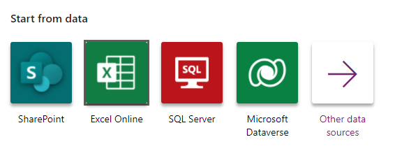
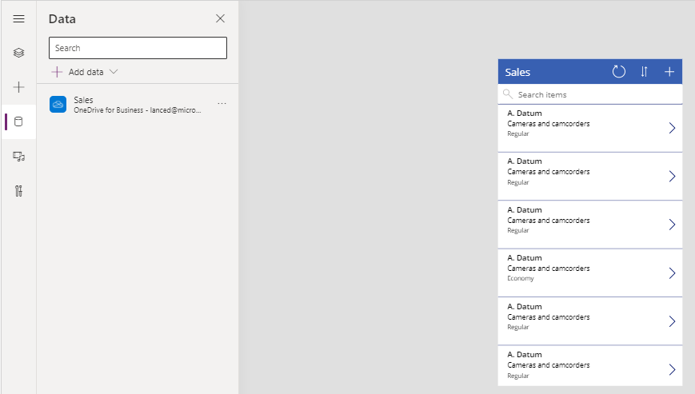
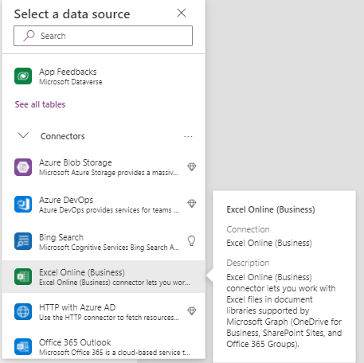
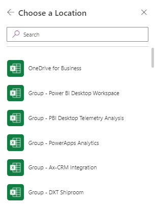
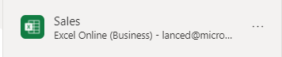

# Connect to Excel from Power Apps

Excel is *kind of* a connection which when added to Power Apps become a data source.

## 1. Format your data as a table in Excel

Ensure that the Excel data you want to use in Power Apps is [formatted as a table in Excel](https://support.office.com/article/Create-an-Excel-table-in-a-worksheet-E81AA349-B006-4F8A-9806-5AF9DF0AC664).

## 2. Store your Excel file in a cloud location

Store the Excel file in a cloud-storage account, such as Dropbox, Google Drive, OneDrive, and OneDrive for Business.  There are two versions of the Excel connector and the more recent one can access more cloud locations.

## 3. Add Excel as a data source for your Power App

There are currently two ways to add the Excel table as a data source in your application.  These two different approaches each uses a slightly different version of the connector.

### Start from Data

You can automatically add Excel and create a 3 screen application by choosing "Start from Data".

If you choose this route, you will use an older version of the connector. When you are finished you will have an application and in the Data Source window, you will see your data source has been added with a **OneDrive** connector.

> [!NOTE]
> When you add Excel as a data source, it may create a column called **\_PowerAppsId_**, with a unique ID for each row of your Excel table.

### Add new data source

You can create a blank application (or you can modify an existing one) and then choose to add a new Excel data source.

The Excel Online (Business) Connector allows users to work with Excel files in document libraries that are supported by Microsoft Graph (OneDrive for Business, SharePoint Sites [Preview], and Office 365 Groups).  

> [!NOTE]
> The ability to connect to SharePoint sites is still in Preview.  OneDrive is fully supported.

There were several limitations of the old Excel connector including the fact that only a single user could work with the Excel file at a time and that you could not access files on a a SharePoint Site [Preview].

The updated Excel Online (Business) Connector is faster, more robust, allows for multiple users, and can work with all standard document libraries (One Drive for Business, SharePoint Sites [Preview], and Office 365 Groups.)

To add Excel as a data source, find the **Excel Online (Business)** connector in the list of connectors.

The Excel Online (Business) connector allows you to choose from more locations to find your Excel file.  OneDrive is just one of them.  To find a file that is OneDrive, you will first need to navigate to OneDrive and then pick your Excel file.

> [!NOTE]
> When you add Excel as a data source, it may create a column called **\_PowerAppsId_**, with a unique ID for each row of your Excel table.  This is so that on updates, Power Apps knows which rows to change.  If you already have a unique identifier for each row, you may identify it for Power Apps as part of this process.

Once you have selected your Excel file, and then table within it, you will have added a new Excel data source to your application.  You can tell it uses the newer version of the connector as it has an Excel icon (not a OneDrive icon.)

If you want a **Start from Data** app but with the newer version of the connector, use the basic Start from Data process to create the application.  Then, drop the OneDrive Excel data source and then re-add the Excel data source using the new connector.  Because the names of the tables are the same and the file is the same, the Power App will simply connect to the updated data source and just work.

## Other connectors

For information about how to connect to other types of data, see the [list of connections for Power Apps](../connections-list.md).

## Known limitations

For information about how to share Excel data within your organization, [review these limitations](cloud-storage-blob-connections.md#sharing-excel-tables).

[!INCLUDE[footer-include](../../../includes/footer-banner.md)]
