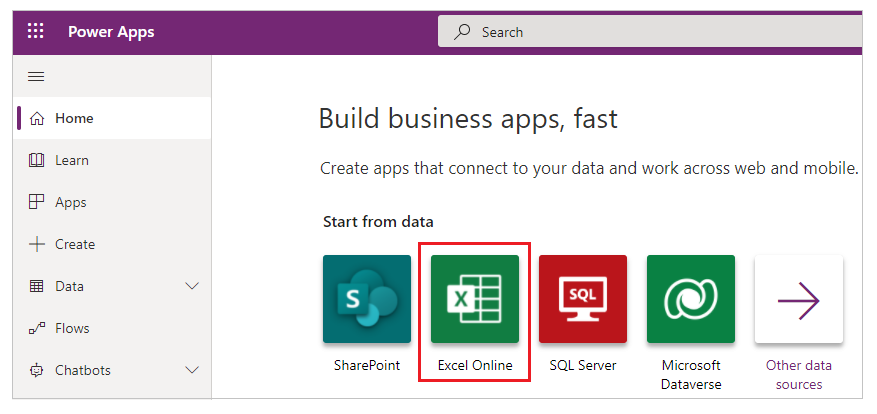
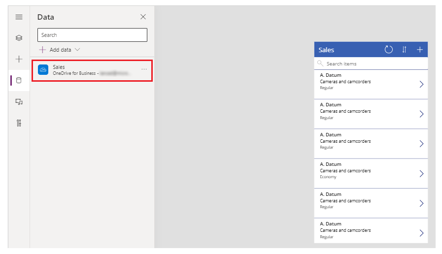
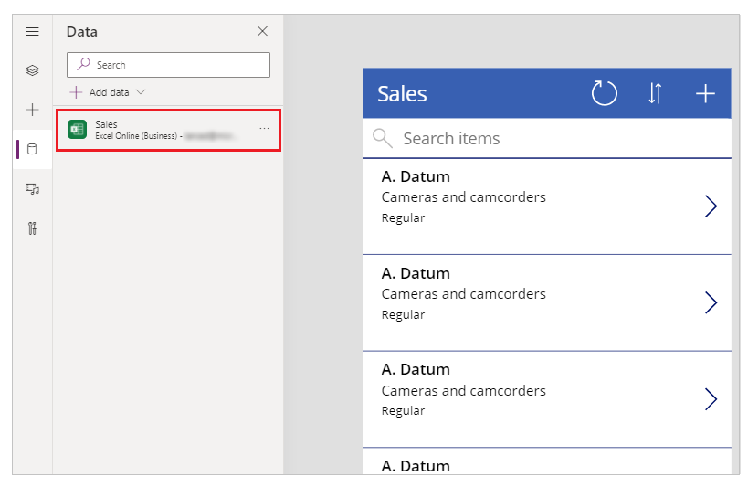
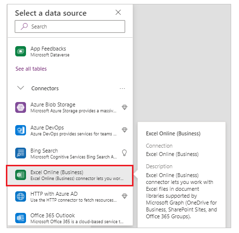
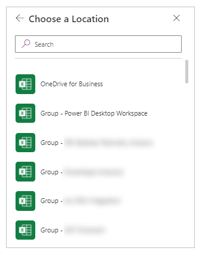

# Connect to Excel from Power Apps

Excel is a connection that becomes a data source when added to Power Apps. To connect to Excel from Power Apps, follow these three steps.

## Step 1 - Format your data as a table in Excel

Ensure that the Excel data you want to use in Power Apps is [formatted as a table in Excel](https://support.office.com/article/Create-an-Excel-table-in-a-worksheet-E81AA349-B006-4F8A-9806-5AF9DF0AC664).

## Step 2 - Store your Excel file in a cloud location

Store the Excel file in a cloud-storage account, such as Dropbox, Google Drive, OneDrive, and OneDrive for Business. There are two versions of the Excel connector. The newer version of the connector can access more cloud locations.

## Step 3 - Add Excel as a data source for your Power App

There are currently two ways to add the Excel table as a data source in your application. These two different approaches each uses a slightly different version of the connector.

> [!NOTE]
> - When you add Excel as a data source, it may create a column called **\_PowerAppsId_**, with a unique ID for each row of your Excel table. This column helps Power Apps know which rows to change. If you already have a unique identifier for each row, you may identify it for Power Apps as part of this process.
> - This article explains different methods to start creating an app using Excel, and how the different methods use different versions of the connector. However, for a detailed step-by-step instructions to create an app using Excel, see [Create a canvas app from scratch based on Excel data](../get-started-create-from-blank.md).

### Method 1 - Start from Data

> [!IMPORTANT]
> If you choose this method, you'll use an older version of the connector.

You can automatically add Excel and create a 3 screen application by choosing **Start from Data**.

When you're finished, you'll have an application and in the Data Source window, you'll see your data source has been added with a **OneDrive** connector.

#### Start from Data with new connector

If you want a **Start from Data** app but with the newer version of the connector, use the basic **Start from Data** process to create the application. Then, drop the OneDrive Excel data source, and then readd the Excel data source using the new connector. Because the names of the tables are the same and the file is the same, the Power Apps will  connect to the updated data source and work without any more changes required.

### Method 2 - Add new data source

> [!IMPORTANT]
> If you choose this method, you'll use updated version of the connector.

You can create a blank application (or you can modify an existing one) and then choose to add a new Excel data source.

The Excel Online (Business) Connector allows users to work with Excel files in document libraries that are supported by Microsoft Graph (OneDrive for Business, SharePoint sites, and Microsoft 365 Groups). There were several limitations of the old Excel connector including the fact that only a single user could work with the Excel file at a time and you couldn't access files on a SharePoint site.

The updated Excel Online (Business) Connector is faster, more robust, allows for multiple users, and can work with all standard document libraries (OneDrive for Business, SharePoint sites, and Microsoft 365 Groups.)

To add Excel as a data source, find the **Excel Online (Business)** connector in the list of connectors.

The Excel Online (Business) connector allows you to choose from more locations to find your Excel file. OneDrive is just one of them. To find a file that is OneDrive, go to OneDrive, and pick your Excel file.

Once you've selected your Excel file, and then table within it, you'll have added a new Excel data source to your application. You can verify the use of the newer version of the connector with the presence of an Excel icon, as opposed to a OneDrive icon for older connector version.

## Other connectors

For information about how to connect to other types of data, see the [list of connections for Power Apps](../connections-list.md).

## Known limitations

For information about how to share Excel data within your organization, [review these limitations](cloud-storage-blob-connections.md#sharing-excel-tables).

[!INCLUDE[footer-include](../../../includes/footer-banner.md)]
