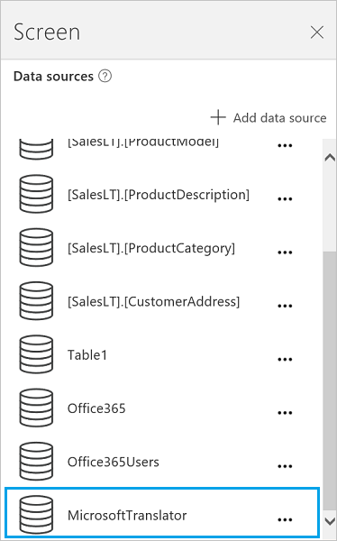

# Connect to Microsoft Translator from Power Apps

Add the Microsoft Translator connector to display translated text in a **Label** control in your app. For example, you can create an input text box that asks the user to enter some text to translate. In another label, you can display the translated text.

This topic shows you how to create the Microsoft Translator connection, use the Microsoft Translator connection in an app, and lists the available functions.

[!INCLUDE [connection-requirements](../../../includes/connection-requirements.md)]

## Connect to Microsoft Translator
1. Open Power Apps, select **New**, and then create a **Blank app**. Choose phone or tablet layout. Tablet layout gives you more workspace:  

   
2. In the right-hand pane, click or tap **Data** tab, and then click or tap **Add data source**.
3. Select **New connection**, and then select **Microsoft Translator**:  

    

    
4. Select **Connect**. Your connection appears under **Data sources**:  

    

## Use the Microsoft Translator connection in your app
### Translate text
1. On the **Insert** menu, select **Text**, and then select **Text input**. Rename the text input control to **Source**:  

    
2. Add a **Drop down** list (**Insert** menu > **Controls**), rename it to **TargetLang**, and move it below **Source**.
3. Set the **[Items](../controls/properties-core.md)** property of **TargetLang** to the following formula:  

    `MicrosoftTranslator.Languages()`
4. Add a label, move it below **TargetLang**, and set its **[Text](../controls/properties-core.md)** property to the following formula:  

    `MicrosoftTranslator.Translate(Source.Text, TargetLang.Selected.Value)`
5. Type some text into **Source**, and select a language in **TargetLang**. The label shows the text that you entered in the language you chose:  

    

### Speak translated text
If you haven't already, follow the steps in the previous section to translate some text. These next steps use the same controls.

1. Set the **[Items](../controls/properties-core.md)** property of the **TargetLang** drop-down list to the following formula:  

    `MicrosoftTranslator.SpeechLanguages()`
2. Rename the second label (not the **Source** box) to **Target**.
3. Add an **Audio** control (**Insert** menu > **Media**), and set its **Media** property to the following formula:  

    `MicrosoftTranslator.TextToSpeech(Target.Text, TargetLang.Selected.Value)`
4. Press F5, or select the Preview button (). Type some text into **Source**, select a language in **TargetLang**, and then select the play button in the audio control.

    The app plays an audio version of the text that you entered in the language you chose.
5. Press Esc to return to the default workspace.

### Detect the source language
These next steps use the same **Source** text input and **Target** text controls. You can create new controls if you prefer, just update the names in the formula.

1. Select the **Target** text control, and set the **[Text](../controls/properties-core.md)** property to the following formula:  

    `MicrosoftTranslator.Detect(Source.Text).Name`
2. Type some text into **Source**.

    The label shows you the language of the text that you typed. For example, the label shows **French** if you type **bonjour**, or **Italian** if you type **ciao**.

## View the available functions
This connection includes the following functions:

| Function Name | Description |
| --- | --- |
| [Languages](connection-microsoft-translator.md#languages) |Retrieves all languages that Microsoft Translator supports |
| [Translate](connection-microsoft-translator.md#translate) |Translates text to a specified language using Microsoft Translator |
| [Detect](connection-microsoft-translator.md#detect) |Detects source language of given text |
| [SpeechLanguages](connection-microsoft-translator.md#speechlanguages) |Retrieves the languages available for speech synthesis |
| [TextToSpeech](connection-microsoft-translator.md#texttospeech) |Converts a given text into speech as an audio stream in wave format |

### Languages
Get languages: Retrieves all languages that Microsoft Translator supports

#### Input properties
None.

#### Output properties

| Property Name | Data Type | Required | Description |
| --- | --- | --- | --- |
| Code |string |No | |
| Name |string |No | |

### Translate
Translate text: Translates text to a specified language using Microsoft Translator

#### Input properties

| Name | Data Type | Required | Description |
| --- | --- | --- | --- |
| query |string |yes |Text to translate |
| languageTo |string |yes |Target language code (example: 'fr') |
| languageFrom |string |no |Source language (if not provided, Microsoft Translator will try to auto-detect) (example: en) |
| category |string |no |Translation category (default: 'general') |

#### Output properties
None.

### Detect
Detect language: Detects source language of given text

#### Input properties

| Name | Data Type | Required | Description |
| --- | --- | --- | --- |
| query |string |yes |Text whose language will be identified |

#### Output properties

| Property Name | Data Type | Required | Description |
| --- | --- | --- | --- |
| Code |string |No | |
| Name |string |No | |

### SpeechLanguages
Get speech languages: Retrieves the languages available for speech synthesis

#### Input properties
None.

#### Output properties

| Property Name | Data Type | Required | Description |
| --- | --- | --- | --- |
| Code |string |No | |
| Name |string |No | |

### TextToSpeech
Text to speech: Converts a given text into speech as an audio stream in wave format

#### Input properties

| Name | Data Type | Required | Description |
| --- | --- | --- | --- |
| query |string |yes |Text to convert |
| language |string |yes |Language code to generate speech (example: 'en-us') |

#### Output properties
None.

## Helpful links
See all the [available connections](../connections-list.md).  
Learn how to [add connections](../add-manage-connections.md) to your apps.

[!INCLUDE[footer-include](../../../includes/footer-banner.md)]