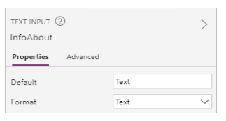

# Connect to Office 365 Users connection from Power Apps

Office 365 Users lets you access user profiles in your organization using your Office 365 account. You can perform various actions such as get your profile, a user's profile, a user's manager or direct reports.

You can display this information in a label on your app. You can display one function, multiple functions, or even combine different functions. For example, you can create an expression that combines the User Name and Phone Number, and then display this information in your app.

This article shows you how to add Office 365 Users as a connection, add Office 365 Users as a data source to your app, and use table data in a gallery control.

[!INCLUDE [connection-requirements](../../../includes/connection-requirements.md)]

## Add a connection

1. [Add a data connection](../add-data-connection.md) and select **Office 365 Users**:  

    
2. Select **Connect**, and if prompted to sign in, enter your work account.

The Office 365 Users connection has been created and added to your app. Now, it's ready to be used.

## Use the connection in your app
### Show information about the current user
1. On the **Insert** menu, select **Label**
2. In the function bar, set its **[Text](../controls/properties-core.md)** property to any of the following formulas:

   `Office365Users.MyProfile().City`  
   `Office365Users.MyProfile().CompanyName`  
   `Office365Users.MyProfile().Country`  
   `Office365Users.MyProfile().Department`  
   `Office365Users.MyProfile().DisplayName`  
   `Office365Users.MyProfile().GivenName`  
   `Office365Users.MyProfile().Id`  
   `Office365Users.MyProfile().JobTitle`  
   `Office365Users.MyProfile().Mail`  
   `Office365Users.MyProfile().MailNickname`  
   `Office365Users.MyProfile().mobilePhone`  
   `Office365Users.MyProfile().OfficeLocation`  
   `Office365Users.MyProfile().PostalCode`  
   `Office365Users.MyProfile().Surname`  
   `Office365Users.MyProfile().TelephoneNumber`  
   `Office365Users.MyProfile().UserPrincipalName`  
   `Office365Users.MyProfile().AccountEnabled`  

The label shows the information that you entered about the current user.

### Show information about another user
1. On the **Insert** menu, select **Text**, and then select **Text input**. Rename it **InfoAbout**:  

    
2. In **InfoAbout**, type or paste an email address of a user in your organization. For example, type in *yourName*@*yourCompany.com*.
3. Add a **Label** (**Insert** menu), and set its **[Text](../controls/properties-core.md)** property to any of the following formulas:

   * To show information about another user:  

     `Office365Users.UserProfile(InfoAbout.Text).City`  
     `Office365Users.UserProfile(InfoAbout.Text).CompanyName`  
     `Office365Users.UserProfile(InfoAbout.Text).Country`  
     `Office365Users.UserProfile(InfoAbout.Text).Department`  
     `Office365Users.UserProfile(InfoAbout.Text).DisplayName`  
     `Office365Users.UserProfile(InfoAbout.Text).GivenName`  
     `Office365Users.UserProfile(InfoAbout.Text).Id`  
     `Office365Users.UserProfile(InfoAbout.Text).JobTitle`  
     `Office365Users.UserProfile(InfoAbout.Text).Mail`  
     `Office365Users.UserProfile(InfoAbout.Text).MailNickname`  
     `Office365Users.UserProfile(InfoAbout.Text).mobilePhone`  
     `Office365Users.UserProfile(InfoAbout.Text).OfficeLocation`  
     `Office365Users.UserProfile(InfoAbout.Text).PostalCode`  
     `Office365Users.UserProfile(InfoAbout.Text).Surname`  
     `Office365Users.UserProfile(InfoAbout.Text).TelephoneNumber`  
     `Office365Users.UserProfile(InfoAbout.Text).UserPrincipalName`  
     `Office365Users.UserProfile(InfoAbout.Text).AccountEnabled`  
     `Office365Users.UserProfile(InfoAbout.Text).BusinessPhones`

   * To show information about another user's manager:  

     `Office365Users.Manager(InfoAbout.Text).City`  
     `Office365Users.Manager(InfoAbout.Text).CompanyName`  
     `Office365Users.Manager(InfoAbout.Text).Country`  
     `Office365Users.Manager(InfoAbout.Text).Department`  
     `Office365Users.Manager(InfoAbout.Text).DisplayName`  
     `Office365Users.Manager(InfoAbout.Text).GivenName`  
     `Office365Users.Manager(InfoAbout.Text).Id`  
     `Office365Users.Manager(InfoAbout.Text).JobTitle`  
     `Office365Users.Manager(InfoAbout.Text).Mail`  
     `Office365Users.Manager(InfoAbout.Text).MailNickname`  
     `Office365Users.Manager(InfoAbout.Text).mobilePhone`  
     `Office365Users.Manager(InfoAbout.Text).OfficeLocation`  
     `Office365Users.Manager(InfoAbout.Text).PostalCode`  
     `Office365Users.Manager(InfoAbout.Text).Surname`  
     `Office365Users.Manager(InfoAbout.Text).TelephoneNumber`  
     `Office365Users.Manager(InfoAbout.Text).UserPrincipalName`  
     `Office365Users.Manager(InfoAbout.Text).AccountEnabled`  
     `Office365Users.Manager(InfoAbout.Text).BusinessPhones`

The label shows the information that you entered about the user you specified or that user's manager.

> [!NOTE]
> If you're developing an app based on a table in the Microsoft Dataverse, you can specify a user based on ID instead of email address.

For example, you can [create an app automatically](../data-platform-create-app.md), add a screen that contains a **Label** control, and set the control's **Text** property to this formula:
 **Office365Users.UserProfile(BrowseGallery1.Selected.CreatedByUser).DisplayName**

If you create a contact and select that contact in the browse screen of the app, the **Label** control will show your display name.

### Show the direct reports of another user
1. Add a **Text input** control (**Insert** menu > **Text**), and rename it **InfoAbout**.
2. In **InfoAbout**, enter the email address of a user in your organization. For example, enter *yourManagersName*@*yourCompany.com*
3. Add a **With text** gallery (**Insert** menu > **Gallery**), and set its **[Items](../controls/properties-core.md)** property to the following formula:

    `Office365Users.DirectReports(InfoAbout.Text)`

    The gallery shows information about the direct reports of the user you entered.

    With the gallery selected, the right-hand pane shows options for that gallery.
4. In the second list, select **JobTitle**. In the third list, select **DisplayName**. The gallery is updated to show these values.  

> [!NOTE]
> The first box is actually an image control. If you don't have an image, you can delete the image control, and add a label in its place. [Add and configure controls](../add-configure-controls.md) is a good resource.

### Search for users
1. Add a **Text input** control (**Insert** menu > **Text**), and rename it **SearchTerm**. Enter a name to search. For example, enter your first name.
2. Add a **With text** gallery (**Insert** menu > **Gallery**), and set its **[Items](../controls/properties-core.md)** property to the following formula:

    `Office365Users.SearchUserV2({searchTerm: SearchTerm.Text})`

    The gallery shows users whose name contains the search text you entered.

    With the gallery selected, the right-hand pane shows options for that gallery.
3. In the second list, select **Mail**. In the third list, select **DisplayName**.

    The second and third labels in the gallery are updated.

## View the available functions
This connection includes the following functions:

| Function Name | Description |
| --- | --- |
| [DirectReports](connection-office365-users.md#directreports) |Returns the direct reports for the specified user. |
| [Manager](connection-office365-users.md#manager) |Retrieves user profile for the manager of the specified user. |
| [MyProfile](connection-office365-users.md#myprofile) |Retrieves the profile for the current user. |
| [SearchUser](connection-office365-users.md#searchuser) |Retrieves search results of user profiles. |
| [UserProfile](connection-office365-users.md#userprofile) |Retrieves a specific user profile. |

### MyProfile
Get my profile: Retrieves the profile for the current user.

#### Input properties
None.

#### Output properties

| Property Name | Type | Description |
| --- | --- | --- |
| City | string |City of user. |
| CompanyName | string |Company of user. |
| Country | string |Country of user. |
| Department |string |Department of user. |
| DisplayName |string |Display name of user. |
| GivenName |string |Given name of user. |
| Id |string |User id. |
| JobTitle |string |Job title of user. |
| Mail |string |Email id of user. |
| MailNickname |string |Nickname of user. |
| mobilePhone | string |Mobile phone of user. |
| OfficeLocation | string |Office location of user.|
| PostalCode | string |Postal code of user.|
| Surname |string |Surname of user. |
| TelephoneNumber |string |Telephone number of user. |
| UserPrincipalName |string |User Principal Name. |
| AccountEnabled |boolean |Account enabled flag. |
| BusinessPhones | string |Phone numbers of user's company.|

### UserProfile
Get user profile: Retrieves a specific user profile.

#### Input properties

| Name | Data Type | Required | Description |
| --- | --- | --- | --- |
| Id |string |yes |User principal name or email id. |

#### Output properties

| Property Name | Type | Description |
| --- | --- | --- |
| City | string |City of user. |
| CompanyName | string |Company of user. |
| Country | string |Country of user. |
| Department |string |Department of user. |
| DisplayName |string |Display name of user. |
| GivenName |string |Given name of user. |
| Id |string |User id. |
| JobTitle |string |Job title of user. |
| Mail |string |Email id of user. |
| MailNickname |string |Nickname of user. |
| Surname |string |Surname of user. |
| TelephoneNumber |string |Telephone number of user. |
| UserPrincipalName |string |User Principal Name. |
| AccountEnabled |boolean |Account enabled flag. |
| BusinessPhones | string |Phone numbers of user's company.|

### Manager
Get manager: Retrieves user profile for the manager of the specified user.

#### Input properties

| Name | Data Type | Required | Description |
| --- | --- | --- | --- |
| Id |string |yes |User principal name or email id. |

#### Output properties

| Property Name | Type | Description |
| --- | --- | --- |
| City | string |City of user. |
| CompanyName | string |Company of user. |
| Country | string |Country of user. |
| Department |string |Department of user. |
| DisplayName |string |Display name of user. |
| GivenName |string |Given name of user. |
| Id |string |User id. |
| JobTitle |string |Job title of user. |
| Mail |string |Email id of user. |
| MailNickname |string |Nickname of user. |
| mobilePhone | string |Mobile phone of user. |
| OfficeLocation | string |Office location of user.|
| PostalCode | string |Postal code of user.|
| Surname |string |Surname of user. |
| TelephoneNumber |string |Telephone number of user. |
| UserPrincipalName |string |User Principal Name. |
| AccountEnabled |boolean |Account enabled flag. |
| BusinessPhones | string |Phone numbers of user's company.|

### DirectReports
Get direct reports: Get direct reports.

#### Input properties

| Name | Data Type | Required | Description |
| --- | --- | --- | --- |
| Id |string |yes |User principal name or email id. |

#### Output properties

| Property Name | Type | Description |
| --- | --- | --- |
| City | string |City of user. |
| CompanyName | string |Company of user. |
| Country | string |Country of user. |
| Department |string |Department of user. |
| DisplayName |string |Display name of user. |
| GivenName |string |Given name of user. |
| Id |string |User id. |
| JobTitle |string |Job title of user. |
| Mail |string |Email id of user. |
| MailNickname |string |Nickname of user. |
| mobilePhone | string |Mobile phone of user. |
| OfficeLocation | string |Office location of user.|
| PostalCode | string |Postal code of user.|
| Surname |string |Surname of user. |
| TelephoneNumber |string |Telephone number of user. |
| UserPrincipalName |string |User Principal Name. |
| AccountEnabled |boolean |Account enabled flag. |
| BusinessPhones | string |Phone numbers of user's company.|

### SearchUser
Search for users: Retrieves search results of user profiles.

#### Input properties

| Name | Data Type | Required | Description |
| --- | --- | --- | --- |
| searchTerm |string |no |Search string. Applies to: display name, given name, surname, mail, mail nickname, and user principal name. |

#### Output properties

| Property Name | Type | Description |
| --- | --- | --- |
| City | string |City of user. |
| CompanyName | string |Company of user. |
| Country | string |Country of user. |
| Department |string |Department of user. |
| DisplayName |string |Display name of user. |
| GivenName |string |Given name of user. |
| Id |string |User id. |
| JobTitle |string |Job title of user. |
| Mail |string |Email id of user. |
| MailNickname |string |Nickname of user. |
| mobilePhone | string |Mobile phone of user. |
| OfficeLocation | string |Office location of user.|
| PostalCode | string |Postal code of user.|
| Surname |string |Surname of user. |
| TelephoneNumber |string |Telephone number of user. |
| UserPrincipalName |string |User Principal Name. |
| AccountEnabled |boolean |Account enabled flag. |
| BusinessPhones | string |Phone numbers of user's company.|

### See also
* See all the [available connections](../connections-list.md).
* Learn how to [add connections](../add-manage-connections.md) to your apps.

[!INCLUDE[footer-include](../../../includes/footer-banner.md)]