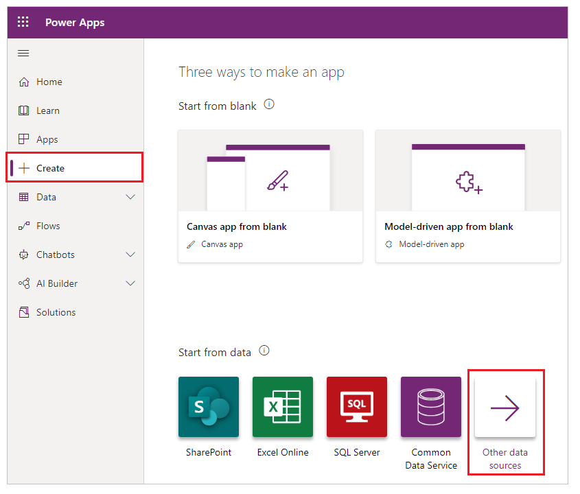
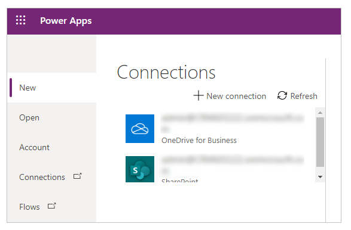
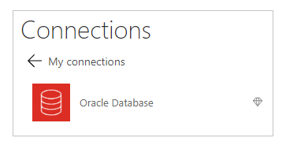
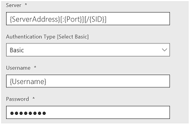
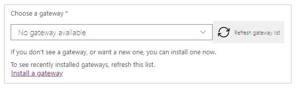
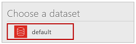
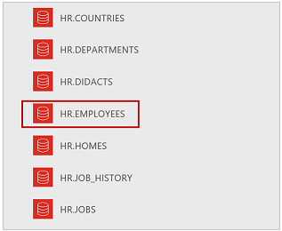

# Connect to an Oracle database from Power Apps

List tables, and create, read, update, and delete table rows in an Oracle database after you create a connection and build an app in Power Apps. The Oracle Database connection supports full delegation of filtering, sorting, and other functions but not triggers or stored procedures.

## Prerequisites
* Oracle 9 and later
* Oracle client software 8.1.7 and later
* Installation of an on-premises data gateway
* Installation of the Oracle client SDK

### Install an on-premises data gateway
To install a gateway, follow the steps in [this tutorial](../gateway-management.md).

An on-premises data gateway acts as a bridge, providing quick and secure data transfer between on-premises data (data that isn't in the cloud) and the Power BI, Power Automate, Logic Apps, and Power Apps services. You can use the same gateway with multiple services and multiple data sources. For more information, see [Understand gateways](../gateway-reference.md).

### Install Oracle client
On the same computer as the on-premises data gateway, install the [64-bit ODAC 12c Release 4 (12.1.0.2.4) for Windows x64](https://www.oracle.com/technetwork/database/windows/downloads/index-090165.html). Otherwise, an error will appear if you try to create or use the connection, as the list of known issues describes.

## Create an app from a table in an Oracle database

1. Go to [Power Apps](https://make.powerapps.com).

1. Under **Start from data** section, select **Other data sources**.

    

1. Select **New connection**.

   

1. In the list of connections, select **Oracle Database**.

   

1. Specify the name of an Oracle server, a username, and a password.

    Specify a server in this format if an SID is required:   `ServerName/SID`

   

1. Select the gateway that you want to use, or install one.

    If your gateway doesn't appear after you install it, select **Refresh gateway list**.

   

1. Select **Create** to create the connection.

   

1. Select **default** dataset.

   

1. In the list of tables, select the table that you want to use.

   

1. Select **Connect** to create the app.
    
    

Power Apps creates an app that has three screens and shows data from the table that you selected:

* **BrowseScreen1**, which lists all entries in the table.
* **DetailScreen1**, which provides more info about a single entry.
* **EditScreen1**, in which users can update an entry or create an entry.

## Next steps

* To save the app that you've generated, press Ctrl-S.
* To customize **BrowseScreen1** (which appears by default), see [Customize a layout](../customize-layout-sharepoint.md).
* To customize **DetailsScreen1** or **EditScreen1**, see [Customize a form](../customize-forms-sharepoint.md).

## Known issues, tips, and troubleshooting

1. Can't reach the Gateway.
   
    This error appears if the on-premises data gateway can't connect to the cloud. To check the status of your gateway, sign in to powerapps.microsoft.com, select **Gateways**, and then select the gateway that you want to use.
   
    Make sure that your gateway is running and can connect to the Internet. Avoid installing the gateway on a computer that may be turned off or asleep. Also try restarting the on-premises data gateway service (PBIEgwService).

1. System.Data.OracleClient requires Oracle client software version 8.1.7 or greater.
   
    This error appears if the Oracle client SDK isn't installed on the same computer as the on-premises data gateway. To resolve this issue, [install the official provider](/power-bi/connect-data/desktop-connect-oracle-database).

3. Table '[Tablename]' doesn't define any key columns.
   
    This error appears if you're connecting to a table that doesn't have a primary key, which the Oracle Database connection requires.

4. Stored procedures, tables with composite keys, and nested object types in tables aren't directly supported in Power Apps. However, stored procedures using Power Automate are supported.

[!INCLUDE[footer-include](../../../includes/footer-banner.md)]