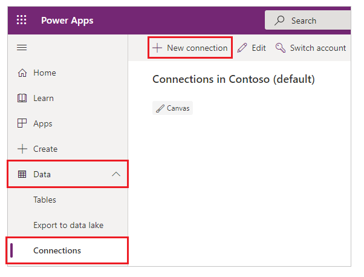
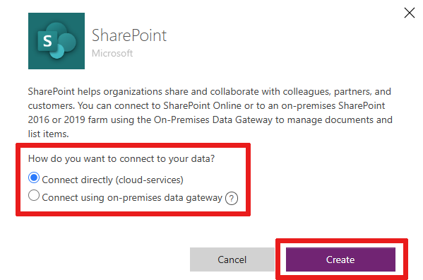
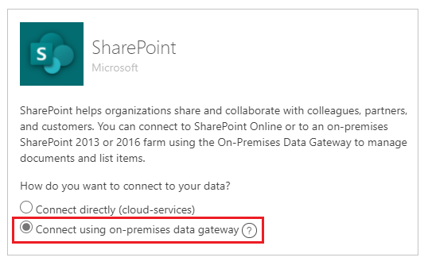
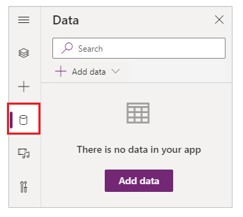
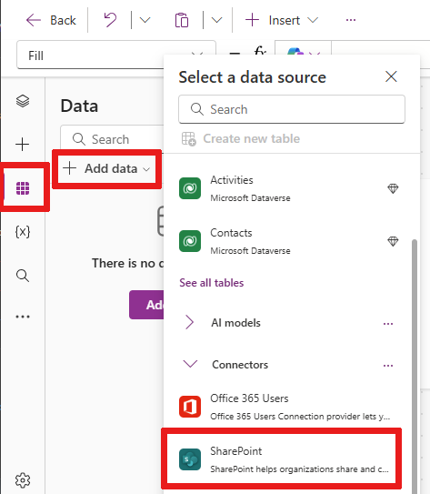

# Connect to SharePoint from a canvas app

Connect to a SharePoint site to generate an app automatically from a custom list, or create a connection before you add data to an existing app or build an app from scratch.

Depending on where your data resides, you can take either or both of these approaches:

- Show data from a custom list in a SharePoint Online site or an on-premises site.
- Show images and play video or audio files in a library (SharePoint Online only).

## Generate an app

If you want to manage data in a custom list, PowerApps can [generate a three-screen app for you automatically](../app-from-sharepoint.md). Users can browse the list on the first screen, show details of an item in the second screen, and create or update items in the third screen.

> [!NOTE]
> If your SharePoint list contains a **Choice**, **Lookup**, or **Person or group** column, see [Show data in a gallery](connection-sharepoint-online.md#show-list-columns-in-a-gallery) later in this topic.

## Create a connection

1. [Sign in to PowerApps](https://make.powerapps.com?utm_source=padocs&utm_medium=linkinadoc&utm_campaign=referralsfromdoc), select **Data** > **Connections** in the left navigation bar, and then select **New connection** near the upper-left corner.

    > [!div class="mx-imgBorder"]
    > 

1. In the search box near the upper-right corner, type or paste **SharePoint**, and then select **SharePoint**.

    > [!div class="mx-imgBorder"]
    > 

1. Perform either of these sets of steps:

    - To connect to SharePoint Online, select **Connect directly (cloud services)**, select **Create**, and then provide credentials (if prompted).

        > [!div class="mx-imgBorder"]
        > 

        The connection is created, and you can add a data to an existing app or build an app from scratch.

    - To connect to an on-premises site, select **Connect using on-premises data gateway**.

        > [!div class="mx-imgBorder"]
        > 

        Specify **Windows** as the authentication type, and then specify your credentials. (If your credentials include a domain name, specify it as *domain\alias*.)

        > [!div class="mx-imgBorder"]
        > 

        Under **Choose a gateway**, select the gateway that you want to use, and then select **Create**.

        > [!NOTE]
        > If you don't have an on-premises data gateway installed, [install one](../gateway-reference.md), and then select the icon to refresh the list of gateways.

        > [!div class="mx-imgBorder"]
        > 

        The connection is created, and you can add a data to an existing app or build an app from scratch.

## Add data to an existing app

1. In PowerApps Studio, open the app that you want to update, select the **View** tab, and then select **Data sources**.

    > [!div class="mx-imgBorder"]
    > 

1. In the **Data** pane, select **Add data source** > **SharePoint**.

1. Under **Connect to a SharePoint site**, select an entry in the **Recent sites** list (or type or paste the URL for the site that you want to use), and then select **Connect**.

    > [!div class="mx-imgBorder"]
    > 

1. Under **Choose a list**, select the check box for **Documents** or one or more lists that you want to use, and then select **Connect**:

    > [!div class="mx-imgBorder"]
    > 

    Not all types of lists appear by default. PowerApps supports custom lists, not template-based lists. If the name of the list that you want to use doesn't appear, scroll to the bottom, and then type the name of the list in the box that contains **Enter custom table name**.

    > [!div class="mx-imgBorder"]
    > 

    The data source or sources are added to your app.

## Build your own app from scratch

Apply the concepts in [Create an app from scratch](../get-started-create-from-blank.md) to SharePoint instead of Excel.

## Show list columns in a gallery

If your custom list contains any of these types of columns, show that data in a **Gallery** control by using the formula bar to set the **Text** property of one or more **Label** controls in that gallery:

- For a **Choice** or **Lookup** column, specify **ThisItem.**_ColumnName_**.Value** to show data in that column.

    For example, specify **ThisItem.Location.Value** if you have a **Choice** column named **Location**, and specify **ThisItem.PostalCode.Value** if you have a **Lookup** column named **PostalCode**.

- For a **Person or Group** column, specify **ThisItem.**_ColumnName_**.DisplayName** to show the display name of the user or the group.

    For example, specify **ThisItem.Manager.DisplayName** to show display names from a **Person or Group** column named **Manager**.

    You can also show different information about users, such as email addresses or job titles. To display a complete list of options, specify **ThisItem.**_ColumnName_**.** (including the trailing period).

    > [!NOTE]
    > For a **CreatedBy** column, specify **ThisItem.Author.DisplayName** to show the display names of users who created items in the list. For a **ModifiedBy** column, specify **ThisItem.Editor.DisplayName** to show the display names of users who changed items in the list.

- For a **Managed Metadata** column, specify **ThisItem.**_ColumnName_**.Label** to show data in that column.

    For example, specify **ThisItem.Languages.Label** if you have a **Managed Metadata** column named **Languages**.

## Show data from a library

If you have several images in a SharePoint library, you can add a **Drop down** control to your app so that users can specify which image to show. You can also apply the same principles to other controls, such as **Gallery** controls, and other types of data, such as videos.

1. If you haven't already, [create a connection](#create-a-connection), and then [add data to an existing app](#add-data-to-an-existing-app).

1. Add a **Drop down** control, and name it **ImageList**.

1. Set the **Items** property of **ImageList** to **Documents**.

1. On the **Properties** tab of the right-hand pane, open the **Value** list, and then select **Name**.

    The file names of the images in your library appear in **ImageList**.

    > [!div class="mx-imgBorder"]
    > 

1. Add an **Image** control, and set its **Image** property to this expression:

    `ImageList.Selected.'Link to item'`

1. Press F5, and then select a different value in **ImageList**.

    The image that you specified appears.

    > [!div class="mx-imgBorder"]
    > 

You can [download a sample app](https://pwrappssamples.blob.core.windows.net/samples/spdoclib_blogapp.msapp) that demonstrates a more complex approach to showing data from a SharePoint library.

1. After you download the app, open [PowerApps Studio](https://us.create.powerapps.com/studio/#), select **Open** in the left navigation bar, and then select **Browse**.
1. In the **Open** dialog box, find and open the file that you downloaded, and then add a SharePoint library as a data source by following the first two procedures in this topic.

> [!NOTE]
> By default, this app shows [delegation warnings](../delegation-overview.md), but you can ignore them if your library contains fewer than 500 items.

In this one-screen app, the list in the lower-left corner shows all files in your library.

- You can search for a file by typing or pasting one or more characters in the search box near the top.
- If your library contains folders, you can filter the list of files by selecting a filter icon in the list of folders just under the title bar.

When you find the file that you want, select it to show it in the **Video**, **Image**, or **Audio** control along the right-hand side.

> [!div class="mx-imgBorder"]
> 

## Known issues

### Lists

PowerApps can read column names that contain spaces, but the spaces are replaced with the hexadecimal escape code **"\_x0020\_"**. For example, **"Column Name"** in SharePoint will appear as **"Column_x0020_Name"** in PowerApps when displayed in the data layout or used in a formula.

Not all types of columns are supported, and not all types of columns support all types of cards.

| Column type | Support | Default cards |
| --- | --- | --- |
| Single line of text |Yes |View text |
| Multiple lines of text |Yes |View text |
| Choice |Yes |View lookup Edit lookup View multiselect Edit multiselect |
| Number |Yes |View percentage View rating View text |
| Currency |Yes |View percentage View rating View text |
| Date and Time |Yes |View text |
| Lookup |Yes |View lookup Edit lookup View multiselect Edit multiselect |
| Boolean (Yes/No) |Yes |View text View toggle |
| Person or Group |Yes |View lookup Edit lookup View multiselect Edit multiselect |
| Hyperlink |Yes |View URL View text |
| Picture |Yes (read-only) |View image View text |
| Attachment |Yes (read-only) |View Attachments|
| Calculated |Yes (read-only) | |
| Task Outcome |No | |
| External data |No | |
| Managed Metadata |Yes (read-only) | |
| Rating |No | |

### Libraries

- You can't upload files from PowerApps to a library.
- You can't show PDF files from a library in a PDF Viewer control.
- PowerApps Mobile doesn't support the **Download** function.
- If your users will run the app in PowerApps Mobile or the Windows 10 app, use the **Launch** function to display library content in a gallery.

## Next steps

- Learn how to [show data from a data source](../add-gallery.md).
- Learn how to [view details and create or update records](../add-form.md).
- See other types of [data sources](../connections-list.md) to which you can connect.
