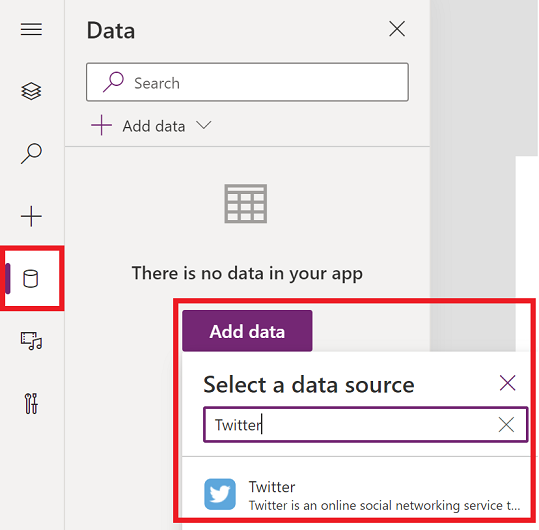
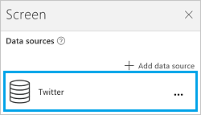

# Connect to Twitter from Power Apps

Twitter lets you post tweets and get tweets, timeline, friends, and followers from your Twitter account.

You can display this information in a label on your app. For example, you can add an input text box, ask the user to enter in some Tweet text, and then add a button that "posts" the tweet. You can use similar methods to get a tweet or search for a tweet, and then display the text in a label or gallery control in your app.

This topic shows you how to create the Twitter connection, use the Twitter connection in an app, and lists the available functions.

[!INCLUDE [connection-requirements](../../../includes/connection-requirements.md)]

## Connect to Twitter
1. Open Power Apps, select **New**, and then create a **Blank app**. Choose phone or tablet layout. Tablet layout gives you more workspace:  

   
2. In the right-hand pane, click or tap the **Data** tab, and then click or tap **Add data source**.
3. Select **New connection**, and then select **Twitter**:  

    

    
4. Select **Connect**, enter your Twitter sign in credentials, and then select **Authorize app**.
5. Select **Add Data Source**. Your connection appears under **Data sources**:  
    

The Twitter connection has been created, and added to your app. Now, it's ready to be used.

## Use the Twitter connection in your app
### Show a timeline
1. On the **Insert** menu, select **Gallery**, and add any of the **With text** galleries.
2. Let's show some timelines:  

   * To show the current user's timeline, set the **[Items](../controls/properties-core.md)** property of the gallery to the following formulas:

       `Twitter.HomeTimeline().TweetText`  
       `Twitter.HomeTimeline({maxResults:3}).TweetText`  
   * To show another user's timeline, set the **[Items](../controls/properties-core.md)** property of the gallery to the following formula:  

       `Twitter.UserTimeline( *TwitterHandle* ).TweetText`

       Enter a Twitter handle in double quotation marks or an equivalent value. For example, enter `"satyanadella"` or `"powerapps"` directly in the formula expression.
   * Add a text input control named **Tweep**, and set its Default property to `Tweep.Text`. In the Tweep text box, type in a Twitter handle such as `satyanadella` (without quotation marks and without the @ symbol).

       In the gallery control, set the Items property to the following formula:  

       `Twitter.UserTimeline(Tweep.Text, {maxResults:5}).TweetText`

       The gallery control automatically shows the tweets of the Twitter handler you type in.

     > [!TIP]
     > Some of these formulas use the **maxResults** argument to show the *x* number of most recent tweets in a timeline.
3. Set the gallery's **Items** property to `Twitter.HomeTimeline()`.

    With the gallery selected, the right-hand pane shows options for that gallery.
4. Select **TweetText** in the first list, select **TweetedBy** in the second list, and select **CreatedAt** in the third list.

    The gallery now shows the values of the properties you chose.

### Show followers
1. Using a **With text** gallery, let's show some followers:  

   * To show the current user's followers, set the **[Items](../controls/properties-core.md)** property of the gallery to the following formula:  

       `Twitter.MyFollowers()`  
       `Twitter.MyFollowers({maxResults:3})`
   * To show the another user's followers, set the **[Items](../controls/properties-core.md)** property of the gallery to the following formula:  

       `Twitter.Followers( *TwitterHandle* )`

       Enter a Twitter handle in double quotation marks or an equivalent value. For example, enter `"satyanadella"` or `"powerapps"` directly in the formula expression.
   * Add a text input control named **Tweep**, and set its Default property to `Tweep.Text`. In the Tweep text box, type in a Twitter handle such as `satyanadella` (without quotation marks and without the @ symbol).

       In the gallery control, set the Items property to the following formula:  

       `Twitter.Followers(Tweep.Text, {maxResults:5})`

       The gallery control automatically shows who is following the Twitter handle you type in.

     > [!TIP]
     > Some of these formulas use the **maxResults** argument to show the *x* number of most recent tweets in a timeline.
2. Set the gallery's **Items** property to `Twitter.MyFollowers()`.

    With the gallery selected, the right-hand pane shows options for that gallery.
3. Select **UserName** in the second list, and select **FullName** in the third list.

    The gallery now shows the values of the properties you chose.

### Show followed users
1. Using a **With text** gallery, let's show some followed users:  

   * To show which users the current user is following, set the **[Items](../controls/properties-core.md)** property of the gallery to the following formula:  

       `Twitter.MyFollowing()`  
       `Twitter.MyFollowing({maxResults:3})`
   * To show which users another user is following, set the **[Items](../controls/properties-core.md)** property of the gallery to the following formula:

       `Twitter.Following( *TwitterHandle* )`

       Enter a Twitter handle in double quotation marks or an equivalent value. For example, enter `"satyanadella"` or `"powerapps"` directly in the formula expression.
   * Add a text input control named **Tweep**, and set its Default property to `Tweep.Text`. In the Tweep text box, type in a Twitter handle such as `satyanadella` (without quotation marks and without the @ symbol).

       In the gallery control, set the Items property to the following formula:  

       `Twitter.Following(Tweep.Text, {maxResults:5})`

       The gallery control automatically shows the other handles you are following.

     With the gallery selected, the right-hand pane shows options for that gallery.
2. Select **Description** in the **Body1** list, **UserName** in the **Heading1** list, and **FullName** in the **Subtitle1** list.

    The gallery now shows the values of the properties you chose.

### Show information about a user
Add a label, and then set its **[Text](../controls/properties-core.md)** property to one of these formulas:  

* `twitter.User( *TwitterHandle* ).Description`
* `twitter.User( *TwitterHandle* ).FullName`
* `twitter.User( *TwitterHandle* ).Location`
* `twitter.User( *TwitterHandle* ).UserName`
* `twitter.User( *TwitterHandle* ).FollowersCount`
* `twitter.User( *TwitterHandle* ).FriendsCount`
* `twitter.User( *TwitterHandle* ).Id`
* `twitter.User( *TwitterHandle* ).StatusesCount`

Enter a Twitter handle in double quotation marks or an equivalent value. For example, enter `"satyanadella"` or `"powerapps"` directly in the formula expression.

Or, you can use an input text control to type in a Twitter handle, just as we have throughout this topic.

### Search tweets
1. Using a **With text** gallery, set its **[Items](../controls/properties-core.md)** property to the following formula:  

    `Twitter.SearchTweet( *SearchTerm* ).TweetText`

    Enter a *SearchTerm* in double quotation marks or by referring to an equivalent value. For example, enter `"PowerApps"` or `"microsoft"` directly in the formula.

    Or, you can use an **Input text** control to specify a search term, just as we have throughout this topic.

    > [!TIP]
   > Show the first five results by using maxResults:  

    `Twitter.SearchTweet(SearchTerm.Text, {maxResults:5}).TweetText`
2. Set the gallery's **Items** property to `Twitter.SearchTweet(SearchTerm.Text, {maxResults:5})`.

    With the gallery selected, the right-hand pane shows options for that gallery.
3. Select **TweetText** in the first list, **TweetedBy** in the second list, and **CreatedAt** in the third list.

    The gallery now shows the values of the properties you chose.

### Send a tweet
1. Add a text input control, and then rename it **MyTweet**.
2. Add a button, and then set its **[OnSelect](../controls/properties-core.md)** property to the following formula:  
    `Twitter.Tweet("",{tweetText: MyTweet.Text})`
      Example: `Twitter.Tweet("",{tweetText:"Sample tweet!"})`
3. Press F5, or select the Preview button (). Type some text into **MyTweet**, and then select the button to tweet the text that you entered.
4. Press Esc to return to the default workspace.

## View the available functions
This connection includes the following functions:

| Function Name | Description |
| --- | --- |
| [UserTimeline](connection-twitter.md#usertimeline) |Retrieves a collection of the most recent tweets posted by the specified user |
| [HomeTimeline](connection-twitter.md#hometimeline) |Retrieves the most recent tweets and re-tweets posted me and my followers |
| [SearchTweet](connection-twitter.md#searchtweet) |Retrieves a collection of relevant tweets matching a specified query |
| [Followers](connection-twitter.md#followers) |Retrieves users following the specified user |
| [MyFollowers](connection-twitter.md#myfollowers) |Retrieves users who are following me |
| [Following](connection-twitter.md#following) |Retrieves users who the specified user is following |
| [MyFollowing](connection-twitter.md#myfollowing) |Retrieves users that I am following |
| [User](connection-twitter.md#user) |Retrieves details about the specified user (example: user name, description, followers count, etc.) |
| [Tweet](connection-twitter.md#tweet) |Tweet |
| [OnNewTweet](connection-twitter.md#onnewtweet) |Triggers a workflow when a new tweet is posted which matches your search query |

### UserTimeline
Get user timeline: Retrieves a collection of the most recent tweets posted by the specified user

#### Input properties

| Name | Data Type | Required | Description |
| --- | --- | --- | --- |
| userName |string |yes |Twitter handle |
| maxResults |integer |no |Maximum number of tweets to retrieve, e.g. {maxResults:5} |

#### Output properties

| Property Name | Data Type | Required | Description |
| --- | --- | --- | --- |
| TweetText |string |Yes | |
| TweetId |string |No | |
| CreatedAt |string |No | |
| RetweetCount |integer |Yes | |
| TweetedBy |string |Yes | |
| MediaUrls |array |No | |

### HomeTimeline
Get home timeline: Retrieves the most recent tweets and re-tweets posted me and my followers

#### Input properties

| Name | Data Type | Required | Description |
| --- | --- | --- | --- |
| maxResults |integer |no |Maximum number of tweets to retrieve, e.g. {maxResults:5} |

#### Output properties

| Property Name | Data Type | Required | Description |
| --- | --- | --- | --- |
| TweetText |string |Yes | |
| TweetId |string |No | |
| CreatedAt |string |No | |
| RetweetCount |integer |Yes | |
| TweetedBy |string |Yes | |
| MediaUrls |array |No | |

### SearchTweet
Search tweet: Retrieves a collection of relevant tweets matching a specified query

#### Input properties

| Name | Data Type | Required | Description |
| --- | --- | --- | --- |
| searchQuery |string |yes |Query text (you may use any Twitter supported query operators: https://www.twitter.com/search) |
| maxResults |integer |no |Maximum number of tweets to retrieve, e.g. {maxResults:5} |

#### Output properties

| Property Name | Data Type | Required | Description |
| --- | --- | --- | --- |
| TweetText |string |Yes | |
| TweetId |string |No | |
| CreatedAt |string |No | |
| RetweetCount |integer |Yes | |
| TweetedBy |string |Yes | |
| MediaUrls |array |No | |

### Followers
Get followers: Retrieves users following the specified user

#### Input properties

| Name | Data Type | Required | Description |
| --- | --- | --- | --- |
| userName |string |yes |Twitter handle of the user |
| maxResults |integer |no |Maximum number of users to retrieve, e.g. {maxResults:5} |

#### Output properties

| Property Name | Data Type | Required | Description |
| --- | --- | --- | --- |
| FullName |string |Yes | |
| Location |string |Yes | |
| Id |integer |No | |
| UserName |string |Yes | |
| FollowersCount |integer |No | |
| Description |string |Yes | |
| StatusesCount |integer |No | |
| FriendsCount |integer |No | |

### MyFollowers
Get my followers: Retrieves users who are following me

#### Input properties

| Name | Data Type | Required | Description |
| --- | --- | --- | --- |
| maxResults |integer |no |Maximum number of users to retrieve, e.g. {maxResults:5} |

#### Output properties

| Property Name | Data Type | Required | Description |
| --- | --- | --- | --- |
| FullName |string |Yes | |
| Location |string |Yes | |
| Id |integer |No | |
| UserName |string |Yes | |
| FollowersCount |integer |No | |
| Description |string |Yes | |
| StatusesCount |integer |No | |
| FriendsCount |integer |No | |

### Following
Get following: Retrieves users who the specified user is following

#### Input properties

| Name | Data Type | Required | Description |
| --- | --- | --- | --- |
| userName |string |yes |Twitter handle of the user |
| maxResults |integer |no |Maximum number of users to retrieve, e.g. {maxResults:5} |

#### Output properties

| Property Name | Data Type | Required | Description |
| --- | --- | --- | --- |
| FullName |string |Yes | |
| Location |string |Yes | |
| Id |integer |No | |
| UserName |string |Yes | |
| FollowersCount |integer |No | |
| Description |string |Yes | |
| StatusesCount |integer |No | |
| FriendsCount |integer |No | |

### MyFollowing
Get my following: Retrieves users that I am following

#### Input properties

| Name | Data Type | Required | Description |
| --- | --- | --- | --- |
| maxResults |integer |no |Maximum number of users to retrieve, e.g. {maxResults:5} |

#### Output properties

| Property Name | Data Type | Required | Description |
| --- | --- | --- | --- |
| FullName |string |Yes | |
| Location |string |Yes | |
| Id |integer |No | |
| UserName |string |Yes | |
| FollowersCount |integer |No | |
| Description |string |Yes | |
| StatusesCount |integer |No | |
| FriendsCount |integer |No | |

### User
Get user: Retrieves details about the specified user (example: user name, description, followers count, etc.)

#### Input properties

| Name | Data Type | Required | Description |
| --- | --- | --- | --- |
| userName |string |yes |Twitter handle of the user |

#### Output properties

| Property Name | Data Type | Required | Description |
| --- | --- | --- | --- |
| FullName |string |Yes | |
| Location |string |Yes | |
| Id |integer |No | |
| UserName |string |Yes | |
| FollowersCount |integer |No | |
| Description |string |Yes | |
| StatusesCount |integer |No | |
| FriendsCount |integer |No | |

### Tweet
Post a new tweet: Tweet

#### Input properties

| Name | Data Type | Required | Description |
| --- | --- | --- | --- |
| tweetText |string |no |Text to be posted e.g. {tweetText:"hello"} |
| body |string |no |Media to be posted |

#### Output properties

| Property Name | Data Type | Required | Description |
| --- | --- | --- | --- |
| TweetId |string |Yes | |

### OnNewTweet
When a new tweet appears: Triggers a workflow when a new tweet is posted which matches your search query

#### Input properties

| Name | Data Type | Required | Description |
| --- | --- | --- | --- |
| searchQuery |string |yes |Query text (you may use any Twitter supported query operators: https://www.twitter.com/search) |

#### Output properties

| Property Name | Data Type | Required | Description |
| --- | --- | --- | --- |
| value |array |No | |

## Helpful links
See all the [available connections](../connections-list.md).  
Learn how to [add connections](../add-manage-connections.md) to your apps.

[!INCLUDE[footer-include](../../../includes/footer-banner.md)]