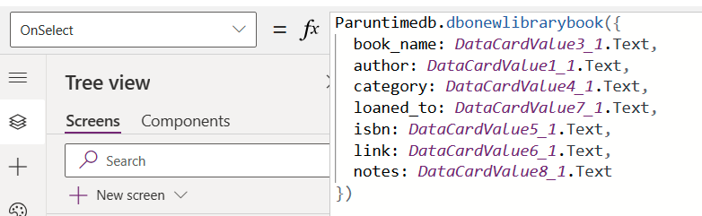

# Methods to access data

One common access pattern is to use a view (or table) and then stored procs for create, update, and delete.  This pattern accommodates a table with a trigger added to log changes to an audit table.  A strong benefit for this pattern is that it leverages the built-in paging capability of Power Apps for galleries or tables which helps keep the app performant.

> [!NOTE]
> If a table has a trigger then you cannot use the direct pattern of using Submit() for create, update, and delete because of a conflict in how output parameters are currently handled for SQL triggers and the built-in Power Apps behavior which uses the same output parameter. You can directly access the table for query purposes, but to handle `Create`, `Update`, or `Delete` you must call a stored procedure.

## Using a view 

Views show up in the list of tables you can select from if you add the data source.  Views only support queries – not updates.  You must use a stored procedure for these actions.

### Using views and stored procedures with `Start with data`

If you use a table with `Start with data`, you will get screens and formulas that allow for display of records in a gallery and form.  And you will get formulas and functionality for creation, editing, and deletion. However, if you use a view you will only get a display screen for the gallery and form.  If you want the auto-generated screens from `Start with data` for a views and stored procedures then first choose to run `Starts with data` with a basic table and then delete the table data source and then replace the table data source and other create, update, and delete formulas with a view data source and stored procedure calls.  

## Using stored procedures

When you add a SQL Server connection to your app, you can now add tables and views or stored procedures and call them directly in Power Fx. This feature also works with secure implicit connections. 

:::image type="content" source="media/connection-azure-sqldatabase/tables-views-stored-proc-selector.png" alt-text="Screenshot that shows lists of tables, views, and stored procedures available to be added to your app.":::

If you don't immediately see your stored procedure, it's faster to search for it.

Once you select a stored procedure, a child node appears and you can designate the stored procedure as **Safe to use for galleries and tables**. If you check this option, you can assign your stored procedure as an **Items** property for galleries for tables to use in your app.

Enable this option **only if**:

1. There are **no side effects** to calling this procedure on demand, multiple times, whenever Power Apps refreshes the control. When used with an **Items** property of a gallery or table, Power Apps calls the stored procedure whenever the system determines a refresh is needed. You can't control when the stored procedure is called.
2. The amount of data you return in the stored procedure is **modest**. Action calls, such as stored procedures, **do not have a limit on the number of rows retrieved**. They aren't automatically paged in 100 record increments like tabular data sources such as tables or views. So, if the stored procedure returns too much data (many thousands of records) then your app might slow down or crash. For performance reasons, you should bring in less than 2,000 records.

> [!IMPORTANT]
> The schema of the return values of the stored procedure should be **static**. Meaning that it doesn't change from call to call. For example, if you call a stored procedure and it returns two tables, then it should **always** return two tables. You can work with either typed or untyped results. The structure of the results need to be the same from call to call. If the schema of the results are **dynamic**, then results will be untyped and you will need to provide a type in order to use them in Power Apps. For more information, go to [Untyped results](#untyped-results).

### SQL namespace pre-pended to stored procedure name

The SQL Server namespace name that the stored procedure is stored in is pre-pended to the name of the stored procedure that is created for it in Power Apps. For example, all stored procedures in the **'DBO'** SQL Server namespace have the **'dbo'** at the start of the name.

### Example

When you add a stored procedure, you might see more than one data source in your project.

:::image type="content" source="media/connection-azure-sqldatabase/sqlserver-datasources.png" alt-text="Screenshot that shows SQL data sources.":::

### Calling a stored procedure

To use a stored procedure in Power Apps, first prefix the stored procedure name with the name of connector associated with it and the name the stored procedure. `Paruntimedb.dbonewlibrarybook` in the example illustrates this pattern. When Power Apps brings the stored procedure in, it concatenates the namespace and the procedure name, and `dbo.newlibrarybook` becomes `dbonewlibrarybook`.  

Arguments are passed as a Power Apps record with named value pairs:

```power-fx
<datasourceName>.<StoredprocedureName>({<paramName1: value, paramName2: value, ... >})
```

Remember to convert values as necessary as you pass them into your stored procedure as necessary since you're reading from a text value in Power Apps. For example, if you're updating an integer in SQL you must convert the text in the field using `Value()`.



## Variables and all stored procs 

You can access a stored procedure for the **Items** property of a gallery after you declare it safe for the UI. Reference the data source name and the name of the stored procedure followed by `ResultSets`. You can access multiple results by referencing the set of tables returned such as Table 1, Table 2, etc.

For example, your access of a stored procedure off of a data source named `Paruntimedb` with a stored procedure named `dbo.spo_show_all_library_books()` will look like the following.

```power-fx
Paruntimedb.dbospshowalllibrarybooks().ResultSets.Table1
```

This populates the gallery with records. However, stored procedures are an addition of **action** behaviors to the tabular model. Refresh() only works with tabular data sources and can't be used with stored procedures. Then you need to refresh the gallery when a record is created, updated, or deleted. When you use a Submit() on a form for a tabular data source, it effectively calls Refresh() under the covers and updates the gallery.

### Use a variable to populate and refresh the gallery

To get around this limitation, use a variable in the OnVisible property for the screen and set the stored procedure to the variable.

```power-fx
Set(SP_Books, Paruntimedb.dbospshowalllibrarybooks().ResultSets.Table1);
```

And then set the `Items` property of the gallery to the variable name.

```power-fx
SP_Books
```

Then after you create, update, or delete a record with a call to the stored procedure, set the variable again. This updates the gallery.

```power-fx
Paruntimedb.dbonewlibrarybook({   
  book_name: DataCardValue3_2.Text, 
  author: DataCardValue1_2.Text,
    ...
});
Set(SP_Books, Paruntimedb.dbospshowalllibrarybooks().ResultSets.Table1);
```

## Using Power Automate to call stored procedures

Asynchronous actions are best handled by Power Automate. Sometimes this involves calling stored procedures part of a series of calls in a business process.

To call Power Automate and then call stored procedures, create input variables as part of your flow.

:::image type="content" source="media/connection-azure-sqldatabase/pa-input.png" alt-text="Power Automate input":::

And pass them into the call to your stored procedure


:::image type="content" source="media/connection-azure-sqldatabase/pa-execute-procedure.png" alt-text="Execute stored procedure":::

Add the Power Automate flow to your app and call it. The optional arguments are passed as a record “{ … }”.  The example below has all optional arguments. 

:::image type="content" source="media/connection-azure-sqldatabase/pa-example.png" alt-text="Power Automate flow":::

