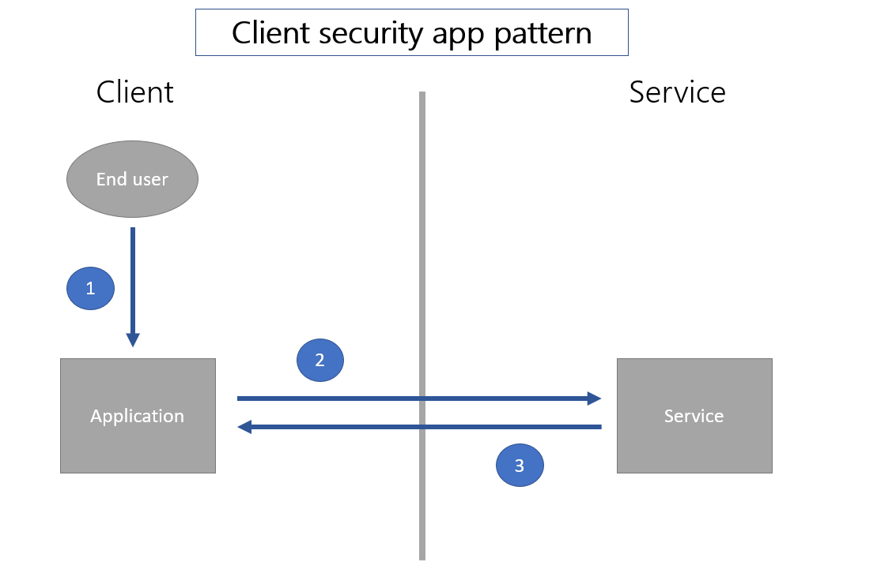
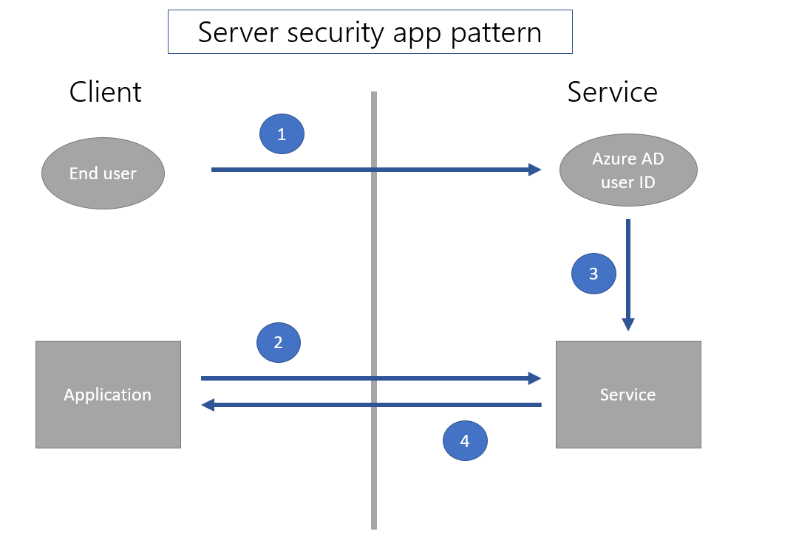

# Use Microsoft SQL Server securely with Power Apps

There are different ways to [connect](../connections-list.md#security-and-types-of-authentication) and authenticate to SQL Server with Power Apps. This article outlines concepts that can be helpful in making a choice about how to
connect to SQL Server with a security approach that matches requirements for your app.

> [!IMPORTANT]
> This article also applies to other relational databases such as Oracle.

## Difference between explicit and implicit connections

A connection to SQL Server is created whenever you create an app using Power Apps connecting to SQL Server. When such apps are published and shared with others, both the app and the connection are deployed to those users. In other words, the app and the connection&mdash;both are visible to users the apps is shared with.

The authentication method used for such connections can be **explicit** or **implicit**. We can also say such connection is shared explicitly or implicitly.

- An **explicitly shared connection** means that the end user of the application must authenticate to SQL Server with their own explicit credentials. Usually this authentication happens behind the scenes as part of Azure Active Directory or Windows authentication handshake. The user doesn’t even notice when the authentication takes place.
- An **implicitly shared connection** means that the user implicitly uses the credentials of the account that the app maker used to connect and authenticate to the data source during while creating the app. The end user’s credentials are **not** used to authenticate. Each time the end user runs the app, they're using the credentials the author created the app with.

The following four connection authentication types can be used with SQL Server for Power Apps:

| Authentication Type                 | Power Apps connection method |
|-------------------------------------|------------------------------|
| Azure AD Integrated                 | Explicit                     |
| SQL Server Authentication | Implicit                     |
| Windows Authentication              | Implicit                     |
| Windows Authentication (non-shared) | Explicit                     |

## Implicit connection sharing risks

Since both the app and its connections are deployed to end users, it means that **end users can author new applications based on those connections**.

For example, consider you created an app that filtered out the data you don’t want users to see. The filtered out data is present in the database. But you're relying on the filter you configured to ensure the end users won’t see certain data.

After you deploy this app, end users can use the connection deployed with your app in any new apps they create. In the new apps, users can see the data you filtered out in your application.

> [!IMPORTANT]
> Once an implicitly shared connection is deployed to end users, the restrictions you may have put in the app you shared (such as filters or read-only access) are no longer valid for new apps end users create. The end users will have whatever rights the authentication allows as part of implicitly shared connection.

## Real-world uses of implicit connection

There are valid use cases for both implicit and explicit authentication methods. Consider security model, and ease of development when choosing your approach. As a general rule, use an explicit authentication method for any situation where you've a business requirement where data must be restricted on a row or column basis.

For an example of explicit connection use case, consider a sales manager who should only be allowed to see price discounts or base cost data that is in the same table where another sales professional needs to see product and price.

However, not all data may need be secured in the same way. An app is shared and deployed to specific users or groups of users. Persons outside of that group don't have access to the app or the connection. Hence, if everyone in a group is authorized to see all of the data in a database, an implicit method of sharing works well.

For an example of implicit connection use case, consider a department that has a small database of projects they're tracking. The database may include information such as departmental work tickets, or corporate calendar for the entire company. In this scenario, the building more apps on top of the implicitly shared connection may be encouraged as long as all of the data should be accessible by all users who are given access.

Apps created using Power Apps are designed to be approachable by end users. This kind of scenario is common because the development cost associated with implicit connections is low.

Departmental based apps can grow into enterprise-wide and mission critical apps. In these scenarios, it’s important to understand that as a departmental app moves to be enterprise-wide, it will need to have traditional enterprise security built in. This approach is more expensive for app building efforts, but important in corporate-wide scenarios.

## Client and server security

You can't rely on the security of data through filtering or other client-side operations to be secure. Applications that require secure filtering of data must ensure that both the user identification and filtering happens on the server.

Use services such as Azure Active Directory instead of relying on the filters designed within the apps when it comes to user identity and security. This configuration ensures server-side filters work as expected.

The following illustrations explain how the security patterns within the apps differ between client-side and server-side security models.

In a client security app pattern, [1] the user only authenticates to the application on the client side. Then [2] the application requests information of the service, and [3] the service returns the information solely based on the data request.

In a server-side security pattern, [1] the user first authenticates to the service so the user is known to the service. Then, [2] when a call is made from the application, the service [3] uses the known identity of the current user to filter the data appropriately and [4] returns the data.

The implicit departmental sharing scenarios described above is combination of these two patterns. The user must log in to the Power App service using Azure AD credentials. This behavior is the server security app pattern. The user is known using the Azure AD identity on the service. Hence, the app is restricted to the set of users to which Power Apps has formally shared the application.

However, the implicit shared connection to SQL Server is the client security app pattern. SQL Server only knows that a specific user name and password is used. Any client-side filtering, for instance, can be bypassed with a new application using the same user name and password.

To securely filter data on the server side, use built-in security features in SQL Server such as [row level
security](/sql/relational-databases/security/row-level-security) for rows, and the
[deny](/sql/t-sql/statements/deny-object-permissions-transact-sql) permissions to specific objects (such as columns) to specific users. This approach will use the Azure AD user identity to filter the data on the server.

Some existing corporate services have used an approach where the user identity is captured in a business data layer much in the same way that Microsoft Dataverse does. In this case, the business layer may or may not use SQL Server’s row level security and deny features directly. If it doesn't, it's often the case that the security is enabled using stored procedures or views.

The business layer (on the server side) uses a known user Azure AD identity to invoke a stored procedure as a SQL Server principal and filter the data. However, Power Apps doesn't currently connect to stored procedures. A business layer may also invoke a view that uses the Azure AD identity as a SQL Server principal. In this case, use Power Apps to connect to the views so that the data is filtered on the server-side. Exposing only views to users may need Power Automate flows for updates.

### See also

[Overview of connectors for canvas apps](../connections-list.md)
