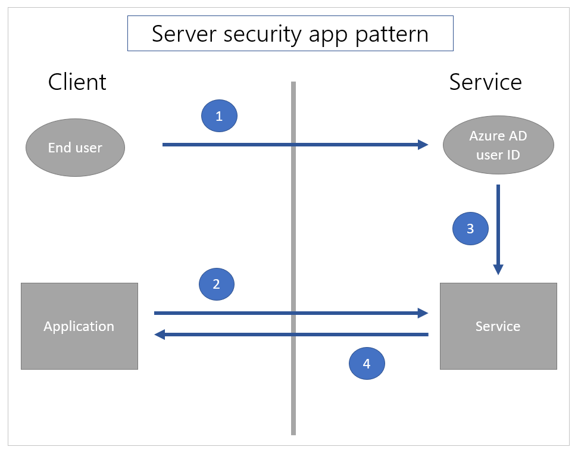

# Use Microsoft SQL Server securely with Power Apps

There are different ways to [connect](../connections-list.md#security-and-types-of-authentication) and authenticate to SQL Server with Power Apps. This article outlines concepts that can be helpful in making a choice about how to
connect to SQL Server with a security approach that matches requirements for your app.

> [!IMPORTANT]
> The [**secure implicit connections**](../connections-list.md#shared-connections-and-secure-implicit-connections) feature was released in January 2024. Microsoft strongly encourages all apps currently using implicit connections to convert to secure implicit connections and to revoke connections shared with end users. 

## Difference between explicit, implicit, and secure implicit connections

A connection to SQL Server is created whenever you create an app using Power Apps connecting to SQL Server. When such apps are published and shared with others, both the app and the connection are deployed to those users. In other words, the app and the connection&mdash;both are visible to users the apps is shared with.

The authentication method used for such connections can be **explicit** or **implicit**. We can also say such connection is shared explicitly or implicitly.

- An **explicitly shared connection** means that the end user of the application must authenticate to SQL Server with their own explicit credentials. Usually this authentication happens behind the scenes as part of Microsoft Entra or Windows authentication handshake. The user doesn’t even notice when the authentication takes place.
- An **implicitly shared connection** means that the user implicitly uses the credentials of the account that the app maker used to connect and authenticate to the data source during while creating the app. The end user’s credentials are **not** used to authenticate. Each time the end user runs the app, they're using the credentials the author created the app with.
- A **secure implicitly shared connection** refers to a scenario where the end user of the app implicitly uses the credentials of the account that the app maker used to connect and authenticate to the data source while creating the app. This means that the end user's own credentials are not used to authenticate. Instead, when the user runs the app, they are using the credentials that the author of the app created it with. It is important to note that the end user is not provided with direct access to the connection, and the app only allows access to a limited set of actions and tables.

The following four connection authentication types can be used with SQL Server for Power Apps:

| Authentication Type                 | Power Apps connection method |
|-------------------------------------|------------------------------|
| Microsoft Entra Integrated                 | Explicit                     |
| SQL Server Authentication | Implicit / Secure Implicit                     |
| Windows Authentication              | Implicit / Secure Implicit                    |
| Windows Authentication (nonshared) | Explicit                     |

## Implicit connection sharing risks

All new applications automatically use the new secure implicit connections. However, with apps that use the older 'implicit connections', both the app and its connections are deployed to end users, it means that **end users can author new applications based on those connections**. 

When an author uses [**secure implicit connections**](../connections-list.md#shared-connections-and-secure-implicit-connections), it means that no connection is shared and no end user receives the connection object. This eliminates the risk of an end-user author reusing a connection to create a new app. Instead, the app works with a proxy connection that is aware of the app and only communicates with that specific app. The proxy connection allows limited actions (create, read, update, delete) and access to specific tables in the app that are defined when the app is published. Therefore, only authorized actions and access are granted to the end user.

The older style simple implicit connection actually distributes a connection object to the end user. For example, if you create an app that filters out the data you don’t want users to see. But, the filtered out data is present in the database. But you're relying on the filter you configured to ensure the end users won’t see certain data.

Again, with older style simple implicit connections, after you deploy the app, end users can use the connection deployed with your app in any new apps they create. In the new apps, users can see the data you filtered out in your application. It's important to use the new secure implicit connections. 

> [!IMPORTANT]
> Once an older implicitly shared connection is deployed to end users, the restrictions you may have put in the app you shared (such as filters or read-only access) are no longer valid for new apps end users create. The end users will have whatever rights the authentication allows as part of implicitly shared connection. Therefore, when you convert an app to use secure implicit connections, you must **also** revoke the connections you shared with your app.  Admins can get a report of apps with implicitly shared connections with the COE toolkit. 

## Client and server security

You can't rely on the security of data through filtering or other client-side operations to be secure. Applications that require secure filtering of data must ensure that both the user identification and filtering happens on the server.

Use services such as Microsoft Entra ID instead of relying on the filters designed within the apps when it comes to user identity and security. This configuration ensures server-side filters work as expected.

The following illustrations explain how the security patterns within the apps differ between client-side and server-side security models.

In a client security app pattern, [1] the user only authenticates to the application on the client side. Then [2] the application requests information of the service, and [3] the service returns the information solely based on the data request.

In a server-side security pattern, [1] the user first authenticates to the service so the user is known to the service. Then, [2] when a call is made from the application, the service [3] uses the known identity of the current user to filter the data appropriately and [4] returns the data.

The implicit departmental sharing scenarios described above is combination of these two patterns. The user must log in to the Power Apps service using Microsoft Entra credentials. This behavior is the server security app pattern. The user is known using the Microsoft Entra identity on the service. Hence, the app is restricted to the set of users to which Power Apps has formally shared the application.

However, the implicit shared connection to SQL Server is the client security app pattern. SQL Server only knows that a specific user name and password is used. Any client-side filtering, for instance, can be bypassed with a new application using the same user name and password.

To securely filter data on the server side, use built-in security features in SQL Server such as [row level
security](/sql/relational-databases/security/row-level-security) for rows, and the
[deny](/sql/t-sql/statements/deny-object-permissions-transact-sql) permissions to specific objects (such as columns) to specific users. This approach uses the Microsoft Entra user identity to filter the data on the server.

Some existing corporate services have used an approach where the user identity is captured in a business data layer much in the same way that Microsoft Dataverse does. In this case, the business layer may or may not use SQL Server’s row level security and deny features directly. If it doesn't, it's often the case that the security is enabled using stored procedures or views.

The business layer (on the server side) uses a known user Microsoft Entra identity to invoke a stored procedure as a SQL Server principal and filter the data. However, Power Apps doesn't currently connect to stored procedures. A business layer may also invoke a view that uses the Microsoft Entra identity as a SQL Server principal. In this case, use Power Apps to connect to the views so that the data is filtered on the server-side. Exposing only views to users may need Power Automate flows for updates.

### See also

[Overview of connectors for canvas apps](../connections-list.md)
