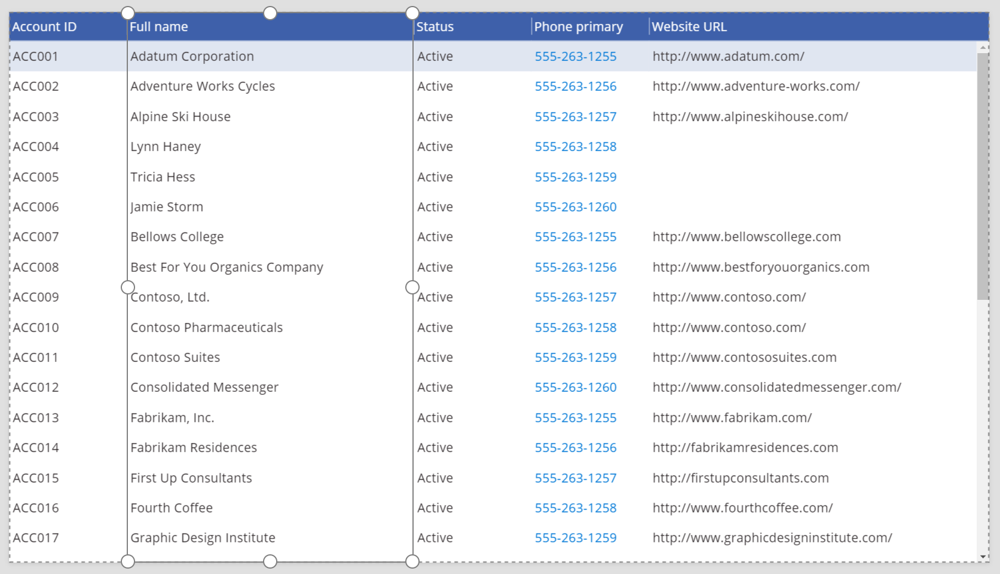

# Column control in Power Apps
Provides the display experience for a single field in a [**Data table**](control-data-table.md) control.

## Description
The [**Data table**](control-data-table.md) control shows a dataset in a tabular format, and each column in that tabular format is represented by a **Column** control. The **Column** control provides properties that the app maker can use to customize the appearance and behavior of the column.

## Capabilities
### Now available
* Change the width of a **Column** control.
* Change the text for a **Column** control.
* Navigate by clicking or tapping the value in a **Column** control.

### Not yet available
* Customize the styling of a **Column** control.

### Known issues
* The **Visible** property doesn't work yet.

## Properties
* **DisplayName** – The text that appears in the header for the column.
  
  > [!NOTE]
  > This property will soon be renamed **HeaderText**.
  > 
  > 
* **IsHyperlink** – A value that indicates whether the data in the column should be underlined to indicate that it's a hyperlink.
* [**Width**](properties-size-location.md) – The distance between the **Column** control’s left and right edges.

## Examples
### Resize a column
1. Create a blank tablet app.
2. On the **Insert** tab, click or tap **Data table**, and then resize the **Data table** control so that it covers the whole screen.
3. In the right pane, click or tap the down arrow to the right of **No data source selected**, and then click or tap **Add a data source**.
4. In the list of connections, click or tap the connection for your Microsoft Dataverse database.
5. In the list of tables, click or tap **Account**, and then click or tap **Connect**.
   
    The **Data table** control is initialized and shows a set of default fields.
6. Click or tap the **Full name** column.
   
    
7. Drag the adorner on the right side to resize the field.
   
    

## Accessibility guidelines
### Screen reader support
* **DisplayName** must be present.

[!INCLUDE[footer-include](../../../includes/footer-banner.md)]