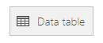
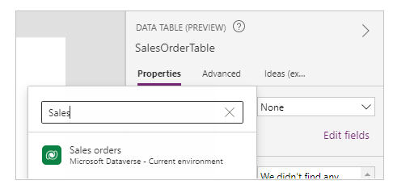

# Data table control in Power Apps
Shows a set of data in a tabular format.

## Description
The **Data table** control shows a dataset in a format that includes column headers for each field that the control shows. As an app maker, you have full control over which fields appear and in what order. Like the **Gallery** control, the **Data table** control maintains a **Selected** property that points to the selected row. Therefore, you can link the **Data table** control to other controls.

## Capabilities
Power Apps introduced the **Data table** control on May 5, 2017. This section provides information about capabilities that are supported and capabilities that aren't supported.

### Now available
* Data in a **Data table** control is read-only.
* A single row is always selected in a **Data table** control.
* Link a **Data table** control to a connected or local data source.
* Adjust column widths in a **Data table** control while you run the app, though your changes aren't saved.
* A set of default fields appear in a **Data table** control when you link it to a connector that has implemented this capability, such as the Microsoft Dataverse. You can then show or hide these fields and others as necessary.
* Customize column width and heading text.
* Show hyperlinks in a **Data table** control.
* Copy and paste a **Data table** control.

### Not yet available
* Customize the styling of individual columns.
* Add a **Data table** control in a form control.
* Change the height of all rows.
* Show images in a **Data table** control.
* Show fields from related tables.
* Use built-in functionality to filter and sort data by column heading.
* Add a **Data table** control in a **Gallery** control.
* Edit data in the **Data table** control.
* Select multiple rows.

### Known issues
* No data appears if you use the **FirstN** function in the **Items** property.

## Key properties
* [**Items**](properties-core.md) – The source of data that appears in the **Data table** control.
* **Selected** – The selected row in the **Data table** control.

## Other properties

* **AutoWidth** - The property of a column inside a data table to define if the column width should be automatic, or manual.
* [**BorderColor**](properties-color-border.md) – The color of the **Data table** control's border.
* [**BorderStyle**](properties-color-border.md) – The style of the **Data table** control's border. The options are **Solid**, **Dashed**, **Dotted**, and **None**.
* [**BorderThickness**](properties-color-border.md) – The thickness of the **Data table** control's border.
* [**Color**](properties-color-border.md) – The default text color for all data rows.
* **FieldDisplayName** - The property of a column inside a data table that defines display name for the selected column.
* [**Fill**](properties-color-border.md) – The default background color for all data rows.
* [**Font**](properties-text.md) - The default font for all data rows.
* [**FontWeight**](properties-text.md) – The default font weight for all data rows.
* **HeadingColor** – The text color for the column headings.
* **HeadingFill** – The background color of the column headings.
* **HeadingFont** – The font of the column headings.
* **HeadingFontWeight** – The font weight of the column headings.
* **HeadingSize** – The font size of the column headings.
* [**Height**](properties-size-location.md) – The distance between the **Data table** control's top and bottom edges.
* [**HoverColor**](properties-color-border.md) – The text color for the row that the mouse pointer is pointing at.
* [**HoverFill**](properties-color-border.md) – The background color of the row that the mouse pointer is pointing at.
* **IsHyperlink** - The property of a column inside a data table that defines whether the selected column should be in hyperlink format or not.
* **NoDataText** – The message that the user receives when there are no records to show in the **Data table** control.
* **Order** - The property of a column inside a data table that determines order of the column respective to other columns. The order starts from left to right with first column order value of 1.
* **SelectedColor** – The color of the text in the selected row.
* **SelectedFill** – The background color of the selected row.
* [**Size**](properties-text.md) – The default font size for all data rows.
* **Text** - The property of a column inside a data table that defines text value of the data to be displayed inside the selected column.
* [**Visible**](properties-core.md) – A value that determines whether the **Data table** control appears or is hidden.
* [**Width**](properties-size-location.md) – The distance between the **Data table** control's left and right edges.
* [**X**](properties-size-location.md) – The distance between the left edge of the **Data table** control and the left edge of its parent container (or the left edge of the screen if there is no parent container).
* [**Y**](properties-size-location.md) – The distance between the top edge of the **Data table** control and the top edge of its parent container (or the top edge of the screen if there is no parent container).

## Related functions
* [**Filter(DataSource, Formula)**](../functions/function-filter-lookup.md)(*DataSource*, *Formula*)
* [**Search(DataSource, SearchString, Column)**](../functions/function-filter-lookup.md)(*DataSource*, *SearchString*, *Column*)

## Examples
### Basic usage
1. Create a blank tablet app.
2. On the **Insert** tab, click or tap **Data table**.
   
    
   
    A **Data table** control is added to the screen.
3. Rename the **Data table** control **SalesOrderTable**, and resize it so that it covers the whole screen.
4. In the right pane, select **Data sources**, and select **Sales orders**. If the table isn't listed, search for the table, and connect to Microsoft Dataverse.
   
    
   
    The **Data table** control is now attached to the **Sales order** data source. Several initial fields appear in the **Data table** control, because we're using a connector that supports that capability.
   
    
7. In the right pane, select one or more check boxes to show or hide individual fields.
   
    For example, select the check box next to **CustomerPurchaseOrderReference** to hide this field.
8. In the right pane, reorder the fields by dragging them up or down.
   
    
   
    The **SalesOrderTable** control shows the fields in the order that you specified.
   
    

### Restyle the header for the Data table control
1. While the **Data table** control is selected, in the right pane, click or tap the **Advanced** tab.
2. Click or tap the field for the **HeadingFill** property, and then change the value to **RGBA(62,96,170,1)**.
3. Click or tap the field for the **HeadingColor** property, and then change the value to **White**.
4. Click or tap the field for the **HeadingSize** property, and then change the value to **14**.
   
    

### Connect a Data table control to another control
1. Add an **Edit form** control to the screen.
2. Resize the **Data table** and **Edit form** controls so that the **Data table** control appears in the left part of the screen and the **Edit form** control appears in the right part of the screen.
   
    
3. While **Form1** is selected, in the right pane, change the number of columns to **1**.
4. Connect **Form1** to the **Sales order** data source.
   
    Several initial fields appear in **Form1**.
   
    
5. In the right pane, click or tap the **Advanced** tab.
6. Set the **Item** property for **Form1** to **SalesOrderTable.Selected**.
   
    **Form1** shows information from the row that's selected in the **Data table** control.
   
    

## Accessibility guidelines
### Color contrast
There must be adequate color contrast between:
* [**Color**](properties-color-border.md) and [**Fill**](properties-color-border.md)
* **HeadingColor** and **HeadingFill**
* **SelectedColor** and **SelectedFill**
* [**HoverColor**](properties-color-border.md) and [**HoverFill**](properties-color-border.md)

This is in addition to the [standard color contrast requirements](../accessible-apps-color.md).

### Screen reader support
* **NoDataText** must be present.

[!INCLUDE[footer-include](../../../includes/footer-banner.md)]