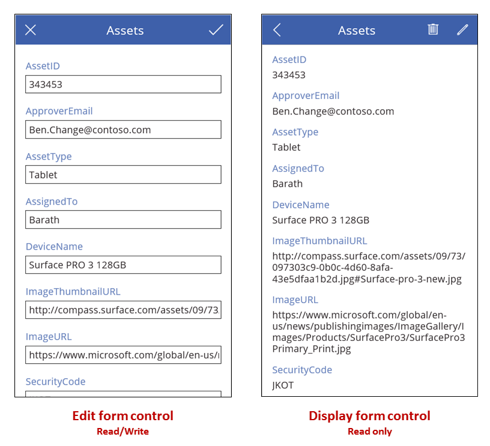

# Edit form and Display form controls in Power Apps
Display, edit, and create a record in a data source.

## Description
If you add a **Display form** control, the user can display all fields of a record or only the fields that you specify. If you add an **Edit form** control, the user can edit those fields, create a record, and save those changes to a data source.



If you add a **[Gallery](control-gallery.md)** control, you can configure it to show a table in a data source and then configure a form to show whichever record the user selects in the gallery. You can also add one or more **[Button](control-button.md)** controls that the user can select to save edits, cancel edits, and create a record. By using controls together, you can [create a complete solution](../working-with-forms.md).

### Record selection
For either type of form, you set its **DataSource** property to a table of records, and you set the form's **Item** property to show a specific record in that table. For example, you can set the **Item** property of a form to the **SelectedItem** property of a **[Gallery](control-gallery.md)** control. When the user selects a record in the gallery, the same record appears in the form, except that the form can show more fields. If the user returns to the gallery and selects a different record, the **SelectedItem** property of the gallery changes. This change updates the **Item** property of the form, which then shows the newly selected record.

You can also set a form's **Item** property by using a **Drop down** control, as [Show, edit, or add a record](../add-form.md) describes, or a function such as **Lookup** or **First**. For example, you can set the **Item** property to either of these formulas to show the Fabrikam entry in the **Accounts** table in Microsoft Dataverse:

```First(Accounts)```

```Lookup(Accounts, "Fabrikam" in name)```

Each form control contains one or more **[Card](control-card.md)** controls. By setting the **[DataField](control-card.md)** property of a card, you [specify which field that card shows and other details](../add-form.md).

### Create a record
When an **Edit form** control is in **Edit** mode, the user can update the record that's specified in the form's **Item** property. If inspected, the **Mode** property returns **Edit**.

When an **Edit form** control is in **New** mode, however, the **Item** property is ignored. The form doesn't show an existing record; instead, the values in each field match the default values of the data source with which you configured the form. The **[NewForm](../functions/function-form.md)** function causes a form to switch to this mode.

For example, you can set the **[Text](properties-core.md)** property of a button to show **New** and its **[OnSelect](properties-core.md)** property to a formula that includes the **[NewForm](../functions/function-form.md)** function. If the user selects that button, the form switches to **New** mode so that the user can create a record starting with known values.

A form switches back to **Edit** mode if either the **[ResetForm](../functions/function-form.md)** function runs or the **[SubmitForm](../functions/function-form.md)** function runs successfully.

* You can set the **[Text](properties-core.md)** property of a button to show **Cancel** and its **[OnSelect](properties-core.md)** property to a formula that includes the **[ResetForm](../functions/function-form.md)** function. If the user selects that button, any changes in progress are discarded, and the values in the form, once again, match the default values of the data source.
* You can set the **[Text](properties-core.md)** property of a button to show **Save changes** and its **[OnSelect](properties-core.md)** property to a formula that includes the **[SubmitForm](../functions/function-form.md)** function. If the user selects that button and the data source is updated, the values in the form are reset to the default values of the data source.

### Save changes
If you create a **Save changes** button as the previous section describes, the user can create or update a record and then select that button to save those changes to the data source. You could, instead, configure an **[Image](control-image.md)** control or some other control to perform the same task, as long as you configure that control with the **[SubmitForm](../functions/function-form.md)** function. In any case, the **Error**, **ErrorKind**, **OnSuccess**, and **OnFailure** properties provide feedback on the outcome.

When the **[SubmitForm](../functions/function-form.md)** function runs, it first validates the data that user wants to submit. If a required field doesn't contain a value or another value doesn't conform to some other constraint, the **ErrorKind** properties are set, and the **OnFailure** formula runs. You can configure the **Save changes** button or other control so that the user can select it only if the data is valid (that is, if the **Valid** property of the form is **true**). Note that the user must not only correct the problem but also select the **Save changes** button again (or discard the changes by selecting a **Cancel** button, as described earlier) to reset the **Error** and **ErrorKind** properties.

If the data passes validation, **[SubmitForm](../functions/function-form.md)** sends it to the data source, which can take some time depending on network latency.

* If the submission succeeds, the **Error** property is cleared, the **ErrorKind** property is set to **ErrorKind.None**, and the **OnSuccess** formula runs. If the user created a record (that is, if the form was previously in **New** mode), the form is switched to **Edit** mode so that the user can edit the newly created record or a different one.
* If the submission fails, the **Error** property contains a user-friendly error message from the data source, explaining the problem. The **ErrorKind** property is set appropriately, depending on the issue, and the **OnFailure** formula runs.

Some data sources can detect when two people try to update the same record at the same time  In this case, **ErrorKind** is set to **ErrorKind.Conflict**, and the remedy is to refresh the data source with the other user's changes and reapply the change made by this user.

> [!TIP]
> If you offer a **Cancel** button on your form so that the user can abandon changes in progress, add the **[ResetForm](../functions/function-form.md)** function to the button's **[OnSelect](properties-core.md)** property even that property also contains a **[Navigate](../functions/function-navigate.md)** function to change screens. Otherwise, the form will retain the user's changes.

### Layout
By default, cards are placed in a single column for phone apps and three columns for tablet apps. You can specify how many columns a form has and whether cards should snap to them as you configure the form. These settings aren't exposed as properties because they're used only to set the **X**, **Y**, and **Width** properties of the cards.

For more information, see [Understand data form layout](../working-with-form-layout.md).

## Key properties
**DataSource** – The data source that contains the record that the user will show, edit, or create.

* If you don't set this property, the user can't show, edit, or create a record, and no additional metadata or validation is provided.

**DefaultMode** - The initial mode of the form control.  See the description of **Mode** below for the acceptable values and their meanings. 

**DisplayMode** - The mode to use for data cards and controls within the form control.  

Derived from the **Mode** property based and cannot be set independently:

| Mode | DisplayMode | Description |
| --- | --- | --- |
| **FormMode.Edit** |**DisplayMode.Edit** |Data cards and controls are editable, ready to accept changes to a record. |
| **FormMode.New** |**DisplayMode.Edit** |Data cards and controls are editable, ready to accept a new record. |
| **FormMode.View** |**DisplayMode.View** |Data cards and controls are not editable and optimized for viewing. |

**Error** – A user friendly error message to display for this form when the **[SubmitForm](../functions/function-form.md)** function fails.

* This property applies only to the **Edit form** control.
* This property changes only when the **[SubmitForm](../functions/function-form.md)**, **EditForm**, or **[ResetForm](../functions/function-form.md)** function runs.
* If no error occurs, this property is *blank*, and **ErrorKind** is set to **ErrorKind.None**.
* When possible, the error message returned will be in the user's language. Some error messages come from the data source directly and may not be in the user's language.

**ErrorKind** – If an error occurs when **SubmitForm** runs, the kind of error that occurred.

* Applies only to an **Edit form** control.
* This property has the same enumeration as the **[Errors](../functions/function-errors.md)** function. An **Edit form** control can return these values:

| ErrorKind | Description |
| --- | --- |
| **ErrorKind.Conflict** |Another user changed the same record, resulting in a change conflict. Execute the **[Refresh](../functions/function-refresh.md)** function to reload the record, and try the change again. |
| **ErrorKind.None** |The error is of an unknown kind. |
| **ErrorKind.Sync** |The data source reported an error. Check the **Error** property for more information. |
| **ErrorKind.Validation** |A general validation issue was detected. |

**Item** – The record in the **DataSource** that the user will show or edit.

**LastSubmit** – The last successfully submitted record, including any server generated fields.

* This property applies only to the **Edit form** control.
* If the data source automatically generates or calculates any fields, such as an **ID** field with a unique number, the **LastSubmit** property will have this new value after **SubmitForm** successfully runs.
* The value of this property is available in the **OnSuccess** formula.

**Mode** – The control is in **Edit** or **New** mode.

| Mode | Description |
| --- | --- |
| **FormMode.Edit** |The user can edit a record by using the form. The values in the form's cards are pre-populated with the existing record, for the user to change. If the **[SubmitForm](../functions/function-form.md)** function runs successfully, an existing record is modified. |
| **FormMode.New** |The user can create a record by using the form. The values in the form's controls are pre-populated with the defaults for a record of the data source. If the **[SubmitForm](../functions/function-form.md)** function runs successfully, a record is created. |
| **FormMode.View** |The user can view a record by using the form. The values in the form's controls are pre-populated with the defaults for a record of the data source. |

The form switches from **New** mode to **Edit** mode when any of these changes occurs:

* The form is successfully submitted, and a record is created. If the gallery is set to automatically move selection to this new record, the form will be in **Edit** mode for the created record so that the user can make additional changes.
* The **[EditForm](../functions/function-form.md)** function runs.
* The **[ResetForm](../functions/function-form.md)** function runs. For example, the user might select a **Cancel** button that's been configured with this function.

**OnFailure** – Actions to perform when a data operation has been unsuccessful.

* This property applies only to the **Edit form** control.

**OnReset** – Actions to perform when an **Edit form** control is reset.

* This property applies only to the **Edit form** control.

**OnSuccess** – Actions to perform when a data operation has been successful.

* This property applies only to the **Edit form** control.

**Unsaved** – True if the **Edit form** control contains user changes that have not been saved.

* This property applies only to the **Edit form** control.
* Use this property to warn the user before they lose any unsaved changes.  To prevent the user from selecting a different record in a **[Gallery](control-gallery.md)** control before saving changes to the current record, set the gallery's **[Disabled](properties-core.md)** property to **Form.Unsaved** and, likewise, disable refresh operations.

**Updates** – The values to write back to the data source for a record loaded in a form control.  

* This property applies only to the **Edit form** control.
* Use this property to extract the field values from the cards within the control.  You can then use these values to manually update the data source with a **[Patch](../functions/function-patch.md)** function call or another method exposed by a connection.  You do not need to use this property if you are using the **[SubmitForm](../functions/function-form.md)** function.
* This property returns a record of values.  For example, if the form control contains card controls for **Name** and **Quantity** fields, and the values of the **[Update](control-card.md)** properties for those cards return "Widget" and 10 respectively, then the **Updates** property for the form control would return **{ Name: "Widget", Quantity: 10 }**.

**Valid** – Whether a **[Card](control-card.md)** or **Edit form** control contains valid entries, ready to be submitted to the data source.

* This property applies only to the **Edit form** control.
* A **Form** control's **Valid** property aggregates the **Valid** properties of all the **[Card](control-card.md)** controls in the form. A form's **Valid** property is **true** only if the data in all cards in that form is valid; otherwise, the form's **Valid** property is **false**.
* To enable a button to save changes only when the data in a form is valid but hasn't yet been submitted, set the button's **DisplayMode** property to this formula:
  
    **SubmitButton.DisplayMode = If(IsBlank( Form.Error ) || Form.Valid, DisplayMode.Edit, DisplayMode.Disabled)**

## Additional properties
**[BorderColor](properties-color-border.md)** – The color of a control's border.

**[BorderStyle](properties-color-border.md)** – Whether a control's border is **Solid**, **Dashed**, **Dotted**, or **None**.

**[BorderThickness](properties-color-border.md)** – The thickness of a control's border.

**[Fill](properties-color-border.md)** – The background color of a control.

**[Height](properties-size-location.md)** – The distance between a control's top and bottom edges.

**[Visible](properties-core.md)** – Whether a control appears or is hidden.

**[Width](properties-size-location.md)** – The distance between a control's left and right edges.

**[X](properties-size-location.md)** – The distance between the left edge of a control and the left edge of its parent container (screen if no parent container).

**[Y](properties-size-location.md)** – The distance between the top edge of a control and the top edge of the parent container (screen if no parent container).

## More information
For a comprehensive overview of how forms work, see [Understand data forms](../working-with-forms.md).

## Accessibility guidelines
### Screen reader support
* Consider adding a heading to the form using a **[Label](control-text-box.md)**.


[!INCLUDE[footer-include](../../../includes/footer-banner.md)]
