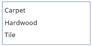

# List Box control in Power Apps
A list in which the user can select one or multiple items.

## Description
A **List Box** control always shows all available choices (unlike a **[Drop down](control-drop-down.md)** control) and in which the user can choose more than one item at a time (unlike a **[Radio](control-radio.md)** control).

## Key properties
**[Default](properties-core.md)** – The initial value of a control before it is changed by the user.

**[Items](properties-core.md)** – The source of data that appears in a control such as a gallery, a list, or a chart.

**Selected** – The data record that represents the selected item.  You can only have one default selected item.  If you need multiple selected items please use the [Combo Box](control-combo-box.md) control.

When you add a gallery, a list, or a chart, the property list shows **Items** by default so that you can easily specify the data that the new control should show. For example, you might set the **Items** property of a gallery to the **Account** table in Salesforce, a table named **Inventory** that you created in Excel and uploaded to the cloud, or a SharePoint list named **ConferenceSpeakers**.

## Additional properties
**[AccessibleLabel](properties-accessibility.md)** – Label for screen readers.

**[BorderColor](properties-color-border.md)** – The color of a control's border.

**[BorderStyle](properties-color-border.md)** – Whether a control's border is **Solid**, **Dashed**, **Dotted**, or **None**.

**[BorderThickness](properties-color-border.md)** – The thickness of a control's border.

**[Color](properties-color-border.md)** – The color of text in a control.

**[DisplayMode](properties-core.md)** – Whether the control allows user input (**Edit**), only displays data (**View**), or is disabled (**Disabled**).

**[DisabledBorderColor](properties-color-border.md)** – The color of a control's border if the control's **[DisplayMode](properties-core.md)** property is set to **Disabled**.

**[DisabledColor](properties-color-border.md)** – The color of text in a control if its **[DisplayMode](properties-core.md)** property is set to **Disabled**.

**[DisabledFill](properties-color-border.md)** – The background color of a control if its **[DisplayMode](properties-core.md)** property is set to **Disabled**.

**[Fill](properties-color-border.md)** – The background color of a control.

**[FocusedBorderColor](properties-color-border.md)** – The color of a control's border when the control is focused.

**[FocusedBorderThickness](properties-color-border.md)** – The thickness of a control's border when the control is focused.

**[Font](properties-text.md)** – The name of the family of fonts in which text appears.

**[FontWeight](properties-text.md)** – The weight of the text in a control: **Bold**, **Semibold**, **Normal**, or **Lighter**.

**[Height](properties-size-location.md)** – The distance between a control's top and bottom edges.

**[HoverBorderColor](properties-color-border.md)** – The color of a control's border when the user keeps the mouse pointer on that control.

**[HoverColor](properties-color-border.md)** – The color of the text in a control when the user keeps the mouse pointer on it.

**[HoverFill](properties-color-border.md)** – The background color of a control when the user keeps the mouse pointer on it.

**[Italic](properties-text.md)** – Whether the text in a control is italic.

**ItemPaddingLeft** – The distance between text in a listbox and its left edge.

**[LineHeight](properties-text.md)** – The distance between, for example, lines of text or items in a list.

**[OnChange](properties-core.md)** – Actions to perform when the user changes the value of a control (for example, by adjusting a slider).

**[OnSelect](properties-core.md)** – Actions to perform when the user taps or clicks a control.

**[PaddingBottom](properties-size-location.md)** – The distance between text in a control and the bottom edge of that control.

**[PaddingLeft](properties-size-location.md)** – The distance between text in a control and the left edge of that control.

**[PaddingRight](properties-size-location.md)** – The distance between text in a control and the right edge of that control.

**[PaddingTop](properties-size-location.md)** – The distance between text in a control and the top edge of that control.

**[PressedBorderColor](properties-color-border.md)** – The color of a control's border when the user taps or clicks that control.

**[PressedColor](properties-color-border.md)** – The color of text in a control when the user taps or clicks that control.

**[PressedFill](properties-color-border.md)** – The background color of a control when the user taps or clicks that control.

**[Reset](properties-core.md)** – Whether a control reverts to its default value.

**Selected** – The data record that represents the selected item.  You can only have one default selected item.  If you need multiple selected items please use the [Combo Box](control-combo-box.md) control.

**SelectedItems** - **Read-only**. Represents a datatable of selected items for a multiselect listbox.

**SelectedItemsText** - **Read-only**. Represents a datatable of selected items text for a multiselect listbox.

**SelectedText (Deprecated)** – A string value that represents the selected item.

**[SelectionColor](properties-color-border.md)** – The text color of a selected item or items in a list or the color of the selection tool in a pen control.

**[SelectionFill](properties-color-border.md)** – The background color of a selected item or items in a list or a selected area of a pen control.

**SelectMultiple** – Whether a user can select more than one item in a listbox.

**[Size](properties-text.md)** – The font size of the text that appears on a control.

**[Strikethrough](properties-text.md)** – Whether a line appears through the text that appears on a control.

**[TabIndex](properties-accessibility.md)** – Keyboard navigation order in relation to other controls.

**[Tooltip](properties-core.md)** – Explanatory text that appears when the user hovers over a control.

**[Underline](properties-text.md)** – Whether a line appears under the text that appears on a control.

**[Visible](properties-core.md)** – Whether a control appears or is hidden.

**[Width](properties-size-location.md)** – The distance between a control's left and right edges.

**[X](properties-size-location.md)** – The distance between the left edge of a control and the left edge of its parent container (screen if no parent container).

**[Y](properties-size-location.md)** – The distance between the top edge of a control and the top edge of the parent container (screen if no parent container).

## Related functions
[**Distinct**( *DataSource*, *ColumnName* )](../functions/function-distinct.md)

## Example
1. Add a **List box** control, name it **CategoryList**, and set its **[Items](properties-core.md)** property to this formula: 
   **["Carpet","Hardwood","Tile"]**
   
    Don't know how to [add, name, and configure a control](../add-configure-controls.md)?
   
    
2. Add three **[Drop down](control-drop-down.md)** controls, move them under **CategoryList**, and name them **CarpetList**, **HardwoodList**, and **TileList**.
3. Set the **[Items](properties-core.md)** property of each **[Drop down](control-drop-down.md)** control to one of these values:
   
   * CarpetList: **["Caserta Stone Beige","Ageless Beauty Clay", "Lush II Tundra"]**
   * HardwoodList: **["Golden Teak","Natural Hickory", "Victoria Mahogany"]**
   * TileList: **["Honey Onyx Marble","Indian Autumn Slate", "Panaria Vitality Ceramic"]**
     
     
4. Set the **[Visible](properties-core.md)** property of each **[Drop down](control-drop-down.md)** control to one of these values:
   
   * CarpetList: **If("Carpet" in CategoryList.SelectedItems.Value, true)**
   * HardwoodList: **If("Hardwood" in CategoryList.SelectedItems.Value, true)**
   * TileList: **If("Tile" in CategoryList.SelectedItems.Value, true)**
     
     Want more information about the **[If](../functions/function-if.md)** function or [other functions](../formula-reference.md)?
5. Press F5, and then choose one or more items in **CategoryList**.
   
    The appropriate **[Drop down](control-drop-down.md)** control or controls appear based on your choice or choices.
   
    
6. (optional) Press Esc to return to the default workspace.

## Accessibility guidelines
### Color contrast
There must be adequate color contrast between:
* **SelectionColor** and **SelectionFill**
* **SelectionFill** and **[Fill](properties-color-border.md)**
* **[HoverFill](properties-color-border.md)** and **[Fill](properties-color-border.md)**
* **[PressedFill](properties-color-border.md)** and **[Fill](properties-color-border.md)**

This is in addition to the [standard color contrast requirements](../accessible-apps-color.md).

### Screen reader support
* **[AccessibleLabel](properties-accessibility.md)** must be present.

### Keyboard support
* **[TabIndex](properties-accessibility.md)** must be zero or greater so that keyboard users can navigate to it.
* Focus indicators must be clearly visible. Use **[FocusedBorderColor](properties-color-border.md)** and **[FocusedBorderThickness](properties-color-border.md)** to achieve this.

    > [!NOTE]
  > The tab key navigates to or away from the **List box**. Arrow keys navigate the contents of the **List box**.

[!INCLUDE[footer-include](../../../includes/footer-banner.md)]